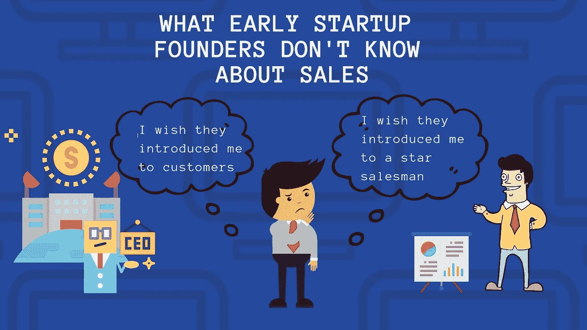
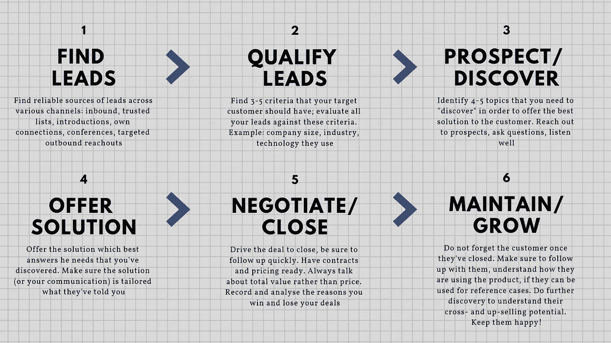

# 创业公司创始人不知道的销售知识

> 原文：<https://medium.com/hackernoon/what-startup-founders-dont-know-about-sales-e0579eaa8d31>

Perception of sales among many early startup founders

“销售”对创始人来说通常是个谜。许多创始人，尤其是技术型的，认为[销售](https://hackernoon.com/tagged/sales)不是他们技能的一部分，而是“其他人”擅长的事情。与种子阶段的初创公司创始人一起工作时，我经常听到“我会专注于打造产品，然后我会雇人来销售。”当被迫考虑销售时，创始人通常会寻找投资者或顾问，将他们介绍给客户，或帮助他们聘请明星推销员。创始人对这些神奇的介绍或者那些神秘的人脉广泛的销售人员寄予厚望，他们会来展示他们的说服艺术，解决销售问题。

如果这是你对 B2B 销售的看法，我有一些坏消息要告诉你。**介绍客户或明星推销员固然不错，但他们不太可能帮助你持续发展业务。**其实过分依赖这些介绍会害死你。我来解释一下原因。

首先，让我们揭开客户介绍的神秘面纱。当然，热情地介绍一家大公司是有帮助的，可能会帮你打开大门。然而，如果你没有做好销售功课，你可能会对产品和市场的契合度产生错误的感觉，并低估赢得客户所需要的条件。我在依赖 intros 的公司中看到的一个常见情况是，为高潜力客户定制产品，然后无法将该产品销售给其他人。在某个时候，当介绍渠道枯竭时，创始人意识到他们从来没有机会建立自己的销售力量。给他们这些精彩介绍的投资者现在正敲他们的门，要求增长。

现在让我们看看第一批销售人员。介绍一个超级明星推销员是有用的，但如果你不知道你在寻找什么样的个人资料，不知道这个人实际上应该做什么，介绍就没用了。如果你自己没有做过很多销售，很可能你实际上并不知道。没有销售过程的背景，就没有理想的“销售人员”或“人脉广泛的企业人员”。如果你雇佣一名销售代表，他或她将向她认为最容易销售的人销售，有效地确定你的客户群，而无需你的任何投入。最重要的是，销售人员的技能各不相同——有些人更擅长狩猎，有些人擅长农业，有些人更擅长某些类型的客户或产品。在一家公司做顶级销售员并不一定能很好地适应另一家公司的环境。当你依赖介绍人时，你是在下双重赌注:对介绍人和销售人员。

那你会怎么做？

# 把手弄脏，开始自己做销售

你应该从实际推销自己开始。你试验、你学习、你迭代，这将产生一些最佳实践，然后你可以“制度化”并传递给你的新员工。一篇著名的 a16z [关于这个话题的文章](https://a16z.com/2018/10/19/when-sales-isnt-just-selling-advice-for-founders-in-early-markets/)说“销售始于创始人”。他们甚至更直白地说，如果你卖不出你的产品，别人也不会卖。根据我与早期初创企业创始人的合作经验，以下是创始人比早期销售人员更擅长销售的原因:

*   **决心、激情和知识:**作为一名创始人，你最了解你的产品，你最大的投入是让它成功，这是显而易见的。许多创始人认为，成功的销售人员需要像金霸王兔子一样超级外向，超级有魅力，超级有影响力，笑容满面，穿着漂亮的西装。如今，这完全不是真的。知识、决心、倾听和产生信任的能力更重要，这也是创始人有天然优势的地方。
*   可信度:比起销售人员，人们更倾向于信任创始人，这也给了他们一种排外感。事实上，大多数客户更愿意从创始人或高管层购买。作为一个早期的创业公司，你有这个独特的机会提供个人专家服务的水平，这对于任何规模更大的公司来说都是不可行的。这就是为什么做[不规模化](http://paulgraham.com/ds.html)的事情其实是个好策略。
*   更快的反馈循环:这可能是最重要的事情。一开始，你需要非常非常接近你的潜在客户。即使他们还不是你的客户。即使你还没有合适的产品或产品市场。你应该把与潜在用户的任何互动都视为“销售”。不是“说服他们购买”，而是理解他们在寻找什么，他们有什么问题，以及你能做什么来解决他们的问题。如果你把这些互动“外包”给任何你可能雇佣的明星销售员，你不太可能获得同样深度的洞察力。

如今的销售不是向客户推销，而是倾听、深入“发现”客户需求，并提供高度相关的解决方案。当 Airbnb 的联合创始人在 YC 工作期间飞到纽约，敲开人们的门时，他们正在销售。当 Doordash [和蛋白杏仁饼店经理 Chloe](https://blog.doordash.com/the-doordash-story-b370c2bb1e5f) 交谈时，他们正在销售。当你和你的用户谈论他们面临的问题时，这是你销售过程的一部分。如果你在问自己，“我什么时候开始销售？”，答案是，“今天”。为了获得一些如何开始的非常具体的例子，我强烈推荐观看 Clever 的首席执行官 Tyler Bosmeny 的[视频](http://startupclass.samaltman.com/courses/lec19/)，他在视频中给出了外联电子邮件和活动的例子。

# 开始构建可重复的销售流程

**可持续发展的唯一途径是建立可靠的销售流程，不断创造和转化机会。这就像生活中的所有事情一样——没有灵丹妙药，但有持续努力的魔力。在与几十个各种规模的销售组织合作后，我发现这些组织是最弱的，它们依赖于一些超级销售明星或超级客户。**当公司没有很棒的销售流程时，除了靠个人英雄主义去销售，别无选择。**一个成功的销售组织运行着一个运转良好的销售引擎，在这个引擎中，每个人都可以有高水平的表现。销售代表加入进来，接受销售流程和工具方面的培训，获得明确的 KPI，以及定期的管理培训。当所有销售要素都到位时，个人英雄主义就变得没有必要了。**

一开始你不会拥有销售引擎的所有要素，但你应该现在就开始构建它们。以下是您应该开始的可重复销售流程的核心要素:

*   **定义你的目标客户。**你应该非常清楚你想要吸引什么样的客户，并优先考虑你对他们的所有销售努力。你的目标客户可能会改变，但在任何时候你都应该知道你最想吸引谁。
*   **定义销售流程的关键阶段。**在思考你试图解决的问题时，想想你的目标客户所经历的决策过程。然后定义反映客户历程的销售阶段。对于大多数公司来说，这些阶段大致如下:

Example sales process of an early B2B startup

*   准备基本的销售和营销材料。您是否有明确阐述的价值主张来直接回应客户的痛点？是在你的网站上，在你的电子邮件中，还是在你的推销中？在您的解决方案中，您有什么证据可以让您的目标客户有充分的“理由相信”?在你的网站和电子邮件中，你有响亮的行动号召吗？
*   **记录你的活动。**是的，CRM。典型的建议是，当你扩大业务规模并雇佣懂得如何设置 CRM 的销售副总裁时，就开始考虑 CRM。这在过去可能是真的，因为 CRM 系统很贵，需要几个月的时间来安装。对于需要大量定制的大型组织来说，情况仍然如此。但是作为一家[初创公司](https://hackernoon.com/tagged/startup)，你有一个更简单的选择。你可以使用一个简单的工具，比如 HubSpot CRM，它是免费的，提供了足够的标准功能，可以让你立即上手。
*   **设置 KPI 和活动指标。**一旦你在 CRM 中获得一些数据，你将能够更好地了解你的活动指标。您将看到销售渠道中的优势和劣势，每个阶段需要转化多少销售线索，以及哪些活动可以帮助您实现这一目标。这将允许你为自己/团队设定清晰的 KPI，并承诺每天执行。没有人说这很容易，但它确实有效。

现在，回到介绍。一旦你完成了销售工作并建立了销售流程的基础，你就可以向你的投资者、顾问和导师寻求有针对性的介绍特定的客户类型。你会发现 1)你得到了更多更高质量的介绍，2)转化它们变得容易多了。确保你明智地使用这些介绍，努力学习它们，并将它们作为其他潜在客户的参考或案例研究。确保你有多种来源的线索，并能从现有的关系中产生介绍。

你现在也处于一个非常好的位置，可以向优秀的销售人员寻求推荐，因为你现在知道要寻找什么样的资料。你也有更好的机会去吸引那个明星销售人员，因为你可以表明你“去过那里/做过那件事”,并且对销售问题有一个明智的看法。

所以，是时候起床开始销售了！

***

*玛丽娜·古列维奇是*[*system labs*](https://www.system2labs.com/)*的创始人兼首席执行官，这是一家专注于帮助 B2B 创业公司成长的管理咨询公司。System2Labs 通过开发成功的上市模式和建立可重复的销售引擎，帮助所有阶段的初创公司成长。在加入 System2Labs 之前，Marina 是 Blue Ridge Partners 的管理顾问，帮助私募股权公司的 B2B 公司加速发展。Marina 还拥有在财富 100 强公司管理全球和欧洲销售和营销职能的运营经验。*