# 做数据预处理时应该采取什么步骤？

> 原文：<https://medium.com/hackernoon/what-steps-should-one-take-while-doing-data-preprocessing-502c993e1caa>

大家好，我又回到了另一个话题，即**数据预处理**。

**什么是数据预处理？**

**数据预处理**是一种**数据**挖掘技术，包括将原始**数据**转换成可理解的格式。真实世界的**数据**通常不完整、不一致和/或缺少某些行为或趋势，并且可能包含许多错误。**数据预处理**是解决此类问题的成熟方法。

**我们为什么要使用数据预处理？**

在现实世界中**数据**通常是不完整的:缺少属性值，缺少某些感兴趣的属性，或者只包含聚合**数据**。嘈杂的:包含错误或异常值的。不一致的:包含代码或名称不一致的。

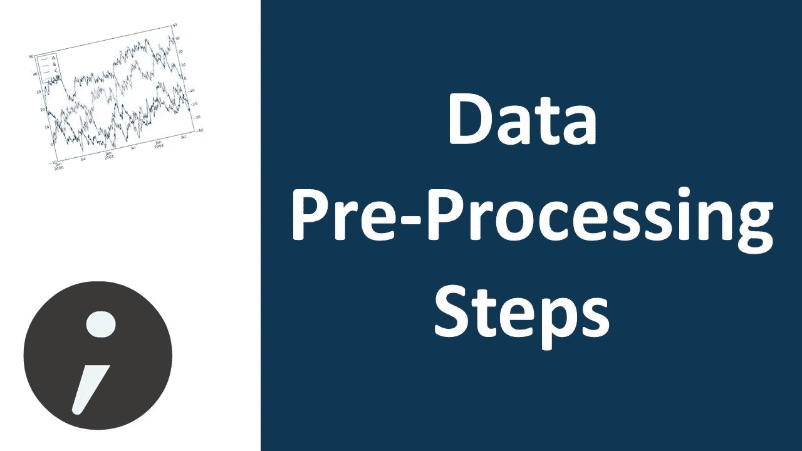

Taken from Google Images

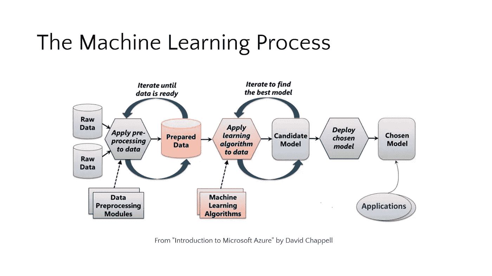

Machine Learning Process

# 数据预处理的步骤

第一步:导入库

**第二步:**导入数据集

第三步:检查缺失的值

**第四步:**查看分类值

**步骤 5 :** 将数据集分成训练集和测试集

**第六步:**特征缩放

所以，不再浪费时间，让我们开始吧！！！

新的开始往往始于痛苦的结局。感谢那些关闭的门和弯路，它们正指引你去一个更好的地方

> **第一步:导入库**

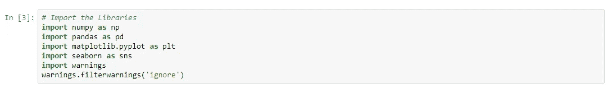

Import the Libraries

这就是我们如何使用 import 关键字在 Python 中导入库，这是任何数据科学家使用的最流行的库。(我用的是——Jupyter 笔记本)

*   NumPy 是用 Python 进行科学计算的基础包。除其他外，它包含:

1.一个强大的 N 维数组对象

2.复杂的(广播)功能

3.集成 C/C++和 FORTRAN 代码的工具

4.有用的线性代数、傅立叶变换和随机数功能

*   **熊猫** *负责*数据处理和分析*。Pandas* 是一个开源的、BSD 许可的库，为 [Python](https://www.python.org/) 编程语言提供高性能、易于使用的数据结构和数据分析工具。*熊猫*是 [NumFOCUS](https://www.numfocus.org/open-source-projects.html) 赞助的项目。这将有助于确保作为世界级开源项目的*熊猫*的开发成功，并使[向该项目捐赠](https://pandas.pydata.org/donate.html)成为可能。
*   **Matplotlib** 是一个 Python 2D 绘图库，它以各种硬拷贝格式和跨平台的交互环境生成出版物质量数字。Matplotlib 可用于 Python 脚本、Python 和 IPython 外壳、Jupyter 笔记本、web 应用服务器和四个图形用户界面工具包。
*   **Seaborn** 是基于 [matplotlib](https://matplotlib.org/) 的 Python 数据可视化库。它提供了一个高层次的界面来绘制有吸引力的和信息丰富的统计图形。
*   [**警告**](https://docs.python.org/3.1/library/warnings.html) 消息通常在对程序中的某些情况向用户发出警告是有用的情况下发出，在这种情况下，该情况(通常)不保证引发异常并终止程序。例如，当程序使用过时的模块时，可能需要发出警告。

> **第二步:导入数据集**

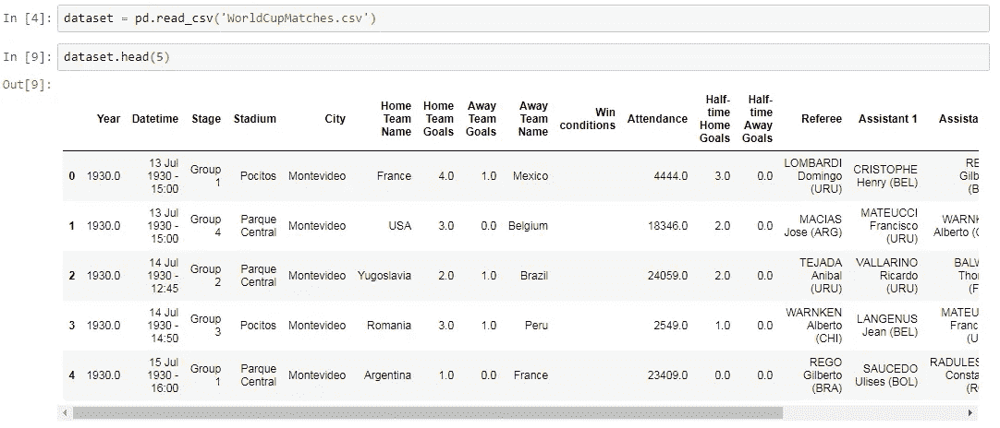

Import the Dataset

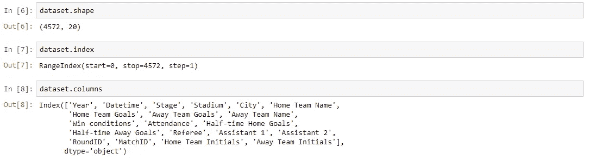

Dataset Info

通过使用 Pandas，我们导入数据集，我在这里使用的文件是。csv 文件【注意:不一定是每次处理 **CSV** 文件，有时候会处理 **Html 或者 Xlsx(Excel 文件)**。然而，为了快速访问和使用，我们使用 CSV 文件，因为它们很轻。导入数据集后，您可以看到我们使用了 head 函数(该函数根据位置返回对象的前 n 行。它有助于快速测试对象中是否有正确的数据类型。默认情况下，它返回 5 行。)

> **第三步:检查缺失值**

为了成功地[管理](http://www.statisticssolutions.com/academic-solutions/resources/dissertation-resources/data-entry-and-management/multiple-imputation-for-missing-data/)数据，理解缺失值的概念很重要。如果研究人员没有正确处理缺失值，那么他/她可能会对数据做出不准确的推断。由于处理不当，研究人员获得的结果将与存在缺失值的结果不同。

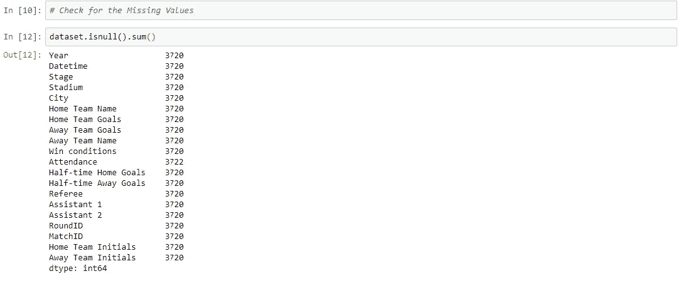

Missing Values

是的，你已经看到它写这个数字 3720 是你在每一列中丢失的值。

你可能在某处读到过，参见处理缺失值的 7 种技巧或处理缺失值的 5 种方法。但是，我将只和你讨论这两种最突出的方式。

**处理缺失值的两种方法**

1.  这种方法通常用于处理空值。这里，如果某个特定特性的值为空，我们就删除特定的行；如果某个特定列的缺失值超过 75%，我们就删除该列。只有当数据集中有足够的样本时，才建议使用这种方法。我们必须确保在我们删除数据后，不会增加偏见。删除数据将导致信息的丢失，这将不会在预测输出时给出预期的结果。

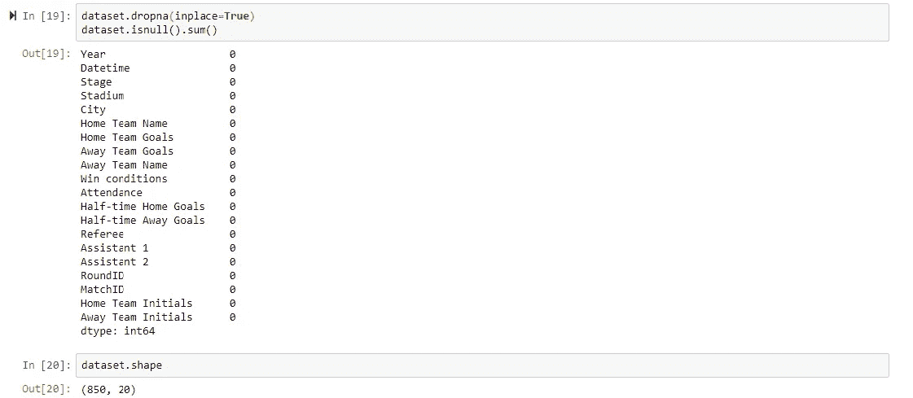

Drop the Missing Values

2.这种策略可以应用于具有数字数据的特性，如 year 列或 Home team goal 列。我们可以计算特征的**均值、中值或众数**，并用缺失值替换它。这是一个近似值，它会增加数据集的方差。但是与移除行和列相比，这种产生更好结果的方法可以消除数据的丢失。用上述三种近似值代替的是处理缺失值的统计方法。这种方法也称为**训练时泄露数据**。另一种方法是用相邻值的偏差来近似它。如果数据是线性的，效果会更好。

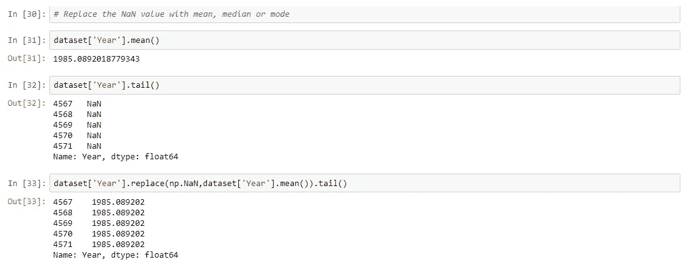

Replace the Missing Value

上述策略适用于数值型数据。但是当分类数据有缺失值时会发生什么呢？

> **步骤 4:查看分类值**

现在让我们看看如何处理分类数据。。。！

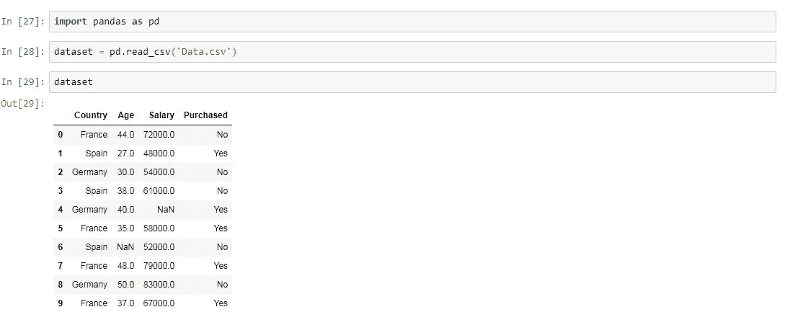

See the Categorical Data in Country

> **因为，机器学习模型是基于数学方程的，你可以直观地理解，如果我们可以在方程中保留分类数据，这将导致一些问题，因为我们只希望方程中有数字。**

所以，我们需要对分类变量进行编码…..

就像在我们的数据集中国家列会引起问题，所以会转换成数值。要将分类变量转换成数字数据，我们可以使用预处理库中的 LabelEncoder()类。

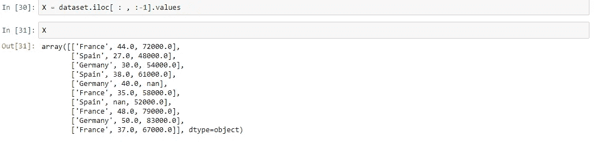

See the Categorical data

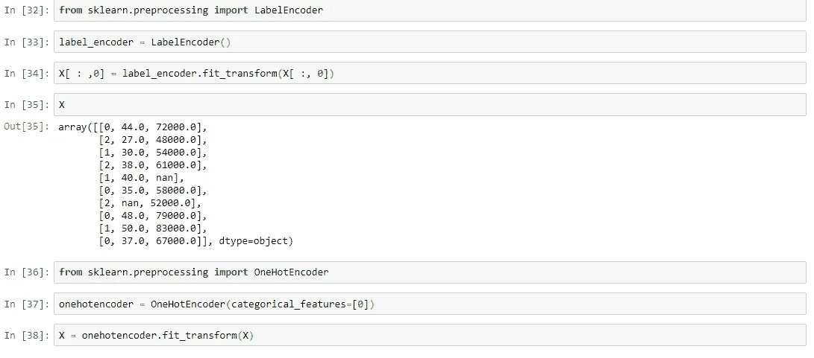

Use LabelEncoder class to convert Categorical data into numerical one

label_encoder 是我使用的对象，它帮助我们将分类数据转换成数字数据。接下来，我将这个 label_encoder 对象与我们的矩阵 X 的第一列相匹配，所有这些都返回矩阵 X 编码的第一列 country。

但这里面有一个问题，问题仍然是一样的，机器学习模型是基于方程的，这很好，我们用数字代替了文本，这样我们就可以在方程中包含数字。

但是，由于 1>0 和 2>1(见上面的数据集)，模型中的方程会认为西班牙的值高于德国和法国，德国的值高于法国。

实际上，情况并非如此，这实际上是三个类别，三者之间没有关系顺序。因此，我们必须防止这种情况，我们将使用什么是**虚拟变量。**

**什么是哑变量？**

**虚拟变量**是一个取值为 0 或 1 的变量，表示可能会改变结果的某种分类效应的存在或不存在。

上面不是一列，而是三列。

> **列数=类别数**

在我们的例子中，我们将有 3 列。

**//为了创建虚拟变量，我们将使用 sklearn.preprocessing 中的 OneHotEncoder 类，或者您可以使用 pandas get dummies 方法。**

在上面的代码中，我已经解释了如何使用 **OneHotEnCoder** 类，现在我将用 pandas 向你展示如何使用 **get_dummies( )** 来创建虚拟变量。

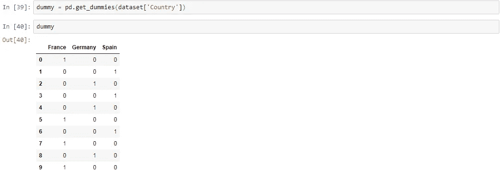

Using Pandas to create Dummy Variables

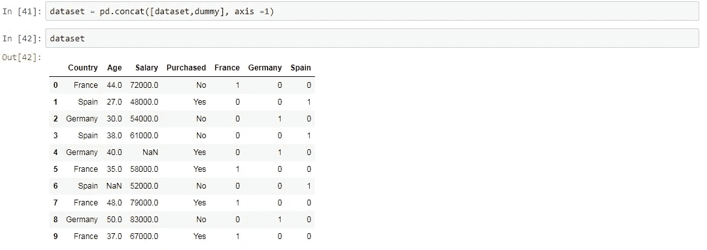

Concatenation

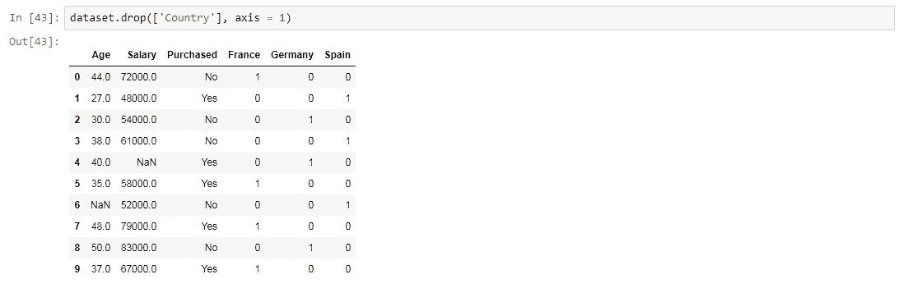

See how our Dataset looks like

有时，我们使用 **KNN 插补(用于分类变量):**在这种插补方法中，使用给定数量的与缺失值的属性最相似的属性对属性的缺失值进行插补。使用距离函数来确定两个属性的相似性。

> **步骤 5:将数据集分割成训练集和测试集**

在任何机器学习模型中，我们都要把数据集分成两个独立的集合

**1。训练集**

**2。测试装置**

为什么我们需要分裂？

这是你的算法模型，它将从你的数据中学习，做出预测。通常，我们将数据集分为 70:30 或 80:20，这意味着 70%的数据用于培训，30%的数据用于测试。然而，这种分割可以根据数据集的形状和大小而变化。

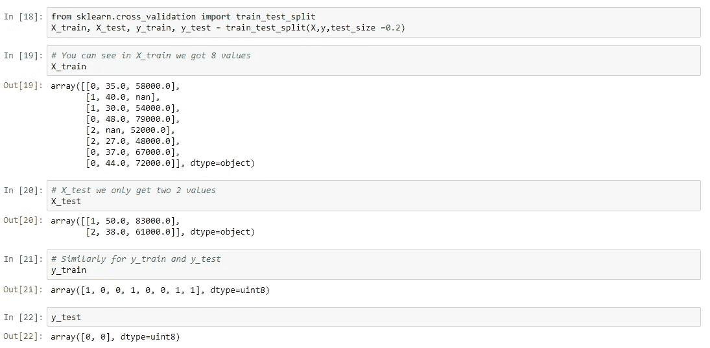

Splitting the Data-set into two set — Train and Test Set

> X_train 是特征矩阵的训练部分。
> 
> **X_test 是特征矩阵的测试部分。**
> 
> **y_train 是因变量的训练部分，此处与 X_train 关联。**
> 
> **y_test 是这里关联到 X_train 的因变量的测试部分。**

> **第六步:特征缩放**

**什么是特征缩放？**

**特征缩放**是一种限制变量范围的方法，这样它们就可以在相同的基础上进行比较。

假设我们有这个数据集

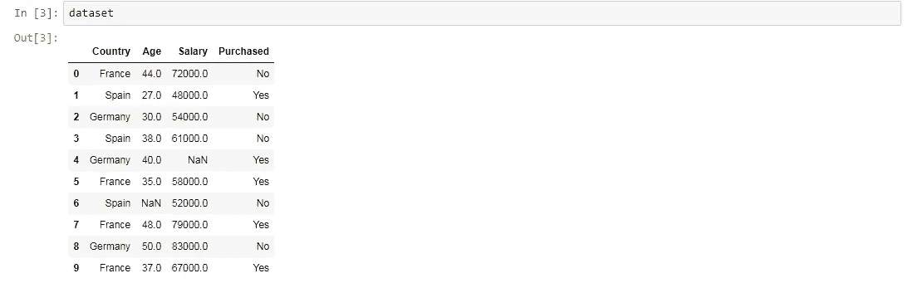

参见年龄和工资栏。你可以很容易地注意到工资和年龄变量没有相同的规模，这将导致你的机器学习模型中的一些问题。

因为大部分机器学习模型都是基于**欧氏距离**的。

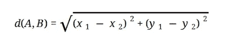

Euclidean Formula

假设我们从年龄和薪水列中取两个值

**年龄- 40 岁和 27 岁**

**工资- 72000 和 48000**

人们可以很容易地计算并看到薪金列将在欧几里得距离中占主导地位。我们不想要这个东西。

因此，有几种方法可以扩展您的数据。 [**参考**](https://en.wikipedia.org/wiki/Feature_scaling)

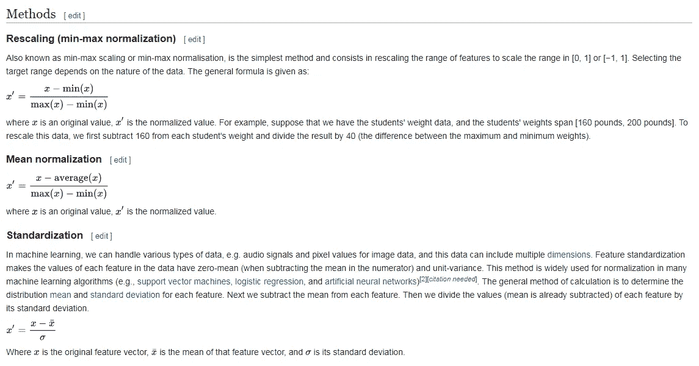

Picture taken from Wikipedia

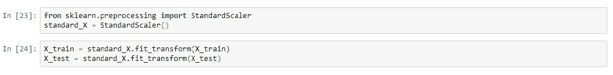

Feature Scaling

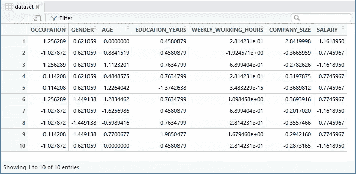

After Feature Scaling all values comes into same scale

注:有时机器模型不是基于欧几里得距离，我们仍然需要进行特征缩放，因为算法会收敛得更快。不基于 ed 的决策树就是这种情况，但是如果我们不进行特征缩放，那么它们将运行很长时间。

这就是我们对**数据预处理**阶段的总结，我希望你喜欢这篇文章。。。！！请注意，我没有包括离群值的话题，并采取了非常简单的数据集，让你明白一切。请随意评论并给它一些掌声。如果你有任何与数据科学相关的问题或疑问，请在评论区告诉我。关于[**LinkedIn.com**](http://linkedIn.com/in/themenyouwanttobe)**文章专栏**以及 [**媒体**](/@themenyouwanttobe) **，我很快会分享更多的概念。**

也给点爱吧！​

> ***莫希特·夏尔马(themenyouwanttobe&co .)*** [***themenyouwanttobe@gmail.com***](mailto:themenyouwanttobe@gmail.com)***/***[***电报***](https://t.me/themenyouwanttobe)