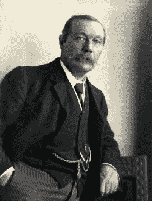

# 夏洛克·福尔摩斯的发明者能告诉我们什么是开发高质量产品的技术

> 原文：<https://medium.com/hackernoon/what-the-creator-of-sherlock-holmes-can-teach-us-about-building-a-tech-for-good-product-f431b2402a6>

阿瑟·柯南·道尔爵士因创造了世界上第一个超级侦探夏洛克·福尔摩斯而闻名。但不太为人所知的是，他也是一位多才多艺的作家，可以从事多种类型的写作。

Arthur, in 1914, 100 years BTG (Before Tech for Good)

戏剧和诗歌。浪漫和非虚构。甚至历史小说。尽管他能讲述一个杀手侦探故事，亚瑟也能创作爱情诗。

这是相当幸运的，因为当他在 1893 年杀死夏洛克时，他不得不为其他读者写其他风格的作品来维持生计。他靠写作生存。

有趣的是，如果他今天还活着，他将会是你的[科技](https://hackernoon.com/tagged/tech)团队中需要的人。

但他不是。所以你要像亚瑟一样。

## 为什么你需要像亚瑟一样

别担心。你不需要发明一个侦探，或者[讲玛丽·塞莱斯特的故事](https://www.arthur-conan-doyle.com/index.php/Mary_Celeste)。但是如果你真的想成功，那么你最好加强你的文案技巧。这是保证你的技术换好产品更成功的方法。

也许你已经会写一点了。但是你能为不同的读者写不同的风格吗？如果不是，那么就像亚瑟一样，你需要在你的作品中融合杀手和诗人。

这样做，你会在项目的每个阶段都有所收获。让我们调查这些。

## 申请资助

如果这不仅仅是一个白日梦，那么你的好项目技术需要钱。除非你有一个富有的赞助人(亚瑟也没有)，否则你需要找到资金。

也许你会写一份资金申请或者写一个视频广告。也许你会申请信托基金、喜剧救济基金或传统的信托或基金会。

不管怎样，穿上你最好的写标书的鞋子，写一份热情的、经过充分研究的、有说服力的标书。找一个[无痛的写作过程](http://www.workingwithjoe.co.uk/bid-writing-tips/)。而[砰的一声写下](http://www.workingwithjoe.co.uk/start-grant-funding-bid-bang/)。

*做过这个？恭喜你，你被判胜诉了！(现在你可以买你一直想要的猎鹿人了)。*

## 建立你的观众群

你得到了资助。哇哦。现在你需要[找到你的第一批粉丝](http://www.innovationlabs.org.uk/2013/10/17/build-1000-true-fans-who-will-adopt-product/)。

你需要建立一个关心你在做什么的观众群。他们可能是你的第一个研究对象，你的 beta 测试人员，或者只是关心你希望解决的问题的人。将他们聚集在你的旗帜下，他们将成为你的第一批用户，你最好的拥护者，甚至可能是付费客户。

以下是要做的:
*博客——创建一个简单的网站，展示有趣的内容，让人们订阅，向他们发送你的更新。让他们分享你的旅程。
* [学习基本的 SEO](https://yoast.com/academy/courses/)——学习谷歌如何使用关键词对页面进行排名。你不需要成为专家，但是你需要让搜索你的主题的人看到你的网站
*做社交媒体——Twitter 非常有助于提高人们对你所做事情的认识。它并不深入，但如果你精心制作你的推文，你会获得良好的声誉，吸引人们来你的博客。推销你的想法——有时候，接触你的听众的唯一方法就是走向他们。找到需要参与的项目合作伙伴、内部经理和外部利益相关者。用尖锐的词语来描述你的推销，用一种非常棒的风格来表达。

如果你的粉丝群很早就开始增长，那么在你打造你的产品的同时，你的粉丝们会把这个消息传播出去。它们将是金钱买不到的最好的广告。

做得好。你已经找到你的约翰屈臣氏，并开始调查！

## 为优质产品打造您的技术

每个产品都需要复制。

好的文案让它看起来很专业。糟糕的文案看起来很业余，会让你的用户反感。

不幸的是，文案基准是由脸书、Snapchat 等公司设定的，他们有一支由多种技能的文案撰写人组成的团队可供调用…

你不知道。但是没关系。

真的没事。因为你所拥有的是支持[理解问题](https://www.gov.uk/service-manual/user-research)和[设计有洞察力的、以用户为中心的解决方案的过程](https://hackernoon.com/six-tenets-of-tech-for-good-210168573f87)。做这些事情的资源是存在的。当你做得好的时候，选择正确的单词会变得容易得多。

以下是两种最重要的产品文案:

1.  [用户故事](https://www.romanpichler.com/blog/10-tips-writing-good-user-stories/)——这些帮助你的开发团队理解构建什么。如果你有扎实的用户研究和专注于用户体验的创造性设计过程，你将准备好用精确的、见多识广的和强有力的用户故事来阐述你的产品需求。你的开发团队会因此而喜欢你。作为回报，他们会制造出更好的产品。
2.  产品副本。从用户界面到解说视频，你会很忙。学习[前置微型复印](http://www.kendallcopywriting.co.uk/front-loading-important-copywriting-online/)的基础知识。学会用自然、超级简单的语言写作。你的用户会喜欢它带给他们的流畅体验。

*干得好。你结合了福尔摩斯式的逻辑推理和沃森式的创造力来解决这个案子！*

## 推销、销售和发展你的产品

你以为写作结束了吗？

抱歉。

此时，你已经推出了一个产品([只有一个 MVP](http://www.innovationlabs.org.uk/2013/05/08/building-minimum-viable-products/) )。但是你仍然会建立你的观众群(抱歉，这还没有结束)和迭代你的产品(这也永远不会结束)。

只是现在，你没有钱去做了！

希望你在产品发布前就开始推销、销售和寻找其他创收方式。希望你已经用[阐明了你的 USP](https://blog.kissmetrics.com/unique-selling-proposition/) 并尝试了至少其中之一:
*写了更多的资金投标
*创建了一个投资提案(可能是为了社会投资)
*确定了一个你可以[销售给其他](http://www.workingwithjoe.co.uk/secret-method-selling-tech-good-product/)服务的产品或价值，并写了有说服力的销售文案

如果你有，那么不仅你的写作会更好，而且你也能更好地口头表达你产品的价值。当人们听到你描述它时，他们会更受鼓舞。你的粉丝会越来越多，钱也会越来越容易找到。

现在你已经建立了解决复杂案件的声誉。恭喜你！

## 这需要练习。你不会第一次就做对。

太好了，你做到了这一步！来到这里并不简单，而且你可能还没有抓到莫里亚蒂。但是你已经上路了！

亚瑟[从](https://en.wikipedia.org/wiki/A_Study_in_Scarlet)开始就没做对。你也不需要。你甚至可以欺骗和聘请文案或投标作家。但是如果你做了，研究它们是如何工作的。提问。向他们学习。

并研究竞争对手。下次你在脸书上的时候，看看它的界面副本是如何构建的。为什么应用程序使用它所做的单词？同样的道理也适用于撰写标书、建立受众以及撰写有说服力的文案。

开始你的科技写作之旅。亚瑟会为你加油的，希望他能活着分享这次冒险。

像这样？点击此处阅读更多关于为优秀项目开发技术的技巧[。](/3-things-create-award-winning-tech-good-startup/)