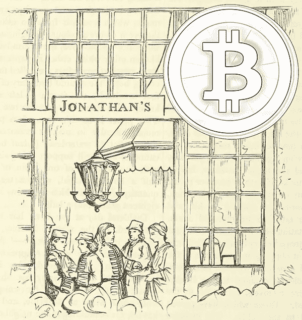

# 加密货币市场能从衍生品市场 300 年的历史中学到什么

> 原文：<https://medium.com/hackernoon/what-the-cryptocurrency-market-can-learn-from-the-300-year-old-history-of-derivative-markets-4ed582fcad20>

> 揭秘 **:** [**树屋**](https://goo.gl/cF8TcH) ，区块链发力的投资平台，之前赞助过黑客正午。

我最喜欢的[书](https://hackernoon.com/tagged/books)之一，也是促使我从事交易的书，是埃德温·勒菲弗尔的《一个股票操作者的回忆》。杰西·利弗莫尔(Jesse Livermore)的半传记式职业生涯，他是 20 世纪之交的一名交易员，本可以在当今基本不受监管的加密货币市场大赚一笔。

看看今天在加密领域发生了什么；我不禁想起了十多年前我第一次读这本书时就一直萦绕在我心头的一段话:

> “当你阅读有关繁荣或恐慌的当代描述时，给你最强烈印象的一件事是，无论是股票投机还是股票投机者，今天与昨天的差别是多么之小。游戏不会变，人性也不会变。”

他在 1900 年说过这句话。

他继续说道:

> “我过去认为，19 世纪 60 年代和 70 年代的人比 20 世纪初的人更容易受骗。但我肯定会在当天或第二天的报纸上看到一些关于最新的庞氏骗局或某个投机经纪人的破产，以及数百万美元的傻瓜资金加入了消失的储蓄中沉默的大多数。”

如果这还不能描述加密市场，我不知道还有什么可以。

我想得越多，就越能回想起我在大学里上的政治经济学和经济学历史课——不管我们生活在什么时代，JL 的话(他喜欢被这样称呼)不断在我脑海中闪现:

> 游戏不会变，人性也不会变

加密空间很像几个世纪前的衍生品和股票市场。

衍生品的历史和商业的历史一样悠久，有一个很有希望的假设是，在罗马时代和公元第一个千年，西班牙系犹太人将衍生品交易从美索不达米亚带到了西班牙，然后在 16 世纪带到了低地国家。

人们认为衍生产品在长途贸易融资中发挥了重要作用；例如，在公元前 2250 年至 1750 年间，印度河流域就种植了芝麻植物。一块公元前 1809 年的石碑记载了一个美索不达米亚商人借了银子，承诺六个月后“根据现行汇率”用芝麻籽偿还。这份合同结合了白银贷款和芝麻种子的远期销售。

在欧洲方面，希腊的优势开始于公元前 1000 年左右，尽管希腊法律支持现货交易，但这并不能证明没有期货合约，因为商业历史上充斥着针对衍生品的法律和法令，而这些法律和法令被公众所忽视。这是我将多次提到的一点。

罗马人深受希腊文化的影响，到公元前 3 世纪，罗马法赶上了商业惯例，规定了未来交货的合同。很容易看出，随着 ico 和代币进一步合法化，今天的法律将如何迅速赶上商业实践。

快进了一千年左右，阿姆斯特丹成为欧洲领先的商业中心，其黄金时代从 1585 年持续到 17 世纪中叶。这是第一个基于证券的衍生品被长期自由使用的城市。

1602 年荷兰东印度公司的成立引起了公众的热情，但当公司发展比预期缓慢时，这种热情就变成了失望。股价在几年内翻了一倍，但到了 1610 年大约损失了 75%的收益。为了应对该公司令人失望的表现，艾萨克·勒梅尔(Isaac Le Maire)通过卖空其股票，进行了历史上首次有记录的熊市攻击。我敢肯定，任何阅读这篇文章的人都可以指出，至少有几个 ico 和区块链的初创公司有着类似的故事。

1621 年，1630 年和 1636 年，颁布法令的意图破坏合同的差异，使他们不能在法庭上执行；然而，这并没有阻止在郁金香狂热期间使用差价合约。衍生品合约继续有效，因为不履行合约会让投机者被驱逐，实际上是将他排除在进一步交易之外。在许多方面，这类似于中国等国家试图禁止加密货币交易，首先限制 ico，然后是交易所，很可能是所有加密货币，直到他们控制它。但是历史表明，活动不会停止。

1711 年，英国(政府)参与了南海公司的组建，该公司的成功催生了一波新的股份制公司，这些公司的商业计划令人生疑，试图利用公众对股票似乎贪得无厌的胃口。这与上世纪 90 年代初互联网泡沫出现的情况以及今天区块链泡沫的情况惊人地相似。我说区块链泡沫是因为大多数人提到这个存在和 ICO 泡沫；现实是，有大量基于区块链的解决方案在寻找问题，几乎所有的都在寻求利用公众的胃口。

一个“重大”事件发生在 1734 年；英国议会通过了约翰·巴纳德爵士法案，宣布未来证券交割合同“无效”。亚当·斯密意识到约翰·巴纳德爵士的法案并没有阻止衍生品交易:“玩游戏的人必须保持信用，否则没人会和他们交易。股票交易也是如此。不守信用的人很快就会被赶出去，用变态园的话来说，就是跛脚鸭。”因此，自从离开大学以来，我第一次引用亚当·斯密的话…

该法案的一个结果是，英国转向了一种基于信誉的证券衍生交易系统，类似于一个世纪前的阿姆斯特丹。这类似于加密空间，以及为什么加密货币社区创建一个自我监管、自我监管的框架很重要，这在一定程度上正在发生，甚至在政府介入之前。

人们对银行使用衍生品的情况知之甚少，但有理由相信，在 18 世纪和 19 世纪，银行处于衍生品交易的前沿。如今，我预计机构会越来越多地接受加密货币，特别是随着正式立法和监管的生效，正如过去的活动所证明的那样。

既然历史已经过去，让我们看看人们在这些市场中的行为方式。就像奴隶在凯撒耳边低语“死亡纪念品”,杰西·利弗莫尔的话在我耳边回响。"游戏不会变，人性也不会变."

一位作者(匿名 1720 年)写道:*“每个人都知道，股票经纪人的主要业务是卖出一只股票，买入另一只股票，因为国内的特殊情况或国外的事故可能会降低一只股票的价值，提高另一只股票的价值”*。这个消息是如此的令人期待，以至于 De la Vega (1688)注意到*“对一个事件的期待比事件本身对交易产生了更深刻的印象”*。读到这里，不管技术如何，看到 300 年前的行为变化如此之小仍然令人惊讶。

关于泡沫，与流行的现代观念相反，18 世纪的投资者，甚至在南海泡沫的高峰期，使用了与今天惊人相似的基于基本面的估值技术。这种估值方法不能证明泡沫是理性的，只能证明市场分析和估值背后的经济原理在近 300 年前就被投资者充分理解了。

所有这些都很好地引出了下一个可能是最重要的智慧金块，可以从股票市场和衍生品的历史中推断出来；**治理和监管**。

莫蒂默(1801)指出，在早期的伦敦股票市场上，存在着大量的拒付和欺诈风险。根据霍布斯的思想(又名“霍布斯理论”)，我们应该期待只有在当局设计并实施了消除这些风险的规则或法规之后，市场才会发展。然而，从历史上看，有很多证据支持这样一种观点，即这些问题的解决方案不是来自国家。

伦敦证券交易所是由 18 世纪的经纪人创建的，他们把咖啡馆变成了私人俱乐部，反过来又创造和执行规则。经纪人不是依靠公共监管来执行合同和减少欺诈，而是有意识地通过成立自我监管俱乐部来解决他们的困境。出于同样的‘原因’(…我会自己出去…)，这取决于密码社区来创建和执行规则，打击坏人。

哈耶克写道(1960)，*“自由的价值主要在于它为签名者的成长提供了机会，而自由社会的有益运作在很大程度上取决于这种自由成长的机构的存在。”*从根本上说，选择允许自由联合的个人团体发现管理他们行为的新方法。同时遵守部分不同规则的个体和群体的存在为选择更有效的规则提供了机会。

随着越来越多的 ico 和区块链创业公司脱颖而出，一个过程正在慢慢形成，并被每个人所遵循，这里那里都有奇怪的变化。反洗钱/KYC/CTF 检查更加“专业”，实体肯定不会违反证券法，并且排除某些管辖区的成员参与。这个过程是达尔文式的，但以光速进行。

很明显，在 1696 年“限制经纪人和证券公司的数量和行为”的法案颁布后，股票经纪人在皇家交易所不受欢迎。该法案旨在监管和许可经纪人，但他们仅仅通过离开皇家交易所就可以避开。18 世纪的作家托马斯·莫蒂默(1801)写了《T2》，“股票经纪人通常的聚集地是交易巷的乔纳森咖啡馆”。各种咖啡馆为顾客提供了一个吸引不同类型人群的聚会场所；作家和评论家去了威尔家，哲学家去了希腊。怀特的巧克力屋吸引了赌徒，劳埃德的咖啡屋，后来成为伦敦的劳埃德，专门从事航运和海上保险。现在，这与我们看到的中国等司法管辖区禁止 ico 和交易所没有什么不同；作为回应，许多交易所干脆搬迁了。

有趣的是，历史上最大的问题之一是蓄意欺诈。约翰·霍顿在 1692 年写道:“毫无疑问，如果这些贸易被更好地了解，这将是王国的一大优势；只有我必须告诫初学者要非常谨慎，因为他们中有许多狡猾的艺术家"这可能是昨天写的，并引用了 ICOs。正如我们所见，SEC 将很快打开闸门，并通过一波调查或传票跟进。

过去，违约者被禁止进入乔纳森咖啡馆，无力支付的经纪人被贴上“跛脚鸭”的标签——被赶出咖啡馆意味着经纪人业务的重大损失。今天的社区需要让尽可能多的个人承担责任，并被贴上“跛脚鸭”的标签，这样他们就不能再重复他们的活动了。

密码社区作为一个整体需要像伦敦证券交易所那样做；经纪人没有依靠公共监管来执行合同，而是有意识地找到了一种方法，通过创建和执行一套私人规则来解决这一困境。多年来，伦敦证券交易所都没有正式的章程，直到 1812 年他们才发布了第一本规则手册。1877 年，甚至政府也宣称证券交易所的规则*“有益于公众利益”，而且交易所的行为“正直、诚实，并且渴望公正”。*

总的来说，所有旨在停止衍生品交易的法规——在整个 17 世纪的不同时期，卖空在 1697 年在英国阿姆斯特丹被禁止，是为了防止远期交易——特别是卖空——立法对时间交易没有影响，对“宣誓经纪人”或“批发商”的交易行为也没有什么影响。约翰·巴纳德爵士 1734 年的行为显示了类似的模式。约翰·巴纳德爵士的法案是影响交易的最重要的法规，因为它禁止所有的衍生品合约，并对从事这些合约的人施以严厉的惩罚。

如前所述，所有方法都不能有效消除时间交易，对市场参与者的行为影响不大。在 17 世纪下半叶和 18 世纪上半叶(在巴纳德法案之前)，英格兰和阿姆斯特丹的衍生品交易在法律上被视为赌博合同，因此在法庭上是不可执行的。

如上所述，尽管合同不能被法律强制执行，但“社区”本身决心解决问题——到 18 世纪初，经纪人已经制定了真正的“行为规则”,以帮助获得公众的信任。我们现在在 ICO 领域看到的一个事件正在发展。

亚当·斯密(1766)对声誉在破坏政府禁止时间交易中的作用做了类似的观察:“玩游戏的人必须保持他们的信用，否则没有人会和他们交易。炒股也是如此。”

总而言之，通过回顾衍生品市场的历史，我们可以清楚地看到，在政府干预之前，金融机构就已经制定了自己的一套规则和法规，以应对围绕欺诈和欺诈活动的问题。糟糕的演员被踢出去，有时是字面上的意思，没有人会和他们做生意。

当旨在制止基本上是商业现实的政府干预出现时，规则、条例和法令在很大程度上被公众忽视，活动继续进行，有时甚至这样做是非法的。尽管没有法律资源，但一个自我监管和自我调节的环境已经形成。几乎没有理由认为，即使 ico 或加密货币被禁止，活动也会完全停止。

毕竟——“游戏不会变，人性也不会变。”

> **拉兹·约尔达切**是 treehouse 的创始人，该公司旨在使房地产投资民主化。
> 
> 加入白名单以便参加即将开始的私人销售:[**https://tree house . online**](http://Treehouse, our weekly sponsor, is a blockchain powered, investment platform, changing the face of property investment, trading and purchasing forever.)