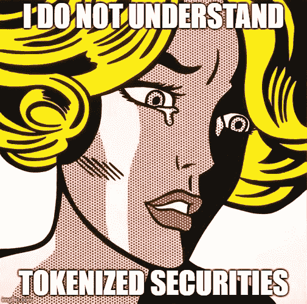

# 令牌化证券到底是什么？

> 原文：<https://medium.com/hackernoon/what-the-heck-are-tokenised-securities-7cd1123cbdad>

在加密社区中有很多关于令牌化证券将会彻底改变传统金融的说法。鉴于这种乐观的情绪，有必要深入探究一下这场狂欢到底是怎么回事。

# TL；dr；

是的，有很好的证券令牌化用例，但不是我在社交媒体上看到的那些。

# **什么是安全？**

证券是一个法律和经济的概念。从经济学的角度来看，证券本质上是对发行实体未来现金流量的一种权利主张，这种权利主张可以交换价值，并涉及一定程度的权利主张不能得到偿还或履行的风险。

从法律的角度来看，证券的公开出售受到高度管制。首次公开募股是向公众发行股票，涉及非常复杂和昂贵的监管过程。也有一些私募证券发行没有那么高的监管负担，但被限制在允许参与的投资者类别之内。证券发行有各种各样的规定，在这里[有更详细的解释](https://blog.verifyinvestor.com/blog/2016/5/25/regulation-d-rule-506c-vs-regulation-a-differences-explained)

以上与代币和区块链有什么关系？没什么。以及一切。对于涉及哪种技术，是 Postgres 数据库、以太坊区块链还是其他，监管是不可知的。它们的应用与底层技术无关。有人可能会说需要新的、更好的法律，有时确实需要，但这超出了本文的范围。我们希望按照我们发现的样子来处理这个世界，而不是按照我们希望的样子来处理。

# **什么是代币？**

加密令牌是一种智能合约，旨在使用私钥加密安全地存储和传输信息(价值)，它可以作为对分散式分类帐维护者的奖励，也可以要求以本地协议燃料(gas)的形式支付奖励。

# 证券令牌化意味着什么？

在最简单的形式中，可以在公共或私有(许可的)区块链上使用令牌来实现证券的记账和转移。让我们暂时搁置怀疑，这是几乎所有创新都需要的，并试图找出这样做的好处。

具体来说，让我们浏览一下本文中的一些声明[:](https://hackernoon.com/the-security-token-thesis-4c5904761063)

# 全天候市场

24/7 小时交易与代币和区块链完全无关。美国股市不全天候交易的原因，与当前系统在技术上无法做到这一点无关。这与传统、习俗和方便有关。是的，方便。开盘和收盘拍卖集中了流动性，当与全天连续交易相结合时，可以方便有效地发现价格。请注意，外汇市场已经是 24/7，没有任何代币的帮助。还要注意，被迫在周末交易所有资产类别会使经营专业交易业务的许多方面变得复杂，这不是世界各地的交易柜台所希望看到的。

# **部分所有权**

显然，部分所有权如今已经存在。合格的投资者可以使用像 [RealCrowd](https://www.realcrowd.com/) 这样的网站购买曼哈顿一栋建筑的股票，公开市场的投资者可以购买提供各种房地产投资的房地产投资信托基金。公开交易的房地产投资信托基金超过 200 只，如果把非交易的包括在内，总共约有 1000 只。当然，没有任何公开交易的证券允许人们做多曼哈顿的一栋建筑，同时做空另一栋建筑。不过，这不是一个技术问题。与代币无关。这与出于做空目的发行证券并从发行方获得证券的监管复杂性以及对冲此类空头头寸的无能有关。这些问题都不会因为涉及到一个令牌而消失。理论上，没有什么能阻止芝加哥商品交易所或洲际交易所等期货交易所创建单独的期货合约，为曼哈顿的每栋建筑创建一个期货合约。他们创造了像方期货和天气期货这样的产品。关键是，在古怪的特质上下注根本不需要代币。

# 快速结算

“比特币或以太网交易在几分钟内结算，而不是几天”。好吧，因为大部分加密交易发生在集中的交易所，从技术上来说，比特币或以太网的交易不会结算，直到有人提出撤销请求，这意味着如果交易所数据库以某种方式遭到破坏或黑客攻击，它们有时会数月不结算或根本不结算。但是公平地说，如果我们是在供应链上交易，我们会马上结算。

然而，证券交易多日结算期的原因并不是技术上无法进行快速转账。这是因为证券的卖方有时间拿出要交割的证券，而买方有时间拿出这些证券的现金。你可以卖出你目前没有的证券，也可以用你没有的钱买入，只要你在 T+2 的结算时间把钱交出来。这不完全是一个错误，但可能是一个有用的特性。没有任何规定禁止交易双方立即交换证券和货币，该规定是对这一过程所允许的时间设定上限。更重要的是，由于这些结算时间是由法规强制规定的，它们将与普通证券完全一样地适用于令牌化证券。大多数交易对手会选择等待交货，因为晚送钱显然比早送钱好。

# 流动性和市场深度

“安全令牌可以缓解市场分割，让一个国家的买家更容易获得另一个国家的资产”。不要。跨境出售证券涉及一个[跨境证券发行过程](http://www.europarl.europa.eu/document/activities/cont/201106/20110606ATT20781/20110606ATT20781EN.pdf)，这个过程已经存在，而且由于监管原因相当复杂。同样的规则也适用于证券代币，因为，你知道，它们是证券。

如何将私募股权或风险基金的股份令牌化？风险基金的投资者是有限合伙人。合伙人，尽管权利有限。但仍然是合伙人。普通合伙人与有限合伙人有业务关系，没有兴趣或动机让他们自由交易他们的利益，就像私人企业的合伙人没有动机让她的合伙人轻松地买卖他们的股份一样。还有巨大的逆向选择问题。如果有人正在出售他们的私募基金权益，这可能是因为他们已经意识到这不是一个伟大的基金。由于证券是私有的，有限合伙人拥有大量的非公开信息。因此，任何购买这种利益的人都会受到巨大的逆向选择。这就是为什么这种利益没有非常流动的市场的原因，同样，象征性的利益并不能以任何方式解决这个问题。

# 互用性

“支撑一切都将被令牌化这一观点的论点是基于一切都将是可互操作的愿望。我想持有商业建筑、早期股权、公司债券、短期国库券、我的房子和同一平台上的分散网络的所有权”

伙计，你已经能做到了。开一个 [Robinhood](https://robinhood.com/) 账户，购买 SPY、VNQ、TLT、HYG 和一些 BTC、ETH 的股票。和有价证券一点关系都没有，明白吗？

# 令牌化证券有意义吗？

是的，只要我们创造性地思考加密令牌允许我们做什么，而不是试图重新发明没有令牌已经非常实用的东西，尝试启用可以使用区块链和分散系统的新范式。

例如，让我们设想一种证券，它代表一批特定类型和/或年份的优质葡萄酒。目前，投资葡萄酒基金是可能的，因此这类证券是存在的。假设，我们创建一个智能契约，它遵循 ERC-721 NFT 协议。进一步假设我们将信息编码到令牌中，该令牌表示基金拥有的特定瓶子或箱子或年份的散列，并且该散列与板条箱、瓶子本身、酒厂设备等上的信息相匹配。通过这种方式，我们创建了一种安全机制，其中智能契约对关于实际被证券化的内容的信息进行编码。人们当然可以用集中式数据库来完成同样的事情，但是在这种情况下，一旦信息被编码，没有人必须维护它，而且它和底层协议一样安全。类似的东西可能有用，也可能没用，但关键是本例中的标记化指的不是重新打包相同的旧 sh..目前运行良好的东西，但要创造一些新的东西，由分散的协议。