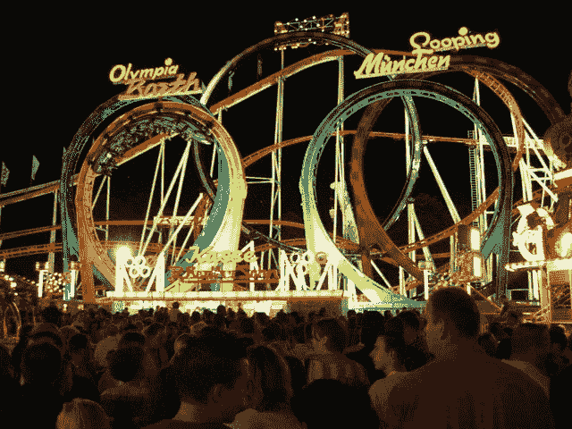

# ICO 到底是什么？

> 原文：<https://medium.com/hackernoon/what-the-heck-is-an-ico-6f3736d5f5a>

简单介绍初始硬币发行或 ico。

如果你一直在关注比特币和加密货币的发展，你可能听说过“ **ICO** 或“**首次发行硬币”**。

那么，什么是 ICO 呢？下面温柔的介绍一下。

这不会让你成为专家，但希望它能让你对 ICOs 有一个基本的了解，甚至可能帮你省钱。

## “定制游乐设施”游乐园

艾米和她的朋友有一个好主意。他们想创建一个游乐园，人们可以创建自己的游乐设施，游客可以乘坐它们。

它被称为“定制游乐设施”公园(好吧，当然，我可以想出一个更好的名字)。

这是公园的运作方式。

创作者可以建造自己的游乐设施，并将其安装在艾米的公园里。公园里的任何游乐设施只能由名为**娱乐**代币的特殊代币操作，她可以为她的定制游乐设施收取任意数量的**娱乐**代币。

游客可以在进入公园前支付美元并购买娱乐代币。在公园内，游客可以使用“娱乐”代币乘坐任何游乐设施。这与今天一些游乐园的运营方式没有太大区别。

游乐设施的创建者可以保留人们在游乐设施上花费的大部分代币。然后，她可以将代币卖回或用于自己的骑行。

## 娱乐令牌的机制

现在，事情变得有趣了。

艾米和她的团队计划铸造 100 万枚娱乐代币。他们用复杂的软件和加密技术确保没有人能够复制或创造更多的这些有趣的代币。

因此，如果这个公园变得非常受欢迎，很多人都想去公园，那么娱乐券的需求和价格就会上升。

## 为公园筹款

艾米和她的团队已经提出了公园的初步设计，并在一份名为白皮书的设计文件中描述了他们的所有计划。

显然，像这样的公园需要大量的土地和基础设施。开始时，Amy 估计需要 100 万美元的初始投资。

她可以贷款或向风险资本家借钱，但在这两种情况下，她都必须放弃自己公司的股份，这是她不想做的。

因此，她决定以每张 2 美元的价格出售一些娱乐代币。如果她向公众出售 50 万枚代币，她可以筹集 100 万美元。

对公众的建议是，这个独一无二的公园将变得非常受欢迎，对娱乐代币的需求将大幅上升，因为很多人会想尝试奇妙的过山车和游乐设施。请记住，代币的供应是有限的。

因此，公园开放后，现在 2 美元的代币可能会变成 6 美元或 8 美元。

艾米在她的网站上出售代币。人们喜欢这个想法。一些人想买代币，以便在公园开放时使用。其他人预计代币的需求和价格将会上涨，并会出现便宜货。

不管怎样，人们都要付钱抢购代币。几天之内，艾米已经为她的项目筹集了 100 万美元，最棒的是，在这个过程中，她没有放弃自己公司的一份股份。

艾米所做的是**首次发行硬币或 ICO** 。她通过出售代币筹集了 100 万美元，代币是未来公园的游客可以使用的。她没有放弃公司的任何部分作为回报。

## 把这一切联系在一起

大多数 [ICO](https://hackernoon.com/tagged/ico) 项目都和这个游乐园类似。一个团队想出了一个主意，包括建立一个平台和一个由一些服务的供应商和消费者组成的[生态系统](https://hackernoon.com/tagged/ecosystem)。他们写了一份白皮书描述他们的想法。这个想法包括一个特殊的令牌，可以用来以某种方式操作他们的发明。他们通过出售这些特殊的代币为他们的项目筹集资金。这里有几个例子: [Filecoin](https://filecoin.io/) ， [Hellobloom](http://hellobloom.io/) 。

在大多数情况下，你只能使用加密货币(如 ETH)而不是法定货币(如美元或欧元)购买特殊代币。所以，如果你想投资 ico，你应该先买一些 ETH。

请记住，购买代币**并不**提供公司本身的任何股份或权利或所有权。这与投资股票市场非常不同，在股票市场上，你通过购买股票获得一家公司的一部分。

因此，如果你正考虑投资一个 ICO，确保你阅读了他们的白皮书，背景调查了团队，了解了硬币将如何使用，供应限制，和你的朋友谈论这个想法，并真正确保你了解“游乐园”将是什么样子。

如果你什么都不做而去投资，你将会坐在一辆你可能不喜欢的车上:)