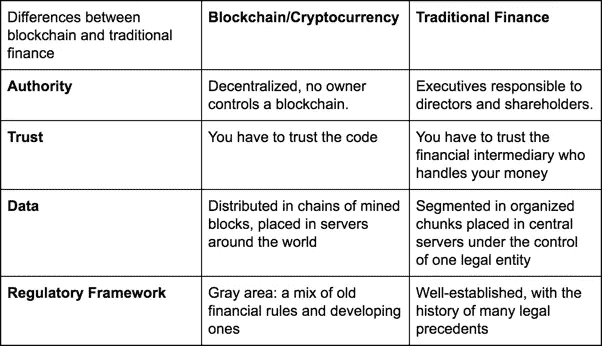

# 区块链和加密货币到底有什么区别？

> 原文：<https://medium.com/hackernoon/what-the-hell-are-the-differences-between-blockchains-and-cryptocurrencies-897d5d4ab2d2>

## 最后，一些明确的回答。

> *简化区块链和加密货币的区别，摘自* [*Flipside Crypto 关于区块链和加密货币领域的指南*](http://fscrypto.co/guideoncrypto) *。*

# 那么区块链到底是什么？

> 区块链是数字公共会计系统，其中用户之间的交易以安全、可验证和永久的方式存储。

**区块链是底层技术和协议**，使得以分散的方式分发数据和信任成为可能。

# 为什么区块链会在这里？

区块链是一种机制，可以实现一个没有中介的世界。

几十年的金融监管和经验创造了一个框架，我们应该信任金融机构来处理交易和保护我们的数据。

然而，这远非万无一失；看看富国银行、Equifax、Heartland、JP Morgan 和 CheckFree 就是最好的例子。

区块链不像传统金融系统那样信任中央机构来控制每个单独的银行分类账，而是在没有任何第三方的情况下分发账户余额、验证、身份和交易流。

# 什么是区块链节点？

节点是托管加密工具集(即区块链)的国际服务器网络。它们分布在世界各地，没有中央权力机构控制活动。

为了创建和传输有效数据，节点必须同意一组通用的规则(称为“共识协议”)。为了接受比特币的新交易区块，矿工必须出示有效工作的证明，才能获得他们的“奖励”:一个比特币区块和开采该区块的交易费。

任何个人都可以在他们的笔记本电脑上运行比特币节点。

 [## 运行一个完整的节点——比特币

### 矿工、企业和注重隐私的用户依赖于他们使用的完整节点的特定行为，因此他们将…

bitcoin.org](https://bitcoin.org/en/full-node#what-is-a-full-node) 

# 区块链的弱点是什么？

因为数据必须分布在没有中央控制的服务器网络中，所以每台服务器都必须存储数据的副本，并且整个网络必须同意新的交易，然后才能对其进行验证。这使得网络运行的计算成本比集中式数据服务器更高。

区块链最大的卖点——它的分布式和缺乏集中治理——也是它最大的弱点之一:可扩展性和互操作性。

# **区块链有什么优势？**

1.  交易是分散的，所以没有中间人
2.  交易一旦记录在分布式分类账中，就不可改变
3.  默认情况下，区块链的交易是透明和公开的
4.  交易是不可逆的
5.  任何人都可以检查代码或运行验证区块链交易的服务器

# 区块链与传统金融的区别

# **等等，什么是加密货币**？

> 加密货币是建立在区块链基础上的数字或虚拟货币。

比特币是一种[加密货币](https://hackernoon.com/tagged/cryptocurrency)，拥有自己的[区块链](https://hackernoon.com/tagged/blockchain)。你可能也听说过以太网，这是交易量第二大的加密货币。以太建筑在以太坊区块链上。在这种情况下，加密货币和区块链不同于比特币，是分开命名的。

**加密货币是价值的象征，它允许底层技术获取基于它的任何应用的价值** —因此，它们已经成为允许个人和机构投资者在区块链投资的投资工具。

# 加密货币的主要特征

*   建在区块链的顶部
*   允许你投资基础区块链的价值
*   可以在交易所和不同用户之间进行交易

# 区块链和加密货币真的有交集吗？

如果 TCP/IP 是一个区块链，你需要 *InternetCoin* 才能访问脸书、亚马逊或网飞。

*互联网币*将是加密货币，而 TCP/IP 将是相当于区块链的协议层。你可以交易互联网币，并用它来访问建立在 TCP/IP 之上的服务。

结果呢？不是脸书的所有价值都归脸书股东所有，而是你实际上拥有了协议层——*脸书所基于的技术——*通过使用加密货币来获取和捕捉价值。

# **TL；博士**

*   区块链是一种分散的分布式数据协议。
*   加密货币是建立在区块链基础上的价值象征，允许您从底层技术中获得价值。
*   加密货币和区块链是独立但相关的概念。

*想要更多这样的内容？查看* [*Flipside 区块链和加密货币加密指南！*](http://fscrypto.co/guideoncrypto)