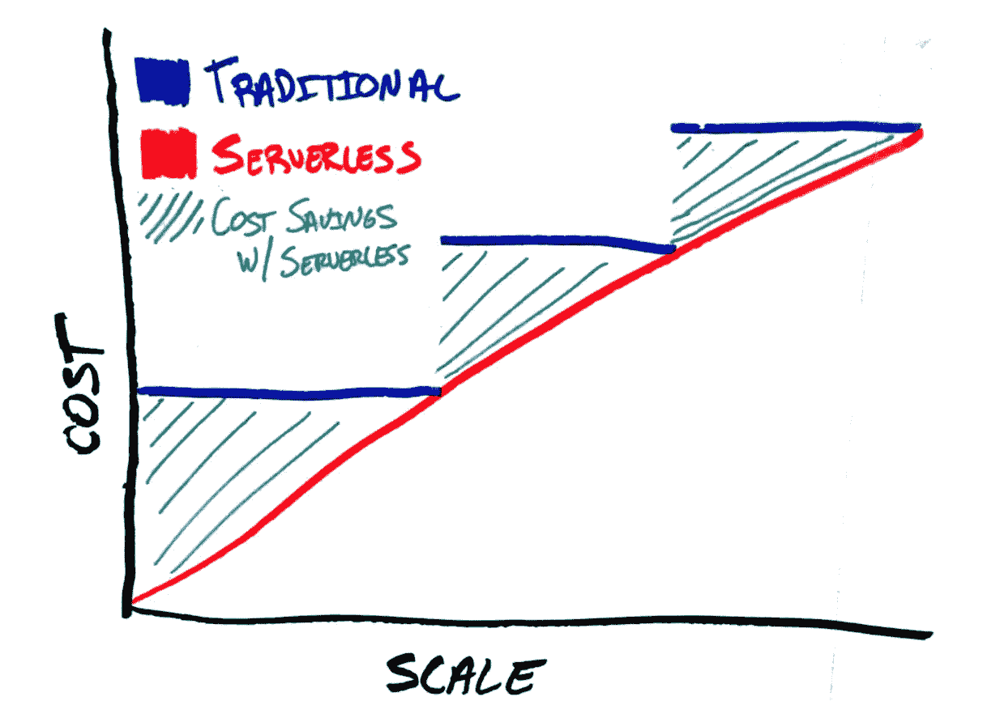
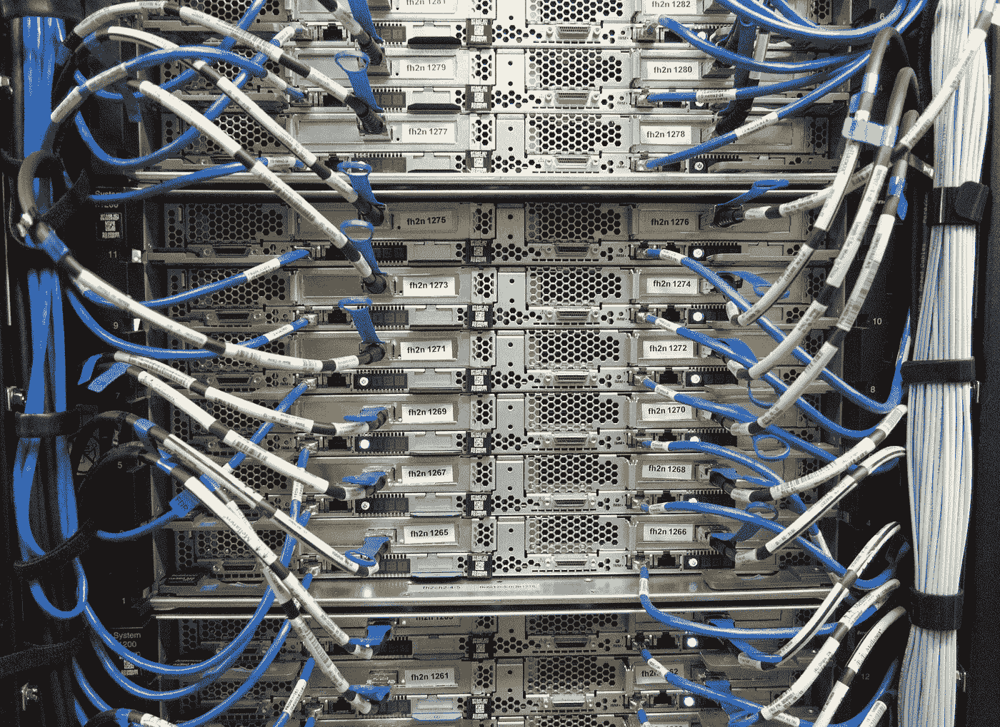
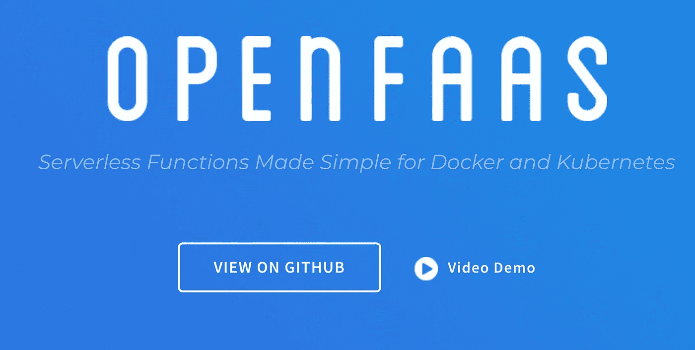

# 无服务器是什么意思？

> 原文：<https://medium.com/hackernoon/what-the-hell-does-serverless-mean-219a5f6e3c6a>

source: Trek10 | [https://www.trek10.com/blog/serverless-framework-for-processes-projects-and-scale/](https://www.trek10.com/blog/serverless-framework-for-processes-projects-and-scale/)

无服务器计算最有可能成为 2018 年的基础设施投资回报率之王。对于任何希望扩大规模的企业来说，认真研究一下这一点都是明智的。那么……什么是无服务器计算？

## 你怎么能没有服务器呢？

How can you not have servers?

认为云计算和规模的未来是一个听起来像哲学废话的概念似乎有点违背直觉。“谁需要服务器，伙计…？”但事实上这很严重。

让我们澄清一下*无服务器最令人恼火的方面；*无服务器计算仍然需要服务器，所以这个名字完全是误导。

传统云计算和无服务器计算的区别在于，作为需要计算的客户，您不会为未充分利用的资源付费。例如，与在 AWS 中启动服务器不同，您只是启动了一些代码执行时间。无服务器计算服务将您的函数作为输入，执行逻辑，返回您的输出，然后关闭。您只需为执行这些功能时使用的资源付费。

## 功能即服务(FaaS)平台

无服务器计算实际上应该被称为功能即服务平台。如果你听说过 [AWS Lambda](https://aws.amazon.com/lambda/) 或者[谷歌云功能](https://cloud.google.com/functions/)，那么你一定听说过 FaaS。这些平台的好处是开发人员不必考虑多线程或负载平衡。他们可以专注于他们的代码。他们信任 FaaS 为他们处理所有的资源管理。事实证明，这也比按固定数量的服务器计费要便宜得多。

使用云公司的 FaaS 也有一些缺点。首先，如果你不经常使用，它们会降低你的运行时环境的速度。矛盾的是，它们也限制了您可用的资源总量，带来了延迟和高性能问题。对于这些云提供商来说，监控、调试和安全性也很棘手(对于任何云计算工作流来说都是如此)，因为它……嗯……运行在您无法访问或控制的公共云中。

Old school (sort of)

## 机器学习

众所周知，今年大多数企业、公司和初创公司都将在人工智能和机器学习上花费时间和金钱。你将会慢慢意识到，机器学习、集装箱化和 FaaS 是相互依存的。机器学习是一组非常具体的计算，在许多情况下，以谨慎的单位发挥作用。例如，你可能需要处理你的社交网络上传的每一张裸体图片，这样你就可以将其标记为不合适(或者非常合适……取决于你的社交网络做了什么)。每张图片都需要通过[机器盒](https://goo.gl/CagLdn)调用类似 [Nudebox](https://goo.gl/sFPUzW) 的东西，这将返回一些信息，然后你可以操作或存储(或者两者都有)。Nudebox 可以独立地、并行地、大规模地处理这些功能……只要速度快，这并不重要。随着您的机器学习需求的增长，您会想要扩展，但在其中使用 GPU 的大型服务器并不划算，除非您打算在它们在线的所有时间使用它们的每一点资源。(机器盒子盒子不需要 GPU，而且非常轻量级)。

## 容器

了解容器，现在就了解它们。它们是虚拟机的自然发展。他们本质上解决了一个与 FaaS 相似的问题；它们让东西变得更便宜，因为你不用为没用的东西付钱…就像你坐在那里等待 Windows 虚拟机启动来运行你的软件一样。它们将成为机器学习/FaaS 未来的重要组成部分，因为容器承担了重任。容器是机器学习模型运行的地方。

## 现在就省钱

这就是你现在省钱的方法；为您的机器学习需求构建自己的无服务器平台。这听起来很难，但事实并非如此。这些功能中有许多是开源的和/或非常经济实惠，并且可以很好地扩展。我公司[机器盒子](https://goo.gl/CagLdn)499 美元/月，无限机器学习动作。 [OpenFAAS](http://www.openfaas.com) 、 [Docker](http://www.docker.com) 和 [Kubernetes](http://www.kubernetes.com) 都是免费的，除非你需要企业支持，即便如此，这仍然比在公共云中运行这一切要便宜得多。

但这不仅仅是运行所有这些的成本，而是它将为您节省的实施、部署和扩展时间。在大约 1 个小时内(我没有夸大，计时，如果我错了，给我回信)，您可以部署一个超级可扩展的、生产就绪的、完整的企业级机器学习平台，运行在容器和无服务器基础设施上。

这意味着你可以去找你的老板，告诉他们你在一个小时内为他们节省了数百万美元！我保证他们会当场给你升职加薪。

> *我不能保证这一点。

所以帮自己一个忙，多了解一下这些工具。不客气

# 什么是机器盒子？

[Machine Box](https://goo.gl/CagLdn) 将最先进的**机器学习**功能放入 **Docker 容器**中，这样像您这样的开发人员就可以轻松地将自然语言处理、面部检测、对象识别等功能融入其中。到您自己的应用程序中。

盒子**是为规模**而建的，所以当你的应用真正起飞时，只需水平地添加更多的盒子，直到无限甚至更远。哦，它比任何云服务都要便宜得多(它们可能比 T21 的更好)，而且你的数据不会离开你的基础设施。

有戏让我们知道你的想法。

# **什么是 OpenFAAS**

[https://www.openfaas.com/](https://www.openfaas.com/)

来自他们的网站:“使用 OpenFaaS，你可以将任何东西打包成无服务器函数——从 Node.js 到 Golang 到 CSharp，甚至是像 ffmpeg 或 [ImageMagick](https://blog.alexellis.io/serverless-imagemagick/) 这样的二进制文件。

你可以在 60 秒内尝试 OpenFaaS，或者在大约 10-15 分钟内编写并部署你的第一个 Python 函数。所以，喝杯咖啡，[了解一下 FaaS 命令行界面如何让无服务器功能变得简单。](https://blog.alexellis.io/quickstart-openfaas-cli/)

所以，带上你的笔记本电脑、你自己的本地硬件或者在云中创建一个集群。选择 Docker 或 Kubernetes 来完成繁重的工作，使您能够为您的应用程序构建一个可伸缩的、容错的、事件驱动的无服务器平台。

我们的核心价值观是:开发者第一、操作简单和以社区为中心。"