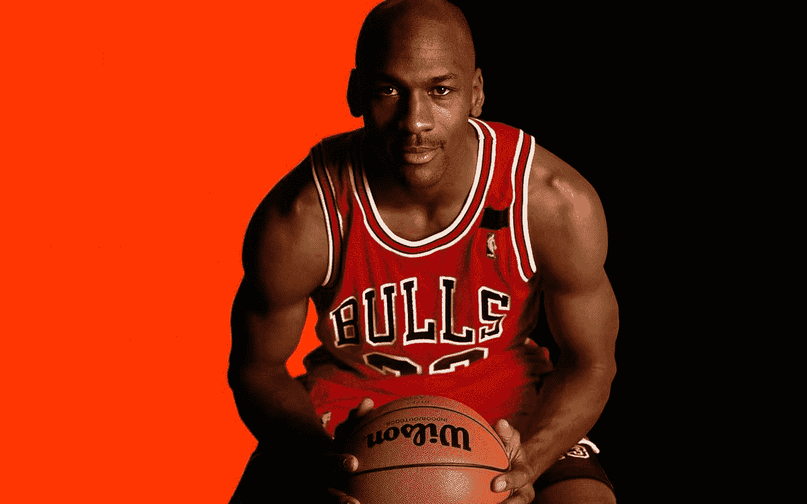
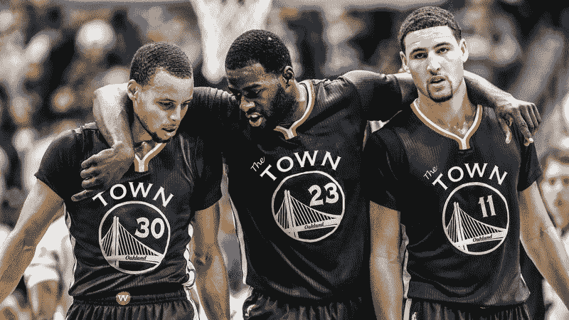
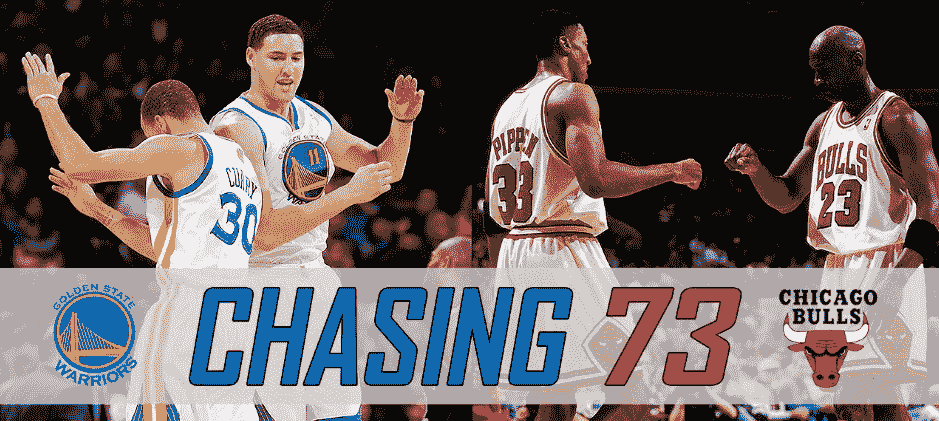

# 关于创业，NBA 能教给我们什么

> 原文：<https://medium.com/hackernoon/what-the-nba-can-teach-us-about-startups-27505e7ec03>

我是 NBA 的超级粉丝。可悲的是，我的身高不允许我成为职业球员，但我喜欢看比赛。几天前我做了一个关于篮球的奇怪的梦，我可以在 NBA 和创业公司之间做一些比较。是的，虽然听起来很奇怪，但你确实可以从篮球比赛中学到一些东西，并将其应用到你的[创业公司](https://hackernoon.com/tagged/startup)中。

我在 NBA 最喜欢的球队是**金州勇士**。对于不怎么看比赛/不太了解比赛的人来说，勇士队在过去 3 年里赢得了 2 次冠军。他们有常规赛 73 胜的记录，还有很多其他很多人认为未来无法打破的记录。你甚至可以说勇士正在成为 NBA 历史上最具统治力的球队之一。

然而，如果我们回顾 5 年前，金州是一个无名之辈。他们有一些有天赋的年轻球员，但没有一个是超级明星。当前团队的一些关键成员甚至没有进入前五名。那么，究竟勇士队是如何在如此短的时间内成为一支如此常胜的球队的呢？

在分析了他们的发展之后，我总结了他们成功的 5 个关键经验。我将详细解释每一课，以及如何将它应用到你的创业中。

# 发展你自己的才能:

你可以从勇士队学到的第一课是你应该如何发展自己的天赋。当勇士队还是一个无名小卒时，他们的预算有限，所以他们雇不起超级巨星。球队唯一的选择是**发现被大球队低估的天赋**并帮助这些球员发挥他们的全部潜力。

如果我们看看他们目前的球队，他们的 3 名主要球员:*斯蒂芬·库里，克莱·汤普森和德雷蒙德·格林，*这 3 人都是全明星球员，在各自的类别中排名靠前。尤其是德雷蒙德，他在选秀中排在第 32 位，但在防守和进攻方面都有出色的表现。

**你如何应用这一课:**

大多数创业公司在开始时资源非常有限。我们不能和大兵团竞争砸钱雇哈佛 MBA 或者斯坦福工程师。我们能做的是努力发现仍处于职业生涯早期的天才。我们应该设计能够帮助他们跟上公司发展步伐的流程。在这种情况下，Stripe 是一个很好的例子，它制定了一项战略，包括在早期获得强大的技术人才。

# 专注于你的力量

在金州成为今天这样的统治性球队之前，NBA 比赛是由大个子球员统治的。他们利用自己的体力做出了不可思议的扣篮和控制篮板。曾经有一句话叫“谁控制了篮板，谁就控制了比赛”。金州勇士队没有像其他人一样按照同样的规则比赛，而是专注于自己的实力。与其他球队不同，金州勇士队有一群很有天赋的球员，他们投篮很准。所以他们根据他们的投篮技术设计了他们的游戏，尤其是三分球。这里的数学很简单:3 > 2，这意味着如果你能有很好的三次出手精度，你将比你的对手扣篮更有效。

**你如何应用这一课:**

创业时，你应该很好地分析自己的技能，然后审视市场状况，看看自己如何适应。一句著名的中国谚语说:“了解你自己和你的对手将永远引导你赢得这场战斗。”我们应该避免按照别人制定的规则去竞争，而是按照我们自己的规则去玩，去改变游戏。一个完美的例子是任天堂如何凭借 Wii 赢得主机战争，将其与 PlayStation 和 XBox 区分开来。任天堂没有在图形和处理能力上竞争，而是为整个家庭设计了一种不同的游戏交互方式。结果，他们卖出的游戏机比竞争对手的总和还要多。

# 保持团队合作

金州勇士队的助攻率是整个 NBA 最高的。所有队员都非常无私，唯一的目标就是赢得比赛。正是团队合作的力量让金州勇士队创造了常规赛 73 胜的 T2 记录。在那之前，人们普遍认为不可能打破迈克尔·乔丹 1996 年带领芝加哥公牛队创下的 72 胜纪录。

另一个证明团队合作重要性的例子是:去年，世界上最好的球员之一凯文·杜兰特自愿降低工资，这样球队就能留住大部分核心成员。

**你如何应用这一课:**

一个想法不付诸实施就一文不值。而伟大的执行力是团队合作的结果。根据一项研究，创业公司死亡的头号原因是缺乏产品市场契合度，但第二大原因是创始团队之间的关系。你应该非常小心地选择你的联合创始人，因为这是一个可能需要很多年的旅程——还有眼泪。之后，你的前 10 名员工也同样重要。只与符合你的文化并能帮助你把项目推进到下一个层次的人一起工作。当事情变糟时(相信我，他们会的)，你只有在团队的支持下才能生存。

# 玩长线游戏

这是金州勇士付出高昂代价才得到的惨痛教训。在 2015 年的常规赛中，勇士的表现势不可挡。他们曾经连续取得 35 场胜利而没有失败。他们太棒了，大部分比赛都赢了 20 分。所有这些导致了 73 场胜利的不可思议的记录。

然而，当季后赛开始时，大多数金州勇士都表现出了常规赛的疲劳。当他们进入对克里夫兰骑士队的决赛时，像斯蒂芬·库里这样的关键成员已经筋疲力尽了。尽管优越，他们还是无法和他们对手的侵略性相比。最终，勇士队在最后一场比赛中以 3-4 输了，冠军从他们手中溜走了。

**您如何运用本课程:**

在初创公司中，许多人使用 Sprints(敏捷开发中常用的一个术语)来组织他们的工作。然而，作为人类，我们不能在很长一段时间内保持高强度。许多人没有意识到这一点；他们开始每周工作 80 小时，由于高强度的工作，他们的积极性慢慢下降。这就是为什么我更喜欢把初创公司比作铁人三项，在铁人三项中，你必须以不同的强度经历不同的阶段。一旦你达到一个阶段，你应该休息一下，计划如何更有效地进行下一步。

# 雇用超级明星

这是最后一课:在输给骑士队之后，金州勇士队意识到他们需要做出一些改变。在那之前，他们队里的大多数超级巨星都是土生土长或白手起家的，但这已经不够了。幸运的是，一个极好的机会很快就来到了他们的手中。凯文·杜兰特在结束了与俄克拉荷马城雷霆队的合同后成为了自由球员。斯蒂芬·库里和勇士队的各成员立即抓住机会，说服 KD 加入他们。这在当时是一笔巨大的交易，因为勇士队已经是联盟中最好的球队之一，但是**加上杜兰特，他们变成了怪物**。在金州勇士队面前，没有一支球队有机会获胜。在那一年的季后赛中，他们创下了 15 胜 1 负的记录，成为了冠军。

**您如何运用本课程:**

正如我们之前提到的，当你刚起步的时候，你可能没有足够的资源去雇佣超级明星。但是随着你的创业公司的成长，你将需要用新的力量来改善团队。人才市场的竞争变得令人难以置信，科技巨头在招聘上花费的薪水不成比例。你应该睁大你的眼睛去寻找任何时候都会出现的机会。就像勇士一样:他们没有出最高的报价，却卖给了 KD 称霸 NBA 的梦想。金钱并不总是最重要的因素。根据候选人的不同，你可能想推销你的使命、文化、经验或乒乓球桌。

希望你觉得以上课程有趣。我很想听听你的想法。你还能从篮球中学到什么？我已经将它们应用到我的创业公司 [Landbot](https://landbot.io/) 中。记住:

> *“如果你不能忍受疼痛，就离开球场。”*

*你知道你可以通过持续按下双手来放弃 50 次鼓掌吗？请给予👏如果你喜欢阅读，这意味着很多！*

更多我的内容请订阅我的 [WhatsApp 简讯](https://bit.ly/DC_WA_newsletter)🙌