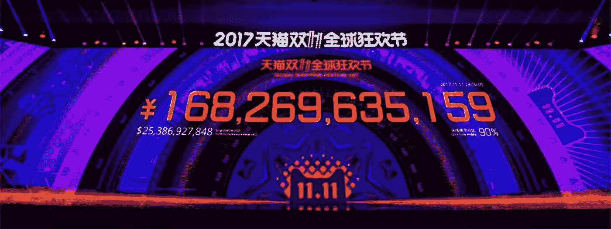
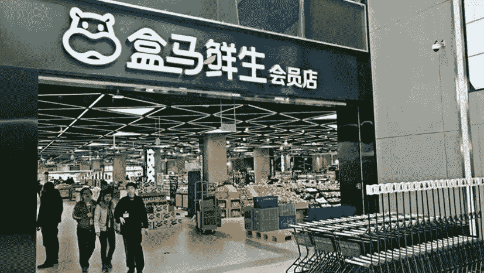
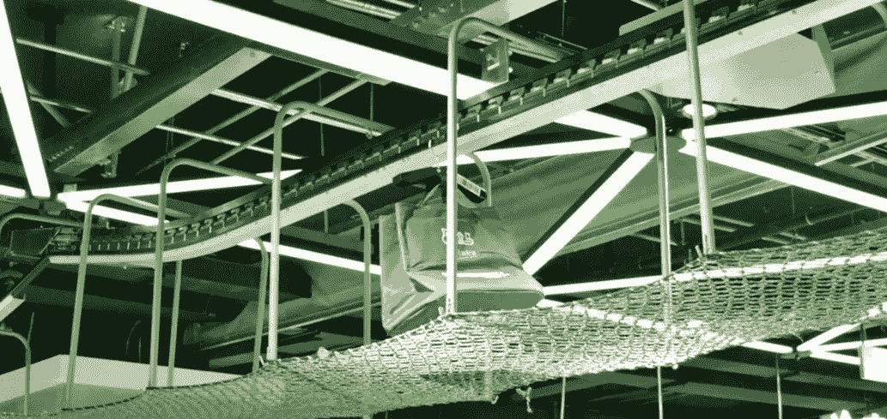
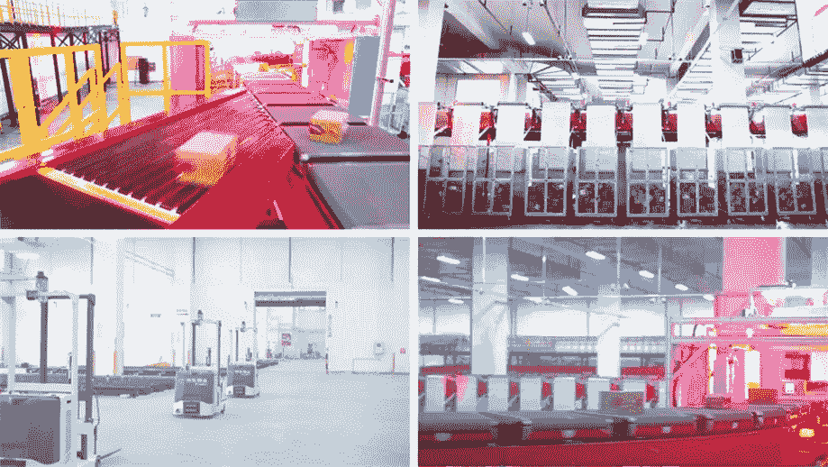
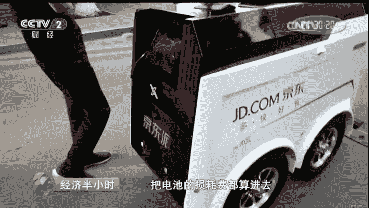
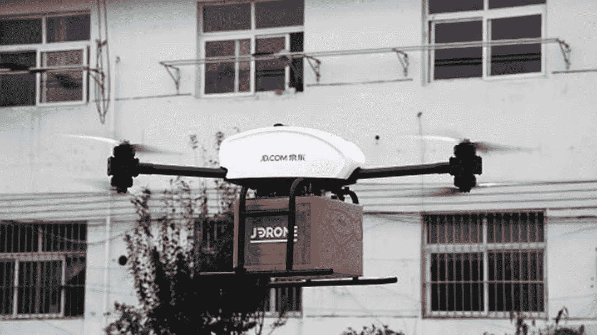
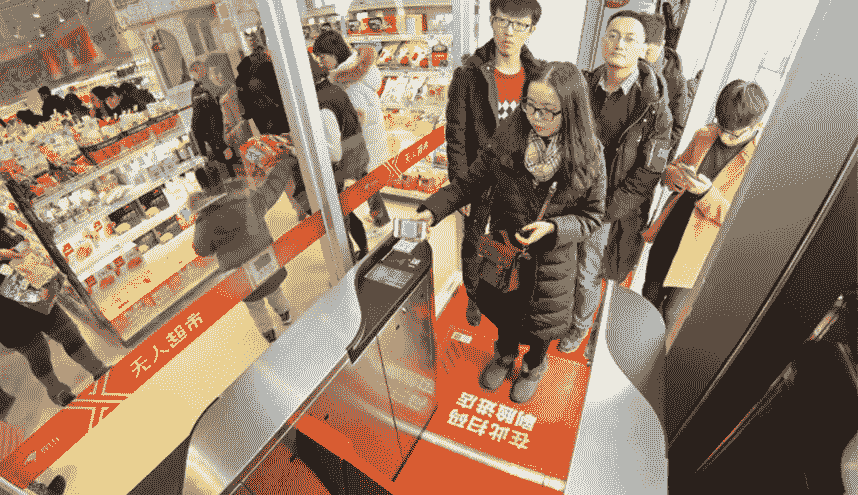

# 他们在做什么:阿里巴巴和 JD.com

> 原文：<https://medium.com/hackernoon/what-they-are-doing-alibaba-and-jd-com-d3ec8ee3cecb>

Source: TMTPOST

在过去的十年里，[零售业](https://hackernoon.com/tagged/retail-industry)已经随着数字化转型而腾飞。尤其是全球电商销售额持续两位数增长；全球电子商务零售销售额预计将在 2021 年[达到 4.48 万亿美元](https://retail.emarketer.com/article/brief-overview-of-global-ecommerce-m xarket/59690010ebd40005284d5cc5)，几乎是 2017 年 2.29 万亿美元的两倍。因此，值得看一看中国最大的两家电子商务公司——[阿里巴巴](https://hackernoon.com/tagged/alibaba)和京东——以及它们在行业中的创新和远见如何推动它们成为东方的易贝和亚马逊。

两家公司都在电子商务热潮中取得了巨大成功。阿里巴巴 [2017 年光棍节](http://fortune.com/2017/11/13/its-not-just-alibaba-jd-com-generated-19-billion-in-sales-at-its-rival-event/)销售额达到 254 亿美元(1683 亿人民币)，而 JD.com 在光棍节当天的销售额总计 191.4 亿美元(1271 亿人民币)。

# 阿里巴巴

Alibaba sales during 2017 Single’s Day totalled $25.4billion USD in Gross Merchandise Value (GMV). Source: Xinhua.net

阿里巴巴由马云于 1999 年创立，成立之初，它是成千上万家中国企业的上市网站。然而，认识到在这个数字时代服务终端消费者至关重要，淘宝和天猫分别提供客户对客户(C2C)和企业对客户(B2C)服务。淘宝是中国个人卖家和终端消费者之间一个平台。相比之下，天猫要求卖家是获得许可的企业，并提供所有文件来确认商品的真实性，因此天猫平台上的产品质量是有保证的。只有菜鸟，他们的专有物流平台，以及采用最新的创新和雇佣数百万快递员，才能每天协调数百万订单。

Overview of Cainiao Network. Source: Alizila

菜鸟是阿里巴巴的物流部门，被认为是淘宝和天猫成功的支柱。菜鸟成立于 2013 年，由几家物流供应商组成，旨在满足蓬勃发展的电子商务领域的物流需求，最终目标是实现 24 小时内送达中国任何地方，72 小时内送达世界各地。

菜鸟没有建立自己的快递服务，而是采用了轻资产的“平台模式”，通过利用第三方快递公司作为“运输工具”在全国范围内交付货物，聚合物流资源，优化交付网络。这种模式简化了操作，并消除了与传统物流行业相关的大量劳动力成本。淘宝和天猫的大量订单足以吸引快递员加入该平台，并采用菜鸟的物流系统，如条形码。

Cainiao largest smart warehouse in Huiyang, Guangdong Province. Source: Business Insider UK

菜鸟的仓库网络覆盖中国 250 多个城市，为 700 多个区县提供当天和次日送达服务。惠阳 3000 平方米的仓库(如上图所示)是 100 多辆自动导引车(AGV)的所在地。这些机器人名为朱雀，或朱雀，在仓库中导航，将多达 600 公斤的产品运送给人类工人，然后他们将包装订单并邮寄给世界各地的客户。

菜鸟还运行着世界上最大的物流数据库，每天处理高达 9 万亿条记录。超过 70%的当前发货依赖内置算法来优化交付路线。此外，未来十年将部署 100 万辆配备菜鸟先进大数据和算法的智能物流车辆，预计每年可节省 14 亿美元。

2017 年底，阿里巴巴增持了菜鸟的股份，获得了物流部门的多数股权。随着马云承诺五年内在菜鸟和 R&D 投资超过 1000 亿元人民币，我们无疑将看到阿里巴巴仓储和配送能力的更多发展。

Storefront of a Hema Supermarket Source: ejinsight.com

[Hema(直译为“河马”)超市](https://www.aseantoday.com/2017/12/alibabas-hema-supermarkets-present-the-model-for-the-future-of-retail/)是阿里巴巴的又一项值得骄傲的创新，将技术与杂货购物的线上线下体验相结合。作为一家仅限会员的超市，顾客可以使用 Hema 的手机应用程序寻找产品，并使用阿里巴巴的支付宝付款。餐饮区提供厨师烹饪的新鲜农产品，收费很低。除了在线订购，店内在线购买也是可用的。客户只需扫描所需产品的条形码，标明数量并付款。然后，订单将由员工填写，并通过传送带发送到隔壁的配送中心，在那里，订单将在分配的时间内运送到客户家中。赫马超市承诺半径三公里内的订单 30 分钟送达。

Bag of grocery packed and sent via a conveyor belt to the delivery center next to the store. Source: lowyat.net

# JD.com

**京东(JD.com)通常被称为东方的亚马逊，是一家专门从事 B2C 服务的电子商务网站。由(刘·)于 1998 年创立的最初是一家电子商店，2003 年底进军电子商务行业。随着对人工智能(AI)和送货网络(包括送货无人机和机器人的使用)的大量投资，JD.com 无疑是阿里巴巴在电子商务和送货领域最接近的竞争对手。**

**JD.com autonomous bots processing parcels during 2017 Single’s Day.**

**JD.com 与阿里巴巴的不同之处在于其重资产的平台模式，它依靠自己的物流部门来处理从仓库到最终消费者的货物配送。这款名为 JD Logistics 的产品让 JD.com 能够在不影响质量的情况下，灵活控制其交付服务。京东物流最近的融资对其估值约为 100 亿美元，这表明投资者对其全球扩张战略充满信心。事实上，JD.com 对自动化仓储和跨境物流等供应链解决方案的投资已经吸引了东南亚的投资者和合作伙伴，特别是与日本运输公司 Yamato 的[合作。](http://www.xinhuanet.com/english/2016-04/06/c_135256169.htm)**

****

**JD’s first ever fully-automated sorting center. Source: JD.com**

**2017 年 10 月，JD.com 建成全球首个全流程[无人分拣中心](https://www.techinasia.com/china-fully-automated-sorting-center-jd-ecommerce)，实现从产品录入、仓储、包装、分拣的全流程自动化。该设施位于江苏昆山，每小时能够处理[9000 个包裹](http://www.chinadaily.com.cn/business/tech/2017-08/03/content_30338693.htm)，相当于 180 名分拣员的工作量，同时消除了人为错误，每年为 JD.com 节省数百万美元。**

****

**A delivery bot travelling on the road. Source: Quartz**

**另一项创新是 JD 的送货机器人。送货机器人的最大行程距离为 20 公里，一次最多可以运送 5 个包裹，旨在为大学校园等较小的社区提供服务。每个送货机器人的成本为 7900 美元(50000 元人民币)，每个包裹的送货成本估计为 0.25 美元(1.5 元人民币)。它目前正在北京的大学校园进行试点测试。**

****

**A JD.com delivery drone undergoing pilot test Source: JD.com**

**为了到达交通不便的中国农村地区，JD.com 发明了七种不同类型的送货无人机，每种都有不同的功能。无人机可携带 1000 公斤的重量，飞行距离为 100 公里，将成为偏远村庄的下一种送货形式，在那里，许多人尚未受益于电子商务的便利。这些无人机消除了用汽车向农村地区运送货物的成本，允许更好地分配物流资源。尽管如此，京东首席技术官张晨指出，电池电量仍然是一个大问题。(阿里巴巴也在进行无人机测试，尽管规模较小。)**

****

**A lady at the entrance of JD’s unmanned store scanning the QR code with her mobile app while undergoing facial recognition. Source: Caixinglobal**

**除了物流，阿里巴巴和 JD.com 还涉足了云解决方案、供应链融资和区块链等其他领域。一个有趣的领域是无人商店，这两个领域都有大量投资，在过去几年中，无人商店在全国范围内越来越受欢迎。使用移动支付、面部和动作识别等技术，收集消费者数据以识别偏好和购买习惯。此类商店全天候运营，仅在必要时补货，大大降低了人工成本。**

**独生子女政策的影响和千禧一代的崛起导致了劳动力萎缩和要求更高工资的双重打击。结合电子商务的蓬勃发展，中国的公司被迫创新和自动化流程以节省成本。在物流等劳动密集型行业，节约成本的措施更为必要。**

**JD.com 和阿里巴巴都塑造了全球电子商务和物流格局，不仅向世界展示了中国的能力，也展示了技术能够实现的目标。如今，人工智能和大数据分析等创新不再是例外，而是常态。在采用创新方面采取积极方法的公司处于领先地位，而那些没有这样做的公司则有可能在这个不断变化的全球环境中被淘汰。在电子商务领域，随着全渠道模糊了砖块和点击之间的界限，我们肯定会看到更多的创新，因为零售商们在争夺 4 万亿美元的电子商务馅饼。**