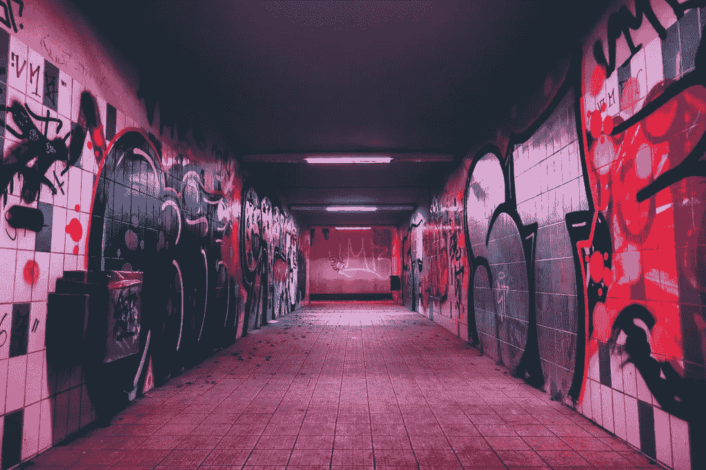

# 大学毕业后做什么

> 原文：<https://medium.com/hackernoon/what-to-do-after-you-graduate-college-d72986ce3c4a>

2006 年，当我大学毕业并获得英语学位时，很多人告诉我，我可以“找份工作，兼职写作”，好像这个选择还不明显。

我需要的建议**是什么样的***的工作。*

*在那 12 年里，我做过物业管理、客户服务、蹩脚的临时工，甚至在面包店和熟食店工作过。*

*在那段时间里，我脑子里闪过的想法是，“我应该写作。”*我不应该做数据录入；我应该写作。我不应该写维护计划；我应该写小说。我不应该清理公共汽车垃圾箱；我应该编辑我的故事。**

*自始至终，我都在谋生，但我没有活着。大多数时候，我醒来会想，让我们结束这一切吧。我的心不在这里。*

*Tim 是我的 Patreon 页面的赞助人，他与我分享了[这篇文章](https://www.theatlantic.com/entertainment/archive/2018/05/i-started-to-drink-on-the-job/559265/?utm_source=eb)，这篇文章让我想起了我刚刚走出大学的那段时光。*

*这是《大西洋月刊》对莱斯利·贾米森的采访，莱斯利·贾米森是哥伦比亚大学艺术学院非小说写作项目的作者和主任。*

> *“……我刚刚收到一封来自一名学生的电子邮件，这名学生刚刚从 MFA 毕业，正在申请一家对冲基金的工作。我 22 岁时申请的是一家对冲基金。我记得我在想，天哪，我想成为一名作家。但如果能赚一些大钱，那就太好了。”*
> 
> ***你认为年轻时听到的最有益的三条建议是什么？***
> 
> *耐心点。希望生活是漫长的，你不需要让每件事都发生在明天。"*

*与此同时，我一边清理着垃圾箱，一边想，我应该写作，我还想，我正在写作。我在写作，也在付房租。清理公交车垃圾箱是在帮我付房租，帮我写作。*

*那是我最后一次因为白天工作而感到内疚。*

*在熟食店、对冲基金或者开垃圾车做临时工并不可耻，如果这能给你写作的稳定性的话。你在做你需要做的事情。*

*所有这些工作最酷的一点是，你真的能学到很多东西。你学习不同的行业。*

*如果你在服务行业工作，比如在熟食店、酒吧或餐馆，你会遇到各种各样的人。他们中的一些人给了我故事的灵感。或者像有一天在熟食店的那个十几岁的女孩，我想，*我的主角就是这么穿的！**

*毕业七年后，我开始创业，但我不知道自己在做什么。我知道如何写作。我知道它可以帮助企业，为我提供生计。但我不知道如何让它发生。*

*我犯了很多错误，差点放弃，又给了一次机会，犯了更多的错误，又差点放弃。现在，不管是好是坏，我已经完全回到这个话题上了。*

*那总结了自大学毕业以来的十二年。*

*很多人不告诉你的是，当你二十多岁的时候，你根本不知道自己在做什么。你不应该知道你在做什么。*

*二十几岁是做错误选择的时候。糟糕的关系。宿醉。一些人(但不是太多的 T2 人)感到遗憾。移动(很多)。更多宿醉。还有工作。好的工作，不好的工作，好的工作但感觉还是不太好。*

*我知道这对你来说很难想象。你的二十几岁感觉就像你的余生，直到你不再是二十几岁。*

***如果你是想写作的毕业生**，那就更是如此。因为你不仅 20 多岁，不知道自己在做什么，而且你是一个 20 多岁的作家，不知道自己在做什么。*

*你不知道自己是不是那种能忍受朝九晚五工作的作家。*

*你不知道你是不是那种作家，可以从事创意行业，有足够的精力做你的艺术。*

*你不知道你是不是那种可以为自己工作而不能为任何人工作的作家。*

*如果你是一个高成就的人，你和其他高成就的人一起上学，那么你会看着你的同龄人去读研，然后想也许你不应该也去读研。*

*如果我可以给年轻时的自己一些建议，我会说这些都不是容易的决定。你出去犯错误了才知道。*

*在过去的 12 年里，我做过的所有工作中，大部分都是出色的雇主，拥有出色的团队和优秀的客户。我从他们每个人身上学到了宝贵的经验和技能。*

*但是在做了那么长时间后，我意识到我不能每天起床去做一份我不喜欢的工作。*

*在过去的十年里，我每天把自己从床上拖起来，害怕我写的每一封求职信，我才明白这一点。*

*当我看到我的许多朋友读研并追求他们热爱的职业时，我才明白这一点，同时我不得不安慰自己读研对我来说不是最好的决定。*

*我是在感受到做负责任的事情和做冒险的事情之间的拉力后才明白这一点的。*

*在两次几乎放弃我的生意后，我才明白了这一点，也才意识到我找到了心中的工作。*

*我是在犯了很多错误后才明白的。*

*当你是一个拥有大学学位的高成就者时，感觉没有犯错的余地，也没有犯错的空间。*

*在过去的八年里，你参加了荣誉课程，花了几个小时实习，参加课外活动，在考试中获得高分，因为你觉得你的未来取决于此。*

*你的未来不再取决于这些东西。勇往直前，犯错误。*

**由 Hin Bong Yeung on Unsplash 拍摄**

****支持文字学者:*** *成为赞助人，提前获得类似这样的好帖子。**

**原载于 2018 年 5 月 19 日*[*word-savant.com*](https://word-savant.com/2018/05/19/what_to_do_after_you_graduate_college/)*。**