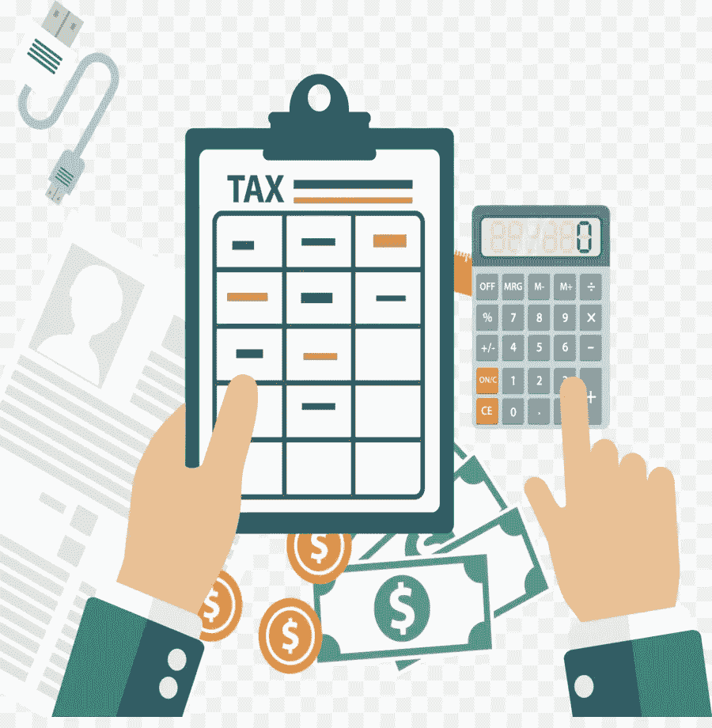

# 如何处理来自比特币基地、双子座或 GDAX 的 1099-K 加密税

> 原文：<https://medium.com/hackernoon/what-to-do-with-your-1099-k-from-coinbase-gemini-or-gdax-for-crypto-taxes-d363baf1fd56>

比特币基地、GDAX、Gemini 和其他加密交易所开始向他们的客户发放 1099-K 税务文件。这些文件将加密投资者送进了一个混乱和恐慌的世界，因为他们在表格上看到了意想不到的大数字。每个人都在问的问题就是这篇文章要解决的问题:我该如何处理我的 1099-K？

# 加密税——基础

美国国税局将加密货币视为财产。这意味着像[比特币](https://hackernoon.com/tagged/bitcoin)、以太坊、Ripple 和其他另类硬币这样的加密技术在税收上必须被视为拥有其他形式的财产(股票、黄金、房地产)。就像其他形式的财产一样，你需要在年底向国税局申报你的资本利得和损失。要深入了解这一过程，请阅读我们的指南，其中涵盖了 [**加密税**](https://www.cryptotrader.tax/blog/the-traders-guide-to-cryptocurrency-taxes) 的基础知识。

# 什么是 1099-K，为什么比特币基地给我发了一个？

1099-K 是一种信息表，用于报告您在一年中收到的信用卡交易和第三方网络付款。

如果您从信用卡交易或第三方网络收到付款，您应该收到 1099-K。在加密的情况下，如果你的支付超过 20，000 美元或者你有超过 200 笔交易，第三方网络(比特币基地、GDAX、Gemini)需要向你发送 1099-K。

如果你符合这个标准，比特币基地会发给你 1099-K，因为这是税法和法律的要求。

您的 1099-K 上的可申报付款总额不包括任何调整，也不代表您可能需要向 IRS 报告的任何收益或损失。它只报告你在网络上进行的所有交易的总收益——在这里是比特币基地。

那是许多花哨的语言。简而言之，1099-K 显示了你在像比特币基地这样的第三方网络上交易了多少。国税局想知道你的交易额是否很高。这张表格向他们展示了。这个 1099-K 是自动发送给国税局的，所以他们知道你在第三方交易所的活动。然而，这并不是你要付的税。*呼气*

记住，你只欠资本收益税。或者换句话说，你只需为你在交易密码时获得的金额缴税。如果你以 100 美元的比特币开始，在持有 6 个月后以 500 美元的价格卖出，你就应该为这 400 美元的收益缴税。如果你不熟悉加密资本利得和税收，阅读我们的文章 [**这里**](https://www.cryptotrader.tax/blog/the-traders-guide-to-cryptocurrency-taxes) 。

如果你从任何交易所收到了 1099-K，你肯定应该在你的税收上申报你的加密活动。如果你没有，你几乎是要求被审计，因为国税局已经知道你的交易。

# 我没有收到 1099-K。我还应该在我的税上报告我的加密收益吗？

虽然这可能会引起很多人的争论，但答案是肯定的。法律要求报告你的加密交易的资本收益。每一次销售和每一次硬币对硬币的加密交易都是一个应税事件。这些都应该在你的 8949 表格上报告。

# 我该如何申报我的加密交易？

你需要两个表格 [**来正确申报你的加密税**](https://www.cryptotrader.tax/blog/how-to-report-cryptocurrency-on-taxes):[**8949**](https://www.irs.gov/pub/irs-pdf/f8949.pdf)和 [**1040 附表 D**](https://www.irs.gov/forms-pubs/about-schedule-d-form-1040) 。在你的 8949 上列出所有交易，以及交易日期、你获得密码的日期、成本基础、你的收益和你的盈亏。一旦你列出了每一笔交易，在底部把它们加起来，然后把这个金额转到你的 1040 表格 d 中。把这两个表格都包括在你的年度纳税申报表中。

如果您的交易量很大，通过将您的交易上传到 [**CryptoTrader，可以节省您的时间和精力来自动化整个 8949 创建。**税](https://www.cryptotrader.tax/)。完成 8949 表格后，将此表格交给您的税务专家或上传到 TurboTax 等税务准备软件中。

概括一下:比特币基地给你发了 1099-K，因为他们不得不这样做，因为你有超过 20，000 美元的交易或超过 200 笔交易。国税局收到了一份 1099 的复印件，所以他们知道你的活动(但不要担心，因为这不是你欠的税！).为了正确报告您的交易活动的税款，请完成 8949 和 1040 表 d。国税局将一起查看您的 8949 和 1099-K，以确定您是否准确地申报了加密税。

*使用* [***CryptoTrader 轻松报告您的加密货币资本收益。税***](http://www.cryptotrader.tax/) 。

*最初发布于*[*www . cryptotrader . tax*](https://www.cryptotrader.tax/blog/what-to-do-with-your-1099-k-from-coinbase-gemini-or-gdax-for-crypto-taxes)*。*