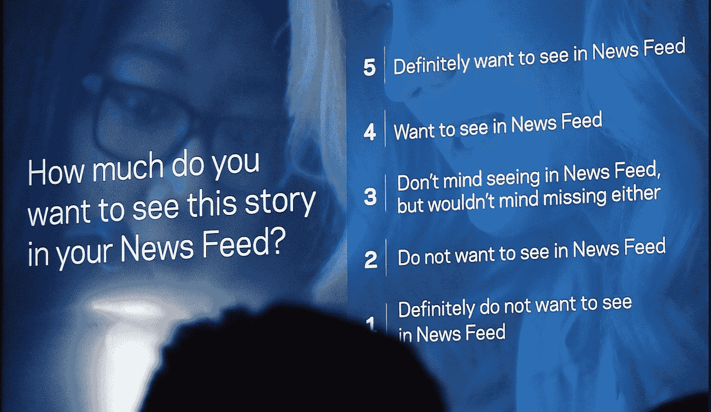
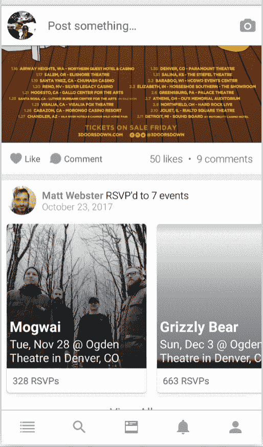

# 从脸书的新闻订阅挣扎中可以学到什么？谁将为未来的新闻订阅提供动力？

> 原文：<https://medium.com/hackernoon/what-to-learn-from-facebooks-news-feed-struggles-and-who-will-power-the-news-feed-of-the-future-fd32f31e6321>

## 创始人访谈

Photo credit, [Ian Kennedy.](https://www.flickr.com/photos/clankennedy/16322698573)

> 披露: [Stream](https://goo.gl/LxzcfX) ，可扩展提要的 API，之前赞助过 Hacker Noon。

*今天，我们将采访他们的首席执行官 Thierry Schellenbach，谈论脸书新闻订阅，以及新闻订阅的未来。*

关于本次采访的前几部分，请访问:

*   [“Stream 如何开始构建新闻订阅源”](/@DavidSmooke/how-stream-started-building-newsfeeds-bfd064ddf054)

大卫 **:所以脸书的新闻供稿受到了很多审查和压力。例如，在平台上分享的故事影响了选举，改变了我们的民主。现在，新闻订阅中发布者帖子的删除和贬值让世界上的 Buzzfeeds 陷入困境，并对其收益进行了低报。**

**所以新闻提要非常非常强大。如果你能和马克·扎克伯格就如何修复或改进脸书新闻频道进行对话，你会对他说什么？**

蒂埃里·谢伦巴赫:哦，这个问题很棘手！我认为这实际上是他们所面临的一系列问题的组合。首先，他们有假账户，这不仅是脸书遇到的问题，Twitter 更是如此。

是啊。我的意思是，在 Twitter 上，你可以有假账号或假名。

我认为这肯定是问题的一部分。对他们的广告商进行额外的审查将是有益的，因为广告在少数人如何成功控制像脸书这样的平台上的对话中发挥了巨大的作用。简而言之，他们应该仔细看看虚假账户和广告，并开始解决这些问题。

另一件要提到的事情是，脸书的个性化(机器学习)是至关重要的，因为有太多的更新需要优先考虑。我的意思是实际上，你不能看到你的朋友发布的所有信息，这太多了。我相信脸书时间线平均每天有 1500 个新帖子，这是不可能人工审核的。他们必须创建某种优先级排序方法。然而，虽然我认为使用这项技术是必要的，但重要的是不要陷入过滤器泡沫。除了看到与他们相似的观点和意识形态，用户还应该看到相反的观点。

> 我建议脸书优化他们的机器学习，不仅要显示用户最有可能参与的内容，还要时不时地鼓励用户探索他们日常兴趣之外的新话题和事物。Quora 平台在这方面做得很好……或者至少比脸书做得更好。

**Quora 创始人不是曾经是脸书的 CTO 吗？**

正确。

**但就挑选你兴趣之外的东西而言，这是平台所处的一个非常危险的领域。你没有做什么可以选择的事情，这就很满足了。你是这个意思吗？**

因此，脸书的个性化方法与大多数其他平台不同。Quora 会向你展示你订阅源之外的内容。Instagram 主要将他们的个性化应用于探索版块——你有你的常规订阅，你有探索版块，在那里你可以发现新的内容。脸书主要使用个性化来重新排序你的 feed 中的内容。通过这样做，他们也创造了一个真正强大的过滤器泡沫。

为了摆脱过滤泡沫，脸书应该时不时地展示你预先定义的兴趣之外的内容。例如，如果你不参与某个主题的帖子，他们应该偶尔再给你看一遍那个主题，看看你的偏好有什么变化。一个人感兴趣的东西可能每天都有很大的变化，更不用说每年了。

**这很好地阐述了过滤气泡的工作原理。就我个人而言，我只是不相信脸书想要走出过滤器泡沫，我认为过滤器泡沫非常有利可图。这种自我实现的预言是他们想要的，但不会告诉你。只是一个想法……**

是的，那也可能是一部分。他们的机器学习显然是为了优化参与度。虽然他们显然必须优化参与度，但长期参与度和短期参与度之间存在重要差异。我认为，从长远来看，找到更多人们感兴趣的东西，并展示更多，可能对他们更好。我不认为只向你展示预先定义的兴趣，永远不走出那个泡泡，对脸书的长期参与真的有好处。

是啊。我认为他们最近推出的一些营销活动证实了这一点，即“我们希望你花更少的时间，进行更有意义的互动。”那么，你有多密切地关注其他人的科技新闻中的所有这些更新呢？你是不是一直在监控 Instagram，Twitter，Pinterest 等等。新闻提要的变化和从中学习？

我们肯定会关注市场，看看有什么新方法。我们技术的最新迭代实际上非常类似于 LinkedIn 的 feed 技术。LinkedIn 有一个庞大的团队在开发他们的 feed。他们已经发表了论文和博客，介绍他们是如何开发它的。( [Linkedin & RocksDB](https://engineering.linkedin.com/blog/2016/03/followfeed--linkedin-s-feed-made-faster-and-smarter) ， [Linkedin 的 AI](https://engineering.linkedin.com/blog/2018/03/a-look-behind-the-ai-that-powers-linkedins-feed--sifting-through) )

我们现在看到的另一个趋势是聚合。因此，如果有人发布了 100 个更新，聚合会神奇地显示为 1 个更新。这大大降低了饲料中的噪音。Bandsintown 是一个利用聚合的应用程序的好例子。

除了传统的社交网络用例之外，我们还开始看到基于 feed 的个性化应用在更多的商业实践用例中出现。Feeds 现在被用于房地产应用程序、求职网站甚至电子商务。或许你可以说，它们在其他行业实际上比社交网络更有用。

**你认为还有其他行业的新闻提要真的会扩大，并成为该行业更突出的技术特征吗？**

基于我们今天看到的趋势，我相信新闻提要将继续成为网站上越来越受欢迎的发现功能。当你知道你在找什么的时候，在任何给定的网站上搜索就很简单了。另一方面，有时你去一个网站却不知道你到底在搜索什么或者想找什么，你可以利用一些帮助。

让我们使用房地产用例。所有房地产网站的目标都是帮助你找房子，希望帮助你发现满足用户独特需求的房屋信息——卧室、浴室、车库、邻居等。随着这类网站的不断完善，提要将发挥更大的作用。

Etsy 就是一个将先进的 feed 技术用于购物体验的公司的典型例子。Etsy 写了一些关于他们如何处理机器学习的论文。通过 Etsy，每当你点击或搜索一个项目，他们的机器学习本质上是“学习”你的兴趣，并继续为电子商务转换进行改进和优化。

**是的，很酷。**

> *随着 feed 技术变得更容易使用，机器学习变得更强大，它将推动越来越多应用程序中的内容发现，使内容更有意义。*

我们将会实现每一个主页的个性化。就像游览 Coke.com 和 Pepsi.com 一样，你可能会根据自己在互联网上的活动体验到个性化的体验。

并不是每个网站都需要个性化。一些社区和网站非常一致——只对特定的受众有吸引力。让我们以 Dribbble 为例。如果你去 Dribbble.com，你会发现一个设计师社区。该网站有一个非常小众和狭窄的焦点。所以我认为这些类型的专注/利基网站永远不会个性化用户体验。

然而，大多数网站吸引更多不同的观众。你会看到越来越多的公司开始实施个性化，为他们的用户提供更量身定制的体验。

**让我们严肃一会儿。你的公司面临的最大威胁是什么？**

我认为对我们和这个领域的任何其他公司来说，最大的危险是像微软、谷歌和亚马逊这样的大玩家，以及这些大的主机提供商推出专用产品的机会。我知道另一家 Techstars 公司 SendGrid 最终受到了亚马逊的竞争。

我得说这是我最大的担忧，让我夜不能寐。如果亚马逊或谷歌的人决定进入我们的市场，这将给我们带来一些激烈的竞争。除此之外，和那么多其他创业公司类似，主要是你自己的执行力。

> *创业公司陷入困境，更多是因为他们自己的选择，或者他们自己的执行，而不是外部因素。*