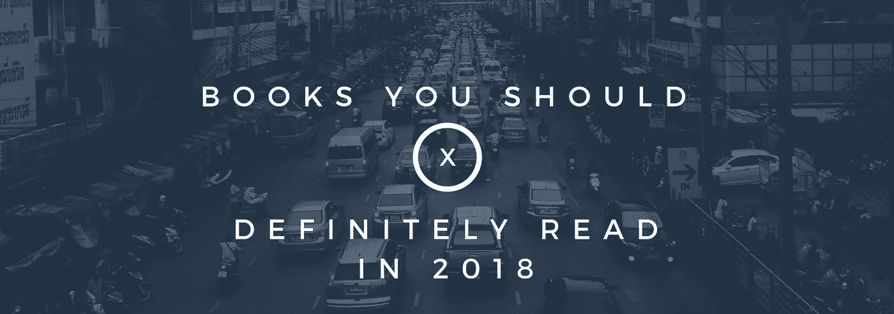

# 2018 年读什么？📚值得你花时间阅读的书单

> 原文：<https://medium.com/hackernoon/what-to-read-in-2018-a-list-of-books-worth-your-time-acacf62d941>

2017 年，我带着“生产力”这个词开始了我如饥似渴的阅读之旅。在我的工作流程中，我希望尽可能地高效，但后来意识到它有其局限性。当我继续我的道路时，我遇到的第一个限制是，我发现在这个词下面有一个广阔的领域和子领域。我必须做出决定，我将如何从生产力本身，但更重要的是拥有/发展这种心态中受益？我一年中碰到了 28 本书。很少有来自与我有相似目标的人的推荐，也很少有是我自己挑选的。

所以让我问一下。你是一个 *创造者/制造者/发货人/建筑商/皮条客/数字流浪者/个体创业者/远程工作者/自由职业者/藏书家吗？🚀🚀🚀*

以上提到的任何一个都在你的目标/工作日程中，下面的书单一定会帮助你实现它们或者继续努力。毕竟，我们都在进步。

这是列表，在一条推特上(笔迹不是很棒，☺️确实很冷🙃):

以下是我今年设法读到的一些:

在一些书中，我甚至设法详细地写了它们。这些主要是我对他们和他们所提供的工具的真实看法。

*   [蒂姆·费里斯的《每周 4 小时工作制》](https://amandeepmittal.wordpress.com/2017/12/14/book-review-the-4-hour-work-week-by-tim-ferriss/)
*   罗伯特·清崎的《富爸爸，穷爸爸》
*   [蒂姆·费里斯的《泰坦之工具》](https://amandeepmittal.wordpress.com/2016/12/30/book-review-tools-of-titans-by-tim-ferriss/)
*   [罗尔夫·波茨的《流浪》](https://amandeepmittal.wordpress.com/2017/11/21/book-review-vagabonding-an-uncommon-guide-to-the-art-of-long-term-world-travel-by-rolf-potts/)
*   [安·兰德《源泉》](https://amandeepmittal.wordpress.com/2015/12/05/book-review-the-fountainhead-by-ayn-rand/)
*   [肖恩·埃利斯和摩根·布朗的《黑客成长》](https://artplusmarketing.com/hacking-growth-by-sean-ellis-morgan-brown-71a518d85fdf)
*   [克里斯·吉列博的《不墨守成规的艺术》](https://amandeepmittal.wordpress.com/2017/08/08/book-review-the-art-of-non-conformity-by-chris-guillebeau/)

请随意添加你的或者在下面的推荐部分向我推荐你读过的。我总是想让我的 TBR 超载😅

如果你想了解更多关于我在上面列表中提到的那本书，请访问我的 [**图书博客**](http://readingbooks.blog/) **！**

## 如果你喜欢这篇文章，请👏。谢谢大家！