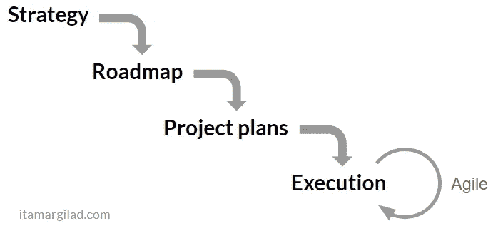

# 科技类阅读内容

> 原文：<https://medium.com/hackernoon/what-to-read-in-tech-23108cb3c0fb>

## 来自互联网另一端的问候，

约翰·佩里·巴洛昨天去世了。他 70 岁了。他的讣告由[电子前沿发现](https://medium.com/u/2fa7aa79cd7a?source=post_page-----23108cb3c0fb--------------------------------)的辛迪·科恩可以在这里阅读。巴洛先生是 EFF 的创始人之一，该组织致力于促进数字媒体的言论自由。如果你有 3 分钟时间，一边听[感恩而死的卡西迪](https://www.youtube.com/watch?v=PLQS1E7ZaqA)(他写的一首歌)，一边读[一段网络空间独立宣言](https://www.eff.org/cyberspace-independence)(节选如下)。

*“网络空间由交易、关系和思想本身组成，像驻波一样排列在我们的交流网络中。我们的世界既无处不在又无处不在，但它不是肉体生活的地方。我们正在创造一个所有人都可以进入的世界，没有因种族、经济实力、军事力量或出生地而产生的特权或偏见。我们正在创造一个世界，任何人、任何地方都可以表达他或她的信仰，无论多么独特，而不用担心被迫沉默或顺从。”*

互联网自由思想者的深呼吸。

# 我们上周的 22 大科技新闻:

## [开发故事](https://hackernoon.com/tagged/software-development)

[**编写一个缓和函数；一个稍微有趣的故事**](https://hackernoon.com/writing-an-easing-function-a-slightly-interesting-story-70ce667c212a) 作者[大卫·吉尔伯森](https://medium.com/u/f735d3b0f2f3?source=post_page-----23108cb3c0fb--------------------------------)。“我应该从一开始就说，这篇博文没有任何实际意义。我有事情要做，我做了这件事，对结果还算满意。我喜欢阅读其他开发者的故事，所以我想分享我的故事。本文推荐的音乐组合:新的《觉醒》专辑。

[**为什么应该停止使用产品路线图，尝试要点规划**](https://hackernoon.com/why-i-stopped-using-product-roadmaps-and-switched-to-gist-planning-3b7f54e271d1) 作者[伊塔马尔·吉拉德](https://medium.com/u/7664b1d60b5f?source=post_page-----23108cb3c0fb--------------------------------)

[**宣布 code sandbox 2.5**](https://hackernoon.com/announcing-codesandbox-2-5-be767d15ffd)**作者 [Ives van Hoorne](https://medium.com/u/ee6691f0bd65?source=post_page-----23108cb3c0fb--------------------------------) 。20 项新功能，重新设计和重写。嘣！**

**[**由**](https://hackernoon.com/top-50-developer-tools-of-2017-7e616928416b) **[StackShare](https://medium.com/u/23fab098ca0d?source=post_page-----23108cb3c0fb--------------------------------) 评选的 2017**50 大开发者工具。第四届年度 StackShare 奖！🎉**

**约翰·格鲁伯就微软的未来 采访西蒙·陈。哦，在建立待办事项列表的挑战中！**

**[**你做单口相声不对！**](https://hackernoon.com/you-are-doing-stand-ups-wrong-3683822bb806) 作者[朱丽叶拉拉](https://medium.com/u/9d14337cac35?source=post_page-----23108cb3c0fb--------------------------------)。“你如何控制人们不要说太多话？如果他们确实说得比分配的时间多，有一些微妙而有趣的方法让他们知道他们已经过了时间，一旦时间到了，就带一个计时器、吱吱响的玩具或迷你足球来传递**

## **[区块链](https://hackernoon.com/blockchain/home)**

**[**一个数万亿美元的区块链用例**](https://hackernoon.com/a-multi-trillion-dollar-blockchain-use-case-458f06732dc5) 作者[泰勒皮尔森](https://medium.com/u/b6343375a907?source=post_page-----23108cb3c0fb--------------------------------)。“有几个区块链供应链案例具有重组行业的潜力。一个特别有影响力的用例是让小供应商更容易以更优惠的条件获得更多融资。”**

**[**带着区块链反应过来**](https://hackernoon.com/bringing-the-blockchain-to-react-native-98b76e15d44d) 由[变为](https://medium.com/u/52211b671242?source=post_page-----23108cb3c0fb--------------------------------)。“尽管 React Native 没有以太坊钱包或浏览器来与跨平台的分散式移动应用程序进行交互，但有可能将区块链引入 React Native。”**

**[**整个城市可以在区块链上运行吗？**](https://hackernoon.com/can-an-entire-city-run-on-the-blockchain-862b90dabae5)**by[Quora](https://medium.com/u/3853f85f7d5e?source=post_page-----23108cb3c0fb--------------------------------)。“虽然迪拜是中东无可争议的商业中心，但它制定了一个雄心勃勃的目标:到 2020 年成为世界上第一个由区块链掌权的政府。”****

****[**你需要知道的区块链技术热门用例**](https://hackernoon.com/popular-use-cases-of-blockchain-technology-you-need-to-know-df4e1905d373) 作者[费宾约翰詹姆斯](https://medium.com/u/75a616711f4e?source=post_page-----23108cb3c0fb--------------------------------)。“你的大部分所有权记录都存储在纸质账本里。这些都是可以篡改的。区块链上的数据不能被篡改。在区块链上有两件事。一块积木和一条链子。在很高的层面上，它只是一个区块链。”****

## ****[比特币](http://hackernoon.com/bitcoin)****

****[**比特币的实质性&技术路到 100K 美元**](https://hackernoon.com/bitcoins-substantive-technical-road-to-100k-2637b899ffc5)**by[Kerati Apilak](https://medium.com/u/79268f60a209?source=post_page-----23108cb3c0fb--------------------------------)。“这篇文章的目标是研究价格达到每比特币 10 万美元的基本路径……”******

******[**The Flippening:以太坊 vs 比特币**](https://hackernoon.com/the-flippening-ethereum-vs-bitcoin-2ac80a953ebb) 作者[肯尼李](https://medium.com/u/f9523f18e303?source=post_page-----23108cb3c0fb--------------------------------)。"挖掘以太坊块每次确认需要大约 14 秒，相比之下比特币需要 10 分钟."******

## ****[更多密码世界](https://hackernoon.com/tagged/cryptocurrency)****

****[**我的超级秘密隐龟攻略**](https://hackernoon.com/my-super-secret-crypto-turtle-strategy-revealed-ae7492fb01a6) 作者[丹尼尔·杰弗里斯](https://medium.com/u/618a7c78c957?source=post_page-----23108cb3c0fb--------------------------------)。“交易系统是关于纪律的。大多数人不会努力让它为他们工作。他们不会经历成为大师的所有必要步骤。”****

****[**2018 年 4 大加密货币趋势看点**](https://hackernoon.com/4-cryptocurrency-trends-to-watch-in-2018-1a0500d63d6)**by[tech recaps](https://medium.com/u/cfe6ee3eeb69?source=post_page-----23108cb3c0fb--------------------------------)。“尽管 1 月份市场整体下滑，但加密货币作为技术资产和消费品仍在快速增长。”******

******[**IOTA:真实世界用例来了**](https://hackernoon.com/iota-real-world-use-cases-are-coming-ab1d8240cf09) 作者[克里斯·穆勒(又名 IOTASUPPORTER)](https://medium.com/u/5170edef4b21?source=post_page-----23108cb3c0fb--------------------------------) 。好奇 IOTA 要去哪里？读读这个。******

****[**想你之前的 SEC ICO**](https://hackernoon.com/think-like-the-sec-before-you-ico-412a24357d76)**by[布列塔尼拉夫林](https://medium.com/u/c2f3fbddcb49?source=post_page-----23108cb3c0fb--------------------------------)。“去年，ICOs 在 800 多个项目中筹集了 50 亿美元，预计今年会有更多。热情高涨，但问题仍然多于答案。一个紧迫的问题是证券交易委员会将如何监管 ico。目前还没有明确的指令，但在推出 ICO 前需要考虑的事项方面，法律标准越来越多。”******

******[**美国证交会和 CFTC 国会关于加密货币的 10 大要点**](https://hackernoon.com/top-10-points-made-by-the-sec-and-cftc-congress-testimony-on-cryptocurrencies-f4c71712624c) 由 [Howard Marks](https://medium.com/u/612939bd0962?source=post_page-----23108cb3c0fb--------------------------------) 。“SEC 主席 Jay Clayton 和 CFTC 主席 Christopher Giancarlo 在国会就加密货币作证。以下是杰伊·克莱顿言论中最重要的 10 点。******

## ****哦，脸书…****

****[**脸书的史诗般的奔跑告一段落**](https://hackernoon.com/facebooks-epic-run-comes-to-an-end-442dee72401c) 由[卢肯纳](https://medium.com/u/b01056393401?source=post_page-----23108cb3c0fb--------------------------------)。“自从 2004 年脸书赛跑诞生以来，我就一直关注着它。那时我在经营 Bolt Media，在 Friendster 和 MySpace 之间的一段短暂时间里，我们是世界上最大的社交网络。我在购买由 16、18、20 岁的孩子创办的网站，我是第一个打电话给马克并提出收购这家公司的人，当时他有大约 1000 名哈佛的孩子。”****

## ****[营销](https://artplusmarketing.com/tagged/marketing)****

****[**不要从为什么开始！**](https://hackernoon.com/https-medium-com-k-yonatan-dont-start-with-why-14a4bb58a209)**[卡根斯基](https://medium.com/u/8a7166467d43?source=post_page-----23108cb3c0fb--------------------------------)。“这就好比说:*要想成为美国总统，你需要从相对高大*开始。这是真的:平均而言，美国总统现在和过去都比普通美国人高得多。然而，尽管个子高是一个优势，但身高并不是后来成为总统的人背后的核心驱动力。登上总统宝座需要很多天赋、韧性和运气。”******

## ******[启动通话](https://hackernoon.com/tagged/startup)******

******[**你是在做副业还是创业？**](https://hackernoon.com/are-you-working-on-a-side-project-or-a-startup-569ae7f6ac0) 由[方正集体](https://medium.com/u/f49435c6fa9?source=post_page-----23108cb3c0fb--------------------------------)。“许多潜在的 1 亿美元公司失败了，因为他们筹集资金，好像他们会成为 10 亿美元的独角兽。问题是，一开始很难判断一个想法能有多大。还不太明显的是，Altair 微型计算机的操作系统、学术论文的搜索算法或哈佛学生的社交网络会成为我们这个时代的三大标志性科技公司！”******

****[**如何获得第一轮资金**](https://hackernoon.com/how-to-secure-your-first-round-of-funding-9461dad669db) 由[转到](https://medium.com/u/64635a6c6340?source=post_page-----23108cb3c0fb--------------------------------)。你的故事的目的应该有两个:(1)确定你是谁，作为共同创始人，你们能够一起经营一家公司，不会出现任何问题。(2)你有能力建造你想建造的东西，如果你的想法行不通，也有能力建造其他东西。”****

## ****…[不要](https://goo.gl/4X4sNQ) [忘记](https://goo.gl/pGDQ95) [关于](https://goo.gl/R4wVbb) [物理](https://goo.gl/9gsD8E)****

****[**海森堡的测不准原理并不意味着你有心灵遥感**](https://hackernoon.com/heisenbergs-uncertainty-principle-doesn-t-mean-you-have-telekinesis-7868eb9bfc83) 由[小亚历克斯](https://medium.com/u/c9fb0f0517ee?source=post_page-----23108cb3c0fb--------------------------------)。“并不是观察的行为改变了粒子的环境，而是为了让我们能够看到，必须存在的其他变量。”****

****直到下一次，不要认为现实是理所当然的。****

****诚挚的问候****

****[大卫·斯穆克](http://www.davidsmooke.net/)，[@阿米](http://twitter.com/ami)****