# 语音用户界面设计选择什么工具？

> 原文：<https://medium.com/hackernoon/what-tool-to-chose-for-voice-user-interface-design-b4122f657e44>

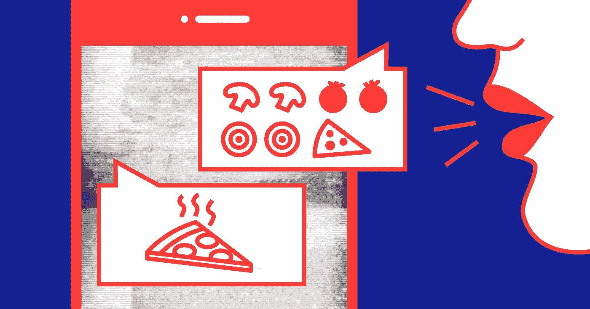

你好，我叫帕维尔。我在一家移动应用程序开发公司工作，一年多前，我积极投入到语音应用程序的设计过程中。

我参加了几个真实的项目，是不同会议的专家，会见了谷歌助手的开发者，与其他 VUI 设计师分享了我的经验，之后深入思考了如何优化语音应用的设计和测试流程。

这个想法给了我一个动力，让我踏上了通过现有工具的漫长旅程，并对它们的局限性进行了分析，并让我得出了预期的结论——我把它留到了文章的结尾。首先，关于礼物。

# 理论部分

让我告诉那些从来没有使用过这种界面的人一些关于设计语音应用程序过程的话。

好语音 app 不同于聊天机器人的是没有强制使用特定命令。用户有机会与服务建立类似于真实生活对话的轻松对话。主要工具是语音和文本，但如果设备有屏幕，应用程序可以以卡片、旋转木马、列表的形式添加视觉伴奏，目的是提供最佳信息。

> 例如，我们来看看“披萨订单”。假设你有多少个不同的短语来告诉程序你想要比萨饼。用户可以点一些特定的比萨饼，但是他也可以点一些有蘑菇和火腿的。用户可以要求应用程序列出所有可用的产品，并选择合适的一个。最终他会说他饿了。

所有这些都是情节发展的场景，我们应该在应用程序的每个场景中以每种可能的方式提供每个单独的步骤。真是一团糟！我们还没点披萨呢！

# 设计方法学

不管平台如何，VUI 设计都要遵循标准的步骤。你可以在[谷歌助手](https://developers.google.com/actions/design/)、[亚马逊 Alexa](https://developer.amazon.com/designing-for-voice/) 和[微软 Cortana](https://docs.microsoft.com/en-us/cortana/skills/design-principles) 的开发者页面找到详细的指南。每个团队以不同的方式构建过程。就我而言，我强调以下步骤(有时，它们运行不一致):

1.  **从观众中识别人物。**每个人物角色都是一组应用程序受众代表的集体形象。人物角色帮助我们更好地理解用户需求，每个人物角色都有一套基于行为模式的短语。
2.  **过滤脚本。**现在我们需要决定将在应用程序中实现哪些脚本。你不能只是把图形应用程序“转换”成语音应用程序。对我自己来说，我推导了一个简单的规则:如果无法想象我如何用真人来发音一个具体的脚本，那么我们就不应该把它带到工作中，因为用户肯定会对它有问题。
3.  **创造一个人物。**我们应该努力让与应用程序的对话像与活人的常规对话一样。为此，用户应该形成与他交流的人的形象。你可以通过创造一个角色来实现。我们添加一个名字，绘制外观，技能，简短的传记，性格，当然，声音。
4.  **写出对话的例子。**我们知道我们的用户是谁，我们知道他们想要什么功能，我们知道我们通过谁的面孔与用户交流。是时候为每个脚本编写用户和应用程序之间的对话示例了。
5.  **构建对话树。为了考虑到事件过程的所有变化，所有将引导用户到一个假设的“比萨饼订单”的步骤，可视化所有的动作是值得的。为了避免混淆，我以流程图的形式画了一个对话框树。**

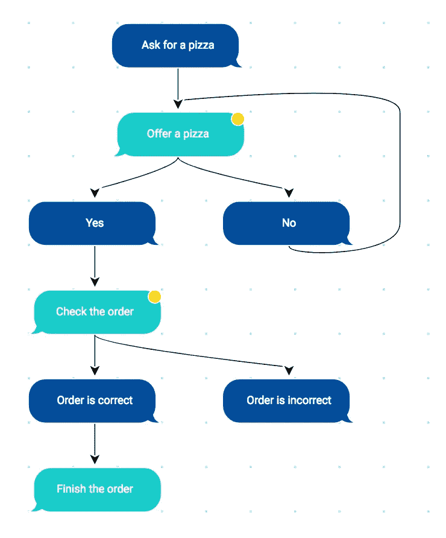

6.使用短语。我们想让对话变得生动，所以对于界面端的每个副本，我们应该有 3 个以上的选项。而且我们想在语音识别方面帮助开发者，所以我们写了几个用户复制品的变种。

7.**测试。**对话的所有分支都考虑到了吗，有没有逻辑死角，剁碎的短语？为此，我们需要检查我们的工作。我使用 WoZ 测试。

# 休斯顿，我们有麻烦了

VUI 设计师所有问题的根源是海量的信息。各种场景，段落的变体，对话树，甚至在一个小应用程序中也有数百个步骤。

所有这些信息都必须存储在某个地方，以某种方式进行合成、检查、测试，传递给开发人员，与客户共享，而语音助手开发人员的指南中根本没有关于如何选择适当工具的建议。

在痛苦和费力地设计我的第一个应用程序后，我提出了一系列具体的问题:

*   **对话的巨幅地图。**详细而直观的从 A 点到 B 点的方式，整个迷宫般的迷惑用户的朝向目标的运动。对于这样的任务，普通的白板是不合适的。试想一下，怎么把所有的字都写出来，然后拖给开发者。我们还必须与团队就我们在地图上使用的常用符号达成一致。天哪！
*   **日常工作。不仅要在发布信息上花费大量时间，还要在同步编辑和修改上花费大量时间。你不能把短语的所有变体都放在地图上，所以你必须把它们保存在 Google sheets 或者别的什么地方。很大一部分时间花在手动同步所有可用信息上。由于所有的操作都是手动执行的，我们也不能避免通常的人为错误和打字错误，我们必须重新检查自己一百次。**
*   **冗长的测试。**每次检查完成作品的质量，你都要手动收集一份对话的抄本，不断地在一份有抄本的文档、一张对话图、一张有短语的表格之间切换。这是一个非常乏味和漫长的过程，完全打消了控制他们工作质量的欲望。

这种与痛苦不断斗争的结果不仅是延长的开发期限，而且是由于注意力不集中、疲倦，当然还有动力的丧失而造成的质量损失。

有一些工具可以简化这个复杂的过程。我们来复习一下。

# 评定标准

在我的分析中，为了客观起见，我选取了我所开发的真实应用程序的同一个部分，并尝试在所提出的工具的帮助下实现它。

我将所有结果放入表中，并根据三个基本标准对每组服务进行评估，用 5 分制对它们进行评估:

*   对话地图的可见性；
*   测试的简单性和质量；
*   编辑和同步的简单性。

## 在你阅读之前

我和我的团队是下面其中一个工具的制造者。这篇文章的主要目的不是推广我们的工具。主要目标是公平地讲述每种工具的优缺点，以便您可以自己决定使用哪种工具。

在我看来，每个团队都有自己的需求，所以没有明显的赢家或输家。如果我错过了什么或者说错了什么，我很乐意在评论中讨论。快乐阅读！

# [白板(Realtimeboard)](https://realtimeboard.com/)

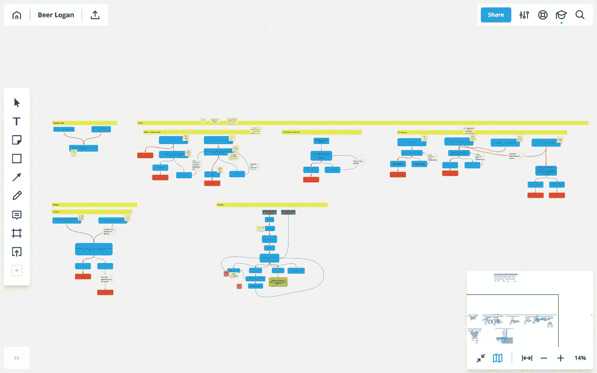

Realtimeboard

让我们从“经典”开始:在白板上构建对话地图，更准确地说是在它的数字等价物——实时白板上。角色的描述和对话的例子将存储在 [Google Docs](https://docs.google.com/) 中，短语存储在 [Google Sheets](https://docs.google.com/) 中。

我假设工作的机制和其他类似的工具非常相似——draw . io，liquidchart 等等。

## 对话映射

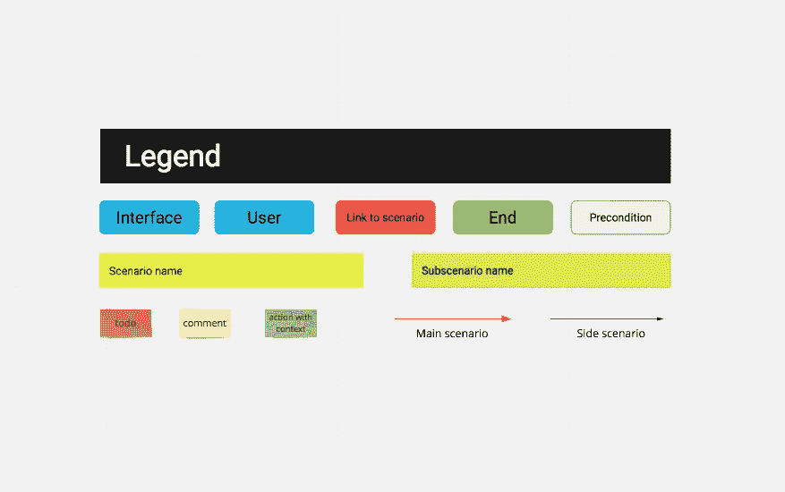

在构建地图之前，你必须选择你自己的定义——这要花很多时间，但之后你会为你的团队得到个人的框架。构建地图时，每个步骤都是手动绘制和对齐的，虽然速度很慢，但地图在视觉上变得更加清晰。

## 测试

收集材料的过程需要很多时间。它看起来是这样的:浏览一下地图，然后从表中取出短语并将其插入到文档中。没有灵活性，固定的程序和不断的工具切换。

## 编辑和同步

编辑地图很容易:您可以交换步骤，移动整个分支，并在组中选择单个元素。但是您必须手动将地图与短语表同步——这又是丢失数据的问题。

## 摘要

Realtimeboard 因设计过程的可见性和灵活方法论而获得“四分”。但是测试时间太长，手动同步也不能让我们满意。

*   对话图— **5/5**
*   编辑和同步— **0/5**
*   测试— **0/5**

链接:[https://realtimeboard.com](https://realtimeboard.com)

# [托尔图](https://tortu.io)

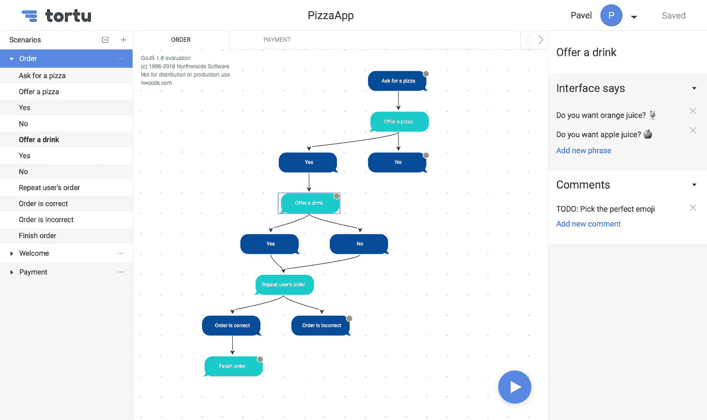

Tortu 可以帮助你将你的对话绘制成图表，允许你存储所有的短语变体，并且可以建立一个交互式的原型。对于对话脚本和角色描述，我们将使用谷歌文档。

## 对话映射

该映射由两个主要模块构成——用户步骤和界面步骤。可以方便地添加和链接步骤，还可以自动对齐。这样可以节省时间。该工具非常灵活，允许您将任何步骤与任何其他步骤相关联，链接的数量没有限制。地图可以分为场景。

然而，自动对齐功能会周期性地开一个残酷的玩笑。对于大尺寸的地图，自动对准并不总是正确地工作，并且很难“读取”地图。

## 编辑和同步

地图上的每一步，无论是用户步骤还是界面反应，都可以包含无限数量的短语。这允许我们不单独存储它们，所以手动同步没有问题。信息编辑方便，内部注释可附在步骤上。

使用地图和进行编辑也很方便，您可以更改步骤、重命名它们、更改链接，但没有拖放功能，还有组选择/复制功能。

## 测试

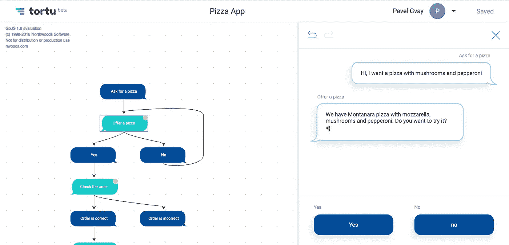

一次点击就构建了一个交互式原型，在这个原型中，我们交替地选择用户和界面的步骤。您可以查看历史记录并撤销操作。文本在屏幕上是可见的，这意味着我们可以阅读拼写错误的短语，并观看历史。你不浪费时间收集材料，整个过程相当简单。

但是没有通过语音测试脚本的功能，甚至没有为你的短语配音。

## 摘要

该地图是可见的，并且在创建和使用时简单方便。所有短语都在步骤中，编辑和同步没有问题。交互式原型是通过一次点击建立的，并提供了大量的测试机会。

没有拖放功能，阅读地图的难度取决于它的大小。没有画外音。

*   对话图— **3/5**
*   编辑和同步— **4/5**
*   测试— **4/5**

链接: [https://tortu.io](https://tortu.io)

# [Sayspring](https://www.sayspring.com/)

地图和短语在 Saysprng 里面，关于角色的信息，人物角色和对话的例子在 Google Docs 里面。

## 对话映射

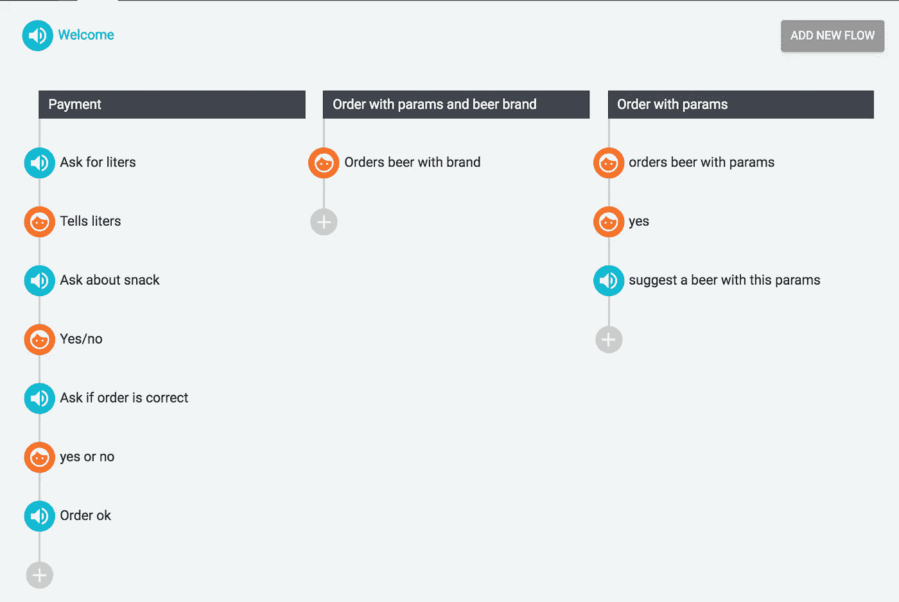

地图是逐步形成的:有用户和界面的符号，它可以分为脚本。同时，贴图是绝对线性的:不显示过渡。可以做的相当快速方便，但是看起来不太懂。

## 测试

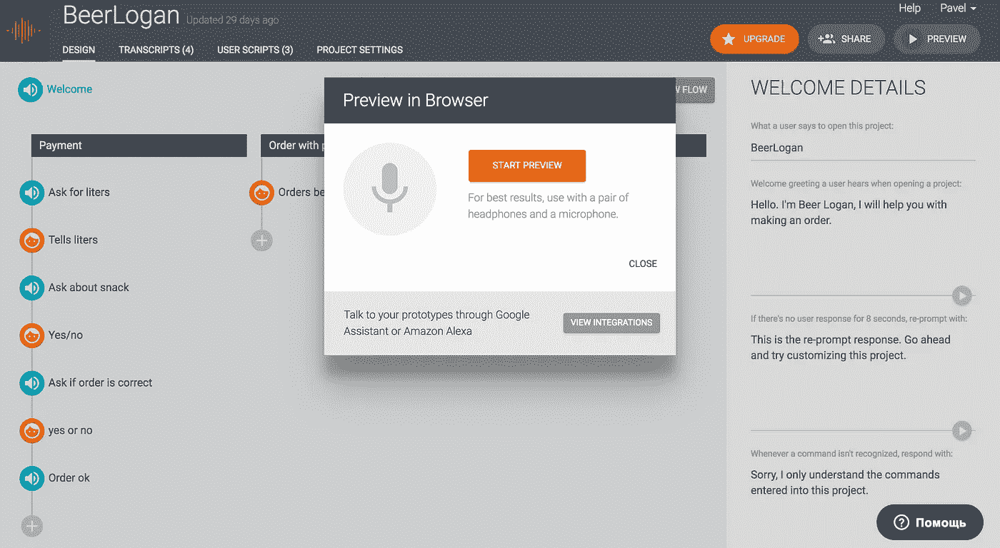

该服务允许您通过语音测试脚本，但文本模拟不可用，没有返回到几个步骤的可能性(您必须从头开始)，语音识别仅适用于三种语言，并且效果很差(或者是我的口音的问题，抱歉)。作为一个语音原型——好吧，但是对于测试来说，这种模式是没有用的，因为不可能查看对话的历史，进入短语，后退几步。仍然需要在文本文件中收集对话框来测试它们。

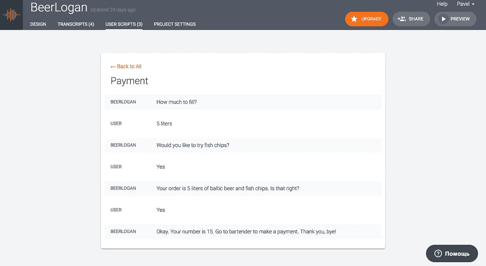

幸运的是，这里的对话收集很方便。点击按钮，工具本身会显示可能的对话框。有很多问题和不方便(比如不能在一个文件中收集两个脚本，不能下载文件，只能在工具中查看)，但是我们认真节省了收集素材的时间。

## 编辑和同步

所有副本都被分配到地图中的一个特定逻辑步骤，这样我们就不用在表格中使用短语，也不需要在工具之间切换并同步它们的状态。这是一个巨大的优势。

仅通过在一个脚本中拖动元素来编辑地图是不方便的，并且没有分组步骤的功能。

## 摘要

Sayspring 消除了收集测试材料和将短语表与地图同步的日常工作，因为副本在步骤之后是固定的。只需几次点击，我们就能得到一个交互式语音原型。

地图在设计过程中不清晰，难度大，不方便。有一个交互式原型，但它只能通过语音工作，这使得它对测试毫无用处，因为没有办法进入副本，查看历史记录，并且对话框的卸载是有限的。

*   对话图— **0/5**
*   编辑和同步— **3/5**
*   测试— **3/5**

链接:[https://sayspring.com](https://www.sayspring.com/)

# [僵尸社会](https://botsociety.io/)

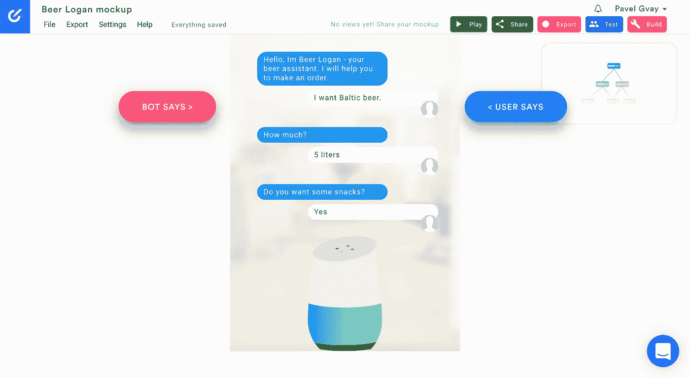

该工具在方法上完全不同。我们写一段对话，地图就自动生成了。短语和字符将存储在谷歌文档中。

## 对话映射

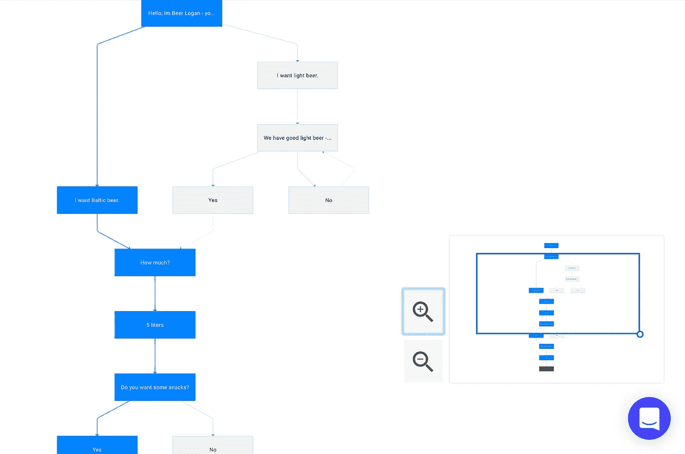

在地图上，分叉和步骤之间的连接清晰可见。它是交互式的:通过点击步骤，项目被打开。

没有对脚本进行划分，这导致了大量的重复和一个巨大的混乱的流程图。

## 测试

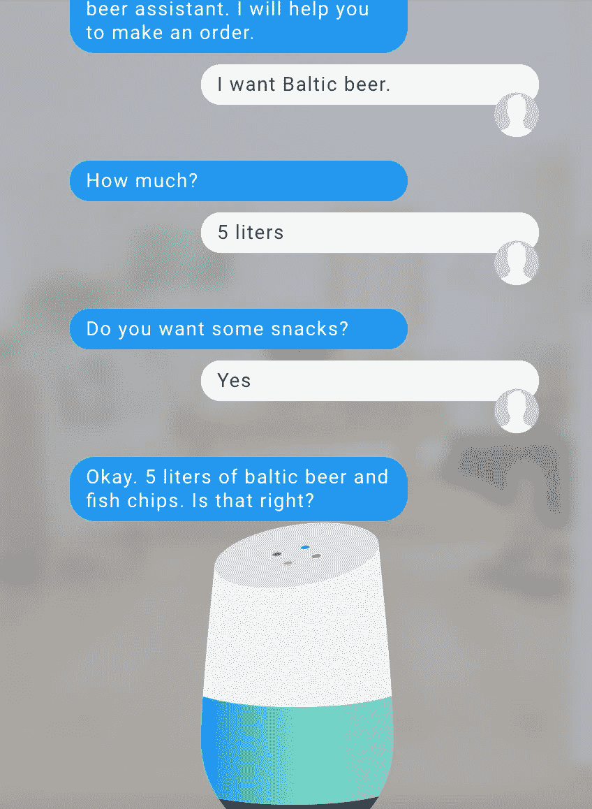

测试是以聊天的形式进行的，它允许你进入副本，并查看历史。

但是，没有机会控制过程，其实我们只是看视频，而不是测试。

## 编辑和同步

对于一个步骤，您只能指定一个短语的变体，因此短语和映射是分开存储的。同步的问题仍然存在。对地图进行编辑非常方便，有拖放功能，但是你不能选择几个元素并对它们进行一般的操作。

## 其他的

服务中有“构建模式”:你可以在短语中添加变量，并通过 API 访问它们。因此，该工具可以成为内容保管者。

还有很酷的 Dialogflow 集成。

## 摘要

该工具是为简单应用和聊天机器人的快速原型开发而设计的。对于一个羽翼丰满的设计，在我看来，并不适合。测试不起作用，留下了收集材料的问题。下载对话框只有 MP4、GIF 或 AVI 格式。

*   对话图— **2/5**
*   编辑 ans 同步— **2/5**
*   测试— **1/5**

链接: [https://botsociety.io](https://botsociety.io/)

# 结论

研究的结果是完全可以预测的。每个团队都有自己的流程，肯定没有最好的工具。每种工具都有其优点和缺点。但是我希望这篇文章能够帮助您为您和您的团队选择最完美的工具。

很明显，我没有研究每一个 VUI 设计工具，我可能会错过其中的一些。我很乐意在评论中讨论特定工具的选择和设计过程。

感谢您的关注😉

*PS。我要感谢 KODE 移动开发工作室的 Maria Kruglova 和 Nikita Korneev 帮助将这篇文章翻译成英文。*