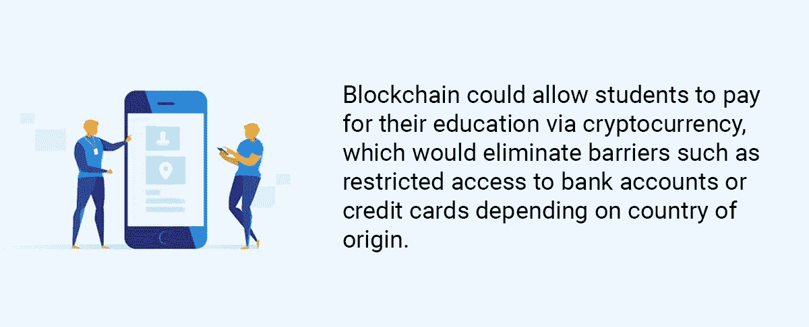

# 什么类型的区块链会更适合教育任务？

> 原文：<https://medium.com/hackernoon/what-type-of-blockchain-would-be-better-for-educational-tasks-a203dde826c3>

建立在区块链技术基础上的教育模式面临着为强大的性能和高效的生产力对其区块链进行编程的巨大挑战。考虑到区块链固有的可扩展性问题(这会导致极其缓慢的通信)，分散式教育模式已经采用了不同类型的分布式网络来缓解其平台的拥堵。通过这种方式，他们希望达到对他们的成功至关重要的沟通质量。他们的能力足以完成教育任务吗？

# 区块链的可扩展性问题

现在，区块链的技术相当于 21 世纪初的互联网:极其缓慢，上传任何东西都要花很长时间。对于区块链，发生这种情况是因为每个节点都必须“同意”通过的数据块。受欢迎的区块链平台，如比特币和以太坊，平均每秒可以处理大约 10 笔交易。相比之下，像 Visa 这样的支付公司目前平均每秒处理约 5000 至 8000 笔交易。交易变得更加昂贵，因为节点更喜欢价格更高的交易，而更受欢迎的加密货币提高了最高价格先服务模式的成本。

区块链交易的低速度和高成本，被称为区块链的[可伸缩性问题](https://en.wikipedia.org/wiki/Bitcoin_scalability_problem)，是阻碍这项技术大规模采用的问题之一。

# 区块链教育平台和可扩展性

在过去的一年里，一系列分散式教育平台涌现出来，兜售的服务包括:

1.  可以想象的任何单一主题的大量课程或计划——例如，Tutellus 有超过 120，000 个视频课程，从如何制作最好的 mojito 到最高水平的官方大学学位。
2.  互动学习——区块链技术保证了教师和学生之间的实时即时交流。在区块链教育联合研究中心的 2017 年[报告](http://publications.jrc.ec.europa.eu/repository/bitstream/JRC108255/jrc108255_blockchain_in_education(1).pdf)中，欧盟委员会指出，区块链在虚拟技术与实时面对面交流相结合的混合学习方面表现出色。
3.  存储永久记录，如学位和课程证书。这些可以永久保存在区块链上，供第三方直接确认其有效性。
4.  支付和资金——区块链可以允许学生用加密货币支付教育费用，这将消除一些障碍，如根据原籍国限制使用银行账户或信用卡。

考虑到可伸缩性的问题，你不禁会想，建立在区块链技术上的教育模型怎么会厚颜无耻地从一个众所周知的缓慢系统中承诺这样的服务。这些产品不是都占用了大量的带宽吗？为了这些效果的发生，交流不是必须非常迅速吗？

教育平台是否一开始就存在可扩展性问题，或者它们当前的容量是否足以完成教育任务。

以下平台采用了不同类型的分布式网络，以消除其平台的拥塞。

# 五种区块链教育模式

# 1.[边缘币](https://www.edgecoin.io/)

EdgeCoin 在其 block 上存储学位和课程证书等教育文档，供第三方直接确认其有效性。这降低了学生的成本，因为他们不必支付公证费。它还削减了机构的成本，因为它消除了官僚主义和文书工作。此外，EdgeCoin 的分散管理系统还将帮助机构或雇主只需点击一下鼠标即可验证证书，而不是经历耗时的技术流程来分别验证每个认证。

EdgeCoin 使用的技术:

EdgeCoin [使用规模证明(PoS)](/edgecoin-blog/edgecoin-co-founder-and-ceo-kambiz-djafari-speaks-tomorrow-at-the-blockchain-bitcoin-conference-466a53e9651d) 而不是标准工作证明(PoW)。工作证明是指网络中的每个节点都必须处理每个事务。因此，即使网络上有一千个节点，所有这些节点都必须处理网络上的每一笔交易。难怪要这么久！PoS 是仅选择那些节点中的少数几个的地方，通常但不一定是由网络根据它们的栈的数量和年龄来选择的。通过选择少数几个人来管理网站，智能合同的传输速度更快，EdgeCoin 可以更迅速地管理其平台。

# 2.[老师请](https://teachmeplease.com/)

TeachMePlease (TMP)为在线和离线学校以及不同的教育项目提供了一个学习机构数据库，从儿童的小组学习课程到私人教师的个人课程。这些程序需要巨大的处理能力和空间才能成功，特别是 TeachMePlease [承诺](https://teachmeplease.com/)“为我们的每个客户提供易于使用的服务的优质平台。”它的区块链能提供这些吗？

他们是这样做的:

TMP 区块链架构将自己分为两层:私有和公共。私有的外链层存放用户的私有和个人数据，如文档、简历、版权等等。公共层提供对该私有数据的存储库的公共访问，以便被邀请方可以验证该数据的可靠性。

通过这样做，TMP 解除了其平台的拥塞，因为它只将流量导向其主分类帐，同时保持区块链网络之外的链外层不对公众使用。

# 3.[成功人生](https://successlife.com/)

书籍、课程、辅导和其他材料可能会很贵，成功资源知道研讨会的成本(以及差旅费和其他相关费用)可能会很高。为了让尽可能多的人获得职业和个人发展，成功资源成立了区块链公司 SuccessLife。

以下是 SuccessLife 如何为辅导、研讨会任务、网络研讨会、视频和流媒体等活动扩展其平台。

SuccessLife token (SLTs)支持持卡人之间的交易，并通过无缝多链支付为他们提供更快的交易速度。区块链的多链体系结构支持数据共享、时间戳和加密存档，使其更适合于支持持续市场发展的内容管理。这种多链系统将允许 SLT 的第三方采用者容易地集成到完全适用于 SLT 的区块链。

# 4.[sonyglobaleduction](https://www.sonyged.com/)

索尼公司和索尼全球教育(SGE)开发了一个基于区块链的学生教育记录平台。学校管理人员使用该技术来整合和管理来自几所学校的学生教育数据，并根据学习经历和成绩单制定分析系统。此外，该系统帮助学习者存储他们自己的正式或非正式学习的证据，与期望的观众分享，并确保即时验证。该分类帐还帮助用户将文档和信用从一个机构转移到另一个机构，验证教育系统中的证书，并在单个信息存储库中整合各种学生服务。

索尼的区块链是如何实现快速流动的:
该系统由 [Hyperledger Fabric 1.0、](https://www.hyperledger.org/hyperledger-fabric-1-0)提供支持，索尼 Hyperledger 通过将一次性执行的标准 PoW 交易处理分为三个阶段来解决可扩展性问题:构建块、对块进行排序以及验证每个块。这使得事务流动更快，因为它减少了节点的工作负载。由于只有数字签名和[读/写集](http://hyperledger-fabric.readthedocs.io/en/latest/readwrite.html)通过 Hyperledger v1.0 架构在网络上发送，因此可扩展性和性能得到了优化，索尼实现了其目标。

# 5.[图特鲁斯](https://tutellus.cryptonomos.com/)

Tutellus 是一个点对点平台，拥有超过 120，000 个视频课程，几乎对每个科目都有吸引力，这个平台奖励用户学习。

迄今为止，Tutellus 拥有超过 100 万的观众，所以你会认为该网站需要一个超快的平台来容纳这么多的流量，他们提供的许多课程，以及学生和教师之间的交流。

他们是这样做的。

Tutellus 使用四层架构，如下所示:

*   多平台应用程序:存储应用程序(Android、iOS、web 应用程序等)。)和分散服务。
*   微服务 API:一个为服务提供额外功能的开源 API。
*   托肯:图特鲁斯·图特。
*   区块链:Tutellus 存储用户文档和智能合约的数据库。

Tutellus 使用一种称为“分片”的策略，在这种策略中，它分解了节点之间的责任，从而使通信更快、更有效。就当是不同团体之间的委托吧。分片将大型数据库分成更小、更快、更易于管理的部分，称为数据分片。区块链被分成离散数量的节点，每个节点解决不同的子任务。每个节点将其数据结果传递给目录服务(DS)委员会，该委员会将其汇总到一个称为最终块的摘要中。来自最后一个块的信息被发送回所有组。

与 Tutellus 相关，这种分割允许公司委派不同的任务，以便最大限度地发挥其教育任务的能力。

# 结论

分散式教育平台有着巨大的野心，其中心是全球各方之间的大量同步实时通信。为了取得成功，这些公司需要克服区块链的可伸缩性问题，在这个问题上，事务的加载速度慢得令人痛苦。一些像 Tutellus 这样的区块链教育公司已经转向创新的解决方案。这些包括股权证明(而不是工作证明)，分片，链外系统，以及使用超级账本。

## 关于作者:

基里尔·希洛夫——geek forge . io 和 Howtotoken.com 的创始人。采访全球 10，000 名顶尖专家，他们揭示了通往技术奇点的道路上最大的问题。加入我的**# 10k QA challenge:**[geek forge 公式](https://formula.geekforge.io/)。