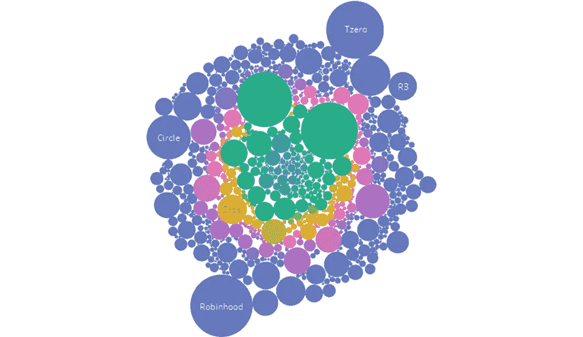
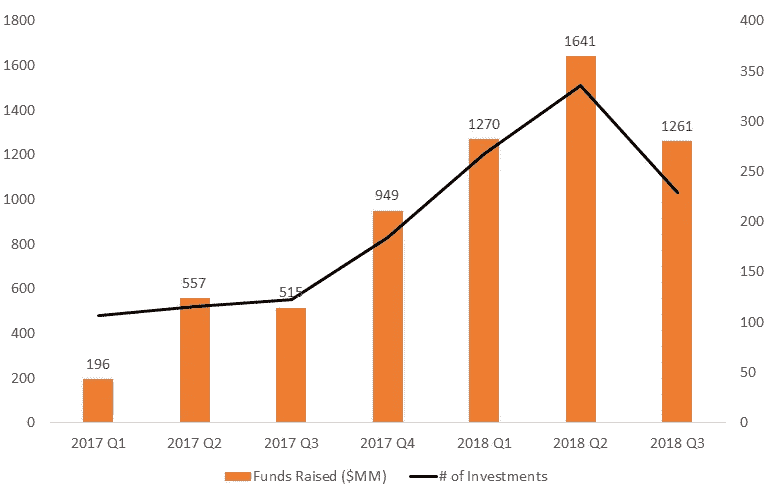
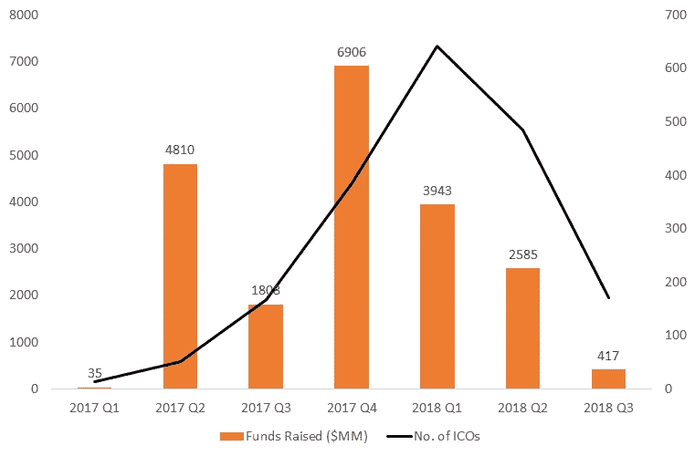
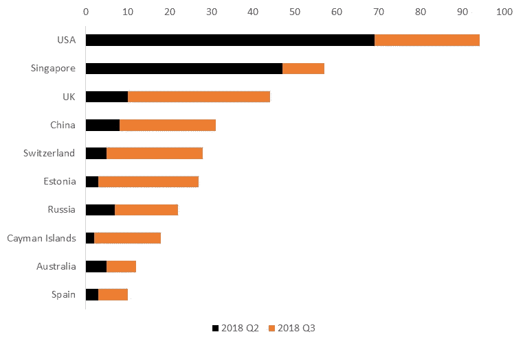
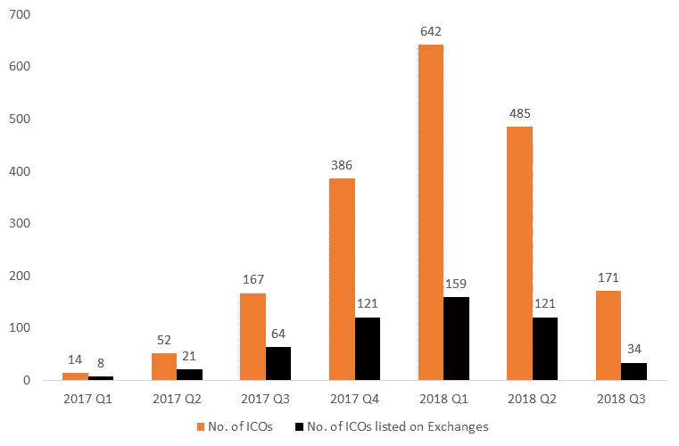
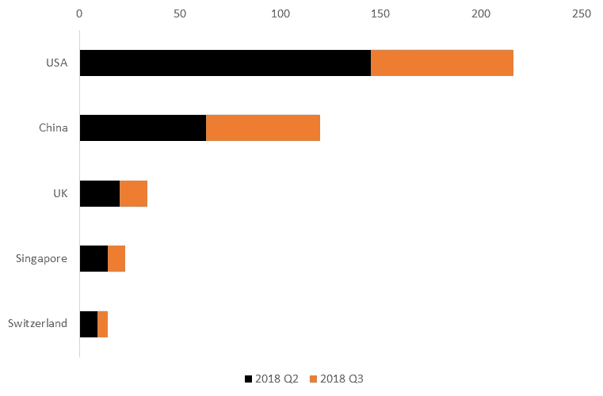
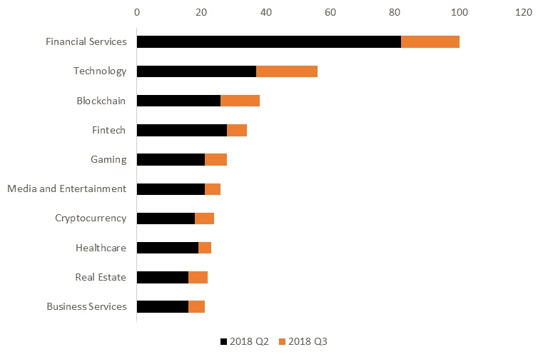
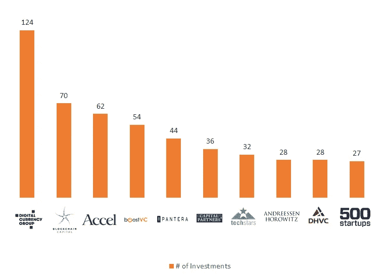

# 2018 年第三季度 ICO 市场怎么样？

> 原文：<https://medium.com/hackernoon/what-was-the-ico-market-like-in-q3-2018-70d87de525b6>

# ico 的私人融资在 2018 年第三季度取得了重大进展，轮次比 2017 年翻了一番

随着风投在 ico 上做多，私人融资在 2018 年增长了约 100%。2018 年第三季度末，ico 集体融资约 41 亿美元，几乎是 2017 年融资额的两倍。2018 年第三季度，风投支持的公司数量增长了约 17%。

Funds raised in ICOs by quarters(Source: [InWara’s Database](https://www.inwara.com/report/quarterly?utm_source=q3hackernoon&utm_medium=q3hackernoon&utm_campaign=q3hackernoon))

顶级投资者如[芬布士资本](http://fenbushi.vc/)、[潘迪拉资本](https://www.panteracapital.com/)、[区块链资本](https://blockchain.capital/)、[安德森·霍洛维茨](https://a16z.com/)和更多的投资者已经迅速投入到加密领域的有趣项目中。

加密公司似乎已经意识到，专业投资者“可能并不那么糟糕”。曾经允许所有人投资的公开 ico 正迅速转向一种新的方式，即有限的私人销售，只允许合格的投资者和关系密切的人参与。

许多顶级 ico，如 [Telegram](https://ico-telegram.org/) 、 [Dfinity](https://dfinity.org/) 等，目前都不包括公开销售部分，散户投资者不得不等到代币在交易所上市后才能购买。

# 行业低迷削减了 ICO 数字

ico 在过去两年中筹集了超过 200 亿美元的资金，这可以被视为各行各业采用数字货币的标志。然而，由于熊市导致投资货币(BTC、瑞士法郎)贬值，300 多种主要销售和预售现已延期。

Number of ICOs by quarter(Source: [InWara’s Database](https://www.inwara.com/report/quarterly?utm_source=q3hackernoon&utm_medium=q3hackernoon&utm_campaign=q3hackernoon))

得出的结论是，ico 筹集的资金被困在不断贬值的货币中，他们的财富迅速缩水，有些人的财务状况很糟糕。

然而，ico 作为一种筹资工具已经获得了显著的吸引力。即使第三季度是 2018 年最慢的季度，公司仍然进行了 170+ico。

# 随着整体市场中 ICO 数量的减少，市场逐渐成熟

美国继续领先，新加坡在整体 ico 调查中逐渐领先于英国，为亚洲市场带来了真正的希望。爱沙尼亚、瑞士和加拿大在第三季度出现了大幅收缩。

Number of ICOs by Country (Q2 2018 vs Q3 2018) (Source: [InWara’s Database](https://www.inwara.com/report/quarterly?utm_source=q3hackernoon&utm_medium=q3hackernoon&utm_campaign=q3hackernoon))

非洲仍然是缓慢的采用者，在该领域的覆盖率几乎可以忽略不计。

# 2018 年第三季度危险水域 ICOs

只有 20%的第三季度 ico 在交易所上市，而交易所的数量增长了近 25% (2018 年比 2017 年)。对于投资者来说，这是一个潜在的危险场景，因为他们可能会被代币套牢，没有流动性可卖。

ICOs getting listed by quarter (Source: [InWara’s Database](https://www.inwara.com/report/quarterly?utm_source=q3hackernoon&utm_medium=q3hackernoon&utm_campaign=q3hackernoon))

值得注意的是，在交易所上市或以其他方式上市可能代表 ico 的战略选择，而不是缺乏愿意上市的交易所。

> [完整细分见 in wara 2018 年第三季度报告。](https://www.inwara.com/report/quarterly?utm_source=q3hackernoon&utm_medium=q3hackernoon&utm_campaign=q3hackernoon)

# 按国家分列的私人资金

# 就各国私人融资轮数而言，美国仍处于加密领域的前列

美国在 2018 年第三季度以 200 多轮私人融资主导了市场，主要是因为许多大牌风投在美国以外运营。亚洲在私人融资方面领先于欧洲，中国和新加坡都获得了约 150 轮融资。

Number of private funding rounds by country (Source: [InWara’s Database](https://www.inwara.com/report/quarterly?utm_source=q3hackernoon&utm_medium=q3hackernoon&utm_campaign=q3hackernoon))

常规风险投资现在似乎把区块链作为其常规业务的延伸，而纯粹专注于区块链的风险投资却越来越少。

# 行业展望

## 区块链技术在 2018 年第三季度获得了牵引力。金融服务业在第三季度以大约 100 个 ico 保持行业领先地位

金融服务仍然是 ico 中最受欢迎的行业，而医疗保健和交易等其他行业也出现了增长，多个基于加密的基金在 2018 年第三季度涌现。

No. of ICOs by Industry (Q2, 2018 vs Q3, 2018) (Source: [InWara’s Database](https://www.inwara.com/report/quarterly?utm_source=q3hackernoon&utm_medium=q3hackernoon&utm_campaign=q3hackernoon))

在 2018 年第三季度，许多公司都提出了开发多样化区块链解决方案的愿景。就第三季度在区块链地区筹集的资金而言，DREP 和 0xcert 位于金字塔的顶端。许多人认为比特币背后的技术有能力扰乱全球商业流程。

尽管 2018 年加密价格遭受重创，但对区块链技术的潜在信念似乎正在繁荣发展。

# 十大加密投资基金的投资选择

随着专注于区块链的基金在 2018 年疯狂购物，DCG 和区块链资本已经进行了大量投资。

Number of investments per fund (Source: [InWara’s Database](https://www.inwara.com/report/quarterly?utm_source=q3hackernoon&utm_medium=q3hackernoon&utm_campaign=q3hackernoon))

# 关键要点:

尽管投资 ico 的风险很高，欺诈 ico 的比例很高，并且许多项目的代币价格下降，但加密货币市场仍有许多值得期待的地方。

与第一和第二季度相比，2018 年第三季度是 ico 的缓慢时期。尽管如此，筹集的资金总额超过了 24 亿美元。在这方面，20 个最大的 ico 占这一数额的 40%以上(约 10 亿美元)。

从好的方面来看，2018 年向世界上更多的人介绍了 crypto。区块链比以往任何时候都有更多的硬币、更多的 ico、更多的钱和更多的行业。

随着新的投资项目即将进入市场，以及世界各地的各个国家正在走向加密货币的合法化，以及对加密税和监管的讨论，有理由希望进一步的采用可能会越来越近。除了投资产品的可用性增加，2018 年晚些时候和 2019 年初还有强劲的基本面消息值得期待。

> [完整细分见 in wara 2018 年第三季度报告。](https://www.inwara.com/report/quarterly?utm_source=q3hackernoon&utm_medium=q3hackernoon&utm_campaign=q3hackernoon)

# 关于方法论

[InWara](https://www.inwara.com/report/quarterly?utm_source=q3hackernoon&utm_medium=q3hackernoon&utm_campaign=q3hackernoon) 研究团队确保高质量和准确的研究，由质量控制人员和高技能分析师组成的团队进行详尽的分析。研究团队努力只发布尽可能准确的信息，因此所有信息都是在事实基础上仔细考虑的，数据是通过分析 3000 多份 ICO 白皮书、近 2200 篇官方公司博客文章、500 篇官方新闻稿以及对新闻和社交媒体来源的持续网络监控收集的。

*免责声明:最初发布于 Coinmarketcap。这不是财务建议。本信息或其他媒体中的观点、陈述、估计和预测仅属于作者个人。它们不一定反映 Inwara 或其任何附属公司(“Inwara”)的意见。Inwara 没有义务更新、修改或修正此消息或其他媒体，或以其他方式通知其接收者，如果此处陈述的任何事项或此处陈述的任何意见、预测、预测或估计发生变化或随后变得不准确。本邮件或其他媒体中提供的任何内容、信息和材料均按“原样”提供。Inwara 对其准确性、完整性或及时性，或收件人获得的结果不做任何明示或暗示的保证，并且不对任何收件人在此的任何不准确、错误或遗漏承担任何责任。在不限制上述规定的情况下，Inwara 对任何消息或媒体的接收方不承担任何责任，无论是在合同、侵权行为(包括疏忽)、担保、法规或其他方面，对于此类接收方因其或任何第三方决定的任何行动、意见、建议、预测、判决或任何其他结论或任何行动过程而遭受的任何损失或损害，无论是否基于此处包含的内容、信息或材料。***