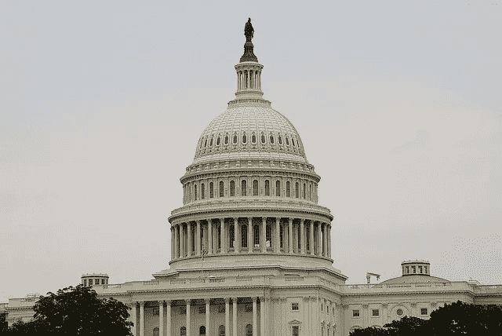

# 我们认为国会在 2018 年中期选举后将如何对待加密货币

> 原文：<https://medium.com/hackernoon/what-we-can-expect-from-congress-for-cryptocurrency-post-2018-midterms-46a5f3a4c226>

*BX3 Capital 内容总监 Anne Szustek Talbot*

从加密货币玩家和分析师的角度来看，国会对加密货币的行动可能会保持相同的总体路线，尽管可能会有更明显的民主党味道:监管如何影响零售层面的消费者以及大型资产管理公司。

[BX3 Capital](https://bx3.io/) 的合伙人和联合创始人凯尔·阿斯曼(Kyle Asman)说:“带头推动加密监管倡议的国会议员都获得了连任，因此法案背后的发起人可能会保持不变。”他也是在国会圆桌会议前作证的加密行业成员之一。“但为了让该法案在众议院金融服务委员会获得通过，现在左倾的委员会可能会将消费者保护作为重中之重。”

俄亥俄州共和党人沃伦·戴维森(Warren Davidson)是 9 月国会圆桌会议(T1)的先锋，他再次当选，他的共和党圆桌会议同事[泰德·巴德(共和党人)](https://bitcoinmagazine.com/articles/crypto-task-force-bill-passes-house-representatives-moves-senate/)和[汤姆·艾默(共和党人)](https://emmer.house.gov/media-center/press-releases/emmer-spearheads-groundbreaking-legislation-support-blockchain)也是如此，他们两人都在 9 月的会谈后起草了加密货币法案。Emmer 也是由 18 名成员组成的国会区块链核心小组的四名联合主席之一，其中大多数人将于 1 月份返回。联席主席 Jared Polis(科罗拉多州民主党人)留在落基山州，成为美国第一位公开同性恋身份的州长。(这对科罗拉多州的 crypto 意味着什么？)弗吉尼亚州资深共和党人鲍勃·古德拉特即将退休，由共和党人本·克莱恩接任。宾夕法尼亚州共和党人基思·罗斯富斯(Keith Rothfus)屈服于众议院“蓝色浪潮”，汤姆·麦克阿瑟(Tom McArthur)在新泽西州第三国会选区与民主党挑战者安迪·金(Andy Kim)的激烈竞争中开始计票，该选区从费城以外延伸到泽西海岸。

除了任何可能的消费者监督措施之外，无论国会高级加密货币官员是否发生微小变化，都不要指望加密政策会有重大影响。从国会加密货币任务组的早期开始，加密就一直是两党共同的事业，远远没有成为热门话题。“两个政党都没有将这个话题作为竞选议题，因为这个领域仍然是新的，一般不会影响普通纳税人，”律师事务所 Drinker，Biddle & Reath 洛杉矶办事处的合伙人兼加密货币专家 JR Lanis 说。

[国会待决的加密货币法案](https://www.jdsupra.com/legalnews/congress-and-cryptocurrency-the-28678/)包括 H.R. 3708，该法案将小额交易(开始时少于 600 美元，随后与通货膨胀挂钩)从国税局报告中豁免，以及 H.R. 6973，该法案旨在通过对区块链福克斯之后收到的可兑换加密货币实施强制执行来保护纳税人免受监管。

H.R. 6974 也试图为 crypto 提供一个监管安全港，但在许可和注册方面，区块链提供商和开发商不“控制”网络软件的用户。就该法案而言，“控制”被定义为“根据需求获得足以启动一定数量数字货币交易的数据的合法权利、权力或能力。”

另一位国会区块链会议联合主席大卫·施韦克特(R-Ariz .)是 H.R. 3708 的主要发起人；艾默正前往人力资源部 6973 和 6974。巴德是 H.R. 6721 的主要发起人，该法案将规定[金融犯罪执法网络](https://www.fincen.gov/)获得加密货币交易和其他新型金融技术的监控技术。这些法案仍在委员会审议中；他们能否到达众议院投票，很大程度上取决于政治风向之外的因素。

加密货币行业的共识是，需要进行监管——无论过道的哪一侧完成监管——以防止通过执法进行更多监管，因为两项未决法案试图避免这种情况。9 月圆桌会议的参与者几乎一致提到，模糊是将基于加密货币的业务带到海外的一个原因，以免他们走错了一步，而不知道他们首先走错了一步。

悬而未决的法案可能会在明年 1 月的国会任期内通过，尽管有可能对语言进行一些细微的调整。与此同时，国会议员[要求 SEC 对首次公开募股(ico)提供一些明确的指导。](https://www.thestockvoice.com/us-lawmakers-ask-sec-to-clarify-ico-regulations/)

就国会而言，加密货币部门可以稍微放心了。正如一段时间以来的情况一样，随着我们进入 2019 年，加密观察家需要关注的是金融执法机构。即使在这条战线上，也可能会有更艰难的时期。Landis 说，“美国监管机构，特别是美国证券交易委员会和 CFTC，已经越来越认识到必须发布新的规则和指导，而不是依赖旧的范式，来解决这个不断增长的空间。”