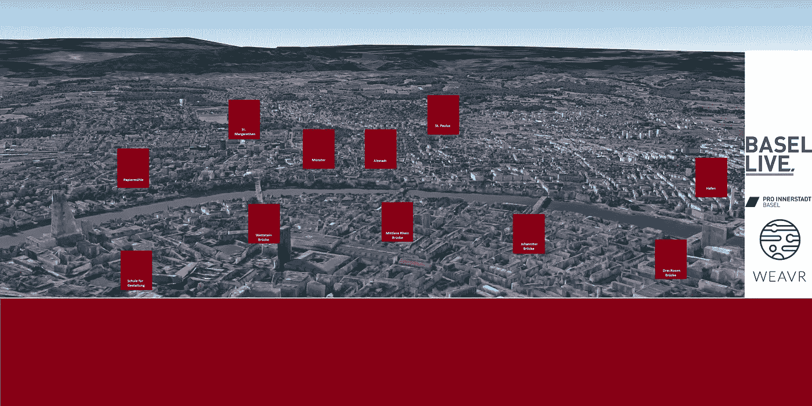
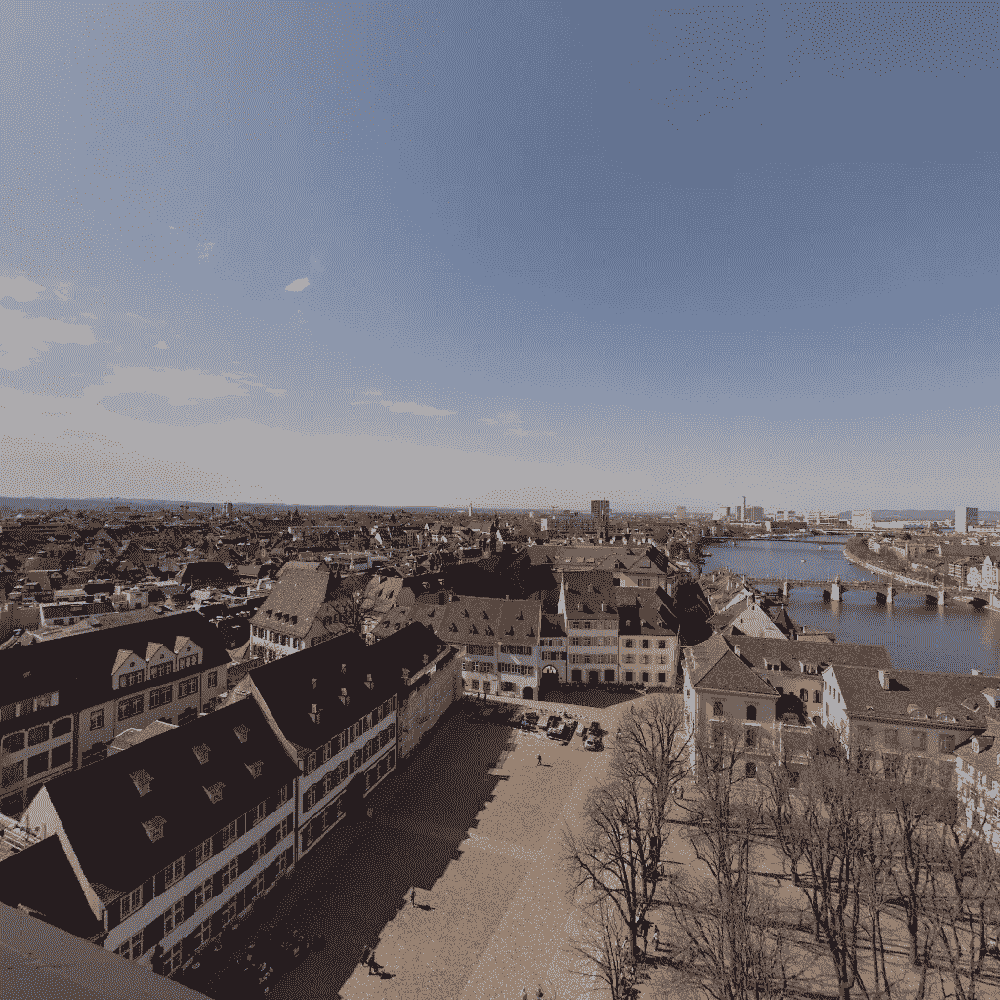
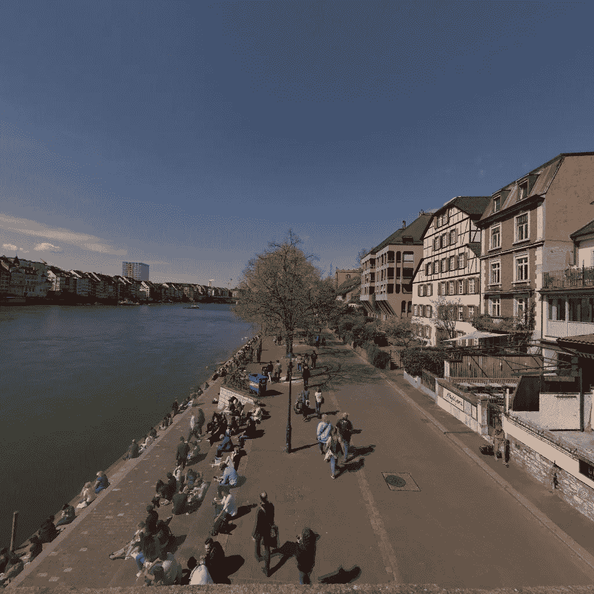
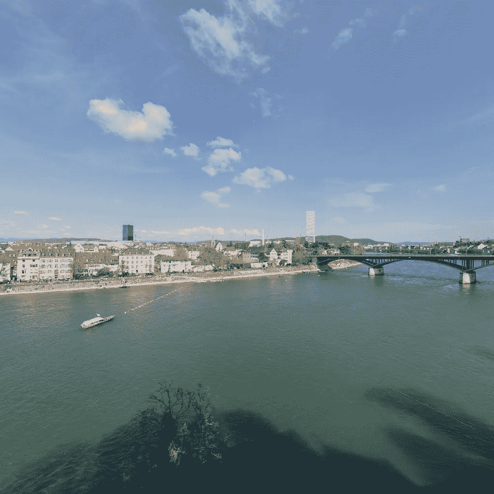
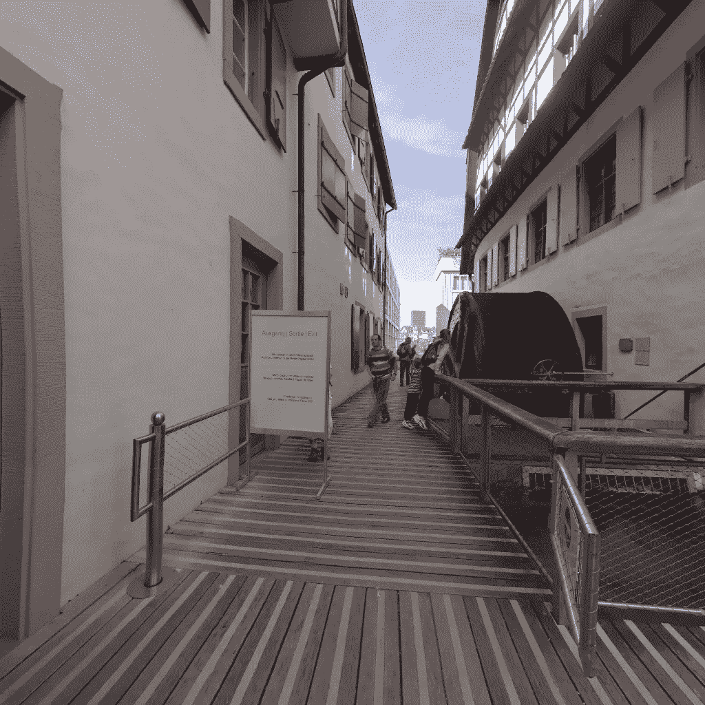

# 我们在为巴塞尔市创造虚拟现实体验中学到了什么

> 原文：<https://medium.com/hackernoon/what-we-learned-creating-a-virtual-reality-experience-for-the-city-of-basel-8adca2730bb1>

几个月前，我们开始与巴塞尔城市中心合作，这是一个负责推广这座城市的组织。当我们开始讨论虚拟现实体验必须实现的目标时，很明显他们不仅仅是为了促进城市的旅游业。

Pro Innerstadt Basel 的目标是向已经生活在这座城市或大都市区的人们宣传这座城市的一切。为此，他们创建了一个名为 [Basel Live](https://basellive.ch) 的特别页面，在这里他们宣传城市内外发生的事情。所以我们决定关注“人迹罕至”的地方。

Aereal view of the location of the Virtual Reality stories for the city

我们已经记录了[一些我们在](https://hackernoon.com/top-5-things-we-learned-while-creating-a-virtual-reality-experience-for-the-city-of-st-gallen-563e4569086e)学到的关于在[圣加仑](https://weavr.space/v/w/fae57e5a-1edb-468f-a0af-512ba67c8d55)市创造虚拟现实体验的事情。这篇文章记录了我们为巴塞尔城市所做的工作中的特殊收获。

## 1)你不需要总是在离主要景点太远的地方寻找隐藏的珠宝

在人迹罕至的地方，听起来你不得不远离大量游客聚集的地方，但巴塞尔的明斯特大教堂之塔证明，他们可以比你想象的更接近你。

View of the old town and the Rhein river from the top of the tower of Basel Münster

塔的入口是免费的，它提供了城市和河流的美妙景色。这张照片是在四月拍摄的，因为树叶还没有长出。想象一下春天或夏天盛开时的景色？

## 2)离开通往巴塞尔的人迹罕至的小路，蜿蜒曲折地穿过莱茵河

“Sunnele”: A place where to enjoy the sun sitting with friends or walking through the promenade.

巴塞尔位于德国和法国的边境。通常边界以莱茵河本身为界，巴塞尔除外。巴塞尔占据了河的两岸。“德国”这边的叫“克莱恩巴塞尔”，或者小巴塞尔。它有一个特殊的性格，并主持大学和该市最大的建筑，罗氏塔。有 5 座桥穿过这座城市，其中 4 座进入了虚拟现实体验。

Mittlerebrücke 或中桥由电车、汽车、自行车和行人共用。它比其他的桥更有活力，克莱恩巴塞尔一侧的海岸是当地人最喜欢坐下来一边聊天一边欣赏海景的地方。这个传统有一个瑞士德语单词:“Sunnele”，直接翻译过来就是“享受阳光”的意思。

> 阳光:(瑞士德语)享受阳光

## 3)不是所有的景点都是好景点。

如果你走下从大教堂到河边的楼梯，你会发现这个城市非常古老的传统。他们有一艘不用马达就能过河的木船。船利用河流的水流，并根据它想要穿过的一侧，逆着河流的流向设置方向舵。

我们认为这将是一个很好的镜头，除了在船上设置相机而不越过船或我们的摄影师在镜头中是不可能的。所以我们决定在岸上拍摄。

Crossing the Rhein river using the water flow as combustible.

## 4)“与众不同的博物馆”不是普通的博物馆。

巴塞尔有很多博物馆。当我们计划我们的“人迹罕至”列表时，我们在城市的合作伙伴告诉我们不要关注他们。博物馆给人一种庄严的感觉，而且他们通常有一批忠实的顾客。我们重点关注的博物馆是你在巴塞尔这样的城市里想不到的。

巴塞尔纸博物馆就是这样一个特殊的博物馆。孩子们喜欢它们，有一个自助餐厅，你可以学习造纸、磨坊和水力。它的展览安排得很好，据猫途鹰说，是这个城市的头号活动。

## 5)检查你的手机型号(又叫哎呀，苹果又来了)

在展览开始的前一天，我们接到了一个制作网页的家伙打来的焦急的电话。他告诉我们，网络虚拟现实故事在他的 iPhone 上显示效果不佳。经过一些质疑后，似乎 Apple model X 执行了一些缩放，并添加了一条不在 WebVR 查看器中心的垂直线。Google 有一篇[文章描述了如何解决这个问题。](https://support.google.com/cardboard/answer/6295070?hl=en)

尽管如此，我们最终还是创建了一个新版本的故事，它不需要导航，让使用纸板浏览器的人更容易看到链接。查看 BaselLive 的 [VR 登陆页面的两个链接](https://basellive.ch/vr)

我们希望这些信息对那些期待在虚拟现实中讲述故事的人有所帮助。你可能想看看[我们为圣加仑市](https://hackernoon.com/top-5-things-we-learned-while-creating-a-virtual-reality-experience-for-the-city-of-st-gallen-563e4569086e)的工作发布的另一组提示。或者查看我们关于虚拟现实中的故事讲述的文章

如果你正在寻找一个在虚拟现实中创作故事的平台，试试我们的 [Weavr 编辑器](https://www.weavr.space)及其相关的查看器。如果你正在寻找一家能够帮助你将虚拟现实中的想法付诸实践的公司[,请查看我们的合作伙伴 Bitforge。](https://bitforge.ch)如果您正在寻找更多关于虚拟现实中讲故事的讲座，请订阅我们。

快乐的虚拟现实故事讲述和快乐的体验。