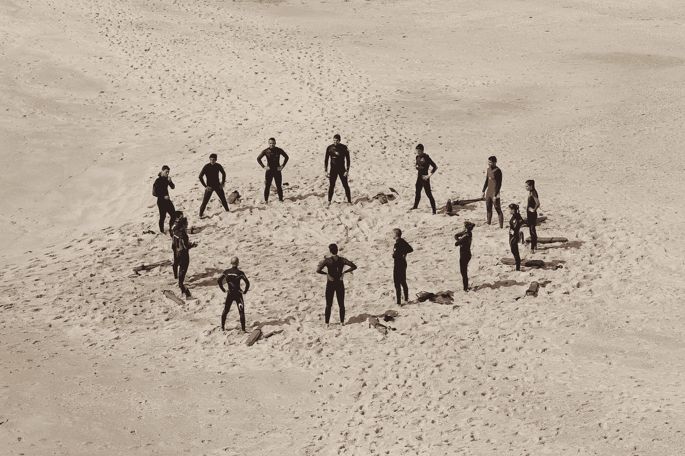

# 我们从最优秀的远程技术团队身上学到了什么

> 原文：<https://medium.com/hackernoon/what-we-learned-from-the-most-performing-remote-tech-teams-bd01229185f>

## 雇佣优秀的员工很难，但是雇佣优秀的团队在远离公司的地方工作是一个真正的挑战。

Photo by [Saksham Gangwar](https://unsplash.com/@saksham?utm_source=medium&utm_medium=referral) on [Unsplash](https://unsplash.com?utm_source=medium&utm_medium=referral)

创业公司有最忙碌的工作日，他们也更容易做出改变，这导致工作范围和产品要求的定期变化。这给地理上分散的技术团队带来了更多的挑战，以跟上他们公司的步伐。

作为决策者，你需要知道寻找什么，以及什么决定了他们是否是处理你的产品的合适人选。我们有一些来自表现最好的团队的例子，您可能想在下次招聘时记下来:

# 第一，看团队文化:

只有当团队成员相互充分了解，并且知道如何同步工作时，团队才能工作。通过了解彼此的工作方式和观点，团队成员可以进行更无缝的协作和支持，并减少沟通失误。

这对大团队来说更具挑战性，因为需要更多的努力来了解每个人，而在小团队中，沟通的途径更加集中，这使得每个人都能够更多地交流和理解他人。不管规模有多大，只要团队中有一个沟通方案，它就会工作，例如在 Scrum 中，有团队每天聚集在一起的每日 Scrum，以及团队就上一次工作迭代进行分享会议并制定行动计划以在下一次迭代中改进他们自己的回顾。

让一个紧密团结的团队在远离你的地方工作，会减少你团结团队的压力。

Photo by [Margarida CSilva](https://unsplash.com/@marg_cs?utm_source=medium&utm_medium=referral) on [Unsplash](https://unsplash.com?utm_source=medium&utm_medium=referral)

# 这些团队遵守“团队规范”:

一旦“团队规范”得到团队的尊重，你就可以知道分布式团队的期望，并相信他们是从他们的目标出发组织的:

团队规范可以有几个方面:

**沟通:**团队需要不断地沟通，互相沟通，也需要与你沟通。也需要有一个交流的指导方针。举个例子，

*   聊天工具:工作场所聊天、Slack 或 Skype:用于日常、快速和实时的讨论。响应时间应始终保持在 5-15 分钟，以避免让客户在交谈中等待。
*   视频会议:Zoom、Skype:当我们与人类一起工作时，应该有时间进行面对面的交谈，即使是通过屏幕，以便真正感受到彼此的存在，并在表达情感时建立更多的联系。
*   电子邮件:对于涉及许多人的重要公告或关键问题，尤其是涉及管理委员会时。邮件应在一天内回复并解决。

等等。

*   为了避免一些成员感到被排除在外，并确保没有人错过重要的信息，他们应该在每个人都能收到信息并感觉他们是团队的一部分并理解这些信息的重要性的地方宣布。

Photo by [Matteo Vistocco](https://unsplash.com/@biscuits94?utm_source=medium&utm_medium=referral) on [Unsplash](https://unsplash.com?utm_source=medium&utm_medium=referral)

健康的习惯:表演团队有一套他们赖以生存的习惯，所以每个人都配合得天衣无缝。这样的习惯可以；

*   **会议常规:**他们每天、每周或每月都有会议，每个成员都尽力参加这些会议。
*   **状态更新:**他们善于沟通，积极主动地更新工作状态和问题，他们习惯在回家前将所有内容更新到他们的项目管理工具中。

根据我们与 H3 Zoom AI 合作的最具表演性团队的一位 PM 所说，最重要的习惯是**提问！**

*   **要求阐明每个工作冲刺的目标**，以便团队知道他们需要交付什么，以及在冲刺结束时他们将实现什么。
*   另外，**提前询问需求和期望**，然后设定完成/验收标准的定义。这一步将允许团队分解任务，并激励团队朝着目标努力。

通过遵循团队规范，团队为自己建立了一种文化，这种文化使他们能够有效地合作并交付成果。

# 你认同项目经理:

项目经理可能是你在分布式团队中的关键人物。这个人可以有不同的名字，例如在基于 Scrum 的项目中的 Scrum Master 或者在团队中担任不同的职位(QC 也可以是 PM)。

不管其他角色是什么，如果项目经理能够在团队中无缝地协调他们的项目，他们将会减轻你的压力。

他们主要负责代表他们的团队与涉众来回沟通，因此他们是河流两岸的连接器，并确保团队朝着正确的方向前进。他们还保护他们的团队免受降低团队绩效的因素的影响，并促进推动团队前进的因素。

因此，在一个有前途的团队中，拥有一个值得信赖、善于沟通的项目经理是最关键的因素之一。

# 他们是自我激励者

AquaMobile 的首席执行官戴安娜·古德温(Diana Goodwin)表示，她在招聘远程员工时寻找的最重要的特质是他们的主动素质。当一个团队在与招聘公司不同的地理位置工作时，就不存在经常监督、物质支持或激励等因素来保持他们对工作的热情。远程团队面临的挑战是在工作中找到意义和动机，为业务优势进行创新，并在大部分时间推动自己。

# 它们以结果为导向。

结果和 KPI 是您评估团队表现是否令人满意和达到您期望的唯一方法。因此，团队需要重视结果并跟踪他们的 KPI。这种特质始于拥有一个详细的计划(在 Scrum 中，我们称之为 Backlogs ),包括每天要做什么，他们正在努力实现什么目标，以及致力于他们的目标。结果导向型团队也应该能够展示他们的结果和进展，向目标靠拢。

雇佣不重视结果的团队(一般是任何员工)不仅意味着公司将很难评估他们的团队，还意味着团队没有最终目标的激励，抑制了他们成长和成功的机会。

## 现在，您已经完成了远程 IT 团队的目标列表。但是问题仍然存在:我们如何判断团队是否具有这些属性？

这对大多数招聘人员来说也是一个挑战。

我们曾经发现自己也在同样的挣扎中。多年来，我们在为公司寻找和获取人力资产方面所学到的东西可以总结为以下两个技巧:

## 提示 1:选择一项技能评估测试。

通常的做法是公司面试他们潜在的雇员。然而，面试有时会令人生畏，阻碍成员充分准确地表达他们的能力。此外，团队如何一起工作并交付成果不能完全基于回答问题来评估，这通常不考虑上下文。

Photo by [Tim Gouw](https://unsplash.com/@punttim?utm_source=medium&utm_medium=referral) on [Unsplash](https://unsplash.com?utm_source=medium&utm_medium=referral)

作为远程的一个好的属性应该是面向结果的，测试给你一个即时和现实的工具来验证他们最终结果的质量。

## **提示 2:进行公开的谈话，而不是“面试”来一窥候选人的个性:**

虽然过于正式的问题可能会让受访者感到害怕，但随意的谈话更有效，因为它们让受访者感到证明自己的压力较小，并开始更开放地分享。抓住机会真正倾听他们的故事，因为他们将描绘候选人的自然性格。

Photo by [Helena Lopes](https://unsplash.com/@wildlittlethingsphoto?utm_source=medium&utm_medium=referral) on [Unsplash](https://unsplash.com?utm_source=medium&utm_medium=referral)

如果做得好，交谈和分享是了解一个人并建立信任的最佳方式。这将有助于你更好地了解团队的每一个成员，并知道当你从地球上的另一个地方开始这个项目时，会期待什么以及如何与他们每一个人一起工作。

# 底线:

与地理上分散的团队合作需要扎实的努力。虽然[技术](https://hackernoon.com/tagged/technology)已经让我们有了更方便有效的工具来支持团队，但是很多时候问题还是来自于人自身。有些人天生就适合在偏远的团队中成长，有些人就是不适合。

这就是为什么你需要一个策略来选择合适的团队一起工作，因为你把你的业务目标交到他们手中。同样，他们也把职业目标放在了你的公司上。让我们来个双赢。

关注我们的 [Kyanon 数字博客](/@kyanon.digital)，成为第一个收到有价值内容的人。

其他流行故事:

 [## 每日站立就像我们的早餐。为什么？

### 医生或妈妈们在开始新的一天之前，再怎么强调吃一顿营养早餐的重要性也不为过…

medium.com](/kyanon-digital/daily-standups-are-like-our-breakfasts-why-60e4a8445863)  [## 当冲刺回顾成为我们害怕的假日家庭聚会时

### 假日家庭聚会有时会很有压力，当你见到你的亲戚时，每个人都在谈论。它可以…

medium.com](/kyanon-digital/when-sprint-retrospectives-become-the-holiday-family-gathering-we-dread-4ee759874a7d)  [## 黑客正午的毒品技术工作

### 黑客如何找到最好的技术工作？官方工作委员会的出版物，黑客中午！黑客如何开始他们的…

jobs.hackernoon.com](https://jobs.hackernoon.com/)