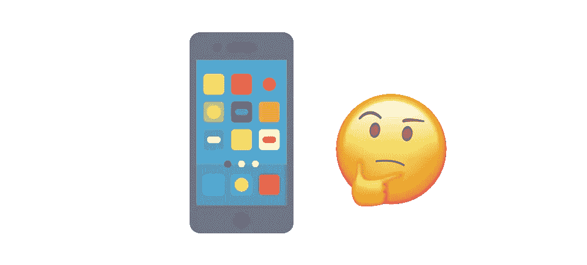
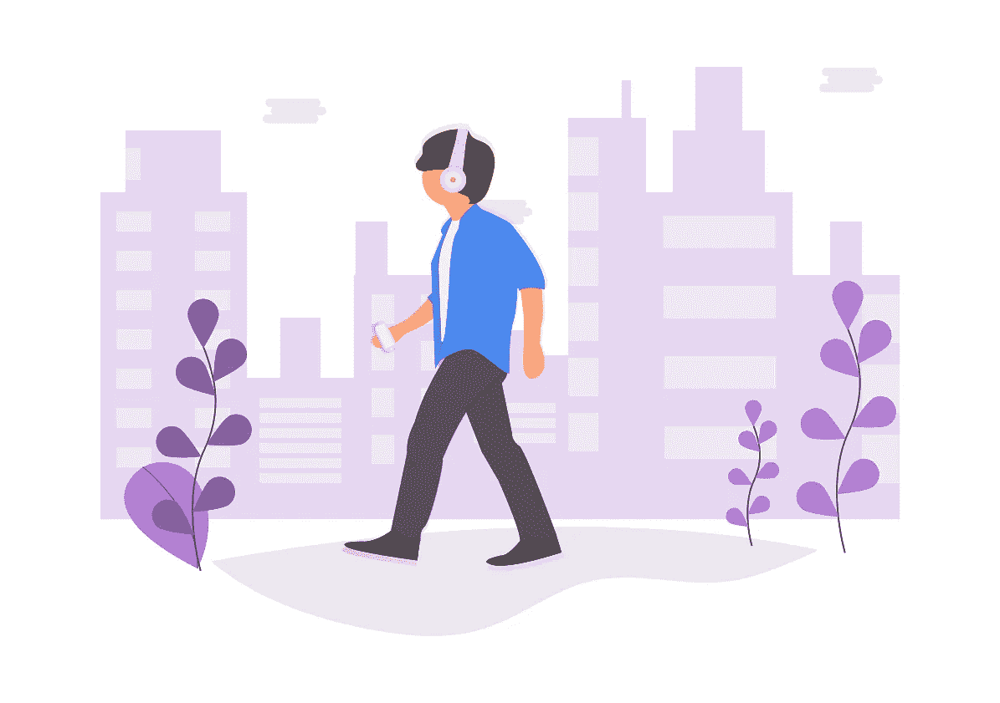
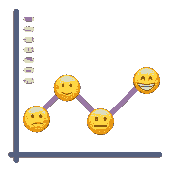
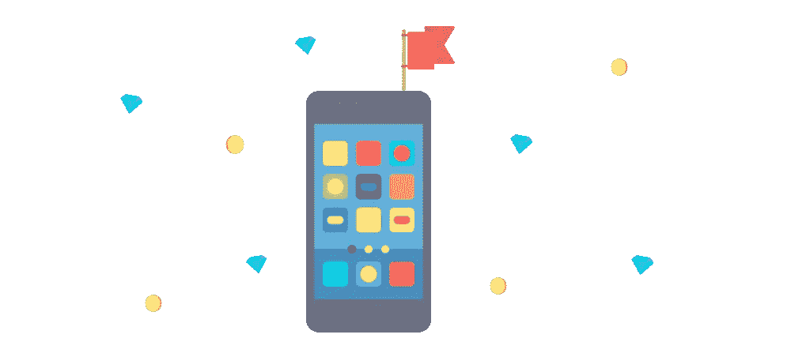
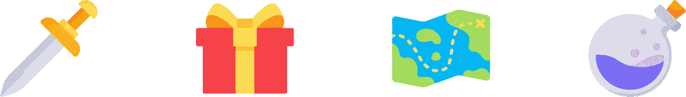
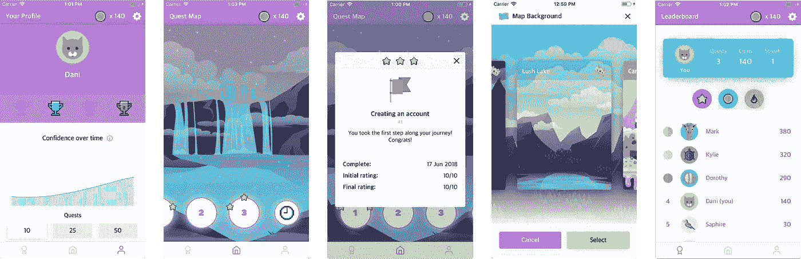

# 我们真正需要焦虑应用的是什么

> 原文：<https://medium.com/hackernoon/what-we-really-need-from-an-anxiety-app-71e215fbcacf>

焦虑是接管我们世界的电影怪兽。

1.  没有人相信[怪物](https://hackernoon.com/tagged/monster)的存在
2.  你周围的人似乎对这个问题视而不见
3.  大多数时候，试图让它降下来的努力最终都是徒劳的

这不是什么小众问题。焦虑和抑郁影响着 40%的人口。

患者可能需要几十年的时间来寻求帮助，原因显而易见。伴随焦虑而来的是自我怀疑、绝望和对耻辱的恐惧。治疗也不是最容易获得或负担得起的事情。

**这就是应用程序的用武之地。**

应用程序是隧道尽头的光，原因有很多。它们很便宜，马上就能买到，而且消除了对耻辱的恐惧。对于那些担心当面讨论自己精神健康问题的人来说，他们也考虑到了更大的隐私和保密性。你可以在自己舒适的家中获得帮助。基本上，它们消除了传统疗法的障碍。

我们已经可以看到针对精神健康的应用程序正在产生的影响。Headspace 在冥想界掀起了风暴，Calm 获得了 2017 年年度应用。

你会发现这些应用有三种类型——但有一种类型以前从未被创造过，有可能真正撼动精神健康应用领域。最后我会让你知道那是什么。

# 类型 1:冥想应用

啊，古老的冥想软件。这是心理健康应用巨头的范畴。在这里你会发现像[顶空](https://medium.com/u/3da90e297190?source=post_page-----71e215fbcacf--------------------------------)和[calm.com](https://medium.com/u/f9c2aa1512fb?source=post_page-----71e215fbcacf--------------------------------)这样的东西。Headspace 通过冥想教你正念。动画很棒，解说员的口音也很棒。平静也提供引导冥想，音乐和睡眠故事。

## 冥想应用适合你，如果:

*   你想放松一下
*   你想更好地集中注意力
*   音频形式的内容适合你
*   你喜欢史蒂芬·弗莱的声音引导你穿越普罗旺斯的想法(感谢平静)

# 类型 2: CBT 应用

认知行为治疗(CBT)应用也非常受欢迎。CBT 专注于挑战错误和无益的想法。如果你把这些想法变得更加现实和积极，你的行为也会随之改变。有很多这样的应用，一些例子包括 [Pacifica](https://medium.com/u/d0381cf19ff7?source=post_page-----71e215fbcacf--------------------------------) 和 [Youper](http://www.youper.co/) 。

## CBT 应用程序适合您，如果:

*   你准备好采取行动了——CBT 通过面对你的恐惧来工作
*   你有很多消极的想法——它们会导致不切实际的信念和恐惧。

几乎任何人都可以从 CBT 中受益，它可以用于治疗各种心理健康问题，包括焦虑和抑郁。

# 类型 3:跟踪应用程序

这些应用程序就像日记一样，你可以在里面记录你每天的心情和活动。随着时间的推移，通过识别情绪模式，你可以发现什么时候以及为什么你会有某种感觉。这类应用包括 [Daylio](https://daylio.webflow.io/) 和 [Moodnotes](http://moodnotes.thriveport.com/) 。

## 追踪器应用适合您，如果:

*   你的情绪变化很大，你想找出原因
*   你想跟踪你的进展
*   你喜欢看漂亮的图表和数据

于是就有了排名前三的[焦虑 app](https://hackernoon.com/tagged/anxiety-app) 类型！

等等，你说的第四种类型是什么？啊，是的…

# 类型 4:游戏

游戏是完美的焦虑应用形式有很多原因。它们有趣、互动、激励人心。在心理治疗中，已经证明那些因为目标的乐趣和享受而努力追求目标的人比那些因为不得不这样做的人做得更好。

人们花几个小时玩它们。想象一下，如果我们像沉迷于游戏一样沉迷于在心理健康方面取得进步，这将是多么有益？

许多应用程序使用游戏化来增加用户的参与度和激励他们，但我没有见过将应用程序变成实际游戏的。

出于好奇，我去收集焦虑患者的反馈。结果是，他们想要现有应用的好处，比如跟踪进度，但他们也想要更有趣、积极、最重要的东西——可操作的**。**

**人们希望看到明确的进展！相信总有一天你的努力会有回报是不够的，尤其是当你的信心已经很低的时候。你需要感觉自己从第一天起就在做一些事情。**

**所以，我创造了[更快乐的](https://apple.co/2Mn8CBb)。**

**梅里耶通过将你的烦恼转化为一个有趣的游戏来帮助你克服焦虑。**

****

## **把你的担忧变成追求**

**欢乐帮你把烦恼变成任务。任务是你设定自己去克服的挑战。他们就像是通向更广阔的信心目标的垫脚石。一个例子是和陌生人打招呼，或者做演讲。**

## **获得奖励**

**您可以通过完成任务和达到里程碑来赢得奖杯和硬币等物品。如果你面对恐惧得到了回报，你就更有可能面对更多的恐惧！**

## **追踪你的进度**

**我想我们都有点痴迷于图表和地图。浏览漂亮的数据是一件令人满意的事情。**

**有了 Merrier，你可以通过你的信心图表(显示你的信心随着时间的推移)和你的任务地图来跟踪你的进展。你的任务地图显示了你过去所有的任务——它们记录了你的想法和经历。随着时间的推移，你会看到你的进步和面对烦恼的能力的提高！**

## **有研究支持**

**梅里耶使用科学支持的方法来训练你的思维，以寻求克服越来越多的挑战。你可以在这里阅读全部内容[。](https://merrier.apptaste.co/the-science/)**

****

**Some screenshots of the app in action**

## **我想知道更多…**

**有几种方法可以让你更好地了解。**

*   ****对科学好奇？**在这里阅读全部内容[。](https://merrier.apptaste.co/the-science/)**
*   ****有更多问题吗？**常见问题可以在[这里](https://merrier.apptaste.co/faq/)找到。**
*   ****有没有连*更*的问题？**太棒了，欢迎给我们发邮件。**
*   ****下载 app** [**这里**](https://apple.co/2Mn8CBb) **。****

**归根结底，无论你是将它们作为主要的恢复方法，还是作为传统疗法的补充，使用一两个应用程序来帮助你的心理健康都不会错。**

****