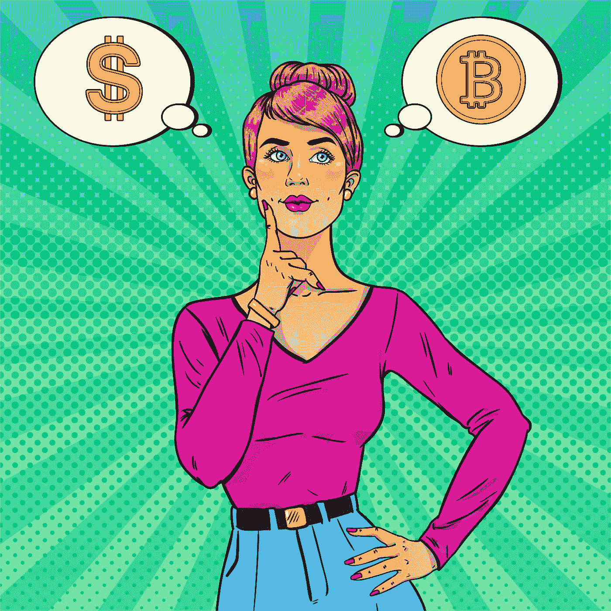
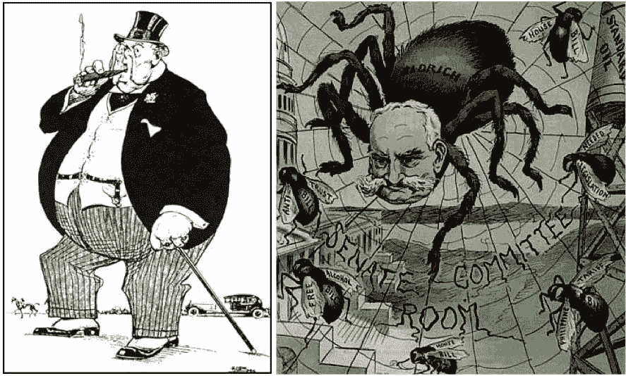
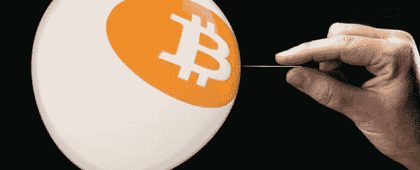
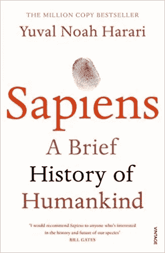
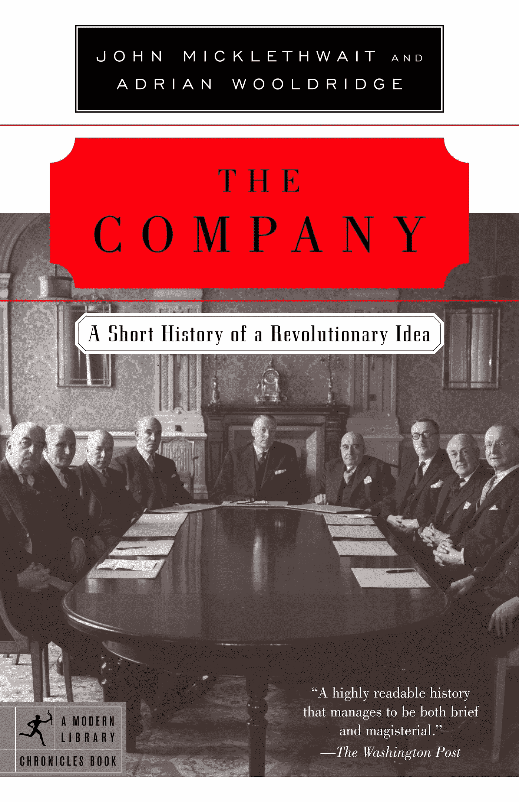
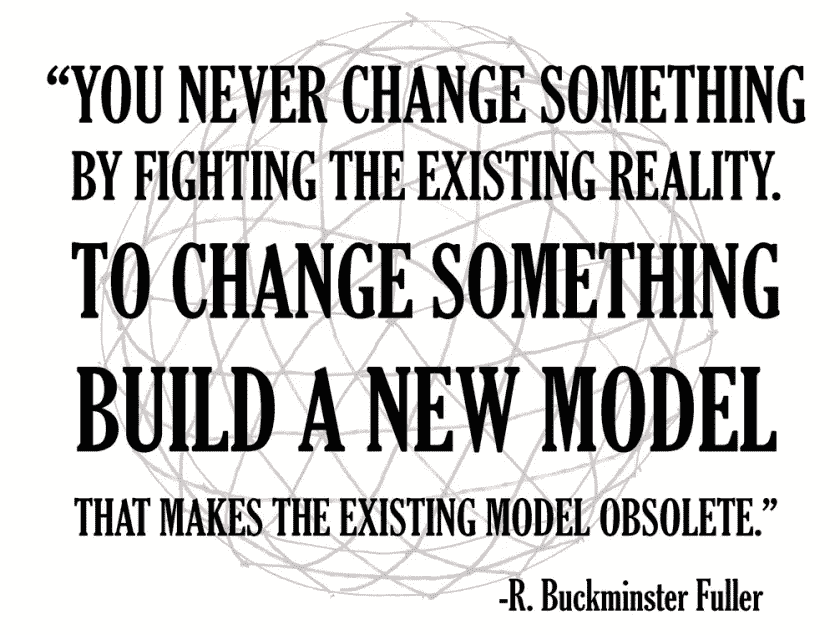

# 如何才能让加密再次繁荣起来？

> 原文：<https://medium.com/hackernoon/what-will-it-take-for-crypto-to-boom-again-a7ef9c2ef982>

让我们面对现实吧:

Crypto 已经死了。

去年，我们看到一个疯狂的市场飙升到疯狂的新高度，然后坠落悬崖。曾经一眨眼就能筹集到 2000 万美元的 ico，现在却很难筹集到 100 万美元。项目开始失败，他们的 Github 变成了鬼城。

监管机构正在打击。他们赶走了小投资者，T2 又一次把当前的系统塞到我们的喉咙里。KYC、反洗钱和集中瓶颈是常态。

只有[认可的投资者](https://www.investopedia.com/terms/a/accreditedinvestor.asp)，也就是已经很有钱的人，可以投资并从他们的钱中赚更多的钱。监管者认为公共汽车司机、教师和码头工人太愚蠢，不会投资，因此我们最好保护他们免受自身损失，而不是让他们决定如何处置自己的现金。

至于交易，除非你是专业的交易者，否则你可能会慢慢失血，或者拼命坚持。

去年，任何人都可以投掷飞镖，在交易中赚钱。今年，在经历了 10 个月的痛苦下滑，80%的加密价值蒸发后，我看到我的许多交易学生开始炒股，他们的银行账户着火，他们的自我价值被投入马桶。

但最糟糕的是，crypto 并没有像宣传的那样成功。

脸书和谷歌仍然是超级垄断者，他们不会很快面临去中心化或民主化的危险。crypto 的主要用例仍然是在编写一行代码或一个客户注册之前，凭空猜测或印刷资金来资助新项目。

我们不会用我们花哨的数字货币买咖啡，也不会在亚马逊上购物。

没有银行账户的人仍然没有银行账户。

而且我绝大部分的钱还是通过直接存款，而不是智能合约。

也许你是那种认为“这次不一样了”的人不是泡沫。这是一个新的世界秩序！

我们所需要做的就是分散一切，我们将摆脱亿万年的经济奴役的枷锁，大步迈向一个富裕和机遇的新世界，人类的新黎明，意识的转变，物种的彻底觉醒，就在此时此地发生着！

嗯，你错了。

你是对的。

泡沫就是泡沫，没有什么能改变基本物理学。世事有起终有落。

但你也是对的。

加密将改变世界。

只是比你预期的时间要长。没有什么是完全好或完全坏的。一个全新世界的梦想——智能合约创造客观公平的系统——是一个白日梦，而且永远都是，因为人们仍然需要写那些智能合约，而那些人总是有缺陷的。

生活中你可以指望三件事:

死亡、税收和人们以真理和光明的名义做着最愚蠢和最糟糕的事情。

无论你如何努力，你都无法纠正人为因素。

但这意味着我们应该停止尝试吗？这是否意味着世界末日是正确的，区块链只不过是被夸大、美化的数据库和密码只对毒贩和骗子有用？

号码

**我们生活在一个二元世界。**

**有些事情既可能被夸大，也可能改变世界。**

AI [在 50 年里没有实现任何目标](https://en.wikipedia.org/wiki/AI_winter)，然后突然它为一切提供动力，从驾驶方向到搜索引擎，同时理解你的声音，并在繁忙的城市街道上驾驶汽车。就像人工智能一样，crypto 将达到一个转折点，在这个转折点上，炒作消退，它开始做真正重要的事情。

怎样才能让这项技术发挥其潜力，证明“末日博士”和其他末日预言家是错的，变得如此有用，以至于我们无法想象在它出现之前的生活是什么样的？

换句话说，如何才能让 crypto 再次繁荣起来？

让我们潜进去看看。

# **过去和未来**

你不必像《末日博士》那样讨厌加密或者对它的潜力视而不见，就能看到什么不起作用。

批判性思维是我们生活中最好的朋友。没有批判性思维，我们什么也修不好。因此，让我们认真而诚实地看看 crypto，看看什么地方出了问题，这样我们就可以开始考虑如何修复它。

这不是我第一次面对 crypto 中的问题。在我的文章中，**中，我谈到了加密技术真正腾飞所需要解决的主要问题。**

**这些问题还没有一个得到解决。**

**区块链没有扩展到 Visa 高度，没有杀手级应用，我们还没有消除集中瓶颈或我在那里列出的任何其他东西。尽管 Radix、Lightning Network 和其他一些项目在可伸缩性方面取得了长足的进步，但所有这些观察仍然有效。为了让这种激进的新技术有机会改变世界，我们必须建立一个更好的捕鼠器，而不仅仅是提供等同于 betamax 的东西，并希望人们放弃他们的 DVR。**

**以杀手级应用为例。试着带你母亲去注册一个交易所，获得 KYCed，设置双因素认证，从她的银行账户转账，购买密码，并下载到钱包。**

**现在想象一下，你不得不做所有这些，只是为了在你的手机上运行一些蹩脚的应用程序。**

**这永远不会发生。**

**我宁愿在碎玻璃上跑两英里，也不愿意为了一个能给我提供更好餐馆建议的应用程序而跑那么多。**

**今天，如果你想试用 Instagram，你可以去 app store，点击安装，一分钟后你就会浏览到比你酷得多的闪亮、快乐的人的照片。Instagram 根本不需要任何密码来做任何事情。它从你故意购买的，现在就在你口袋里的监视设备中赚钱。它更像是你的智能手机。**

**你的手机做广告比过去的任何广告系统都好。它[会听你说的每一句话，并使用人工智能来判断给你看什么广告，](https://www.vice.com/en_uk/article/wjbzzy/your-phone-is-listening-and-its-not-paranoia)就像你刚刚和你最好的朋友谈论的那个背包或夹克。这吹散了路边的广告牌或报纸上的平面文字广告。过去的广告客户永远不知道有多少人开车经过广告牌 20 次后买了可乐，但他们知道你在脸书点击了多少广告。**

**除非我们有加密应用，不仅能做 Instagram 做的一切，而且做得更好，同时创造一个卓越的经济模式来取代或增强广告巨头，更不用说给你提供你不能没有的全新功能，否则加密应用世界不会发展得很快。**

**这是一个艰巨的任务，但这正是我们所面临的。**

**但这还不是最糟糕的。自从我写了那篇文章后，我越来越多地思考 crypto 面临的问题，它们甚至比我想象的还要大。**

**这是坏消息。**

**好消息是什么？**

**我意识到我们遗漏了一些非常简单的东西，这些东西可以帮助社区更快地进入下一个层次。**

**这是我从未预料到的。**

****我们必须着眼于过去，而不是未来。****

# ****婴儿和洗澡水****

**我说我们必须回顾过去，因为我们做了一件最愚蠢的事情:**

****

**我们把婴儿和洗澡水一起倒掉了。**

**我们试图从头开始重新创造一切，而不是看以前的工作。那不仅愚蠢，而且不可能。**

**我们现在可以解决一半的加密问题，只需要简单地从过去窃取有用的东西，并让它为未来服务。**

**先说 ICOs。**

**ICO 是一种为激进的新想法快速众包资金的创新方式。他们跨越法律管辖区，让每天的投资者把他们的钱投入到戒指中，而不仅仅是合格的投资者，他们不需要银行账户或大量疯狂的文书工作。**

**尽管有很多骗局和蹩脚的项目，这些都是真正的创新。当你审视当前的艺术状态时，区分什么是有效的，什么是无效的是很重要的。**

**当然，监管者很快就赶上了创新并摧毁了它们。很快，项目开始害怕，尽最大努力遵守不断变化的法规，KYC/反洗钱，FACTA，并希望他们在为白日梦筹集了 2000 万美元后不会被起诉。**

**更糟糕的是，随着项目破产，创始人带着所有现金消失在国外海滩，许多投资者损失惨重。监管机构为投资者提供的保护，比如要求透明度，确保公司不会对未来回报做出古怪的声明，开始看起来不那么过时了。**

**ICOs 还有其他问题。**

**某些类型的硬币是不可能用 ICO 来投资的。大多数实用硬币永远不会升值。**

**为什么？因为效用币会消失在应用的后台，机器对机器的交易。把它们想象成机器人的可编程货币。它们被设计成在幕后透明地买卖商品，而不需要任何人类互动。**

**认为这些硬币会像比特币这样的通货紧缩硬币一样值钱是疯狂的，比特币从根本上来说是为了随着越来越稀缺而升值。**

**这并不是唯一一种在 ico 融资方面很糟糕的硬币。**

**稳定债券旨在通过将价值与一篮子外部因素或资产挂钩来保值，对投资者来说没有太大价值。我们都想要一个简单的稳定币来对抗[的系绳](https://cointelegraph.com/news/untethered-the-history-of-stablecoin-tether-and-how-it-has-lost-its-1-peg)，但是谁会把他们辛苦赚来的比特币和以太坊花在一个不仅不会升值，而且是*专门设计的* *而不是*升值的资产上呢？**

**答案很简单。**

**不要麻烦直接向公众出售你的硬币，而是出售一个安全令牌。**

**(哦，还要创建一个有限合伙人，也就是有限合伙期权，它不会给投资者一个安全令牌，只是公司的权利。传统的、旧世界的投资者喜欢有限合伙人，因为他们对他们了如指掌，而安全代币仍然会把他们吓得半死，尽管在五到十年内，没有人会想要一个纯粹的有限合伙人，除非他们疯了，因为与一个设计合理的安全代币相比，它提供的流动性和权利更少。)**

**没错。创建一家公司，遵循实际有效的规则。给人们他们渴望的投资者保护、投票权和利润分成。**

**然后使用该公司发行你真正需要的那种硬币来驱动你的应用程序。**

**较新的项目已经在遵循这一模式。而且有很好的理由这么做。**

**你不能直接向公众出售稳定的硬币。好吧，你可以试试，但是由于我们前面谈到的所有原因，你不会筹集到多少钱。它永远不会升值，所以谁想买它？**

**但是你可以把拥有稳定币的公司卖给投资者，然后按照你想象的方式建造稳定币。该公司将需要从投机以外的东西中获利，但这是一件好事。这是理所应当的，因为这意味着利润不再与善变的交易者的奇思妙想联系在一起，他们用一枚硬币换另一枚硬币的速度比说“shitcoin”还快。**

**一家公司可以通过多种方式赚钱，从提供流动性获得报酬，或者通过原子互换收费，或者通过与主要交易所分享交易费用，或者通过打造一个像亚马逊市场这样的买方和卖方的强大经济生态系统，以及我们刚刚开始发现的一千多种其他方式。**

**一旦加密社区意识到旧金融系统中的东西并不都是邪恶的，他们就可以开始从旧系统中剔除好的，把坏的留在砧板上。**

****完全多此一举是不可能的。****

****那么，我们为什么要努力呢？****

**不如迭代，让那些迭代产生创新。**

# **英国茶叶公司、目录公司和改变现实的铁路公司**

**有很多其他方法可以重复过去，而不是忘记它的存在。**

**让我们仔细看看 DAOs(去中心化自治组织)。**

**DAOs 承诺重塑我们做生意的方式，我们组织和激励劳动力的方式，以及我们制造和分配商品的方式，但这还没有发生，因为我们没有看到在这些方面已经做得非常好的组织:**

**公司。**

**在人类历史上，没有一个组织比公司更能改变现实的本质。**

**如果你想设计一把刀，你没有祈祷，除非你回去看看什么已经工作了，什么没有工作，然后再努力去做得更好。**

****

**现代公司的兴起是起点。在股份公司、股票市场、有限责任以及我们认为理所当然的现代商业的所有特征出现之前，改变世界几乎是不可能的。正如尤瓦尔·赫拉利在他那本令人惊叹的书《智人》中指出的，人们相信过去而不是未来。年复一年，十年又十年，一个世纪又一个世纪，生活都大同小异。**

**国王和王后拥有权力和金钱，并把它们传给他们的孩子。如果你是农民，你还是农民，你的孩子还是穷人，他们的孩子还是穷人。**

**想象一下，你是一个年轻、有事业心的中世纪农民，梦想着开一家面包店，一步步走向中产阶级。你成功的机会几乎为零。**

**你从哪里弄到钱？谁会借给你？**

**几乎没有银行，当然也没有投资公司，也没有办法以合理的利率获得贷款。如果你幸运的话，也许你家里有人认识某人，谁认识谁，你可以去当地的领主那里获得贷款，贷款的利率会让现代的暴民羡慕不已。**

**没有人想拿未来冒险。不像今天，生活每十年都会发生翻天覆地的变化。一百年前，人们仍然用马打仗。一百年前他们也用马打仗，再往前一百年。**

**但是到了第一次世界大战，我们有了原型坦克。到第二次世界大战时，我们有了坦克和飞机，这两者完全抹杀了所有旧的战略。在统治世界几个世纪后，马在几十年内就过时了。坦克每次都赢马。**

**二十年前，很少有人使用电脑或互联网。今天，你能想象没有它做什么吗？**

**我们有充分的理由相信明天会与今天不同。但在过去，没有人有任何理由相信这一点，因为生活保持不变。你父亲是个农民，他的父亲在他之前，他的父亲在他之前。**

**所以，如果你是个有钱人，为什么还要借钱给当地的农民来开面包店呢？你无法想象看到面包店生意兴隆，顾客盈门，因为你一生中从未见过这样的例子。如果你从未见过黑天鹅，为什么还要费神去相信外面有黑天鹅呢？最好把你的钱放在保险箱里，不惜一切代价保护好它。**

**但是公司改变了这一切。**

**他们第一次允许我们分担风险。投资者可以将他们的资金集中在一起，如果出现问题，他们只需承担有限的责任。国王和王后们不能派他们的士兵来责备你，因为一次海难从长途航行中再也没有回家，淹死了船上所有的水手。你的风险就是你的资本。这艘船的风险是船员和利润。**

**风险共担造就了现代世界。**

****

**大多数人都懒得去研究公司的历史，这是一种耻辱。从 Micklethwait 和 Wooldridge 的优秀著作[**The Company:A Short History of A Revolutionary Idea**](https://amzn.to/2PP0pUI)开始，从那里开始。**

**像荷兰和英国东印度公司这样的早期公司开创了长途贸易，从四面八方带来了香料和货物，并彻底改变了我们为宏大而雄心勃勃的想法融资的方式，而这些方式在古代的国王和王后们只能在他们最疯狂的幻想中梦想。**

**当然，早期的公司不仅仅是一种好的力量。我们经常抱怨今天公司的力量，但是他们比不上过去的巨头。**

**英国东印度公司开创了长途贸易，但他们也“开创”了奴隶制和垄断。他们设法用两倍于英国军队的私人军队在印度殖民，同时折磨和剥削当地农民，操纵价格，排斥竞争对手。**

**试着想象一下，即使是当今最强大的私营军事公司也决定接管一个像印度这么大的国家。一旦福克斯新闻频道和 CNN 受到影响，他们就会被关闭。**

**像生活中的一切一样，遥远过去的公司存在于二元性中，既有好的也有坏的。他们有好的想法和坏的想法。后来，公司拿走了好的，把大部分坏的留在砧板上。新一代更好的公司建造了铁路，创造了现代民主的许多方面，并改变了人们买卖从食物到家庭用品等一切东西的方式。**

****

**西尔斯·罗巴克于 1892 年以销售手表起家。几十年后，他们的目录扩展到 500 多页，出售一切可以想象的东西。他们的货物沿着革命性的新铁路流向美国各地的小城镇和村庄。在此之前，人们只能购买当地工匠制造的产品，但现在他们可以打开西尔斯商品目录，从千里之外的工匠师傅那里订购做工精细的手表。**

**西尔斯还开创了物流和供应变革管理以及经理和员工大军。为西尔斯赚钱机器提供动力的公司与约翰·雅各布·阿斯特的皮草公司截然不同，正是这家公司让他成为美国第一个千万富翁。**

**阿斯特的公司比西尔斯公司早 50 年成立，除了几个职员之外什么也没有，尽管他积累了 8000 万美元的个人财富，按今天的标准大约是 22 亿美元。**

**但是西尔斯改变了这一切。公司的每一部分都成了自己的网络。它雇佣了数千人来管理运输、退货、支持、经纪人、经销商、人员、供应商和工厂。**

**简而言之，他们开创了自动化。**

**从你坐的椅子，到我正在打字的电脑，甚至是我坐在咖啡馆里写作时喝的咖啡，公司对你今天生活中许多想当然的事情负有责任。**

**但在加密领域，我们已经完全放弃了过去行之有效的东西。分散一切是战斗的号令！用 Dao 替换公司！摆脱等级制度，经理，后勤和老板。**

**我们想象，一个简单的智能合同，根据一个触发器发出几个以太坊，就足以取代公司创造的几代人的进步和创新。**

**智能合同可以雇佣和解雇员工吗？**

**他们能改变产品线、营销和方向吗？**

**他们能激励人们朝着同一个方向前进吗？**

**我越是观察 Dao，就越想知道它们是否离我们至少还有十年，如果不是几十年的话。他们需要比智能合同更多的东西来与今天的大公司竞争，比如苹果、亚马逊和埃克森美孚。沃尔玛雇佣的员工比大多数中等国家都多。**

**道需要彻底改造我们如何激励和惩罚人们，我们如何做决定，以及我们如何引导人们的注意力，让他们受到激励。他们需要改变一切，从我们订购铅笔和回形针的方式，到我们处理法规和文书工作的方式。**

**简而言之，他们需要做所有公司已经在做的工作，如果他们有机会竞争的话，还要做得更好。**

**他们一点都不亲近。**

**我环顾四周，我环顾四周，没有一个我见过的道项目有答案。这可能只是因为这些答案将来自我们还没有发明的技术，也看不到未来。但不管是什么，我们还没到那一步。**

**只要你回顾一下公司的历史，你就会意识到密码社区还有多远的路要走。这并不意味着我们不会到达那里，只是意味着这可能是一条比任何人预期的都要长的路。**

**正如我们在《肖申克的救赎》中所学到的，当你想改变一些事情时，“所需要的只是压力和时间。”**

**压力是存在的。**

**时间还在流逝。**

# ****从蹩脚钱包到黑仔 App****

**让我们面对它，几乎没有什么加密是为黄金时间准备的。**

**从蹩脚的钱包界面，到购买和出售密码的疯狂复杂的过程，到几乎不起作用的应用程序，到除了基于暴力触发器发送和接收金钱之外不做太多事情的 Dao，同时在解决实际问题上撑船，我们有很多内容要介绍。**

**但这与说加密永远不会覆盖那个领域是非常不同的。**

**这是末日论者不明白的。**

**他们的观点是非黑即白。要么全有，要么全无。加密要么彻底失败，要么彻底成功。没有中间地带。它要么解决了人类的所有问题，要么毫无价值。**

**这不仅仅是疯狂，这是愚蠢的。**

**事情不是这样运作的。生活是分阶段进行的。你的 DNA 包含了在你之前所有迭代的全部历史，所有的都在尝试新的东西。**

**crypto 问题的答案在于同样的迭代过程。**

****

**思考进化，而不是革命。**

**是进化让我们走向革命。革命不仅仅是一次大爆炸，它们是在一段很长的时间内一点一点发生的，力量就像一个远离大海的波浪，在冲向海岸时聚集蒸汽。**

**革命将会到来。**

**在它自己的时间里。**

**没有人能推动河流，让我们更快到达那里。**

**同时，开始回顾过去。一步一步，一寸一寸地改变事情。**

**做到这一点，crypto 可能就会开始不负众望。**

**Crypto 死了。**

**加密万岁。**

**###########################################**

## **如果你喜欢我的作品，请[访问我的个人主页](https://www.patreon.com/danjeffries),因为那是我与所有粉丝分享特别见解的地方。**

## **顶级赞助人可以独享这么多东西:**

*   ****每篇文章、播客和私人谈话的早期链接。**你比任何人都先阅读和聆听！**
*   ****一个月月虚拟的和我见面并问&一个。**问我什么我都会回答。我也分享我正在做的一切，并给你一个幕后看我的过程。**

## **访问传说中的硬币表 Discord，您会发现:**

*   ****市场来电**来自我和其他专业技术分析大师。**
*   ****币**只**私聊**。**
*   ****私人海龟滩频道，程序员们在这里分享各种版本的** [**密码海龟交易员策略**](https://hackernoon.com/my-super-secret-crypto-turtle-strategy-revealed-ae7492fb01a6) **等信号和交易软件**。**
*   **幕后看看我和其他专业人士是如何解读市场的。**

**############################################**

## **我有一个新的播客， [The Daily PostHuman](http://dailyposthuman.com/) ，涵盖加密、人工智能、科技、未来、历史、社会等等！查看我最著名的文章和观点的扩展报道。上 RSS 频道，不要错过任何一集，请在接下来的几个月里关注一些非常特别的嘉宾！**

****

**############################################**

****

**[Photo credit](https://extranewsfeed.com/the-winds-of-world-war-iii-8bc369584f67)**

**简单介绍一下我:我是一名作家、工程师和连续创业者。在过去的二十年中，我涉及了从 Linux 到虚拟化和容器的广泛技术。**

**你可以看看我的最新小说， [***这是一部史诗般的中国科幻内战传奇***](http://amzn.to/2gAg249) *在这部小说中，中国摆脱了共产主义的枷锁，成为世界上第一个直接民主国家，运行着一个高度先进的、人工智能的去中心化应用平台，没有领导人。***

## **[加入我的读者群，你可以免费得到一本我的第一部小说《蝎子游戏》。读者称之为“神经癌的第一次严重竞争”和“黑色侦探会见约翰尼记忆术。”](http://meuploads.com/join-my-readers-group/)**

**############################################**

## **最后，你可以[加入我的私人脸书小组，Nanopunk Posthuman 刺客](https://www.facebook.com/groups/1736763229929363/)，在这里我们讨论所有的科技、科幻、幻想等等。**

**############################################**