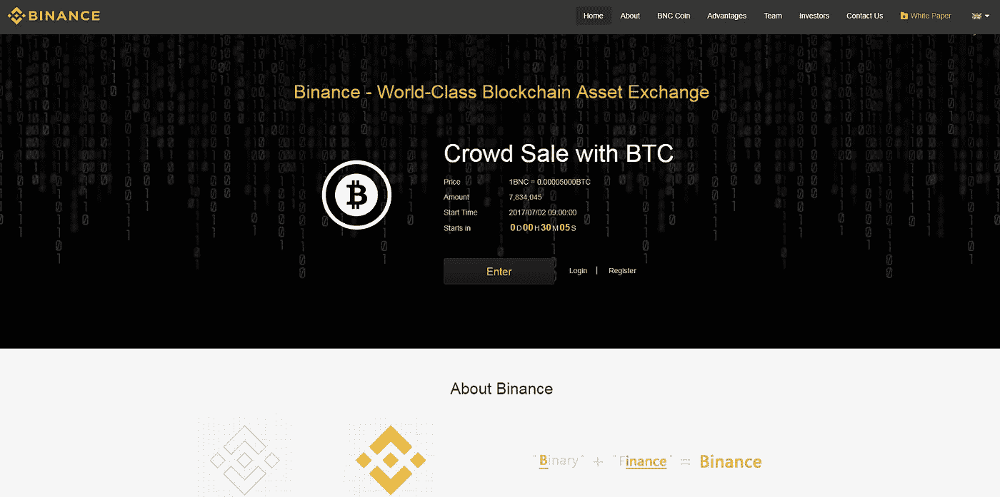
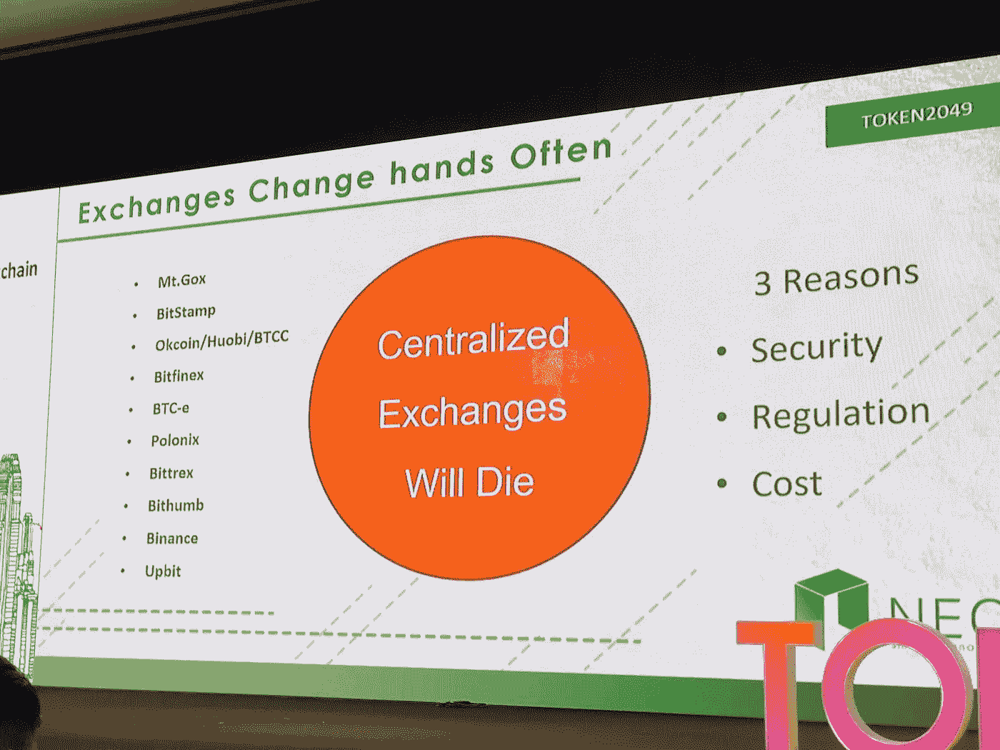

# 下一代密码交易所要取得成功需要什么？

> 原文：<https://medium.com/hackernoon/what-will-it-take-for-the-next-generation-of-crypto-exchanges-to-succeed-92af8029af2c>

我的加密货币之旅始于学生时代，但直到一位朋友提出付给我价值 100 美元的比特币(当时为 0.055BTC)时，我才真正起步。不得不从头建立一个钱包，并在 Quoinex 上创建一个账户，却发现他们没有 NEO 和 QTUM 的比特币配对，这凸显了当时交易所的局限性。

需要使用另一个交易所 Bittrex 来将我的比特币交易为 NEO 和 QTUM 似乎效率低下且不方便，大约在这个时候，币安开始了首次比特币发行(ICO)。

Source: Binance

我把币安视为新一代交易所的一部分，它们速度更快，能够处理更大的交易量，也更安全。他们上市新硬币的速度比大多数其他中央交易所都要快，向 NEO 代币持有者支付汽油费，交易费用也很低。然而，时过境迁，币安已经开始收取高昂的上市费用(高达 500 万美元)，大大减缓了它们的上市进程。币安也容易受到黑客攻击。

**下一代交易所**

很明显，下一代加密货币交易所将采取不同的形式。以太坊的创始人维塔利克·布特林(Vitalik Buterin)最近提到[“我当然希望集中式交易所尽可能地下地狱，”](https%3A%2F%2Ftechcrunch.com%2F2018%2F07%2F06%2Fvitalik-buterin-i-definitely-hope-centralized-exchanges-go-burn-in-hell-as-much-as-possible%2F)和 NEO 的创始人达·洪飞(Da Kumar)也表达了同样的观点，后者也表示“集中式交易所将会消亡”。

“Centralised Exchanges Will Die” — Da Hongfei’s slides at Token 2049

未来的交易所必须解决以下问题，以弥补当前的交易所和项目在当前的[区块链](https://hackernoon.com/tagged/blockchain)生态系统中遇到的困难:

**a) 100%分散**

Photo by [Francisco Gomes](/hackernoon/https%3A%2F%2Funsplash.com%2F%40thepip%3Futm_source%3Dmedium%26utm_medium%3Dreferral) on [Unsplash](https%3A%2F%2Funsplash.com%3Futm_source%3Dmedium%26utm_medium%3Dreferral)

加密货币的精髓在于《比特币》白皮书的第一句话:

电子现金的纯点对点版本将允许在线支付直接从一方发送到另一方，而不通过金融机构

未来的交易所不应易受单点故障的影响，也不应易受交易所被亵渎的影响。它应该允许用户从他们现有的钱包直接连接，以便资金始终在他们的控制之下，并促进点对点的价值转移，而无需通过任何外部机构。这些是分权的基础。

**b)代币上市应该几乎没有成本**

“A piggy bank on a white surface” by [Fabian Blank](/hackernoon/https%3A%2F%2Funsplash.com%2F%40blankerwahnsinn%3Futm_source%3Dmedium%26utm_medium%3Dreferral) on [Unsplash](https%3A%2F%2Funsplash.com%3Futm_source%3Dmedium%26utm_medium%3Dreferral)

当前交易所对上市项目的垄断，只会突显加密货币领域的分歧。项目不应该筹集超过上市所需的资金，项目的支持者也不应该为了上市而等待数月。

**c)允许跨区块链交易**

Photo by [Pietro Jeng](/hackernoon/https%3A%2F%2Funsplash.com%2F%40pietrozj%3Futm_source%3Dmedium%26utm_medium%3Dreferral) on [Unsplash](https%3A%2F%2Funsplash.com%3Futm_source%3Dmedium%26utm_medium%3Dreferral)

为了参与 ico，我们现在必须管理多个加密货币交易所的账户。

*虽然加密货币的理念是分散你的资产，但它不应该通过将你的资产分散到多个交易所来实现。*

目前形式的 ico 的缺点是显而易见的，因为一些代币只在某些交易所上市。虽然分散式交易所通过在某个区块链上列出所有代币来解决这个问题，但大多数 dex 是区块链特有的，只存在于单个区块链上。

为了让 DEX 与当前的加密货币交易所正面竞争，它必须是区块链不可知论者，允许在多个区块链之间跨不同的令牌进行交易。

**d)使用起来非常简单**

“Lights in the windows of an office building in Moscow” by [Mike Kononov](/hackernoon/https%3A%2F%2Funsplash.com%2F%40mikofilm%3Futm_source%3Dmedium%26utm_medium%3Dreferral) on [Unsplash](https%3A%2F%2Funsplash.com%3Futm_source%3Dmedium%26utm_medium%3Dreferral)

易用性是交易所等复杂金融产品留住用户的关键因素。许多早期的加密货币交易所很少强调用户体验。这导致最终产品过于复杂，基本交易者无法理解。下一代交易所将不得不非常注重用户界面和体验，同时让普通交易者熟悉它们。

**e)成交量和流动性**

Photo by [Mark Finn](/hackernoon/https%3A%2F%2Funsplash.com%2F%40mrkfn%3Futm_source%3Dmedium%26utm_medium%3Dreferral) on [Unsplash](https%3A%2F%2Funsplash.com%3Futm_source%3Dmedium%26utm_medium%3Dreferral)

交易员被拥有厚厚订单簿的交易所吸引，而不那么偏爱没有订单簿的交易所。如果交易所不同配对的交易量和流动性较低，交易就会受到抑制，因为交易者在执行接受报价时会在价差上产生亏损。

为了将做市商吸引到他们的平台，交易所需要更复杂的 API 和有吸引力的做市商费用。[做市商](https%3A%2F%2Fwww.investopedia.com%2Fterms%2Fm%2Fmarketmaker.asp)通过增加交易量和玩市场的双方来鼓励交易，使其对有机交易者更具吸引力。

Photo by [Andre Francois](/hackernoon/https%3A%2F%2Funsplash.com%2F%40silverhousehd%3Futm_source%3Dmedium%26utm_medium%3Dreferral) on [Unsplash](https%3A%2F%2Funsplash.com%3Futm_source%3Dmedium%26utm_medium%3Dreferral)

自加密货币问世以来，10 年已经过去了，在建设下一代交易所方面还有许多工作要做。我们建造了 Switcheo 作为第一个基于新区块链的 DEX，但这仅仅是个开始。通过将我们的 DEX 扩展到其他区块链，从 2018 年第三季度末的 QTUM 和 Ethereum 开始，我们希望 Switcheo 能够促进不同区块链之间的无信任价值转移。

我们最近推出了 Switcheo 交易所的 V2，它开放了我们的交易 API，引入了移动用户界面和使用外链匹配引擎的即时确认。我们希望这能让我们更接近建立下一代交易所。

也在 [e27 上看过。](https://e27.co/will-take-next-generation-crypto-exchanges-succeed-5-must-features-20180806/)