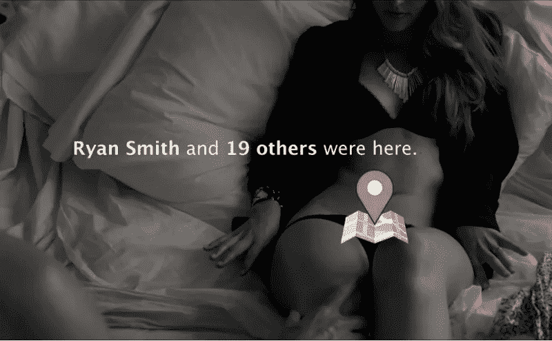

# 如果医疗和社会数据受益于同样的保护，会发生什么？

> 原文：<https://medium.com/hackernoon/what-would-happen-if-medical-and-social-data-benefited-from-the-same-protection-48a8a11d5b63>

当我们想到任何与超人类主义有关的活动时，我们可以依赖这样的想法，那就是因为我们想要增强我们身体的功能表现。Bodies 在这里写的是复数，因为“穿体”有很多种可能(从身体残疾到跨性；从偶然事件到个人选择)。我们甚至可以看到我们的个人决定，就好像它们仅仅是通过我们的器官循环的浓缩信息量的结果:*空间识别*通过视觉，*数据传输*通过语音，*数据存储*和使用记忆系统的准确数据回忆，以及许多其他应该有助于我们的生物在这个世界上茁壮成长的事情。但是这个版本我们的人类状况也与我们的可能性有很大关系**。这意味着我们维持机体良好功能的能力是为了帮助它生存或在生活中取得成功。总之，我们的医疗条件可以改善我们的社会活动。**

**然而，我们的现实世界并不是由一个奇妙的类人物种组成的，他们甚至不需要睡觉或吃饭来保持能量平衡。真实的人类有弱点，尤其是道德倾向。当我们是一个团体的一部分时，我们倾向于欣赏在我们的同伴中流传的尊严感。为了保持自我和正直感，我们倾向于学会尊重对方。那么，如果我们的社会活动和我们的健康状况之间不再有界限，会发生什么呢？如果我们的社交活动可以预测我们的医疗状况，那会怎么样？**

**实际上，我们关于社会和医疗数据的情况是什么？显然两者之间有差距。不同的是，病历是受法律保护和保密的。社交媒体上共享的数据等个人信息没有那么多的保密性。而他们共同的敌人依然如故:公众曝光。有些人乐于与他人分享他们的医疗状况，但他们的医疗记录的状态并没有改变，仍然受到法律保护。另一方面，有些人不一定觉得轻松，即使他们通过社交媒体在线分享个人信息。那么，保护数据或保护数据隐私的目的是什么呢？**

**事实上，将医疗数据分类和保密的目的是因为它们容易被滥用。医疗数据是最容易受到攻击的信息之一。医疗记录的敏感程度受到保护，因为如果它很容易泄露，可能会造成很大的伤害。公开宣布一个医疗问题会导致其他人对病人另眼相看，或者利用疾病。这种知识的后果可能或多或少是致命的，并可能在工作场所引起一些不容忍的待遇。这种保护假定某人不应该因其医疗状况而受到歧视。**

**但是社会数据呢？这些信息是我们有时自愿分享给彼此的关于我们道德特征的信息。有什么区别，应该有吗？这两组个人数据的区别之一是，医疗数据主要是由医疗保健专业人员收集和注册的信息。然而，社会和医疗数据都是个人信息，对一个人来说都是有害的。让我们想想道德骚扰，特别是勒索，例如，有人可能因为网上实现的一些数字分析而使他或她的名誉受到威胁！自从剑桥分析公司的案例以来，现在似乎可以接受去实现一些心理剖析，显然是。**

**那么，如果一个人的医疗记录可以附加到他或她的在线共享的社交数据上会发生什么？让我想想。首先，当一些医疗数据在数据库中注册时，它应该是在医疗保健系统的认证专业人员的控制下完成的。然而，当涉及到精神疾病时，诊断可能有点模糊。在这种情况下，当涉及到精神疾病时，可能会发生一些专业人士对诊断意见不一致的情况。因此，在精神卫生保健系统中，就像在其他卫生保健中心一样，有可能产生不同的结果。我们可能有三种可能的结果:一种商定的诊断，然后可以与 DMS-V 建议一起治疗，或者一种诊断不符合负责该疾病的专业人员的经验(在这种情况下，这意味着患者会见了不同的医生)，或者有这样的情况，一些专业人员对精神健康问题的定义完全不同意，但被一些其他同事发现(这也意味着咨询了几名医生)。[这些不确定性的问题是潜在的假阳性](https://www.ncbi.nlm.nih.gov/pubmed/20232254)。**因为这些分歧会发生在人类中，为什么它不会发生在机器上？****

**为什么我们关于社会数据和医疗数据的话题需要这种精确性？因为如果我们生活在一个结合了这两者的世界里，将会有一些情况会潜在地增加心理健康问题，伴随着社会数据的分析，可能会有灾难性的后果。几年后，在至少一个社交网络上找到任何有记录的人肯定会很容易。想象一下，事实上，如果我们可以将一个人的医疗记录与他通过社交媒体在网上分享的个人信息联系起来？[这个想法并不新鲜](https://www.cnbc.com/2018/04/05/facebook-building-8-explored-data-sharing-agreement-with-hospitals.html)，政府已经实施了社会监控以防止恐怖主义行为，因此这种行为的全球化可能正在进行中。我们现在能做些什么呢？**

**那么，让我们考虑一下。这就是我想在这里做的，因为我们今天拥有的分析潜力已经达到了如此高的性能，如果不自动将两者结合起来，那将只是一个道德问题。我们今天创造的算法能够自我优化，这意味着它们能够决定自己的标准，也能够自己设定自己的限制。这也意味着，我们的精神卫生保健系统将完全依赖于一些自动化决策，这只是一个时间问题。**

**Google efforts to create a machine learning and augmented reality-powered microscope for real-time detection of cancer, helping to make pathologists more efficient and ultimately to save patient lives.**

**今天收集的数据量太大了，不容否认或忽视。例如，我们已经超越了完全恢复隐私的可能性。如果我们听之任之，几年后我们的隐私意识可能不再属于我们。我们分析的行为模式将设定一个角色，该角色应该类似于每天跟随我们的影子(具有心理学背景的数据分析师从事虚拟剖析的潜力将在这种实践中占有一定的位置！).与真实世界的区别在于，我们的实际影子只会跟随我们直到我们死去，而保存我们数据的幽灵可能会永远存在，这是为了让未来的自动化决策随着时间的推移变得更加准确。因为人工智能拥有的数据越多，就越有利于他们创建识别模式，我们不仅仅是从大自然中传播的花粉中诞生的，我们生来就有一段历史。也就是说我们的历史是有历史的！跟随我们的第一段历史是我们的家族。我们家有自己的鬼魂，每个家庭成员都有自己的影子，会一直跟着他们，直到他们死去。如前所述，机器输入的数据越多，它的决策就越准确…**

**这里医疗数据结合社会数据有什么问题？他们拥有相同的法律地位有什么关系呢？正如我们所知，我们实际算法的性能能够以比任何人更快的精度预测不健康的模式。随着时间的推移，这些预测的正确率越来越高。这意味着未来的算法将在一个具有解除武装功能的身体内找到不健康的模式。当涉及到精神诊断时，它会变得同样准确吗？这个设施会允许这些算法打开一个新的市场吗？我们的医疗数据会获得新的资本价值吗？如果没有，为什么没有？如果是，出于什么目的？利用这种精确预测的目的是什么？**

**脸书曾经试图在用户中发现抑郁的模式，以便为他们提供一些帮助，尤其是在自杀方面。如果有与这些预测活动相关的付费广告会怎么样(**尤其是当医疗保健系统是私有的**)呢？如果社交网络从这些关于自杀的预测算法中赚到一些钱会怎么样？任何声称像脸书那样关心用户的社交媒体都会对优化这类算法非常感兴趣。这意味着致力于预测分析的优化是一个新时代的开始:一个可以利用漏洞的时代。如果我们的虚拟行为被扫描到有利于一些服务的程度，这些服务将能够为父母提供一些关于他们孩子的道德安慰:一些工程师和设计师将致力于建立预测算法的事实，这样一些父母就不会那么担心他们的孩子有抑郁危机，因为机器将能够在他们自己的孩子意识到他们有多么自杀或抑郁之前警告他们？这听起来并不令人担忧，但这是一个可以说明医疗记录可以资本化的例子，因为没有物理诊断可以通过社交媒体实现。**

**所以，我的问题是:如果医疗和社会数据最终共享相同的法律地位，会发生什么？谁会从保护个人信息的锁定系统中受益？也许不是一个想利用医疗问题的系统。为什么？因为如果我们深入研究反乌托邦，如果伴随这种货币化而来的论点是声称一些精神健康问题可能对社会有害，那么有必要进行某种“合法”的控制呢？谁来决定什么是有害的？分析在社交网络上自愿分享的个人信息，就好像这些信息是与精神健康问题相关的潜在预测一样，会有什么后果？谁来设置诊断？机器将如何识别实际上是一种精神疾病？从哪次经历？那么，如何添加能够或者应该规范那种人为诊断的伦理呢？**

**在我的文章中，主要问题是，如果我们未来的趋势是实现一些可能超越精神疾病相关问题的侧写，为什么社会数据不能受益于与医疗数据相同的保护？因为可能会有保密问题，尤其是准确性问题。让我们深入研究一下，因为超人类主义可能是对这种结合最感兴趣的运动！**

****