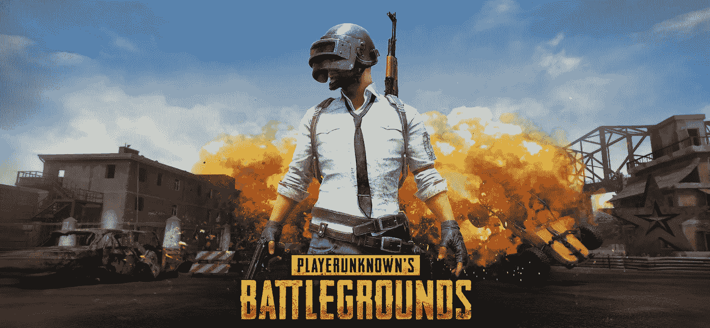

# 你能从 PUBG 背后的团队学到什么

> 原文：<https://medium.com/hackernoon/what-you-can-learn-from-the-team-behind-pubg-71d449e7b6>

Source: [PUBG](https://www.pubg.com/)

# **PUBG 是什么？**

PUBG 或[玩家未知的战场](https://www.pubg.com/)是一款非常受欢迎的在线皇家战役游戏，可以在 PC 和 Xbox 上玩。

在前 3 个月里， [PUBG 收购了**500 万**玩家](https://news.xbox.com/en-us/2018/03/15/playerunknowns-battlegrounds-xbox-hits-5-million-player-mark/)仅 Xbox One 版本的票房就达到了 1 . 5 亿美元。

# **精益启动方法**

我知道你在想什么……电子游戏和在 SaaS 创业有什么关系？嗯，实际上相当多。

它进一步验证了在“全力以赴”之前用少量的时间和金钱投资来测试一个想法的理论。

在流行游戏大会 [E3](https://www.e3expo.com/) 上，PUBG 背后的开发者因从市场[虚幻市场](https://www.unrealengine.com/marketplace/store)购买开源资产而受到批评。

PUBG 公司的公关负责人 Ryan Rigney 在发布给 PUBG subreddit 的帖子中证实了这些指控。他继续解释游戏开发的现实，最重要的是，良好的商业实践。

> “雇用一个 40 人的艺术团队‘尝试一个游戏’并‘看看它是否有趣’根本不是一种明智的工作方式——这就是资产商店的作用！对于希望聪明工作的团队来说，这是一个很好的资源。”

Rigney 表示，PUBG 的第一张地图 Erangel 结合了该公司在韩国总部完成的内部工作、一些直接购买的资产以及来自美国中西部团队的外包艺术品。

# **进化游戏**

在证明他们能够获得一些初始牵引力，产生可观的收入，并保持需求后，PUBG Corp .开始建立他们的内部团队，并开发更多的内部资产。

相应地，每一个后续的地图都越来越定制化，来自开源市场的资源越来越少。

# **将此应用到你的创业中**

不要在尚未验证的新特性上浪费开发时间。

从最小可行产品开始。做不成规模的事情。

开发新产品

在[云活动](https://cloudcampaign.io)中，我们开发了一个我们目前主要在内部使用的潜在客户创造工具。由于我们主要与寻求扩张的数字营销机构合作，在我们的[社交媒体营销平台上为机构](https://cloudcampaign.io)提供这种产品似乎是一种合乎逻辑的产品扩张。

我没有花时间建立一个新的服务并为这个新产品建立另一个登录页面，而是通过电子邮件向我们现有的客户群发送了一个潜在客户的 CSV。

我还没有为此收费，而是在验证两件事:

1.  我们现有的客户群想要这种产品吗(他们需要更多的销售线索吗)
2.  销售线索合格吗

下一个合乎逻辑的步骤可能是对这些线索收费，以确保人们真的愿意为此付费。

在那之前，浪费开发时间在这个新产品上是没有意义的。

**拓展现有产品**

相同的方法应该适用于扩展现有产品的功能集。

如今，开源代码非常丰富，SaaS API 插件也非常丰富。

我们在产品中加入了许多功能，首先是为服务付费，然后在看到足够多的需求后在内部重新构建。这些服务中的大多数都有一个免费层，足以满足首次测试的兴趣。遵循此生命周期的一些特性/服务示例如下:

*   网站 metatag 刮刀
*   PDF 报告生成
*   ML 自动字幕生成

你可以做尽可能多的假设，但是在你测试之前，你永远不会知道谁真的愿意为一个新功能或产品付费。