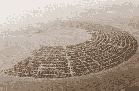
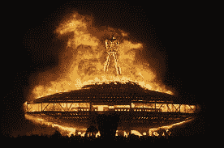
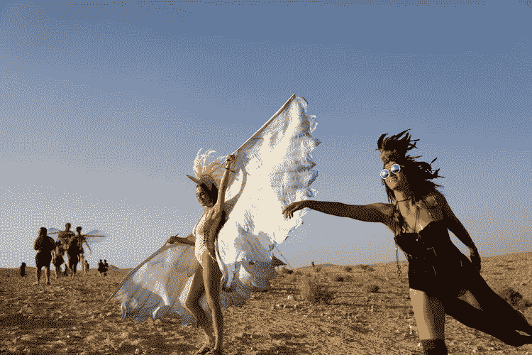

# 什么，你也没去火人节？？你是什么样的硅谷圈内人？？

> 原文：<https://medium.com/hackernoon/what-you-didnt-go-to-burning-man-either-what-kind-of-silicon-valley-insider-are-you-d989cff29fa9>

所以到现在为止，你们大多数人应该已经听说了《燃烧的人》正在内华达州黑石的海滩上上演(我也不知道那是哪里——在内华达州里诺附近的某个地方)。

每年，我们都会看到一些令人难以置信的艺术图片，半裸的人在沙子和灰尘中四处游荡，或者暗示:“太糟糕了，傻瓜，你错过了我们所有的乐趣！”。

几年前，埃隆·马斯克(据说他和另一位亿万富翁马克·扎克伯格一起参加了去年的燃烧人)嘲笑另一位硅谷企业家:“他连燃烧人都没去过！”。这是一种侮辱——好像另一个人(我不记得是谁了)，不是“真正的”硅谷内部人士！

Life on the “playa”

在过去的 10 年里，我一直住在硅谷的中心——在山景城，像谷歌和网景这样传奇的“真实”硅谷成功故事在这里孵化和成长。事实上，帕洛阿尔托(惠普车库和斯坦福大学的所在地)还是山景城(飞兆半导体公司和史蒂夫·乔布斯传奇车库的所在地，以及上面的传奇公司)是硅谷的心脏，这是一个掷地有声的问题。

唉，没熬到火人节(还是火人节，还是火人节？)今年。

你也没有？

好吧，别太难过。因为我不在城里，又有健康问题，所以我得到了一张通行证——如果我的医生认为我今年要去游乐场，他们会感到非常失望。我敢肯定，你和我在硅谷的大多数“圈内”朋友一样，有很好的理由错过它。

想起来了，几年前我打算去，但一些小事，比如创业、筹集资金，以及我对露营的厌恶、灰尘、缺乏卫生都阻碍了我。

我记得一年前，大约 5 年前，当时似乎是“跳上燃烧的人乐队”是要做的事情，一个朋友正试图安排一个野营车。然后，我意识到我真的讨厌开 5 个多小时的车，然后在成千上万辆车中再坐 3 个多小时才能进入公园。这也是件好事，因为去年，在购买了每张 1200 美元的门票后，许多与会者在门口等了好几个小时——只有在其他人离开后才能进去。我的膀胱几乎不能承受通过旧金山交通从南湾到伯克利的车程，所以我最终没有去。想起来了，我想她也没去。

不要误解我，我有很多生活在硅谷的自由派朋友(假设你把科幻小说也包括在这个宽泛的定义中)，和他们中的许多人一样，我支持《燃烧的人》这个想法，它诞生于 70 年代和 80 年代(我想，90 年代及以后也是)硅谷的一个重要组成部分的反主流文化。博爱的理念，沙漠中的艺术品，反资本主义，与你的男性同胞(和女性)自由而不虚伪地联系在一起——如果你愿意的话，回归基本，理论上听起来都很棒！

这让我想起了伍德斯托克音乐节。我最近读了一篇关于伍德斯托克的文章，唉，虽然我太年轻了，不能去(几个月后我出生了)，但我支持一群年轻人反抗“男人”和制度的想法——反战和自由恋爱等等。他们甚至有一个瑜伽师，每天早上带领人群进行冥想和瑜伽——对此我要说耶！

但是，我不得不承认，当我读到关于它真实情况的文章时——到处都是泥，人们不洗澡，而是整个周末通宵听音乐。“谁呀”(或者可能是“门”,或者像他们这样的人),原定于周日晚上上场，直到周一早上才上场。别担心。每个人都很高兴熬夜等他们！再说一次，理论上我喜欢这个想法——但是细节——没有除臭剂，没有淋浴……还有文章中所有图片上的面部和胸部毛发……恶心！

再说一次，我喜欢自由奔放的爱情、毒品和摇滚，就像下一个思想开明的技术人员一样。事实是，在我看来，我是一个超级自由温和的反文化鉴赏家，出现在反文化活动中，可以处理狂欢，自由恋爱和与名人如谁和门，更不用说我的好朋友埃隆和扎克。

不过，我想现实是，我真的只是另一个从来没有抽过大麻的电脑极客(也许明年，现在大麻在加州是合法的)，宁愿花时间阅读*指环王*或观看《星际迷航》或编写可靠的代码，也不愿半裸着在“playa”上闲逛，成为一个“playa”。*叹息*

The Burning Man

想一想，我在脸书大概有 100 多个朋友，包括许多在硅谷创业和风险投资领域很出名的成功企业家——或者因为他们是(或者被认为是)硅谷“内部人士”——我希望他们中每一个有自尊的人都能参加，所以我很期待在我的社交 feed 上看到照片。

据我所知——去年我只有两个 FB 朋友去了火人节——她们都是 40 多岁的白人女性，已经去那里 20 多年了。他们是真正的“燃烧者”，是社区的一部分，所以我不能嫉妒他们有我没有的乐趣。

所以，如果你是一个“真正的”硅谷企业家(而不是亿万富翁或燃烧者)，如果你今年没有参加燃烧人，我不会担心。

和我一样，不要那么难受。与埃隆不同，我不确定《燃烧的人》是否能让你成为一个“真正的”硅谷人。看看这张照片——看起来很酷吧？

我想说，在山景城市中心闲逛,“真正的”硅谷的中心看起来更像是“疯狂、富有的亚洲人”的演员，而不是网上流传的燃烧人的照片(顺便说一句，这些照片很棒，很喜欢模特和服装)！

也许这就解释了。

等等，什么？？你还没看过《疯狂的亚洲富人》吗？

没关系，我也没有。

不过，我有没有告诉过你，我住在硅谷的中心，每天在街上都能看到疯狂富有的亚洲人…