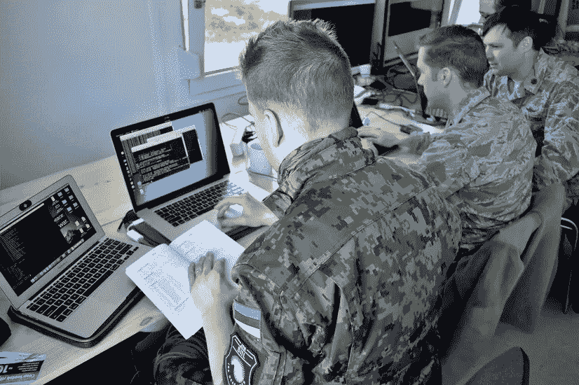
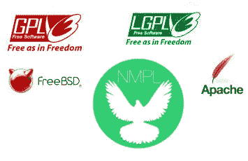

# 在军队从事网络安全工作前应该知道的事情。

> 原文：<https://medium.com/hackernoon/what-you-should-know-before-working-in-cybersecurity-in-the-military-569352f39635>

Photo by [rawpixel](https://unsplash.com/photos/JVybIQTS6YQ?utm_source=unsplash&utm_medium=referral&utm_content=creditCopyText) on [Unsplash](https://unsplash.com/search/photos/weapon?utm_source=unsplash&utm_medium=referral&utm_content=creditCopyText)

> 听说你现在在兵器行业工作？你晚上睡得怎么样？

这句话是几年前一个朋友的爸爸写给我的，当时他的女儿正在离他 20 米远的房间里尝试每一种可能的药物，慢慢地试图自杀。令我惊讶的是，这位父亲关心我的伦理道德比关心他女儿的生命更重要，这实际上是我第一次认真地将开发中的伦理道德作为我作为开发人员的 T2 职责的一部分。

2012 年毕业后，我开始在一家开发武器(网络、电子和常规武器)的法国跨国公司的服务部门工作。在网络和系统安全部门工作时，我最初是一名软件工程师，主要为银行和保险公司设计和开发应用程序，除了一个老问题:“我应该告诉经理这个用户一直在用公司的设备观看成人内容吗？”之外，我从未遇到过任何道德难题。很好。我能处理。我打算保持这种方式。毕竟，我选择这家公司作为第一份工作的唯一原因是因为**工资真的很好**而且**每个人都想在那里工作**。不管怎样，我对未来有其他的计划，只是想尽可能多学点东西，并在经济上宽裕些，以便以后自己开始做些事情。

这家公司的主要客户是**国家** [**军事**](https://hackernoon.com/tagged/military) (或者国防，看你怎么看了)虽然我的工作一开始和其他软件工程师一样，但我必须说**我在随机的社交聚会中利用了它**

> 我为军方工作，是一名工程师，我的大部分项目都是机密，所以如果我告诉你，我会杀了你。

这是一个很好的谈话开始！比“我是一名软件工程师”好得多，那时在我的城市，人们对“我是一名软件工程师”的欢迎通常充其量只是礼貌地“叹口气”，最糟糕的是翻个白眼，然后说“哦，原来你是个书呆子”。

但在内心深处，我会告诉自己，为了应对这种小小的负罪感。

> 没关系，你只开发网络应用程序，它不会杀死任何人

这是真的，尽管我的表单和按钮非常好，但它们不可能被以任何致命的方式使用。

# 为国防部工作

渴望**学习**，日以继夜**工作**我得到了同事们的好评，我爬上了公司的阶梯。渐渐地，我接到了更有趣的任务，更接近他们的核心业务之一:**网络安全**。

Maryland Guard cyber warfare operators from the 175th Wing’s Cyber Operations Group

为网络安全部门工作比我以前做过的任何事情都要酷。我在一个研究实验室工作，我们可以自由创新，花尽可能多的时间去尝试最新的技术和建造原型。最终，我们开发了一个结合尖端网络技术的内部框架，用于在欧洲防务展上展示最新的网络防御创新。

这些原型从一个简单的工具到实时可视化复杂网络中的漏洞，再到一个完整的防空控制应用，你可以实时看到雷达的覆盖范围，并从网络的角度可视化你对这些数据的信任。

我再次被问及我是否在开发武器

> 不，我只开发威胁检测的可视化工具，而且这些只是原型。

我被提升为**网络软件技术**的**专家**，自从我**离开公司**开始自己的事业后，我就再也没有进一步发展。但我确信，随着我在公司的发展，我会在**更敏感的项目**中结束，或者实际实现我正在原型制作的**真实系统**。我的问题是:**作为一名开发者，你的责任从何开始**？

# 尽管你是军人

Photo by [Hello I’m Nik](https://unsplash.com/photos/8yCmQODY2SY?utm_source=unsplash&utm_medium=referral&utm_content=creditCopyText) on [Unsplash](https://unsplash.com/search/photos/rocket?utm_source=unsplash&utm_medium=referral&utm_content=creditCopyText)

很少有人知道，但最新的导弹可以与超级跑车相提并论。它们每台**花费数百万**(感谢上帝)，有**自动导航**，车载一台**电脑**，最新的高清**摄像头**，几十个**传感器**，并使用尖端技术。大多数时候，这些传感器和技术并不主要是为军事用途而设计的，发明它们的人甚至不知道它们是如何被使用的。**设计和组装**这些导弹可能只需要**几个** **人**，但事实上，如果**超过 1000 人**从事嵌入式技术工作，将允许目标探测、导弹发射、制导和影响优化，我不会感到惊讶。实际上，如果你正在为一个广泛使用的开源软件或库做贡献，你的代码行可能已经在那里了。在我的例子中，也许我已经原型化的一个库将在一个空气监测系统中重用，该系统将允许威胁检测并自动触发反击。当然，我在军队工作，所以即使我以前从未这样想过，当我签署合同时，我同意出于任何目的重用我的代码，但对于我们大多数开源社区的人来说，情况并非如此。

Most popular open sources licenses and NMPL license concept : Non Military Public License

离开公司后，我应对这种情况的方法是问自己“**我创造的东西会被用来做坏事吗？**“但我很快意识到，你做的几乎所有事情都可以用坏的方式 ( [你毕竟可以用椒盐卷饼杀人](http://articles.latimes.com/2002/jan/14/news/mn-22490))，而且**更大** **影响**你的贡献有**更大** **危险**它就是。因此，由于缺乏更好的解决方案，我只是将自己局限于我的工作可能产生的直接影响。

所以我在想，我们能不能开始一个新的**许可证**，允许**打开** **来源**和**禁止军方**的重复使用？“非军用公共许可证”之类的。而且现实中能被**控制**吗？