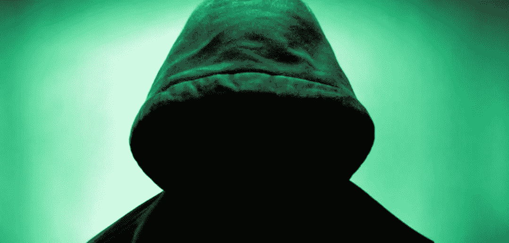
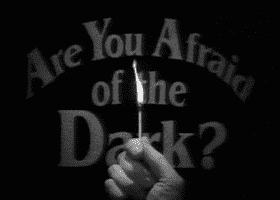
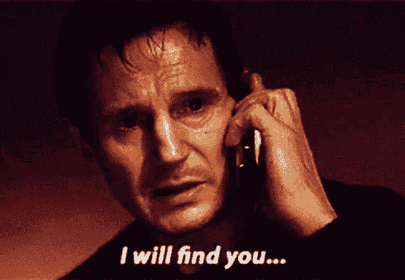

# 关于黑暗社交，你的营销团队需要知道什么

> 原文：<https://medium.com/hackernoon/what-your-marketing-team-needs-to-know-about-dark-social-686bd56fa179>

黑暗社交并不像听起来那么可怕，但你还是应该关注它。如果你以前从未听说过这个术语，黑暗社交指的是通过私人渠道进行的社交分享，你的网站分析工具无法跟踪这种社交分享。

这个术语是《大西洋月刊》前副主编亚历克斯·马德里加尔在 2012 年创造的。现在，许多市场研究人员认为，暗社交占到了对外分享的 84 %( T3)。

那么这对你的网站分析意味着什么呢？

你可能已经注意到大量的网站流量来自“直接”来源。但是人们不太可能只是在浏览器中输入你网站的链接。这些访问者中的大多数可能来自通过黑暗社交分享的链接。

# 互联网用户如何通过黑暗社交分享内容

黑暗社交分享最常见的是通过直接消息传递，当有人复制页面的 URL 发送给朋友时，而不是使用社交分享按钮。

最常见的黑暗社交分享平台有:

*   **电子邮件** —电子邮件推荐人不会被共享，以保护用户的隐私
*   **直接消息应用** — Whatsapp、iMessage、Twitter、Instagram Direct Message 和 Facebook Messenger
*   **安全浏览** —如果您从 https 点击到 http URL，您的分析将不会选择推荐
*   **原生移动应用** —脸书、Instagram 等

仔细想想，暗社交是互联网用户分享内容最常见的方式也就不足为奇了。当你读到一篇你认为你的朋友会喜欢的文章时，你可能习惯于复制并粘贴链接到电子邮件或文本中，然后发送给他们。

老一代人尤其可能通过黑暗社交分享内容，46%的婴儿潮一代人专门使用黑暗社交分享内容。

然而，这种形式的分享妨碍了营销人员追踪访问者来源的能力，这使得网站流量统计对营销团队的分析更具挑战性。

如果你的营销是数据驱动的，丢失 84%的来源可能意味着你把精力放在了错误的地方。

# 那么你如何追踪黑暗社会呢？

有几种方法可以绕过监测你的直接流量的挑战，尽管大多数分析工具还没有强大到足以捕捉所有这些信息。

即使对于最有经验的数字营销人员来说，跟踪黑暗社交仍然是一个谜，但实施这些技巧可以帮助你发现更多直接访问的来源。

# 1.提供更复杂的分享按钮

许多网站将分享按钮放在帖子的底部，或者不清楚该按钮是用于分享还是关注。更新您的共享按钮，使点击它们变得容易并对您的读者有吸引力。

如果点击一个按钮会节省他们的时间，让分享更简单，那么他们更有可能使用你的按钮，你可以跟踪这些分享。

# 2.在你的社交媒体分享中使用 UTM 链接和缩短链接

不幸的是，许多人在阅读完一篇文章后仍然直接从他们的搜索栏复制链接，这意味着分享再次发生在黑暗的社交上。通过使用 UTM 链接，你可以为你所有的帖子提供唯一的网址，帮助你了解你的吸引力来自哪里。如果有人直接从你的帖子中复制 UTM 链接，或者私下分享你的帖子，你仍然会知道他们来自哪里。

虽然 UTM 链接并不能完全解决问题，但是在你的邮件和帖子中使用可追踪的链接可以减少你对采购的疑问。更多关于如何使用 UTM 链接的信息请点击[这里](https://blog.kissmetrics.com/how-to-use-utm-parameters/)。

# 3.采用黑暗社交追踪应用

这三个在线工具也可以帮助你追踪黑暗社交分享:

[**Get Social.io**](https://getsocial.io/) :在你网站的 HTML 中插入一段代码，通过他们的网站关注所有分享——甚至是黑暗社交分享。

[**po . ST**](https://www.po.st/)**:**po . ST 提供社交分享按钮，允许通过暗社交发送(消息、邮件等。)和对签约公司的分析。

[**获取社交**](https://getsocial.io/) :与 Po.st 类似，这个 web 应用允许你包含社交分享按钮，通过黑暗社交渠道发送链接。

黑暗社交对商业没有坏处，但它会扰乱你的营销分析。了解它是如何工作的是至关重要的，这样你就可以开始获得更多的“直接”流量，并分析哪些渠道正在产生独特的访问者。

上述工具可以帮助最小化黑暗社交分享造成的信息差距，尽管迄今为止还没有软件或应用程序强大到足以完全跟踪黑暗社交。然而，如果你能学会发现黑暗社交分享的迹象，那么你就可以更精确地定位你的营销，提高你的社交媒体投资回报率。

[*这个帖子最初出现在 blog.gainapp.com。*](https://blog.gainapp.com)

[*图片来源*](http://www.europeosviajeros.com/wp-content/uploads/2017/11/instagram-shadowban-by-Globb-Security.jpg)