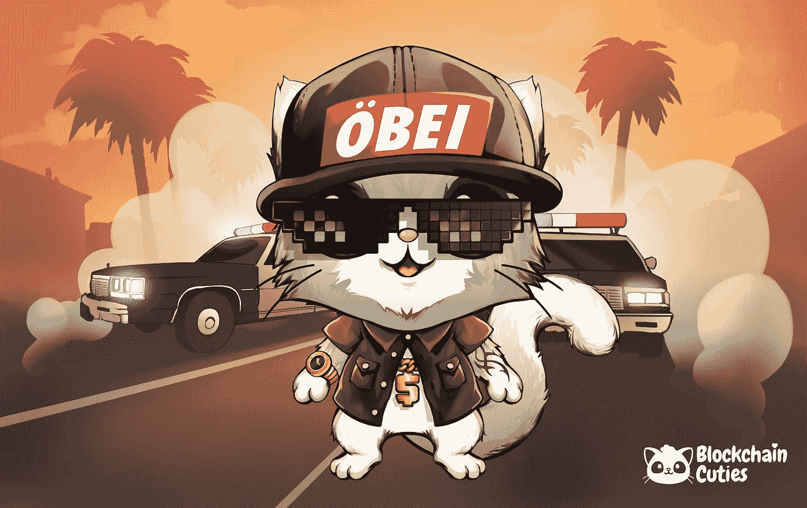

# ERC20 钱包之后的 EOS 生活是怎样的？我们能相信游戏里的钱包吗？

> 原文：<https://medium.com/hackernoon/whats-eos-life-like-after-erc20-wallets-in-game-wallets-we-trust-77d277fcaf3a>

2018 年 6 月，EOS 向世界推出了全新的区块链架构，旨在实现分散化应用的垂直和水平扩展。该软件在多个 CPU 内核或集群之间同步帐户、身份验证、数据库、异步通信和应用程序调度。由此产生的技术是一种区块链架构，它有可能扩展到每秒数百万次交易，消除用户费用，并允许快速轻松地部署分散的应用程序。这种共识机制有 21 个区块生产商，而不是工作证明模型中使用的大量矿工。由于验证机制的困难，还没有人如此接近优化加密货币中的传统费用模型和链外令牌的概念。除了 EOS 没人。

# 下一代的区块链

公平地指出，在上述变化发生之前，EOS 曾经是以太坊区块链的一部分。因此，当标志性的 EOS 软件推出时，作为以太坊区块链的一部分，对 ERC20 钱包的需求消失了。从那一刻起，EOS 就有了自己的一套钱包，和 EOS 本身一样令人印象深刻，一样具有革命性。

在体验 EOS 钱包之前，你必须有一个 EOS 账户。要创建一个 EOS 帐户，必须使用预先存在的 EOS 帐户。听起来很困惑？请容忍我们。EOS 帐户是存储在区块链上的 12 个字符长的可读名称。要获得帐户，您可以使用网络上众多第三方应用程序和服务之一。但是要小心。负责任地选择你的客户服务商，并在与他们做生意之前对他们进行调查。我们总是建议在你同意与一家公司做任何事情之前，通过电报与他们联系，以确保他们是合法的。

# 下一代的钱包。

区块链 Cuties 发布了第一个 EOS 游戏内钱包，它具有最好的 EOS 钱包的功能和能力，然后是一些。区块链 Cuties 的游戏内钱包为玩家开放了 EOS 区块链，并将游戏内钱包的易用性带给了大众。再加上开发者一直在提升整体游戏体验。

区块链 Cuties 是第一个同时支持 2 个区块链的加密收藏游戏——以太坊和 EOS。它也因强调不同的战斗机制而闻名。玩家可以培育独特的区块链宠物，如小狗、蜥蜴、小熊、猫和其他真实和幻想的生物。每个小可爱都有一个独特的基因组，它基本上是人类 DNA 的类似物。在繁殖时，人工智能负责提出不同基因的特殊组合，以创建头发、胡子和眼睛颜色等属性。这些特征将直接影响到玩家在战斗中测试他们的技能或者把他们放到市场上出售的时候。

# 5 个原因

1.  两分钟内创建一个 EOS 帐户。只需 5 美元就可以完成(这是最便宜的了)。EOS 的交易速度是传说中的快。这使得游戏体验流畅愉快，不会对用户的时间造成不必要的限制。EOS 区块链在游戏中的实现意味着繁殖、购买、出售和发送冒险物品的过程持续发生。区块链 Cuties 是加密游戏领域最活跃的社区之一，最近在 DappRadar 的区块链游戏评级中排名第二。他们已经证明了他们的可信度，现在轮到你在他们的名字旁边打勾了。
2.  EOS 钱包允许玩家登录游戏，为此他们需要输入他们的私钥。值得一提的是，私钥存储在本地，因此玩家不必担心安全性。
3.  为了增加游戏中的余额，资金可以通过像 BestRate 这样的交易平台直接转移到游戏中的钱包。
4.  该游戏通过始终与其玩家交流并在游戏中实施他们的建议来实践社区驱动的开发。通过参与，你不仅可以加入 EOS 区块链社区，你还有机会为游戏本身的改进做出贡献。
5.  对于那些需要时间来适应全新事物的人来说，未来将会有更多的 EOS 钱包在像 Scatter 这样的区块链中实现。Scatter 是一个兼容的桌面钱包，它还带有 chrome 扩展。加密总是有选择的。

# 游戏内钱包的力量。

安全和透明的原则构成了 EOS 区块链哲学的支柱，是区块链的核心，游戏中的钱包也遵循这些原则。游戏中的钱包可以在桌面和移动设备上使用，也可以在所有浏览器和操作系统上使用。区块链 Cuties 是为增长而设计的，因此对玩家可以执行的交易数量没有限制。EOS 游戏钱包的存在是为了消除摩擦，促进这种增长。

# 还能期待什么

在可预见的未来，区块链 Cuties 的游戏内钱包将实现种子短语(有时称为“助记短语”)。这意味着游戏中的钱包软件通常会生成一个种子短语，并指示玩家将其写在纸上。如果玩家的电脑坏了或者他们的硬盘损坏了，他们可以再次下载同样的钱包软件，并使用他们的纸质备份来取回他们的 EOS 钱包。

区块链 Cuties 的 EOS 钱包已经完全集成了 EOS 中可用的功能。IO 软件。很快，这款钱包将超越游戏范畴，与任何其他熟悉的 EOS 钱包展开竞争。