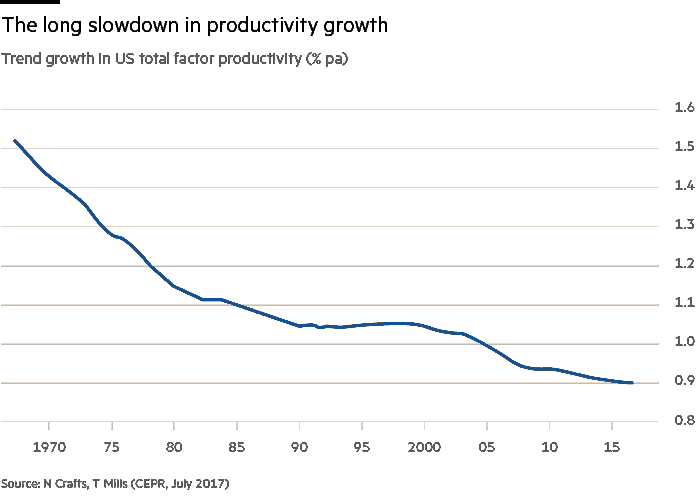

# 什么让敏捷下降了？

> 原文：<https://medium.com/hackernoon/whats-getting-agile-down-7b0983b8027e>

## 生产率难题

Photo by [Uillian Vargas](https://unsplash.com/photos/7oJpVR1inGk?utm_source=unsplash&utm_medium=referral&utm_content=creditCopyText) on [Unsplash](https://unsplash.com/search/photos/fast?utm_source=unsplash&utm_medium=referral&utm_content=creditCopyText)

全球生产率强劲增长的条件已经成熟，而且已经成熟了一段时间。

首先，Scrum 和敏捷方法已经伴随我们 20 年了，正如 [Jeff Sutherland](https://medium.com/u/1612936bed4e?source=post_page-----7b0983b8027e--------------------------------) 在 *Scrum 中所写的，用一半的时间做两倍的工作的艺术*，在团队和组织中释放巨大的生产力增长。

> 工作出色的 Scrum 团队能够达到我们所说的“高生产率”。很难相信，但是我们经常看到在很好地实施 Scrum 的团队中，生产力提高了 300%到 400%。最好的团队可以实现高达 800%的生产率增长，并一次又一次地复制这种成功。他们的工作质量也提高了一倍以上。

第二，软件无孔不入。软件触及一切事物。在全球范围内，组织和行业正在快速变得“数字化”。虽然[马克·安德森](https://medium.com/u/fa65e64cf273?source=post_page-----7b0983b8027e--------------------------------)不是从 2011 年开始写[为什么软件正在吞噬世界](https://www.wsj.com/articles/SB10001424053111903480904576512250915629460)，两年前的技术危机提醒我们[软件仍在吞噬世界](https://techcrunch.com/2016/06/07/software-is-eating-the-world-5-years-later/)，但我们几乎可以看到我们生活在一个软件主宰的世界。

> 如今，“每个公司都需要成为软件公司”的观点几乎被认为是老生常谈。无论你从事什么行业，你都应该重新规划自己的业务，以确保自己不会成为下一个被优步(Alibaba)或 Airbnb 弄得措手不及的本地出租车公司或连锁酒店。

因此，在一个以软件为中心的世界里，有了一种成熟的技术，可以将交付软件的生产率提高 4 到 8 倍，全球经济的潜力是不可思议的。我们应该为生产率数据而欣喜若狂——但事实并非如此。

真正发生的事情是完全不同的。

> 你可以在任何地方看到计算机时代，除了在生产力统计中。

这可能是今天写的，但这是美国经济学家、现代增长理论创始人罗伯特·索洛 1987 年的一句话。

《金融时报》在他们的文章 [*中对此进行了评论，他们用来说明这一点的图表发人深省。*](https://www.ft.com/content/8bea636a-6d78-11e8-852d-d8b934ff5ffa)

[The long wait for a productivity resurgence, Financial Times](https://www.ft.com/content/8bea636a-6d78-11e8-852d-d8b934ff5ffa)

在一个以软件为基础的世界里，20 年的现代实践比以往任何时候都更快更有效地交付软件，生产力却下降了。

那么到底哪里出了问题？

**定理 1——敏捷可以交付成果，但受到另类采用的阻碍——罪魁祸首:领导力**

我们知道采用敏捷实践有助于团队加速并获得动力——我们亲眼目睹了这一点。团队检查是否有改进和做得更好的方法，并检查什么可能阻止他们这样做——在“检查和适应”周期中，在正确的团队中应用纪律，可以释放速度和交付价值。

除此之外，虽然敏捷实践通常集中在软件开发团队上，但如今 DevOps 扩展了这个领域，将运营和支持环境纳入其中，进一步减少交付价值的滞后和返工，并缩短交付周期。

如果这些实践越来越普遍，随着软件本身越来越普遍，全世界的人均生产率和产量都会上升。敏捷不是问题，但敏捷的领导力才是问题。

领导敏捷需要领导者具备不同的技能。它需要不同的领导者。

世界变化很快，过去“命令和控制”的旧世界是可以接受的——*离开去做这件事，完成后回来告诉我*——从一个需要更密切支持(或者对某些人来说需要审查和微观管理)的团队转变为一个可以照顾自己的团队，这让许多人措手不及。敏捷团队需要做到这一点，敏捷。开销可以减少，我们需要一种新型的领导者来代替经理和微观经理。仆人型领导懂得如何授权给团队，具有服务的心态，并能释放团队的潜力，了解流程、质量、价值和团队福祉之间的最佳平衡点。

在广泛的组织和团队中，一种倾斜的敏捷正在被实施并强加给团队。团队被告知采用其他人的框架和方法。经理们没有经过培训，不接受培训，结果是犯了错误，形成了一个障碍点，阻碍了潜在的生产率提高。

**定理 2** — **敏捷得到了很好的领导，并且交付了左、右、中，但是生产力的提高被更大的宏观经济因素所掩盖**

与上面相反，敏捷大体上被很好地领导着。敏捷采用是普遍的，并且符合首要原则。第 12 次年度敏捷状态报告描绘了一幅相当积极的画面，尽管我很难找到组织开始和结束的真实指标。

但是，在宏观经济层面上，有更大的事情在起作用，掩盖了我们在全球软件团队中看到的所有这些四倍和八倍的改进。

其他因素，如竞争减弱、资产泡沫和经济危机、保护主义和贸易战，可能掩盖了幕后的收益。更糟糕的是，正如英国《金融时报》所写，“现代的技术创新可能根本不像它们所宣称的那样，特别是与 19 世纪末和 20 世纪初的一系列变革性创新相比:清洁水、电力、内燃机、动力飞行、石油和化学品。”或者，我们正处于暴风雨前的宁静，人工智能等技术将释放出前所未有的突破性生产力。

不管怎样，这都是一个有趣的想法。与以前相比，我们的创新和技术突破如何？我们是否有合适的领导和实践来以最好的方式实现这些突破？

软件无处不在。敏捷帮助我们更快地交付它。但全球生产率滞后。那么是什么原因呢？

如果你有敏捷带来突破性生产力增长的方法和证据，我很想听听。或者，如果你有失败的例子，听听你对失败原因、领导力或其他方面的想法会很有意思。

或者也可能情况很乐观，我们即将起飞。

Photo by [Nicolas Gras](https://unsplash.com/photos/s680F2335KI?utm_source=unsplash&utm_medium=referral&utm_content=creditCopyText) on [Unsplash](https://unsplash.com/search/photos/rocket-launch?utm_source=unsplash&utm_medium=referral&utm_content=creditCopyText)

一篇受哈维·内夫启发并与其共同撰写的文章。

加里·沃茨和哈维·尼夫

如果你喜欢这篇文章，请分享并点击👏👏 👏。