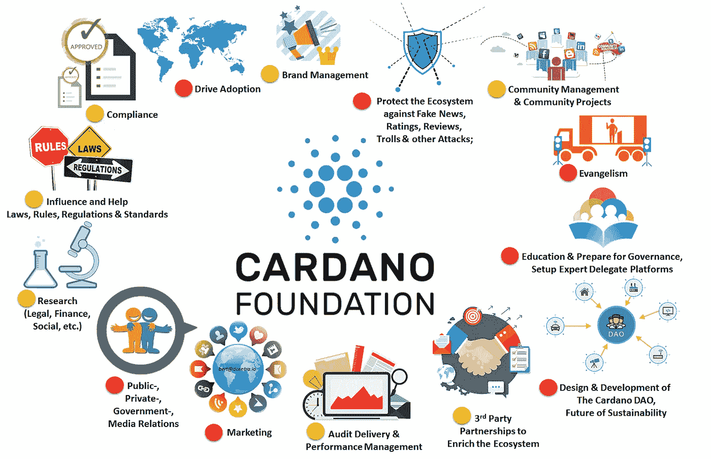
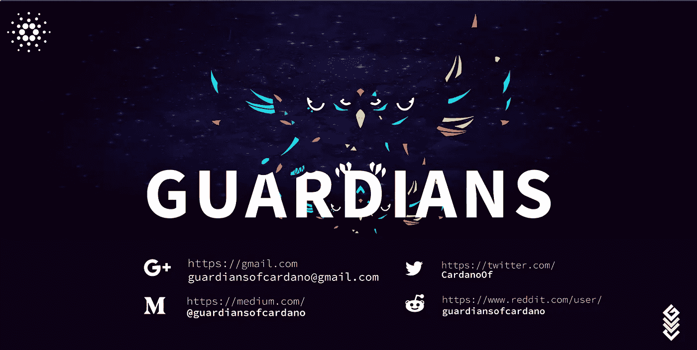

# 卡尔达诺怎么了？

> 原文：<https://medium.com/hackernoon/whats-going-on-with-cardano-3f2996841b21>

> Cardano 是一个雄心勃勃的项目，它使用学术方法来建立一个可扩展、可互操作和可持续的加密货币和智能合约平台，目标是成为发展中国家并最终成为全世界的金融基础设施。关于卡尔达诺的新闻通常是关于学术出版物或正在建设的技术创新的教育。然而，在过去的几周里，这种论调已经发生了变化，尤其是卡尔达诺基金会的主席受到了抨击。这篇长篇大论旨在告诉你最近发生的事件以及对卡尔达诺未来的影响。

# 重要的事情先来

在我们深入了解发生了什么之前，让我们先解决一些基本问题。Cardano 是该生态系统的名称，其主要特征是加密货币(ADA)和智能合约平台。Cardano 自 2017 年 9 月以来一直在运行自己的 mainnet，但仍在进行中，其路线图将贯穿 2020 年。路线图完成后，Cardano 将成为一个自主的基础设施层，通过一个流动的链上民主进行管理，利益相关者决定系统的未来方向。在那之前，卡尔达诺由三个实体组成“联盟”。

[输入输出香港(IOHK)](https://iohk.io) ，由首席执行官 [Charles Hoskinson](https://twitter.com/IOHK_Charles) 领导，是建造 Cardano 的工程公司。由首席执行官[肯·儿玉](https://twitter.com/Emurgo_Ken)领导的 Emurgo ，是一家希望通过商业投资来促进 Cardano 生态系统的公司。最后， [Cardano 基金会](https://cardanofoundation.org/en/)，由董事长 [Michael Parsons](https://twitter.com/BitcoinByte) 领导，是一个非营利组织，其使命包括推动 Cardano 的采用、发展社区和促进合作伙伴关系。到目前为止，这些实体一直在一起工作，各司其职。

…或者他们有吗？

# 地基上的裂缝

卡尔达诺基金会的作用之一是监督卡尔达诺的发展。为此，[它已经聘请了 FP Complete 公司](https://www.cardano.org/en/cardano-audit-reports/)来审计 Cardano 的代码库，[估计每年要花费 60 万美元](https://www.guardiansofcardano.com/download.php?=An_Open_Letter_to_the_Chairman.pdf)。

9 月 13 日，FP Complete 在论坛上发布了一份关于 Cardano 的 Haskell 库[的新审计报告。该报告中有相当多的黄色和红色，引起了社区成员的关注。9 月 14 日，卡尔达诺基金会发表了一份声明，其中他们基本上将矛头指向了 IOHK，称他们从未对第一次审计做出回应。9 月 17 日，IOHK 首席执行官查尔斯·霍金森(Charles Hoskinson)在一段视频信息中向公众解释了他对此的立场。](https://forum.cardano.org/t/13-09-18-haskell-cborg-dependency-report/15927)

Charles Hoskinson’s reaction to the audit report (starting 4:52 min)

在他的邮件中，Hoskinson 解释说，经过审计的代码库只是一个概念验证，实际上是由另一家公司开发的，从未打算用作长期代码。在他看来，审计报告没有什么价值，花社区的钱在上面是值得怀疑的。IOHK 已经使用他们自己的方法开发了两个代码库，包括正式的验证，并想知道为什么这些没有被审计。

Hoskinson 接着说，如果有必要，IOHK 将“超越需要做的事情”*。IOHK 将创建更多的视频内容，已经聘请了一名产品营销人员，并正在聘请社区经理来完成这项工作。*

显然，卡尔达诺基金会不仅在一份无用的审计报告上花费了数百万美元的社区资金，而且 IOHK 还雇佣了员工来完成卡尔达诺基金会负责的任务。Hoskinson 在视频中沮丧的语气和他明显想要向社区保证必要的工作将会完成的强烈愿望也很有说服力。

这到底是怎么回事？

# 在卡尔达诺论坛上闲逛

卡尔达诺有一个[官方论坛](https://forum.cardano.org)，由卡尔达诺基金会在社区成员的帮助下主持。使用的[话语](https://www.discourse.org)软件允许用户在达到更高等级时获得徽章或特权，例如通过频繁登录、阅读、写作和喜欢帖子。在 Cardano 论坛上，达到 3 级的用户可以看到一个名为“休息室”的新的子论坛。虽然它的内容不对公众开放，但任何人都可以访问它。一些用户对拥有私人休息室的必要性提出质疑，但 Cardano 基金会选择了这种方式，以允许更活跃的社区相互交流。

9 月 15 日，一位社区成员在休息室发布了一条名为*[*的消息，我担心卡达诺基金会与 IOHK*](https://forum.cardano.org/t/i-am-concerned-over-friction-between-the-cardano-foundation-and-iohk/)*之间的摩擦。最初的评论很笼统，但似乎触动了社区的神经。来自其他忧心忡忡的成员的消息堆积如山，在[卡尔达诺官方电报频道](https://t.me/CardanoGeneral)上的讨论更是火上浇油。**

**除了审计争议之外，提到的问题包括:**

*   **IOHK 非常积极地在非洲国家推广 Cardano。这似乎是卡尔达诺基金会的责任；为什么他们似乎与此事无关？**
*   **卡尔达诺基金会主席迈克尔·帕森斯在公共场合几乎不露面，似乎也没有为卡尔达诺做什么宣传。为什么他不像他的功能所要求的那样，更加引人注目和活跃呢？**
*   **缺乏透明度(例如外部审计甚至沟通)以及 Cardano 基金会发展生态系统的计划明显缺乏雄心。**
*   **卡尔达诺基金会承诺提供的卡尔达诺借记卡和自动取款机缺乏进展和/或更新。**
*   **缺少关于大使模式的新闻，该模式旨在描述如何在 ADA 中使用由基金会控制的基金奖励积极帮助 Cardano 生态系统进步的社区成员。**
*   **基金会存储 ADA 的地址从来没有公开过，不像 IOHK [一直对此保持透明。](https://adatracker.com/address/DdzFFzCqrht2WKNEFqHvMSumSQpcnMxcYLNNBXPYXyHpRk9M7PqVjZ5ysYzutnruNubzXak2NxT8UWTFQNzc77uzjQ1GtehBRBdAv7xb)**
*   **根据该基金会的[网站](https://cardanofoundation.org/en/team/)显示，帕斯卡尔·施密德是唯一的卡尔达诺基金会理事会成员。为什么没有更多的安理会成员？**

**尽管所有(30)个担忧和问题[都由一名社区成员](https://forum.cardano.org/t/i-am-concerned-over-friction-between-the-cardano-foundation-and-iohk/15995/67)详尽地写了出来，似乎获得了广泛的支持，但基金会选择不在实际论坛或书面消息中做出回应。9 月 18 日，他们举行了一场名为的[休息室聚会，人们可以加入谷歌的一个聊天室，就此事获得一些解释。据参加会议的机构群体成员称，主席 Michael Parsons 没有参加会议，而且没有任何问题或顾虑得到实际解决，](https://forum.cardano.org/t/i-am-concerned-over-friction-between-the-cardano-foundation-and-iohk/15995/72)[让机构群体成员感到沮丧](https://forum.cardano.org/t/i-am-concerned-over-friction-between-the-cardano-foundation-and-iohk/15995/88)。**

**这些成员开始思考下一步该做什么，并开始总结他们的关注点，以解释这种情况，并将讨论扩大到公众论坛。例如，在休息室里出现了一个[视觉表示](https://forum.cardano.org/t/expected-roles-responsibilities-of-the-cardano-foundation/16280)，表示卡尔达诺基金会根据他们[自我描述的目标](https://www.youtube.com/watch?v=_f9vIJ6WM7c)在过去一年中的表现程度。**

****

**Visual representation of the degree to which the Cardano Foundation has performed [regarding their self-described goals](https://www.youtube.com/watch?v=_f9vIJ6WM7c) over the past year, [according to one community member](https://forum.cardano.org/t/expected-roles-responsibilities-of-the-cardano-foundation/16280)**

**到 9 月 23 日，一些对缺乏透明度和沟通的不满转移到了 Twitter 上。尤其是卡尔达诺基金会主席迈克尔·帕森斯获得了很多提名。为什么他的用户名是' [@BitcoinByte](https://twitter.com/BitcoinByte) '，他的个人资料有比特币标志吗，他似乎很少发关于 Cardano 的微博？还是没有回应。**

**然后，卡尔达诺基金会取消了 10 月 6 日在伦敦举行的聚会活动。这一点，再加上 Cardano Foundation 仍然没有分享他们的 ADA 地址，尽管[表示他们预计在“九月底”这样做](https://forum.cardano.org/t/14-09-18-statement-from-cardano-foundation/15969/1)，进一步加剧了社区内的怀疑。不管是不是有意的，基金会似乎试图停止与社区的交流，混淆某些信息，希望如果他们以震耳欲聋的沉默对待讨论，讨论将会逐渐消失。**

**所以…不好，对吧？有人需要站出来。**

**Chris Pratt stepping up in Guardians of the Galaxy**

# **卡尔达诺的守护者**

**10 月 9 日，一篇名为*[*关于卡达诺基金会*](https://forum.cardano.org/t/special-announcement-on-the-investigation-of-the-cardano-foundation/16822)*的特别公告出现在卡达诺的公众论坛上。帖子是由一个名为“卡尔达诺守护者”的账户写的，并描述了在 3 天的时间内，他们关于卡尔达诺基金会问题的第一批调查结果将会公布。[添加了一个到他们网站](http://www.guardiansofcardano.com/)的链接，其中包含一个倒计时定时器，到 [Twitter](https://twitter.com/CardanoOf) 、 [Medium](/@guardiansofcardano) 和 [Reddit](https://www.reddit.com/user/guardiansofcardano) 的链接，以及[一个电子邮件地址](mailto:guardiansofcardano@gmail.com)。****

******

***The Guardians of Cardano***

***那么这些“卡尔达诺的守护者”是谁，为什么包括一个计时器，而不只是立即公布结果，这到底是怎么回事？***

***正如承诺的那样，10 月 12 日星期五，卡尔达诺的守护者发布了一封给卡尔达诺基金会主席迈克尔·帕森斯的公开信。这封信由 9 名 Cardano 社区成员以他们的全名签名，并以基金会没有回应他们的沟通尝试(因此有了倒计时定时器)为开头，让他们别无选择，只能写一封公开信。他们接着描述了他们对卡尔达诺基金会的表现、缺乏沟通和整体透明度的失望。***

***[的公开信](https://www.guardiansofcardano.com/download.php?=An_Open_Letter_to_the_Chairman.pdf)继续提供了另外 15 页他们对卡尔达诺基金会的调查结果。主要调查结果包括:***

## ***1.关于为卡尔达诺基金会的关键职位任命合适人选的问题***

*   ***布鲁斯·米利根(根据霍斯金森的说法，他是帕森的继子[)和约翰·迈克尔·马奎尔(帕森的长期商业伙伴)是基金会的创始成员，这可能是有偏见的决策甚至是裙带关系的迹象。](https://youtu.be/brmocm3ttQo?t=202)***
*   ***罗伯特(鲍勃)麦克多沃尔(伦敦智库机构 Z/Yen 的成员)被聘为特别顾问，据推测帕森斯在基金会成立前就与他有密切联系。尚不清楚他在基金会中的具体角色。***

## ***2.对资金的适当使用的关注***

*   ***在 2017 年 10 月 14 日 Parsons 的[主题演讲中，他宣布了分布式期货开源区块链研究计划，该计划将花费数百万美元。公开信指出，这些论文不是 Cardano 特定的，有些肤浅，几乎没有公开分享，它们对 Cardano 生态系统的价值主张仍不清楚。所有论文均由 Z/Yen 智库发表，部分(8 篇中有 3 篇)由罗伯特·麦克多沃尔合著，他当时也是该基金会的特别顾问。Z/Yen 的创始人之一是迈克尔·麦内利(Michael Mainelli)，帕森斯称他为“一位老朋友”。因此，公开信质疑雇佣 Z/Yen 是否存在利益冲突。](https://youtu.be/_f9vIJ6WM7c)***
*   ***关于 FP 完整审计的情况在前面已经描述过了。监护人质疑继续审计的选择，知道他们的结果事先不会有用。***
*   ***卡尔达诺基金会控制着 ICO 基金的一部分，打算用于社区发展。然而，卡尔达诺基金会只雇佣了五名员工来管理社交渠道，而依靠 IOHK 的志愿者和演讲者来组织聚会。***
*   ***以下方面缺乏透明度:(1)基金会当前的金融资产，(2)基金会的支出计划，(3)他们持有这些资产的地址。监护人假定[这个](https://adatracker.com/address/DdzFFzCqrhsrLwwP94HsJenSAauqK8VXE2HDGTZPBHwHVFrqmiPAQjjFjxDyNibJvbqH7vFndYKwZFQdAzdcS9DHH3CGaZsjm8f9SxSV) ADA 地址(创建于 2017 年 9 月 28 日)拥有大约 6 . 48 亿 ADA 是基金会的地址。奇怪的是，2018 年 6 月 27 日所有的 ADA 都搬到了[这个](https://adatracker.com/address/DdzFFzCqrhsgwQmeWNBTsG8VjYunBLK9GNR93GSLTGj1FeMm8kFoby2cTHxEHBEraHQXmgTtFGz7fThjDRNNvwzcaw6fQdkYySBneRas)地址，提出了为什么要搬，这个地址对应的私钥归谁所有的问题。***

## ***3.对帕森斯作为主席领导卡尔达诺基金会的动机、能力、效率、健康和议程的关注***

*   ***Parsons 似乎根本没有与社区互动，因此也限制了他对社区的透明度和责任。***
*   ***除了 2018 年 1 月 18 日在英国广播公司短暂露面外，帕森斯没有在任何媒体上露面支持卡尔达诺。***
*   ***帕森斯没有积极反驳假新闻、不准确的评论或任何其他负面反映卡尔达诺的(社交)媒体传播。***
*   ***这封公开信表明，社交媒体账户上的粉丝数量似乎过度夸大了 Cardano 社区成员实际上积极参与的程度。***
*   ***2018 年 9 月，卡尔达诺基金会在其网站上更改了目标的措辞，并删除了某些目标。守护者们想知道这种方向的转变是否应该被传达，也许会导致政策和预算的改变。***
*   ***未能(1)建立并领导一个有能力的组织，(2)发展 Cardano 品牌和形象，并在这方面进行任何营销，(3)交付承诺的 Cardano 借记卡和分类账钱包路线图项目，并通过有价值的合作伙伴关系来丰富 Cardano 生态系统，(4)有效地支持 Cardano 的全球采用，(5)为 Cardano[链上治理]的可持续发展时代做好准备，对社区进行 it 教育，并研究即将到来的过渡。***

## ***4.关注基金会决策过程的完整性和合理性***

*   ***明显缺乏自律和应用[瑞士基金会规范](https://www.swissfoundations.ch/sites/default/files/Recommendations.pdf)的任何建议。***
*   ***理想情况下，一个基金会应该由多名 boad 成员组成，但目前该基金会只有一名董事会成员，仅次于 Parsons。***
*   ***因此，帕森斯似乎完全控制了卡尔达诺基金会。瑞士民法(第 83 条)规定*“基金会章程应规定基金会的管理机构及其管理方式。”*公开信要求主席帕森斯公布卡尔达诺基金会的章程。***
*   **没有关于卡达诺基金会绩效的外部审计报告或指标(KPI)。**

**更多细节可以在的信中找到[。这封信还附有](https://www.guardiansofcardano.com/download.php?=An_Open_Letter_to_the_Chairman.pdf)[一份请愿书](https://www.change.org/p/cardano-community-lets-liberate-the-cardano-foundation-suspected-to-be-hijacked-paralyzed-by-its-chairman)，要求帕森斯*“与社区以及 IOHK 和 Emurgo 的首席执行官就选举或任命四名无可指责的新成员加入基金会理事会进行协商并达成一致，或者辞职。”截止到本文撰写之时(10 月 22 日)，该请愿书已有超过 3000 人签名。华人社区翻译了公开信，并建立了他们自己的请愿书，也有 500 多人签名。***

**虽然监护人的倡议似乎在卡尔达诺社区内获得了广泛的支持，但一些社区成员确实[质疑监护人的动机](https://forum.cardano.org/t/criticism-and-censorship-or-the-irony-hubris-and-hypocracy-of-the-self-appointed-guardians/16895)。这些顾虑包括这九个监护人都是自封的，在私信渠道对应。**

**这九个人聚集在一个私人频道的封闭群中，因为他们觉得在公共论坛上交谈可能会适得其反，而公共论坛是由他们正在调查的同一个卡尔达诺基金会主持的。[在公开信后发布的视频声明](https://youtu.be/GQ4AnSdwni8)中，监护人邀请社区成员加入他们的倡议，并解释说任何人都可以成为监护人并做出贡献。不同意这种方法的社区成员可以建立自己的计划；这叫去中心化。**

**此外，在目前情况下，上述指控的价值有限，因为守护者在卡尔达诺生态系统中没有正式角色。然而，如果权力的真正转移发生了，对于谁在试图抓住它，肯定会有相当多的怀疑——就像发生这种权力转移的任何情况一样。**

# **意外支持**

**令许多人惊讶的是，卡尔达诺的守护者并不是唯一在 10 月 12 日发布公开信的人，因为 IOHK 和 Emurgo [也几乎同时发布了一封公开信](https://iohk.io/blog/an-open-letter-to-the-cardano-community-from-iohk-and-emurgo/?__hstc=64163184.da5032b0f014deffd266388843fded5d.1537645132336.1540117702819.1540120563900.29&__hssc=64163184.1.1540120563900&__hsfp=2609304355)。与监护人的信不同，IOHK 首席执行官 Charles Hoskinson 和 Emurgo 首席执行官 Ken Kodama 的声明是针对 Cardano 社区的。**

**在信中，IOHK 和 Emurgo 首先描述了他们自己的愿景和工作流程，以及 Cardano 基金会的职责。他们继续描述了与监护人所表达的类似的对基金会表现的不满，包括缺乏(1)理事会的战略眼光，(2)关于如何使用其资金造福社区的明确公共计划，(3)基金会运营的透明度，(4)财务透明度，(5)任命一个完整和多元化的理事会，(6)关于承诺给基金会的数百万美元将如何造福社区的任何概念， (7)卡尔达诺基金会的任何有意义的内部管理制度，以及(8)基金会理事会的重大失实陈述和错误声明，包括声称其拥有卡尔达诺商标。**

**虽然[IOHK 和 Emurgo](https://iohk.io/blog/an-open-letter-to-the-cardano-community-from-iohk-and-emurgo/?__hstc=64163184.da5032b0f014deffd266388843fded5d.1537645132336.1540117702819.1540120563900.29&__hssc=64163184.1.1540120563900&__hsfp=2609304355) 的公开信指出了与《卫报》的信类似的担忧，但它增加了两家与基金会密切合作的公司的细节——或者至少是试图这样做的公司。IOHK 和 Emurgo 随后要求基金会理事会自愿接受瑞士当局的全面审计，并向公众公布审计结果。他们还描述说，该基金会是一个独立的法律实体，由其理事会管理，这意味着 IOHK，Emurgo 和 Cardano 社区不能强迫主席辞职，而只能希望理性可以说服他自愿下台。**

**好消息是，在缺乏运作良好的 Cardano 基金会的情况下，IOHK 和 Emurgo 承诺采取多种行动来“填补空白”，即:(1)雇用社区经理，(2)雇用 Cardano 基金会的人员直接参与社区管理，如果他们希望离开基金会，(3)雇用一名开源社区经理，(4)在日本开始努力改善 Cardano 的交流渠道和社区了解，(5)扩大教育和营销工作， (6)扩大研究范围，以包括最初为基金会预见的领域，(7)启动研究议程，以设计一个分散式基金会，作为一个分散式自治组织(DAO)，部署在 Cardano 计算层(CCL)上。**

**当天晚些时候，霍金森的视频信息被添加进来。**

**Charles Hoskinson reflects on the recent chain of events**

**在 Hoskinson 的视频信息中，他解释说，给社区的公开信是他们支持监护人努力的方式，并说*“我们听到你，我们承认你，我们感受你的痛苦”*。他承认，IOHK 和 Emurgo 几乎已经放弃了对当前基金会理事会将使事情变得更好的希望。从更积极的角度来看，Hoskinson 认为社区以这种方式自主发展是非常令人鼓舞的，因为一个积极的，自我思考的社区对于 Cardano 计划中的流动链上民主来说是必不可少的。**

**不幸的是，卡尔达诺基金会还没有公开回应这两封公开信。**

# **对卡尔达诺未来的潜在影响**

**IOHK 首席执行官 Charles Hoskinson [已经多次确认](https://youtu.be/kAMbs57tkQA)IOHK 有充足的资金至少在 2020 年前完成所有计划的开发。[在他的最新声明](https://youtu.be/brmocm3ttQo)中，他补充道，由于比特币的升值，IOHK 和 Emurgo 也有足够的资金来承担额外的角色。因此，无法获得 ICO 基金和 ADA 对 Cardano 基金会的拨款不一定会限制 Cardano 的整体发展。**

**IOHK 和 Emurgo 的公开信还指出，该基金会关于拥有 Cardano 商标的声明是错误的。如果这是正确的，IOHK 和 Emurgo 可以继续按照最初的计划开发技术和品牌，由新雇佣的人员来完成基金会无法完成的任务。**

**分配给卡尔达诺基金会的 ADA(约 6 . 48 亿 ADA)的潜在不可获得性确实有影响。除了这些资金无法按原计划用于社区和生态系统发展之外，它们只占流通供给的 2.5%。这还不足以对系统的安全构成直接威胁(需要超过 50%的股份)，但这一分配将代表所设想的流动链上民主的大量股份，因此可能会影响 Cardano 的未来。**

**虽然金钱上的损失令人痛心，尤其是名誉上的损害可能会给卡尔达诺带来长期后果。即使所有其他负面影响都可以避免，也没有任何理性的理由担心这个系统，品牌声誉也有一种情感的本质。虽然负面联系永远无法完全避免，但在处理挫折时保持透明和积极可能会有所帮助(例如，霍斯金森[出现在受欢迎的 YouTube 频道](https://youtu.be/kAMbs57tkQA)上解释情况[或做一个惊喜 AMA 回答社区问题](https://youtu.be/kmnbzUwlm0s))。**

**几天前，卡尔达诺的推特账户被限制，一些人认为这是一个迹象，表明*[*无论被推的是什么，它都在工作*](https://forum.cardano.org/t/guardiansof-restricted/17095)*。守卫者在这个帖子里回复说*[*他们可以封杀我们的推特账号，但他们不能阻止我们指出帕森斯可耻的沉默。*](https://forum.cardano.org/t/guardiansof-restricted/17095/8) *"* 他们还感谢社区的其他成员团结在一起，并表示他们正在处理更多信息，但只是需要更多时间来以正确的方式做事。*****

**听起来这场舞会还远没有结束。**

**When facing opposition — just dance**

**作者要感谢 Cardano 的监护人提供并核实了本文中使用的信息。**

*****整改(10 月 22 日周一 16:00 UTC)*** *:文章最初称 IOHK 和 Emurgo 都曾公开共享其 ADA 地址，这是不正确的，因为只有 IOHK* [*曾公开共享其地址*](https://adatracker.com/address/DdzFFzCqrht2WKNEFqHvMSumSQpcnMxcYLNNBXPYXyHpRk9M7PqVjZ5ysYzutnruNubzXak2NxT8UWTFQNzc77uzjQ1GtehBRBdAv7xb) *。***

> **喜欢这个故事吗？你可以在[媒体](/@undersearcher)和[推特](https://twitter.com/undersearcher)上关注我。**
> 
> ****免责声明**:本文仅用于信息和教育目的，不应被视为投资建议。**