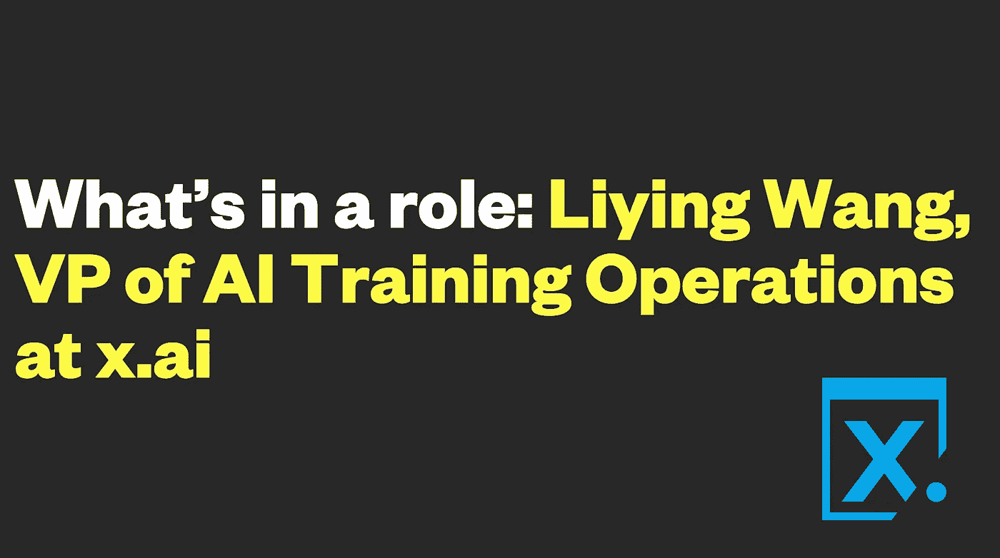

# 角色是什么:x.ai 人工智能培训运营副总裁王丽颖

> 原文：<https://medium.com/hackernoon/whats-in-a-role-liying-wang-vp-of-ai-training-operations-at-x-ai-c713f067b8a2>

作者:[阿曼达·穆雷](https://medium.com/u/ff98da83280d?source=post_page-----c713f067b8a2--------------------------------)

作为 [Lerer Hippeau](https://www.lererhippeau.com/) 公司的高级人才经理，我每天都会与我们的创始人交谈，了解他们的招聘需求和挑战。在这些对话中，我了解到他们需要什么来壮大自己的团队，了解公司结构的来龙去脉，并了解他们的明星和新兴领导者。在这个新系列“角色是什么”中，我将采访在[我们的投资组合](https://www.lererhippeau.com/companies)中担任独特职位的个人，他们负责推动对业务功能至关重要的核心计划。

这个系列的开篇是 x.ai 的人工智能培训副总裁[王丽颖](https://www.linkedin.com/in/liying-iris-wang-65220b6/)。从她如何开始人工智能到她对自动化未来的看法，这里看看她在 [x.ai](https://x.ai/) 的日常工作，最著名的是人工智能调度助理艾米和安德鲁·英格拉姆的创造者。

**阿曼达·穆雷:**你的职业生涯是从哪里开始的，又是如何结束你在 X.ai 目前的角色的？

**王丽颖:**我在帕洛阿尔托长大，所以科技是我身体的一部分。我在康奈尔大学学习存在主义和文学理论，这两者对我看待世界的方式产生了深远的影响，并给了我解决这个语言学问题的工具，这是我工作中最大的挑战之一。我认为人文背景对我今天工作的成功至关重要。

我很早就加入了 Lyft，那时它还是 Zimride，从那以后我就一直在科技领域工作。以积极和颠覆性的方式改变世界的可能性不同于任何其他行业。在 Lyft 之后，我在自己的初创公司尝试了一把，这是一家运动营养的电子商务公司，这是一次令人惊叹的成长经历。

然后我加入了门洛帕克的脸书，在那里我负责各种机器学习产品的人类注释者部分。产品类型的广度和出色的产品和工程合作伙伴让我有机会学习如何评估、优化和扩展数据注释。

我是通过 Crunchbase 通知得知纽约 x.ai 公司的这个职位的。该公司刚刚筹集了 B 轮资金，我认为这是一个超级有趣的机会，我知道我想留在人工智能/机器学习行业。一天之内，我收到了丹尼斯(莫滕森)的来信。剩下的就是历史了！

Mulay: 你的职责是什么？你通常是如何解释的？

**王:**我的工作就是解决未知领域的复杂问题，除此之外我别无选择！我的专业领域是建立、运行和优化我们的人工智能训练团队。这个团队制作的数据注释为我们的机器学习如何理解生产环境中的自然语言提供了输入。

我设计了人工智能训练者用来注释数据的基础设施，创建了注释质量控制、过程、反馈机制和指导方针，以教导人工智能训练者如何实现高质量的数据注释。自然语言是流动的，不断进化的，所有这些组件都需要永久的灵活性和优化。

在高层次上，事情是这样的:如果机器在解析 Amy 或 Andrew 收到的电子邮件时信心不足，我们的系统会向 AI 训练器团队发送数据注释任务。这个数据注释任务然后将反馈到机器的学习中，以便它可以在未来更有信心地处理它。这个过程发生在特定的微任务中，所以人类永远不会决定 Amy 将如何回复给定的电子邮件，或者以任何方式参与实际的时间安排。

人工智能培训团队产生的数据除了符合产品的功能要求外，还必须符合机器学习模型。密不可分的系统需要不断的协作和微调，才能和谐地工作。

我有时向人们解释的方式是，想象你有一个婴儿机器人，你必须教会婴儿机器人独立执行任务。为了做到这一点，你需要向它提供大量一致的输入，以便它能够学习，同时考虑其他变量。

**穆雷:**当你描述你在人工智能中的角色时，最常见的困惑是什么？

王:我认为人工智能能够为人类创造机会，而不是夺走机会。不幸的是，后者比前者更常被我听到。我认为这通常以两种方式发生。

1.)能够接管各种各样的任务，这使人们能够专注于更具挑战性和创造性的任务，而人工智能没有认知能力来执行这些任务。让人们有时间将他们的努力和精力用于解决更复杂的问题是非常有益的。我当然认为 x.ai 为人们提供了更高的效率，因此他们不必处理来回安排会议的世俗任务，而是可以将注意力转移到更重要的事情上。

2.)为了人类的进步而破坏工业。人工智能可以(并且已经开始)在革命性地改变我们对待医疗保健或交通运输等其他领域的方式方面取得飞跃。

虽然我听到的大多数误解都是关于人工智能本身的，但就我的角色而言，大多数人都很惊讶我没有工程或编程背景。人工智能相对不太为人所知的领域是训练部分，对我来说，处理自然语言处理基本上是一个语言学挑战。这就是为什么我的文学理论、解构主义和操作背景非常吻合。

**Mulay:** 你觉得你的角色或职责中最具挑战性的是什么？

**王:**我的动力是能够捕捉语言的无限方面及其所有微妙之处/变化/独特的古怪之处，以满足数据科学和产品的要求，同时达到我们努力达到人类性能上限的高质量水平。

**穆雷:**你如何看待你的角色和职业技能在这里的成长？

王:人工智能是一个充满活力、不断发展的领域，所以机会真的是无穷无尽的。无论是教 Amy 学习不同类型的任务，添加新功能，扩展到其他平台与 Amy 互动，还是培训 Amy 理解其他语言，所有这些机会都需要我扩展我目前的角色，并适应每个新的语言挑战所需的细微差别。

人工智能将继续发展和变化。这是一个正在快速扩张的行业，我们看到的任何地方都有人工智能。我认为人工智能是训练机器，通过提供输入来帮助教会它们独立执行任务。每个行业都在努力提高效率，因此对人工智能的需求无处不在。

**Mulay:** 这个角色怎么是 x.ai 独有的？

**王:**我正在培训的数据是专门针对 Amy 的，但方法、理念和原则肯定可以适用于不同的需求和产品。

**Mulay:** 在这个领域工作最让你兴奋的是什么？

**王:**我喜欢在一个相对较新的领域工作。这种不确定性令人振奋，我喜欢处理这些棘手的大问题，喜欢边解决问题边迭代。

对 x.ai 的一个职位感兴趣？点击 *查看当前职位空缺* [*。*](https://x.ai/jobs/)

## 跟上我们的社区。订阅[每日综合报道](http://lererventures.us6.list-manage.com/subscribe?u=d34b43a395d6f0cc105a42bf1&id=68fc2c8f4e)并在[推特](https://twitter.com/LererHippeau)和 [Instagram](https://www.instagram.com/lererhippeau/) 上关注我们。