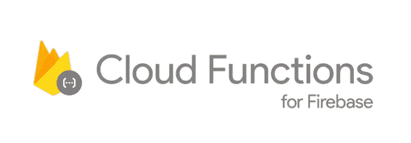

# 为多个移动平台构建应用程序是什么感觉

> 原文：<https://medium.com/hackernoon/whats-its-like-building-an-app-for-multiple-mobile-platforms-77e76996be04>


Major mobile platforms

在这篇文章中，我试图指出在这些应用商店中开发一个产品时，什么是好的或伟大的，什么是坏的或可怕的。我希望这将有助于像我一样为这些平台构建的一些人。

# 一些背景


作为我第二次微创业的一部分，我决定，为了最大限度地扩大我正在构建的加密货币跟踪工具 ACrypto 的覆盖范围，它应该通过尽可能多的渠道提供。在当今世界，任何数字产品都可以在

*   [安卓应用](https://developers.google.com/training/android/)
*   [iOS 应用](https://developer.apple.com/library/archive/referencelibrary/GettingStarted/DevelopiOSAppsSwift/)
*   [亚马逊应用](https://developer.amazon.com/apps-and-games)(是的，在美国这是一个不错的平台)
*   [MacOS 应用](/macos-app-development/100-days-of-osx-development-e61591fcb8c8)(苹果已经宣布用户可以将他们的 [iOS 应用](https://hackernoon.com/tagged/ios-app)带到 mac 上，很快，在 2019 年，很快)
*   [窗口 App](https://developer.microsoft.com/en-us/windows/apps)
*   [网站](https://developers.google.com/training/web/)(桌面/移动)

[Android](https://hackernoon.com/tagged/android) 开发是我的强项，所以我选择前 3 个渠道。当我有空的时候，网络是我喜欢尝试的东西，因为它是关于在今天的世界里你能多快地验证你的产品。很抱歉网络，但你必须等待。
只是一个背景，Android 有 87%的市场份额，iOS 有 12 %。[来源](https://www.statista.com/statistics/266136/global-market-share-held-by-smartphone-operating-systems/#0)

# 建立在

我很自然地从 android 开始，花一些时间为亚马逊做好准备，因为它只是 android 的一个分支，你只需要做很小的改变。然后我会为 iOS 构建。希望如果这是成功的，会看到我是否可以把它们带到 Mac 和 windows 操作系统，因为在贸易世界里人们非常喜欢桌面应用程序。

所以我的旅程开始了，也结束了，如果我必须总结的话，这篇推文将会涵盖一切

summarising working with different app stores

# **需要的关键东西**

我现在不会讨论发布部分，而是将重点放在对开发者来说重要的是轻松发布应用程序并测试他们的产品市场适应性(PMF)，而不是挣扎于移动应用程序世界的基本必需品。

[**安卓**](https://www.android.com) 是我非常热爱的一个平台。这是我开始职业生涯时学到的第一件事。社区和开源项目和库是惊人的，有点令人难以置信。但是如果你正确地学习它，你将会在 Android 上开发任何产品。

最简单的方法之一是使用一个自举项目，它有所有的导航，不同类型的屏幕，如搜索列表，排序，标签屏幕，设置，支付，推送通知，本地存储。不幸的是，没有，所以我决定从头开始构建，这样我可以在以后重用这个模板，如果有足够的需求，我会开源整个代码，这样可以让有类似需求的人在几分钟内开始，节省至少两个月的时间。

以下是我意识到的 6 件至关重要的事情，我认为应该尽可能地让开发者容易做到。没错，我说的就是你，苹果和亚马逊！

1.  **通知**
2.  **订阅**
3.  **转诊**
4.  **点评**
5.  **数据缓存**
6.  **App 更新**

# 1.通知:

Android: Android 在发送通知方面是最简单的，并且内置了很多用例。仍然在构建自己的通知是一个痛苦的单位 [Firebase 云功能](https://firebase.google.com/docs/functions/?gclid=CjwKCAjw6djYBRB8EiwAoAF6oZ0SohBHmaEvoAGLX-04QdOcm1XpJBxMIgKHreB6FFWaY2A5esr7OxoCkf4QAvD_BwE)来拯救

**苹果:**我不事件想去附近怎么用苹果推荐的方式寄。相信我，它比《闪灵》更恐怖！

**亚马逊:**亚马逊在分叉 Android OS 的时候已经抄袭了谷歌。它工作，但他们没有改变任何东西，从过去 5 年。

[](https://firebase.google.com/docs/functions/?gclid=CjwKCAjw6djYBRB8EiwAoAF6oZ0SohBHmaEvoAGLX-04QdOcm1XpJBxMIgKHreB6FFWaY2A5esr7OxoCkf4QAvD_BwE) [## Firebase | Firebase 的云函数

### 在许多情况下，开发人员更喜欢控制服务器上的应用程序逻辑，以避免在客户端篡改…

firebase.google.com](https://firebase.google.com/docs/functions/?gclid=CjwKCAjw6djYBRB8EiwAoAF6oZ0SohBHmaEvoAGLX-04QdOcm1XpJBxMIgKHreB6FFWaY2A5esr7OxoCkf4QAvD_BwE) 

从服务器发送通知曾经是一件痛苦的事情，尤其是如果你是一个移动开发者，并且不太熟悉后端。云功能很容易成为 Android、iOS 甚至亚马逊设备发送通知的最简单方式之一。使用 firebase，通知非常简单，只需要很少的样板代码。对于 iOS 和 Android 来说，主题通知也非常容易实现。对于亚马逊，你必须使用一些基本的东西，因为 firebase 不被支持。为亚马逊付出更多努力。

> **胜利者🏆安卓系统**

> **ProTip ✨** :使用此云功能向所有 3 个平台发送推送通知[https://gist . github . com/1 hakr/8 a 69 b 04 CD 02 e 556 fececb 5 ccebebb5c](https://gist.github.com/1hakr/8a69b04cd0d2e556fececb5ccebebb5c)

# 2.订阅:

**Android :** 订阅是非常复杂的一个功能添加。大多数订阅细节可以改变，如试用天数，介绍费和实际都必须动态获取。如果你有一个以上的订阅，那么你最终从主应用程序异步地做这件事，并缓存它，直到应用程序重新启动。为了方便使用 anzlab 库，它实现了大部分 boiler plate 代码，并提供了订阅和应用程序购买的简单方法。

[](https://github.com/anjlab/android-inapp-billing-v3) [## anjlab/Android-inapp-计费-v3

### Android-In app-Billing-v3——Android 应用内计费版本 3 的轻量级实现

github.com](https://github.com/anjlab/android-inapp-billing-v3) 

苹果:使用苹果提供的文档同样难以实现。不用担心，我们有一个惊人的这个库，它不像 android 那样简化订阅和购买。你还需要一个实际的物理设备来测试这一点，所以除非你有很多钱，否则我的建议是像我从朋友那里借一个设备。

[](https://github.com/bizz84/SwiftyStoreKit) [## bizz84/SwiftyStoreKit

### SwiftyStoreKit -轻量级 In App 购买适用于 iOS 8.0+、tvOS 9.0+和 macOS 10.10+的 Swift 框架

github.com](https://github.com/bizz84/SwiftyStoreKit) 

亚马逊:你肯定会遇到障碍。幸运的是，我只找到了一个图书馆，顺便提一下，它是亚马逊和 Google play 订阅的公共图书馆。EggheadGames 的[应用支付。亚马逊的一个好处是他们有一个](https://github.com/eggheadgames/android-in-app-payments)[配套应用](https://developer.amazon.com/docs/in-app-purchasing/iap-install-and-configure-app-tester.html)可以在应用购买中测试，这使得测试变得很容易。

[](https://github.com/eggheadgames/android-in-app-payments) [## egghead games/安卓应用支付

### android-in-app-payments -用一个 API 支持 Android Google Play 和亚马逊应用内付费(IAP)支付

github.com](https://github.com/eggheadgames/android-in-app-payments) 

需要注意的一点是，Google play 的应用程序购买功能在拥有庞大用户群的中国不可用。默认情况下，如果您在 [Google Play 开发者控制台](https://play.google.com/apps/publish/)中购买了应用程序，则您的应用程序在该国家不可用。我建议你从 App 上打开>商店存在>定价&分销>国家。看看使用情况，如果用户给出反馈并提出要求，你可以实现[支付宝](https://alipay.com)，这又是一件痛苦的事情，但你可以用 [Stripe](https://stripe.com/docs/sources/alipay) 轻松完成。
截图

> 赢家🏆:安卓

> **ProTip ✨** :将订阅逻辑放在你的应用程序类(Android)或应用程序(iOS)中，这样你就可以在你的应用程序中的任何地方访问订阅信息

# 3.推荐:

应用推荐是一个非常常见的功能，现在每个公司都在采用，无论是初创公司还是跨国公司。但是没有一个适用于所有平台的一体化解决方案。

Android :没有内置功能，但是由于订阅支持延长结束日期，你可以很容易地构建这个功能。用 firebase 实现起来非常简单。在 android 中，服务器检查也很简单。

[](https://firebase.google.com/docs/dynamic-links/use-cases/rewarded-referral) [## 奖励推荐| Firebase

### 跟踪这些信息的一种方法是匿名登录用户，并将数据存储在匿名帐户的…

firebase.google.com](https://firebase.google.com/docs/dynamic-links/use-cases/rewarded-referral) 

**苹果:**问题出在不支持扩展订阅的 iOS 上。除此之外，iOS 的一切都简单明了。所以，除非你有应用积分之类的东西，否则使用 firebase 将是轻而易举的事情。

**亚马逊:**同安卓。

> 赢家🏆:安卓

> **ProTip ✨** :使用云功能奖励推荐的用户，并在每次推荐被添加到 enthu for users 时发送通知。[https://gist . github . com/1 hakr/4c E1 ea 08119 FB 21 a 764 a 454 b 26 E3 cdde](https://gist.github.com/1hakr/4ce1ea08119fb21a764a454b26e3cdde)

# 4.评论:

很容易成为用户增长最重要的部分之一，也是最容易被忽视的部分。许多变种已经被实现了很多年，但是其中 95%都是无效的，因为它们打扰了用户。因此，找到正确的平衡是这里的关键。

**Android:** 这里没有内置功能，但最好的方法是在应用程序中实现一个横幅或 snackbar，以一种微妙而不打扰的方式征求反馈。


Subtle App review banner which comes after certain usage

苹果:苹果内置了一项功能，可以要求用户对应用程序进行评分。不幸的是，这并不微妙，但这是默认的方式，苹果已经严格禁止使用任何其他方式从 iOS 10.3 开始。除非你想面对苹果的愤怒，否则我强烈建议你坚持下去。

```
if #available(iOS 10.3, *) {
   SKStoreReviewController.requestReview()
} else {
   //Use your custom review view.
}
```

不要担心，有一个神奇的库可以为 iOS 10.3 以下的设备解决这个问题。因此所有案例都封装在库中

[](https://github.com/takecian/SwiftRater) [## takecian/SwiftRater

### SwiftRater -一个提醒你的 iPhone 应用程序用户审查用纯 Swift 编写的应用程序的工具。

github.com](https://github.com/takecian/SwiftRater) 

**亚马逊:**没有内置机制。我们用了和安卓一样的东西

> 赢家🏆:苹果

> **普罗提普✨** :当用户报告错误和问题时，修复后，回复他们，礼貌地要求他们给你的应用一个评价，如果他们喜欢你的应用。

# **5。数据缓存:**

为用户创造美好体验的一个好方法是智能地缓存数据，这样你就不会每次都显示进度条。这会让你的 app 体验非常流畅。

Android: 默认情况下，没有内置功能，但凌空是一个惊人的网络库，可以根据任何人的喜好进行定制。但问题是，你必须写出你想支持的所有平凡的逻辑。幸运的是，我为印度的一家初创公司 Practo 编写了这个库。它内置了对各种事物的支持。我绝对建议你试试这个。

[](https://github.com/DWorkS/VolleyPlus) [## DWorkS/VolleyPlus

### 排球加-🏐凌空图书馆:让一切更快。这是谷歌对 Android 版凌空的改进…

github.com](https://github.com/DWorkS/VolleyPlus) 

**iOS:** 如果你来自 iOS 开发的 Objective C 阶段，我无法想象你使用原生的 **NSURLConnection 所经历的一切。幸运的是，这里有一个很棒的图书馆，叫做 Alamofire。**

[](https://github.com/Alamofire/Alamofire) [## 阿拉莫菲尔/阿拉莫菲尔

### alamo fire-Swift 中优雅的 HTTP 网络

github.com](https://github.com/Alamofire/Alamofire) 

它工作得很好，但是不支持数据引导和网络数据的自定义缓存。不过不用担心，因为我已经编写了简单的代码来解决这个问题。

[https://gist . github . com/1 hakr/6e 7 efcd 72 a 0fa 5d db ebc 3 ab 62972d 3c](https://gist.github.com/1hakr/6e7efcd72a0fa5d5dbebc3ab62972d3c)

**亚马逊:**同安卓。

> 赢家🏆:安卓

> **ProTip ✨** :你还可以将数据导入应用程序，并在数据发生变化时通过网络进行更新。这可以用来节省数以千计的额外调用到您的 API，这可以节省很多💲

# 6.应用程序更新:

这是任何移动开发者最痛苦的事情之一，他们希望他们的用户几乎立即获得最新版本的应用程序，但由于各种原因，这很少发生。您可能添加了新的权限，然后自动更新不起作用。为了解决所有这些问题并让用户了解最新的应用程序更新，我们需要一种方法来通知用户每次有一个惊人的新功能添加到应用程序中。

Android: 我发现在这方面帮助很大的一个方法是使用应用内版本更新程序。你所要做的就是给它一个应用程序包，其他的事情就交给这个小程序库了。它甚至有如何告诉用户更新的选项，如推送通知或应用程序内对话。

[](https://github.com/javiersantos/AppUpdater) [## javiersantos/AppUpdater

### AppUpdater——一个库，检查你在 Google Play、GitHub、Amazon、F-Droid 或你自己的服务器上的应用程序更新…

github.com](https://github.com/javiersantos/AppUpdater) 

**苹果:**iOS 也存在类似的情况。您可以用几行代码在中使用这个库。

[](https://github.com/ArtSabintsev/Siren) [## ArtSabintsev/警报器

### 警报-当您的应用程序有新版本可用时通知用户，并提示他们升级。

github.com](https://github.com/ArtSabintsev/Siren) 

**亚马逊:**同安卓。

> 赢家🏆:安卓

> 普罗提普·✨:记住要正确地测试它，因为一旦它出来了，如果有一段未经检查的代码会崩溃，一切都会失控。相信我！

我制作并发布到这些应用商店的应用程序是

[](https://acrypto.io) [## 加密货币比特币价格、新闻、警报和投资组合

### ACrypto 应用程序是一个比特币/替代币价格检查器，使用它你可以跟踪最新的价格、新闻、发现套利…

一个加密的 io](https://acrypto.io) 

总之，我想说，谷歌实现了移动开发者的梦想，因为他们提供了大部分现成的东西，使得做很多事情变得如此容易和简单。苹果位居第二，但远不及谷歌。亚马逊可能会成为第二个，但他们不会真的那么关心开发者。我强烈建议远离亚马逊。

我希望你喜欢我的这个小视角。你呢？作为一名开发者，你认为最重要的事情是什么？请在评论中告诉我。我也想写另一篇关于设计的文章，所以如果你想看，请在评论中告诉我。

to the moon!

所有人！这是 HaKr 的结束。感谢阅读。如果你喜欢阅读，请点击👏向其他人推荐这篇文章，让他们可以欣赏。

也可以在[Twitter](https://twitter.com/1hakr)/[GitHub](https://github.com/1hakr)关注我。