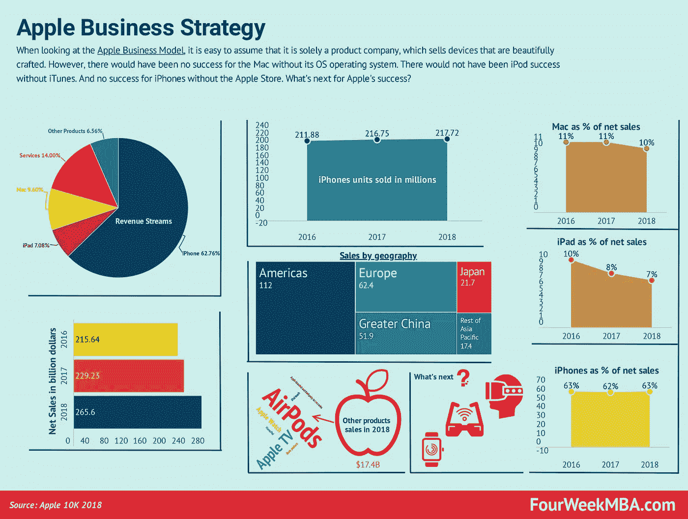
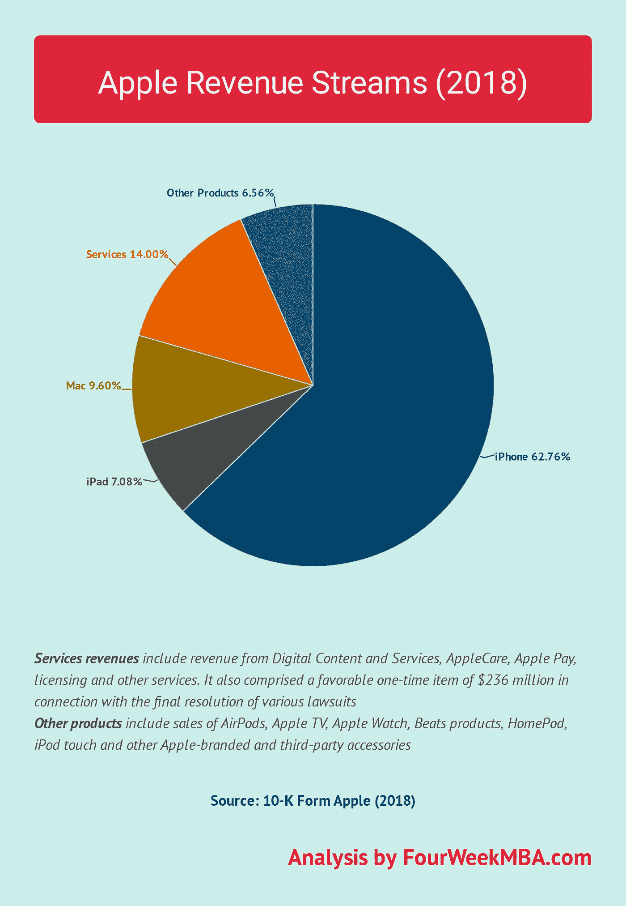
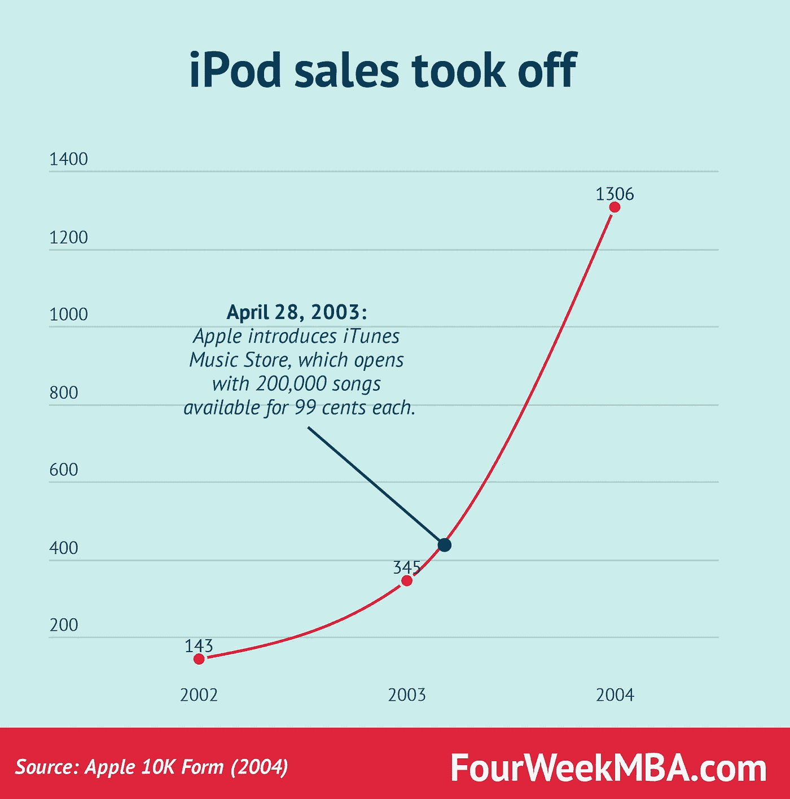
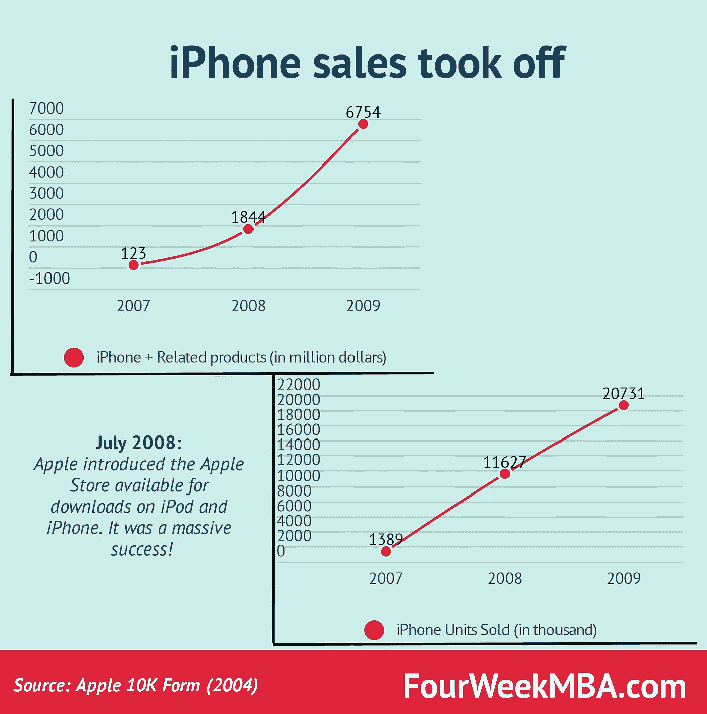
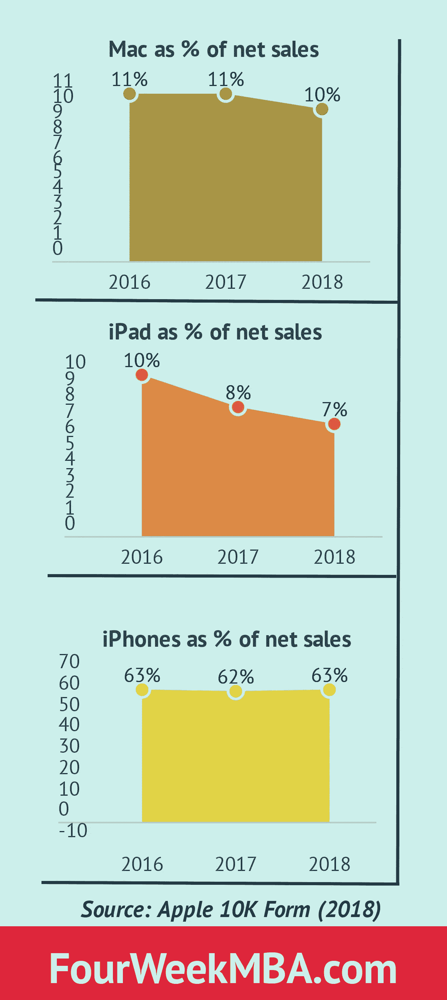

# 2019 年苹果的前景如何？

> 原文：<https://medium.com/hackernoon/whats-next-for-apple-2b1ae88d4b2e>

回到 1985 年，史蒂夫·乔布斯被苹果公司赶了出来。该公司仍将受益于几年的持续增长，直到它遇到障碍，销售额开始下降。

到 1996 年，苹果公司引入了一位新的首席执行官，这位首席执行官本应扭转局面。但是到了 1997 年，事情并没有好转，直到苹果在收购 NeXT 公司后召回了史蒂夫·乔布斯。史蒂夫·乔布斯回来了，几年后它让苹果翻身，让它再次成为科技巨头。

剩下的就是历史了。

**阅读全文:** [重温苹果的下一笔交易及其重要性](https://fourweekmba.com/apple-next-deal/)

人们在看待苹果的商业战略时犯的最大错误之一就是把它仅仅看作一个产品公司。这种错误之所以会发生，是因为你不时会看到它的收入流，诸如此类的事情就会发生:

截至 2018 年，iPhones 约占该公司净收入的 63%。

然而，[苹果](https://fourweekmba.com/apple-business-model/)远不止这些。没有 OS 操作系统的 Mac 及其后续产品不会如此成功。

这同样适用于 iPod:

我们在看待一家公司的成功时都会犯的一个错误是，认为单一的策略或产品决定了它的成功。然而，事情从来没有那么简单。

在许多情况下，技术、产品和[业务建模](https://fourweekmba.com/what-is-a-business-model/)的结合使之成为可能。

据[cultofmac.com](https://www.cultofmac.com/124565/an-illustrated-history-of-the-ipod-and-its-massive-impact-ipod-10th-anniversary/)报道:

> ***4 月 28 日:*** *苹果发布第三代 iPod，将控制按键移到屏幕下方新的一排触摸感应按键上。该型号引入了用于同步的 USB dock 连接器。苹果还推出了 iTunes 音乐商店，提供 20 万首歌曲，每首 99 美分。在音乐盗版猖獗之际，此举被视为大胆之举。如果音乐是免费的，谁会为它付费呢？但乔布斯认为简单易用将胜过偷窃。他说，大多数消费者都想做正确的事情。*

简而言之，史蒂夫·乔布斯押注于一种消费音乐的新方式，这意味着一种全新的商业模式。

在音乐需要通过 CD 购买和消费的地方，有了整张专辑，[苹果](https://fourweekmba.com/apple-business-model/)可以只花 99 美分购买任何歌曲，而且你不需要购买整张专辑。

这种新的音乐商业模式让 iPod 起飞(产品本身也有重要的美学变化)。

到 2007 年，iPod 将为苹果带来超过 80 亿美元的年收入！

2007 年，苹果推出了 iPhone。这是它构思手机方式的一次革命。不仅仅是一部电话，它就像口袋里有一台迷你电脑。

iPhone 本身并不是苹果销量腾飞的原因。相反，苹果商店一经推出，iPhone 就获得了巨大的成功！

据 apple.com[报道:](https://www.apple.com/newsroom/2008/07/14iPhone-App-Store-Downloads-Top-10-Million-in-First-Weekend/)

> *加州库比蒂诺——2008 年 7 月 14 日——苹果公司今天宣布，自上周晚些时候苹果开创性的新应用商店推出以来，iPhone 和 iPod touch 用户已经从该商店下载了超过 1000 万个应用程序。开发人员创造了大量创新的移动应用，从游戏到基于位置的社交网络，从医疗应用到企业生产力工具。用户可以将应用程序直接无线下载到他们的 iPhone 或 iPod touch*上，并立即开始使用。App Store 上现在有 800 多个本地应用程序，其中 200 多个是免费的，90%以上的价格低于 10 美元。*

再次，技术+制作精美的产品+ [商业模式创新](https://fourweekmba.com/what-is-business-model-innovation/) =大规模成功。

正如[史蒂夫·乔布斯](https://fourweekmba.com/who-owns-disney/)当时报道的那样"*App Store 是一个大满贯，仅三天就有惊人的 1000 万个应用程序被下载，*"他接着说，"*开发者创造了一些非凡的应用程序，App Store 可以通过无线方式即时提供给每一个 iPhone 和 iPod touch 用户。*

史蒂夫·乔布斯和苹果再一次改变了游戏规则。他们创造了一个平台，开发者可以利用他们的专业知识将应用程序交付给大众消费者。

苹果也很聪明，在运营商协议方面改变了游戏规则。[分销](https://fourweekmba.com/distribution-channels/)始终是任何公司成功实现可扩展性的关键因素。

因此，苹果创造了一个由几个关键角色组成的生态系统，而不仅仅是创造一个很酷的产品。

下一步是什么？

让我们从当前的数字开始。

# 少数苹果产品创造了其大部分收入

iPad、Mac 和 iPhone 代表了公司的大部分收入。2018 年，84%的苹果净销售额来自这些产品。剩下的部分用于服务和其他产品。

# 服务代表了支持苹果销售的生态系统

正如[苹果【2018 年度报告所述，服务方包括:](https://fourweekmba.com/apple-distribution-strategy/)

**1。数字内容和服务**

> *iTunes Store 适用于 iOS 设备、Mac 和 Windows 个人电脑以及 Apple TV，允许客户购买和下载音乐和电视节目，租借或购买电影，以及下载免费播客。适用于 iOS 设备的 App Store 允许客户发现和下载应用程序，并购买应用程序内的内容。适用于 Mac 电脑的 Mac App Store 允许客户发现、下载和安装 Mac 应用程序。电视应用程序商店允许客户访问专门针对 Apple TV 的应用程序和游戏。该书店面向 iOS 设备和 Mac 电脑，提供主要独立出版商的电子书。Apple Music 通过基于用户播放或下载活动的点播电台和基于订阅的互联网流媒体服务为用户提供精心策划的收听体验，该服务还提供对 Apple Music library 的无限制访问。*

因此，服务端主要包含以下数字内容:

*   iTunes 商店
*   应用商店
*   Mac 应用商店
*   书店
*   苹果音乐

**2。iCloud**

*存储音乐、照片、联系人、日历、邮件、文档等内容的云服务，使它们保持最新，并可在多个 iOS 设备、Mac 和 Windows 个人电脑以及 Apple TV 上使用。*

**3。AppleCare**

*内置于软件产品、电子产品手册、在线支持中的帮助，包括全面的产品信息以及技术帮助。*

**4。Apple Pay**

*无现金支付服务，提供简单、安全和私密的支付方式。*

这项业务的服务方面对苹果产品销售的腾飞至关重要。

# 其他产品:智能音箱之战？不容易！

*   苹果电视
*   苹果手表
*   其他:AirPods、Beats 产品、HomePod、iPod touch 和其他苹果品牌和第三方配件

截至 2018 年，其他产品仅占苹果收入的 6.5%。然而，如果下一个宝石就在那里呢？

按照苹果产品的发展模式，在潜在的成功产品中，Siri 驱动的 HomePod 似乎是最有希望的。

语音设备的战场并不轻松。苹果公司推出了 SiriKit，允许“*”的 iOS 应用和 watchOS 应用与 Siri 配合使用，因此用户只需用语音就能完成任务。您的内容和服务可以用于新的场景，包括从锁屏访问和免提使用。”*

诗丽吉对控制 HomePod 也至关重要。正如苹果所指出的:

> *通过 Siri 的智能，用户可以通过自然的语音交互控制 HomePod，并可以方便地访问支持 SiriKit 消息、列表和笔记的 iOS 应用。Siri 可以识别 HomePod 上的 SiriKit 请求，并将这些请求发送到用户的 iOS 设备进行处理。要准备你的应用程序，请确保你的 SiriKit 集成是最新的，并且你已经采用了所有适当的意图。*

因此，SiriKit 可能是苹果试图建立与过去为操作系统和应用商店创建的生态系统相同的生态系统。然而，语音领域是一个艰难的领域，竞争对手包括谷歌(Google Home)和亚马逊(Amazon)等。

智能音箱之战仍在继续，苹果似乎还没有找到自己的本垒打。

据[彭博](https://www.bloomberg.com/news/articles/2018-04-12/apple-s-stumbling-homepod-isn-t-the-hot-seller-company-wanted)报道，根据 Slice Intelligence 的数据，2018 年第一季度，智能音箱的市场份额划分如下:

*   HomePod 10%
*   亚马逊回声 73%
*   谷歌主页 14%

当然，现在说谁会赢得这场战斗还为时过早。但是如果下一件事就在眼前呢？

# 苹果的下一步是什么？苹果的 iGlasses？

据 [TechCrunch](https://techcrunch.com/2017/11/21/apple-acquires-mixed-reality-headset-startup-vrvana-for-30m/) 报道，2017 年，苹果以约 3000 万美元的价格收购了图腾耳机制造商、加拿大蒙特利尔的初创公司 Vrvana。

购买 Vrvana 并非孤例。据 [TechCrunch](https://techcrunch.com/2017/06/26/apple-acquires-smi-eye-tracking-company/?_ga=2.248097991.1301159916.1546003798-1712558225.1526200171) 报道，苹果也可能在一年前收购了眼球追踪公司 SensoMotoric Instruments (SMI)。

前几年的其他收购包括 Flyby Media、Metaio、Emotient 和 Faceshift。

苹果智能眼镜是一种选择吗？

时间会证明一切！

**参考文献:**

*   [苹果 2004 年年报](https://d1lge852tjjqow.cloudfront.net/CIK-0000320193/b0b7d71b-26ce-46b6-a84d-30b07944baa9.pdf)
*   [苹果 2009 年年报](https://d1lge852tjjqow.cloudfront.net/CIK-0000320193/5dfc8604-cbdc-448b-ba04-700a22a37909.pdf)
*   [苹果 2018 年年报](https://d18rn0p25nwr6d.cloudfront.net/CIK-0000320193/68027c6d-356d-46a4-a524-65d8ec05a1da.pdf)

*原载于 2018 年 12 月 28 日*[*fourweekmba.com*](https://fourweekmba.com/apple-business-strategy/)*。*