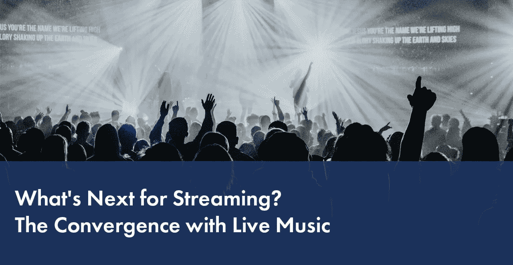

# 流媒体的下一步是什么？与现场音乐的融合

> 原文：<https://medium.com/hackernoon/whats-next-for-streaming-the-convergence-with-live-music-4ddf81f150bd>

> “音乐从不在电视上播放是有原因的。这是一次社区体验。现在，如果你把一个被动的观众变成一个主动的观众，感觉他们在与人交流，现在我们已经创建了在线音乐社区。”— Allen Sanford，LiveList 联合创始人兼首席执行官。

[RIAA 2017 年年终音乐行业收入报告](http://www.riaa.com/wp-content/uploads/2018/03/RIAA-Year-End-2017-News-and-Notes.pdf)明确重申了流媒体对行业的价值。音乐流媒体平台的总收入增长了 43%，达到 57 亿美元，占去年行业总收入的 65%，而付费订阅成为 2017 年最大的增长动力。

所有人都在关注最新趋势，流媒体市场的新一波浪潮是什么？

## **视频直播！**

部分归功于社交网络，这项技术已经成为主流。从流媒体体育游戏和新闻发布会到直播流媒体音乐会和音乐节是一个自然的发展，因为消费者越来越接受在旅途中或舒适的家中观看赛事的概念。虽然脸书直播、Instagram 直播视频、Periscope、YouTube 直播和其他类似的服务继续受到个人使用的极大欢迎，但专业视频流媒体平台与音乐行业的领导者和未签约的音乐家合作，以利用直播音乐会流媒体的体验。LiveList、Brightcove、DaCast、IBM Cloud Video(原 Ustream)、Livestream 等平台早已证明了这项技术的好处。

## 粉丝互动

流媒体直播音乐会为音乐行业提供了非常强大的品牌和非凡的粉丝参与机会。许多平台提供了广泛的视频播放器、社交分享功能、基于 API 的轻松嵌入解决方案和其他工具，使音乐家能够通过几乎任何互联网连接设备接触到大量观众。视频直播有助于消除音乐家和他们的粉丝之间的物理、地理和技术障碍。

但是艺术家有什么收获呢？目前的现实是，巡回演出和音乐会是大多数音乐家的主要收入来源。然而，直播音乐会不仅没有减少收入，反而有助于增加门票销售。根据 Livestream 和纽约杂志进行的一项[调查](http://lp.livestream.com/rs/582-GOU-684/images/Look%20Ahead%20-%20Live%20Video%20in%202017.pdf)的结果，67%的观众在观看直播视频后受到启发，更有可能亲自参加音乐会。

## 数据分析

在线平台提供的直播音乐会的另一个巨大价值前景是他们收集和分析粉丝偏好数据的能力。广播公司可以测量他们的直播视频的性能，并知道有多少新观众或回头客观看这些内容，他们来自哪里，以及其他取决于平台的指标。通过正确的方法，这种[视频流分析](https://blog.dataart.com/count-the-streams-understanding-video-streaming-analytics/)可以更好地安排巡演，提高品牌知名度，并吸引更多音乐家观众。

## 沉浸式虚拟现实

此外，将虚拟现实(VR)与音乐会的直播相结合，有可能进一步改变现场音乐体验。流行音乐节 Coachella 已经与 vantage.tv 合作，尝试将 360°广播与高流量的 2D 广播相结合，从而使用户可以轻松地在 2D 和虚拟现实之间切换。另一家初创公司 TheWaveVR 在 VR 中直播音乐会，同时提供互动功能，进一步吸引粉丝，让他们有机会虚拟触摸设备或在音乐会上跳舞。

我们只是刚刚开始发现直播音乐会吸引粉丝并提高媒体行业品牌潜力的无数方式。随着越来越多的艺术家和公司进入这一相对较新的形式，随着现场音乐会体验与数字世界的融合，我们可以期待看到一系列精彩的创新。

*由* [***谢尔盖布多夫***](https://www.linkedin.com/in/sbludov/) *，
媒体与娱乐实践高级副总裁* [***数据艺术***](https://www.dataart.com/industry/media-and-entertainment?utm_source=medium.com&utm_medium=referral&utm_campaign=m-regular&utm_content=sbludov-hn-streamfuture)

*原载于*【blog.dataart.com】**。**