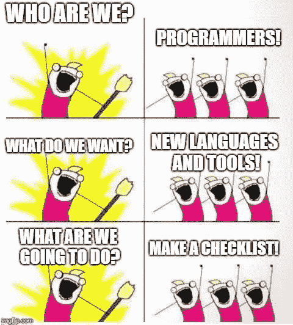

# 你的 2019 年编程清单上有什么？

> 原文：<https://medium.com/hackernoon/whats-on-your-2019-programming-checklist-605a1bbb777d>

我们都想学习新的东西，掌握不同的技能。然而，不可能在一年内实现我们想要的一切。不管你多么努力，总有一些事情会被忽略。

这场关于犹太人的讨论正在进行🔥🔥🔥现在，这里是人们在 2019 年编程清单上添加的内容:

*   继续享受编程的乐趣，
*   高手 ES6！JavaScript 就像一位祖母，不停地给你糖果，从不停止。她只是想看到你开心又胖，
*   也许我会学 React，也许不会。也许我会学 Python，也许不会，
*   赚更多的钱，
*   不要像今年一样每天都提交 Github，
*   铁锈+ WASM！！！
*   查看[原因:](https://reasonml.github.io/)
*   我想在我朋友的一个项目中添加 ML powered feed 将使用 tensorflow.js，所以我必须学习这个和一些神经网络，模型等，
*   学习 GraphQL🚀并在我的项目中使用它，
*   常去[逛逛](https://hashnode.com)😎,
*   花点时间写游戏开发文章(它们在第 6 部分之前已经完全计划好了，我只需要编写代码就可以了😆),
*   必须学习先进的区块链和 dapps 架构&如果时间允许的话，也许可以造一个小的假硬币(erc 20 或高级代币)，
*   参加 AWS 解决方案架构师考试并通过，
*   回来继续用 PHP 开发星球大战转换网站，
*   参加更多技术会议😃,
*   学习 Docker，
*   准备 AI 和 ML，

我们的首选是😂 👇：

*   不久前，我设计了一只我认为漂亮的蝴蝶，而我无情的女朋友告诉我，它看起来像一匹马。所以，我必须学习一些 3D 设计。

那么，[你的 2019 年编程清单是什么样的？](https://hashnode.com/post/whats-on-your-2019-programming-checklist-cjpcuwcqk000ia0s1467ayurk)

 [## 你的 2019 年编程清单上有什么？—哈希节点

### 前几天我对一位同事说过，现在我要再说一遍。明年我打算休两次假。1 我的…

hashnode.com](https://hashnode.com/post/whats-on-your-2019-programming-checklist-cjpcuwcqk000ia0s1467ayurk)