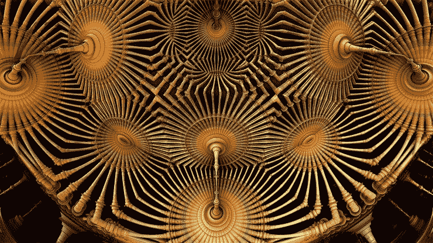
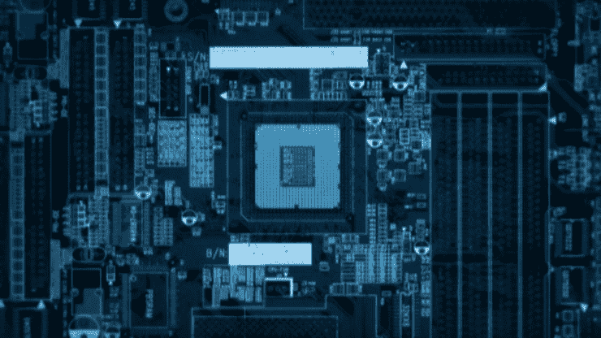
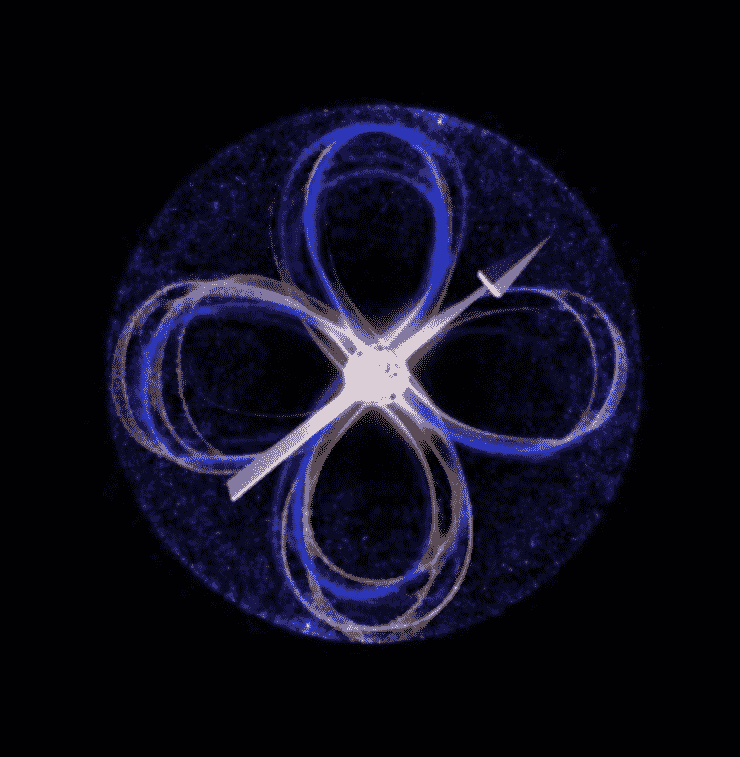
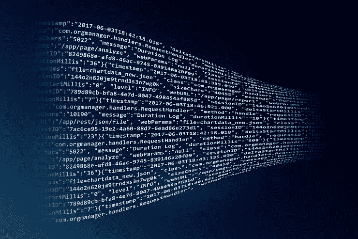
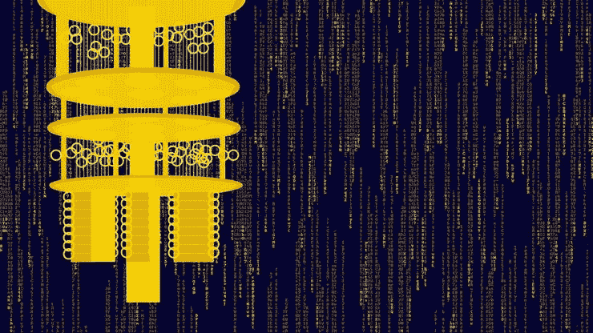

# Shor 的算法是什么？|量子计算周刊综述 2018 年 1 2 月 11 日

> 原文：<https://medium.com/hackernoon/whats-shor-s-algorithm-quantum-computing-weekly-news-for-dec-11-2018-721a4934a46f>

> 这是我每周电子邮件中关于量子计算新闻的综合版本。[访问主页](https://www.quantumcomputingweekly.com/)订阅更新和查看以前的问题。

👋大家好，感谢您阅读幸运杂志第 7 期！

[上周](https://www.quantumcomputingweekly.com/issues/what-a-quantum-computer-programmer-looks-like-quantum-computing-weekly-6-147608)我们在 Anastasia Marchenkova 上有一个很棒的简介，如果你错过了，我强烈建议你去看看，我很兴奋地说，我们已经有一位新客人在一月份排队了！🎉

你在寻找量子计算的某个特定领域，希望在下一期文章中看到它吗？ [Ping 我](https://twitter.com/jesperht)让我知道！

# 本周的小事实

我一直听到的 Shor 算法是什么？简而言之，这是一种量子算法，能够相对快速地回答一个计算上非常困难的问题:

给定一个数 N，它的质因数是什么？

为什么这很重要？好吧，碰巧的是，这个问题(或这个问题的变体)是让大多数现代计算机和互联网上使用的加密技术工作的原因——它只是计算起来太昂贵了，所以事情是安全的！然而，Shor 的算法在解决这个问题上几乎比经典计算机今天能够做到的要快得多，所以现在人们开始挖掘后量子密码术的领域来对抗它，以便在未来保持安全。

这是一个非常有趣的领域，这里有一些额外的资源可供参考:

[用通俗易懂的语言清晰地解释了当今密码学的工作原理。](https://www.youtube.com/watch?v=YEBfamv-_do)

[更深入地解释肖尔算法](https://www.scottaaronson.com/blog/?p=208)

[Anastasia 的一篇博客文章，她谈到了 Shor 的算法及其对密码学的影响](/quantum-bits/break-rsa-encryption-with-this-one-weird-trick-d955e3394870)<——值得点击“太多的数学；我没有单独读“第一页，但也读了其余的部分！

# 学习

上周，我们有一个链接，链接到一个很棒的 PBS 介绍量子计算数学的链接，现在似乎连谷歌也加入了这个派对，并开始了一个名为 Quantum Casts 的量子计算系列，重点是人工智能——看看他们最近发布的第一个视频:

# 新闻

[**新光学设备让量子计算更近一步**](https://phys.org/news/2018-12-optical-device-quantum-closer.html?utm_campaign=Quantum%20Computing%20Weekly&utm_medium=email&utm_source=Revue%20newsletter)**——**[**phys.org**](https://phys.org/news/2018-12-optical-device-quantum-closer.html)
一个国际研究团队向创造光量子计算机迈出了一大步，这种计算机有可能设计出新的药物并优化节能方法。

[**美国在探索量子计算方面落后了吗？**](https://www.scientificamerican.com/article/is-the-u-s-lagging-in-the-quest-for-quantum-computing/?utm_campaign=Quantum%20Computing%20Weekly&utm_medium=email&utm_source=Revue%20newsletter)**——**[**www.scientificamerican.com**](https://www.scientificamerican.com/article/is-the-u-s-lagging-in-the-quest-for-quantum-computing/)

专家说，需要美国政府的资助来维持走向实用量子计算机的艰难旅程。

【www.shine.cn】华东**量子计算机控制系统****——**

**中国首个具有自主知识产权的量子计算机控制系统已经启动。**

****

**[**利用硅中“自旋轨道”耦合的力量:扩大量子计算**](https://www.sciencedaily.com/releases/2018/12/181207144400.htm?utm_campaign=Quantum%20Computing%20Weekly&utm_medium=email&utm_source=Revue%20newsletter)**—**[**www.sciencedaily.com**](https://www.sciencedaily.com/releases/2018/12/181207144400.htm)
研究团队正在研究利用自旋轨道耦合扩大基于原子的计算架构的多种途径——朝着他们构建基于硅的量子计算机的目标前进。**

****

**[**量子计算机正在让经典计算机变得更快，下面是如何让**](https://www.seeker.com/videos/tech/quantum-computers-are-making-classical-ones-faster-heres-how?utm_campaign=Quantum%20Computing%20Weekly&utm_medium=email&utm_source=Revue%20newsletter)**——**[**www.seeker.com**](https://www.seeker.com/videos/tech/quantum-computers-are-making-classical-ones-faster-heres-how)**

**借助数学技术，一些看起来源于量子过程的问题可以被“去量子化”,并用经典计算机有效地模拟。**

****

**[**量子计算的发展如何影响加密货币**](https://irishtechnews.ie/how-developments-in-quantum-computing-could-affect-cryptocurrencies/?utm_campaign=Quantum%20Computing%20Weekly&utm_medium=email&utm_source=Revue%20newsletter)**—**[**irishtechnews . ie**](https://irishtechnews.ie/how-developments-in-quantum-computing-could-affect-cryptocurrencies/)**

**在开发和实验中的量子算法中，有一种类型，即 Shor 因子分解，可以被用来破坏基于 ECDSA(椭圆曲线数字签名算法)的区块链密码。**

****

**[【www.technologyreview.com】](https://www.technologyreview.com/s/612509/quantum-computers-encryption-threat/?utm_campaign=Quantum%20Computing%20Weekly&utm_medium=email&utm_source=Revue%20newsletter)**——**[**量子计算机对安全构成威胁，对此我们还完全没有准备**](https://www.technologyreview.com/s/612509/quantum-computers-encryption-threat/)**

**一些美国专家认为，量子加密技术可能至少需要 20 年才能得到广泛应用。**

# **感谢阅读！投稿？**

**写了一篇有趣的博文或者发现了一些关于量子计算的趣事分享？发现了一个错误？在 twitter 上 Ping 我( [@jesperht](https://twitter.com/jesperht) )。**