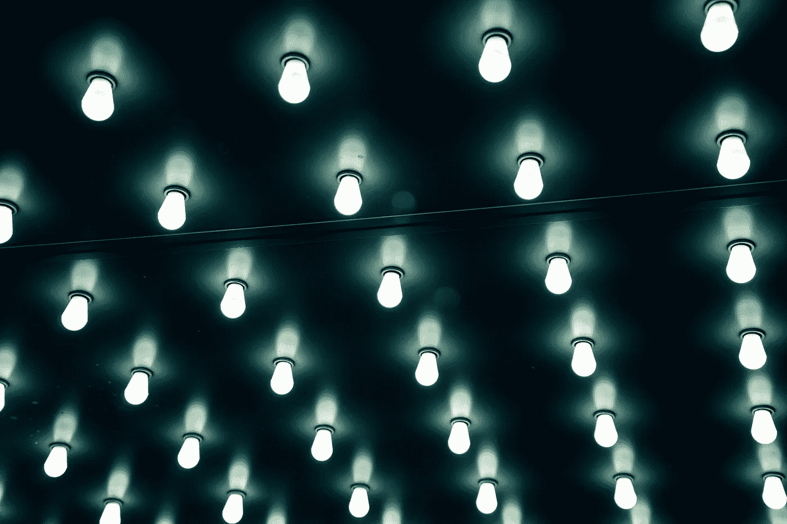

# 蓝光有什么不好？

> 原文：<https://medium.com/hackernoon/whats-so-bad-about-blue-light-b04e13a801df>

Many white light sources contain a significant amount of blue light. Image: [Evan Smogor](https://unsplash.com/photos/2XrFBLiTzKo?utm_source=unsplash&utm_medium=referral&utm_content=creditCopyText)

# 太长；没看

*   大多数 LED 灯不会对正常健康的眼睛造成危险。
*   如果使用不当，led 会对你的睡眠和白天的能量产生负面影响。
*   但是你可以利用蓝光。关键在于时机。

我*保证*如果你真的读了这篇文章，你会觉得很有趣，也很有启发。

# 荧光白炽灯

是啊，我刚刚把舞曲扔进了一篇**严肃** 的文章里。发光二极管在短期内不会有这么吸引人的报道。

我跑题了。白炽灯和荧光灯都是*旧闻*。你甚至再也买不到大多数白炽灯了。

> 白炽灯曾经有过不可思议的发展，但遗憾的是，现代世界没有这种耗能灯的空间。
> 
> **——**[**洛城时报**](http://www.latimes.com/opinion/editorials/la-ed-incandescent-light-bulbs-20180101-story.html)

再见，*能量吸盘。*我们是来谈**引**的。

# 蓝色(达达迪)

为什么大家**都在为蓝色 led***抓狂？我刚买的 LED 灯泡是白色的，不是蓝色的。就像一个老*能量吸盘。**

*原因如下:中国的那些灯泡厂正在使用*魔法*让那个东西看起来是白色的。底下都是蓝色的。*

*我会让一个普通的麻瓜容易理解。LED 最初亮起的是蓝色，而且只是蓝色。我们称之为*蓝泵。**

*太蓝了，看着就疼。甚至不是开玩笑。你不应该尝试它。*

*在蓝色泵的顶部，那些 LED 工厂的奇才应用这个黄色的东西。它被称为*磷光体。**

*磷光体从蓝色泵获得光，并将其传播成白光。有点像棱镜，但方向相反。不完全是。*

*磷光体颜色转换实际上涉及*光子*，这相当神秘。对于这个过程，我还没有想到一个好的类比。你可以自己研究[它是如何工作的](http://www.photonstartechnology.com/learn/how_leds_produce_white_light)。*

*让我们继续这个关于**蓝光**的话题。*

*记得在科学课上，光的所有颜色加起来都是白色吗？包括蓝色。*

*磷光体不能消除蓝光。它仍然在白光输出中。*

*但只要你不是*直盯着灯，*大部分 LED 灯对正常健康的眼睛 [*](#f13a) 并不危险。发光二极管并不比包括白炽灯在内的其他光源更危险。*

*别盯着灯看就好。光线太亮时使用遮光帘。*

# *所有的灯*

*那么，如果大多数 led 对大多数健康人都没有危险，那有什么大不了的呢？*

*你看，这些新奇的灯随时随地都在。*

*旧石器时代，白天是白天，夜晚是夜晚。夜间照明只有两个来源:火和月光。*

*我们的身体进化出一种感知机制，只是为了检测何时是白天，何时不是。不管喜欢与否，我们的眼睛里仍然有那些日光传感器[并且它们仍然在工作。](https://en.wikipedia.org/wiki/Intrinsically_photosensitive_retinal_ganglion_cells)*

*那些眼睛传感器只有在有蓝光时才会被触发。让我们清楚地展示输入内容:*

*   *日光:大量明亮的蓝光*
*   *月光:昏暗的光线，有一些蓝色，但少得多*
*   *火光:暗淡到明亮的光，但很少到没有蓝色*
*   *现代人造光和电子屏幕:昏暗到明亮的光线，带有明显的蓝色*

*当有明显的蓝光时，传感器会向生物钟发送一条信息，告诉它现在是白天。*

*生物钟调节我们何时感觉疲劳，何时感觉清醒。它在许多其他重要的身体过程中起着重要的作用。*

*我不是勒德分子，我也不想回到比现在更早的时代。我认为人们应该更多地使用技术，而不是更少。*

*但是我们必须意识到，所有这些灯和显示器都在告诉我们的身体，现在一直是白天。*

*这就像永久的时差。或者每天上不同的班。而且对我们的健康也不是最理想的。*

# *节奏的奴隶*

*那我们该怎么办？*

*事实证明，我们可以利用蓝光为我们带来优势。*

*记住，身体模块告诉我们什么时候该醒，什么时候该困。它对许多其他对我们健康至关重要的功能也至关重要。每个人都有。*

*生物钟的别称？ [*昼夜节律*](https://sleepfoundation.org/sleep-topics/what-circadian-rhythm) *。**

*节奏。你能感觉到这里的主题吗？*

*昼夜节律在一天的早中期获得大量蓝光时效果最佳。它在夜间蓝光很少或没有蓝光时也最有效。*

*显著蓝光的来源是什么？*

*   *老式日光*
*   *明亮的 LED 照明*
*   *冷白光 LED 和荧光照明*
*   *没有滤色器的电子显示器*

*以及有哪些方法可以最小化蓝光？*

*   *调暗或关闭灯光*
*   *用夜灯或重点灯代替普通灯*
*   *像 [f.lux](https://justgetflux.com/) 和[夜班](https://support.apple.com/en-us/HT207570)这样的彩色滤镜应用*
*   *[蓝光阻隔眼镜](https://www.swanwicksleep.com?rfsn=970855.b19aca)*
*   *遮光窗帘*
*   *睡眠面具*

*在一天的早些时候使用大量的蓝色光源。向减少夜间蓝光的方法过渡。*

*就这么简单。*

*你会感觉更好，你的昼夜节律会感谢你。*

*感谢阅读。如果你喜欢这篇文章，请点击上面的按钮，与你的朋友分享。我也鼓励你留下评论，[注册](https://goo.gl/forms/FVpO8AsXp6zCUUA72)我的电子邮件简讯，或者[直接联系我](https://gregyeutter.com/contact)。*

*[***](#5e6c) *如果您患有眼部疾病，您可能需要对光线采取额外的预防措施。这个声明适用于所有的光源，自然的和人工的。咨询你的医生。我不是医生，也不在网上玩医生。**