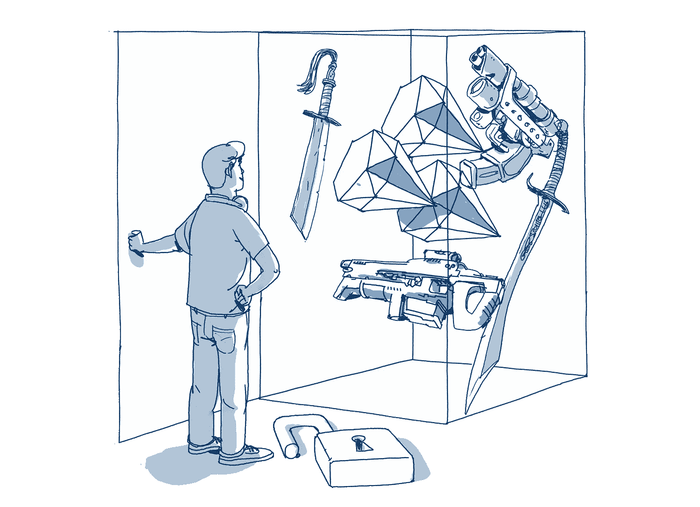
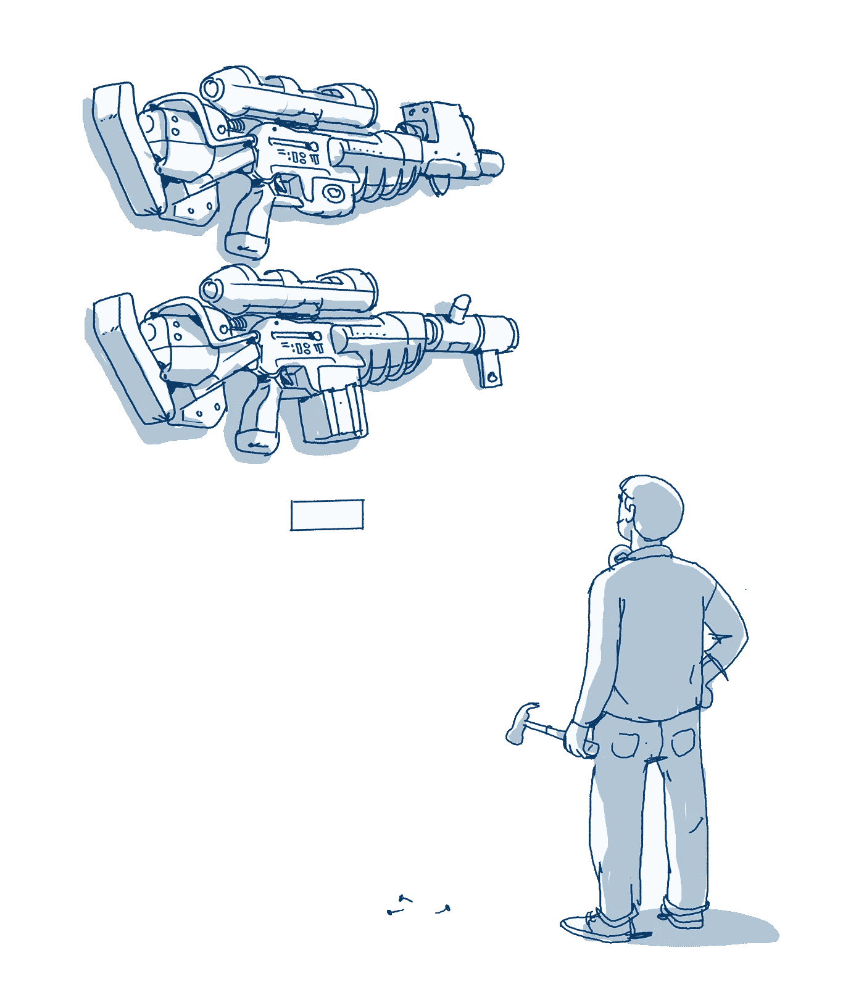

# 虚拟游戏物品的真实所有权有什么了不起的？

> 原文：<https://medium.com/hackernoon/whats-so-great-about-true-ownership-of-virtual-game-items-be629e5ae900>

2017 年，虚拟商品的销售额超过 800 亿美元，博彩业总收入为 1030 亿美元。

那一年票房收入前五的游戏是免费游戏，这是一种从游戏内容销售中获得收入的模式。其中票房最高的*《英雄联盟》*，2015 年[报道的收入为 16 亿美元](http://info.digitalriver.com/rs/348-QUY-258/images/SuperData%20Research_Digital%20River%20Monetization_Sep%202017.pdf)。

**进一步，观察下面的例子:**

*   在 10 周年之际，在线电脑游戏《我的第二人生》报道称，在他们的平台上已经发生了价值 32 亿美元的虚拟商品交易。
*   *《战争游戏》*一款移动 MMO，报道称每个付费用户在虚拟内容上的平均花费为 549.69 美元。
*   2015 年 1 月，Steam 宣布向贡献虚拟物品在平台上销售的社区成员累计支付[5700 万美元](https://venturebeat.com/2015/01/28/hats-equal-money-1500-steam-community-creators-have-earned-more-than-57m-making-items/)，每个贡献者的平均收入为 38，000 美元。
*   *Overwatch* ，一款暴雪多人射击游戏，其大部分收入来自销售化妆定制物品，[在第一年结束前赚了 10 亿美元](http://investor.activision.com/releasedetail.cfm?ReleaseID=1024915)，2017 年，暴雪宣布其来自游戏内内容的收入同比增长超过 25%。

## 有什么问题/现状？

目前的情况是，游戏玩家并不真正拥有他们所购买的内容。发行商通过 EULAss(最终用户许可协议)对用户可以使用这些项目进行严格限制，EULA 禁止交换或转让项目所有权或在特定游戏或平台之外使用这些项目。

根据 EverdreamSoft 的 CEO，CCG *的开发者 Genesis* 的说法:

> “消费者在没有真正所有权的内容上花费了数千亿美元。对于所有由皮肤和游戏中物品赚取的钱，它们都被游戏发行商所拥有和控制。这些公司有权改变服务条款，冻结玩家账户，甚至关闭整个市场。事实上，他们不这样做是因为这是如此有利可图，以至于你会看到更多的大出版商在他们的游戏中加入战利品箱和可交易物品。它适合许多游戏公司保持这种方式。人们认为别无选择。”
> 
> *——沙班·沙姆*，EverdreamSoft 首席执行官

尽管收入模式越来越倾向于主要从购买游戏内容中获利，但情况依然如此。在一个越来越认识到虚拟资产具有真实世界价值的环境中，这种情况不公平地对游戏玩家不利。

> 尽管收入模式越来越倾向于主要从购买游戏内容中获利，但情况依然如此。

> *“数以千万计的虚拟商品在虚拟现实中被创造、分享和出售，人们投入数千小时在太空中创造飞船，让它们相互对抗。所以，虚拟商品、虚拟世界和虚拟货币的概念都联系在一起。”*
> 
> *-* [*黄仁勋，*英伟达](https://www.barrons.com/articles/nvidia-ceo-huang-crypto-is-real-the-world-is-coming-to-terms-with-it-1518188630)首席执行官，为游戏、加密货币和专业行业设计 GPU。

## 真正的所有权对整个游戏产业有什么好处？

我们相信，实现虚拟物品的真正所有权将提高游戏玩家的参与度，为内容创作者提供更大的开发灵活性和功能性，并通过吸引新的市场参与者来扩展行业。

## a)真正的所有权=更大的参与度

乍一看，似乎允许用户从他们的虚拟物品中“套现”会让他们更容易离开游戏。平台内没有锁定的物品可能会减少继续玩下去的动力。

然而，来自现有市场的例子表明，支持虚拟物品的自由移动实际上增加了平台内的参与度。其中一个主要原因是，当物品可以自由交易时，它们的价值就会增加，这为玩家留在生态系统中提供了更大的激励。

> 当物品可以自由交易时，它们的价值就会增加。

这方面的一个例子是“皮肤”的交易，这是流行的第一人称射击游戏的装饰性附件。这些商品交易的便利性导致了对它们需求的增加，以及多个第三方网站的发展。

此外，真正的所有权不仅可以促进一个游戏内的商品交易，还可以促进同一开发商或特许经营商的几个游戏之间以及不同市场上的商品交易。这增加了游戏在更广泛的生态系统中的互连性，并且建立更强大的网络可以导致比其他情况下更大的认知和更广泛的玩家接触。

## b)如果游戏玩家能够实际拥有内容，他们更有可能购买内容

真正拥有虚拟内容，并使其成为真实经济环境的一部分，可以降低游戏玩家进行这些购买的风险。知道他们可以简单地转售不想要的物品，甚至在游戏中增加其价值后获利，降低了进入门槛，甚至可能扩大玩家愿意尝试的游戏范围。

> 真正拥有虚拟内容，并使其成为真实经济环境的一部分，可以降低游戏玩家进行这些购买的风险。

进一步降低风险的是，游戏玩家可以在不使用时出租物品。这具有进一步降低新游戏玩家尝试游戏的门槛的次要效果，因为他们不必承诺购买。让人们更容易接触到游戏对开发者来说也是有益的。

## c)围绕虚拟物品交易的新经济将在传统游戏网络之外发展

如果虚拟物品在创造它们的游戏或平台之外具有真实世界的价值，它将吸引一批新的市场参与者，他们将纯粹为了交易和价值创造而参与进来。

> …它将吸引一批新的市场参与者，他们将纯粹为了交易和价值创造而参与进来。

这样做的效果之一可能是通过鼓励特别有技能的人才为这个市场创造内容来提升游戏中虚拟内容的整体标准。游戏玩家可以从增强他们游戏体验的内容的可用性中获益。此外，专业化可能会出现，催生一个新的行业，奖励一种新型的价值创造。

这也将催生一个新的虚拟收藏品市场。电子竞技的兴起和高度宣传的电子游戏比赛吸引了数百万美元的资金、赞助、奖金和庞大的粉丝群。就像人们从现实世界的游戏中收集回忆录一样，就像一个棒球在世界职业棒球大赛中被击中，可以为标志性游戏中使用的虚拟物品或之前由高调竞争对手拥有的虚拟物品建立市场。

区块链技术将使物品的历史、用途和所有权谱系得到验证，为竞争对手提供创造代表他们技能和努力的“奖杯”的机会，并吸引投资者和投机者参与这些资产的估值过程。

## d)更有趣的游戏体验

我们相信游戏内容的真正所有权，包括关卡、故事情节、角色、不动产和皮肤，将使游戏开发者能够构建不同世界的各个方面可以无缝融入其他世界的游戏。这可能是科幻小说期待已久的真实宇宙元宇宙的最终含义。

> 这可能是科幻小说期待已久的真实宇宙元宇宙的最终含义。

此外，用户创造的内容可能演变成一种大规模的家庭手工业，导致实际开发计算机游戏的几乎分散的方式:10 人、100 人甚至 1000 人合作开发作品，这些作品可以组合成新的游戏世界，所有这些都与“元宇宙”相连。

游戏的很大一部分是被传送到另一个世界并接触到现实世界没有的体验和挑战的幻想元素。这使得游戏更加刺激。

## 囤积将如何实现这一点？

Hoard 的平台将使开发者能够轻松地在区块链上标记虚拟物品，游戏玩家可以通过先进的加密技术真正拥有这些虚拟物品并自由安全地进行交易。

> 我们相信，实现虚拟物品的真正所有权将会产生大量多方面的、分散的视频游戏资产市场，由强大的游戏玩家、发行商和开发者社区组成。

此外，它将提供该技术的安全、不变性和可审计的特征，以消除当前市场中存在的欺诈、复制和盗版问题。

如前所述，我们不认为虚拟世界有任何理由不完全融入我们的“真实”世界——没有任何技术可以使这尽可能安全和可行。

此外，这似乎是该行业的发展方向，该领域的许多知名人士预测这是未来。随着越来越多的人赚取和购买虚拟内容，越来越多的游戏采用免费模式，以及官方和非官方平台交易虚拟物品，显然这是一个需要妥善解决的市场。

最后，或许也是最重要的，它有潜力让游戏世界变得更加协作、刺激和…有趣！

加入我们，为这个新的未来铺平道路。

在 [**我们的网站**](https://hoard.exchange) (https://hoard.exchange)了解一下，在[**Twitter**](https://twitter.com/hoardexchange)**(https://Twitter . com/hoard exchange)关注我们。**

***IDG 咨询公司，2017 年 3 月季度报告***