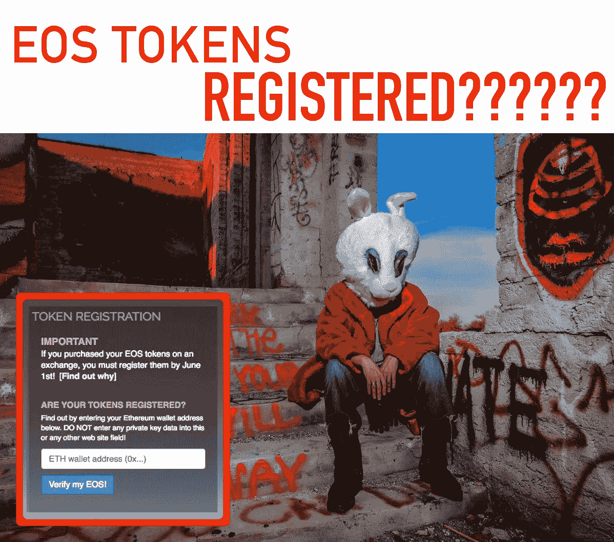

# 对于 EOS token 持有者来说，保持空投、token 注册和新闻更新的最佳网站是什么？

> 原文：<https://medium.com/hackernoon/whats-the-best-website-for-eos-token-holders-to-keep-updated-about-airdrops-token-registration-fb2c5ac7e090>

unsplash mixed with Ruben Alexander’s EOS art

**快速回答:**[**【https://eoscountdown.com/】**](https://eoscountdown.com/)

[EOS Countdown website](https://eoscountdown.com/)

# 如果你像我一样，你可能正在试图找出哪个 EOS 网站可以让你了解最新的价格变动、EOS 区块链上的令牌空投、最新的 dApp 项目、令牌注册验证工具和社会新闻。

去中心化的好处有时也会导致很多困惑，因为在互联网上搜索关于 EOS 的有用信息会让我们发疯，浪费我们的时间。我一直试图拼凑各种关于 EOS 的新闻，但今天我终于找到了一个非常好的网站，它包含了我所需要的 90%。 [EOS 倒计时](https://eoscountdown.com/)，[https://eoscountdown.com/](https://eoscountdown.com/)由软件开发商杰森·霍奇斯(Jason Hodges)打造，它几乎拥有你需要的所有 EOS 新闻和信息，以导航即将于 2018 年 6 月诞生的 EOS 区块链。

# 如何查看我的 ETH 地址是否已注册到 EOS？

unsplash

> 我是否在 EOS 区块链正确注册了我的以太坊地址，我的 EOS 令牌是否将在 2018 年 6 月 1 日全部设置好？

您可以使用网站上的工具检查您的 ETH 地址的注册状态:

[https://eoscountdown.com/](https://eoscountdown.com/)

该部分包含在标题**令牌注册下。**

你所要做的就是把你的公共以太坊密钥放进搜索框，你就会知道你的 ETH 地址是否已经注册到 EOS 链了。记住只放入你的**公共**密钥。永远不要放你的私人钥匙。

如果您尚未将您的 ETH 地址注册到您的 EOS 地址，请观看此视频了解如何注册:

## 不要拖延，2018 年 6 月 1 日是最后期限。

# 我如何能跟上所有的 EOS 新闻？

art by [Yusaymon](https://steemit.com/cryptoart/@yusaymon/cryptopack-eth-btc-eos-mixed-media-by-yusaymon)

EOS 倒计时网站非常棒，因为你需要的所有链接都包含在**社会反馈**部分。

另一个非常有用的部分是**即将到来的事件**，在其中我刚刚得知，对于钱包中有超过 100 个 EOS 的 EOS 令牌持有者，将会进行另一次空投。下面是来自 *eosDAC* 、[https://eosdac.io/tokens/](https://eosdac.io/tokens/)的更新，这是对 EOS 持有者的最新象征性空投:

> “75%的 eosDAC 代币(900，000，000)已分配给 EOS 代币持有者进行空投。在 EOS 众筹日 300 天结束时(2018 年 4 月 15 日 01:00:00 UTC ),持有超过 100 个代币*的所有 EOS 代币持有者将获得 1 个 eosDAC 代币，这些代币将直接转移到他们的以太坊(ERC20 兼容)钱包中。在这个日期之后，在我们进行了必要的测试和检查之后，将尽快进行真正的空投。”—[https://eosdac.io/tokens/](https://eosdac.io/tokens/)

EOS 火车正在快速移动，今天我注意到唯一的硬币远在积极的绿色土地是 EOS。我在 Twitter 列表中收集了所有的 EOS 项目和账户，所以你可以跟着我去订阅这个列表，这会节省你大量的时间。

我还会写一篇关于即将向 EOS 持有者空投的文章，到目前为止总共有 3 次。

干杯，
Stellabelle