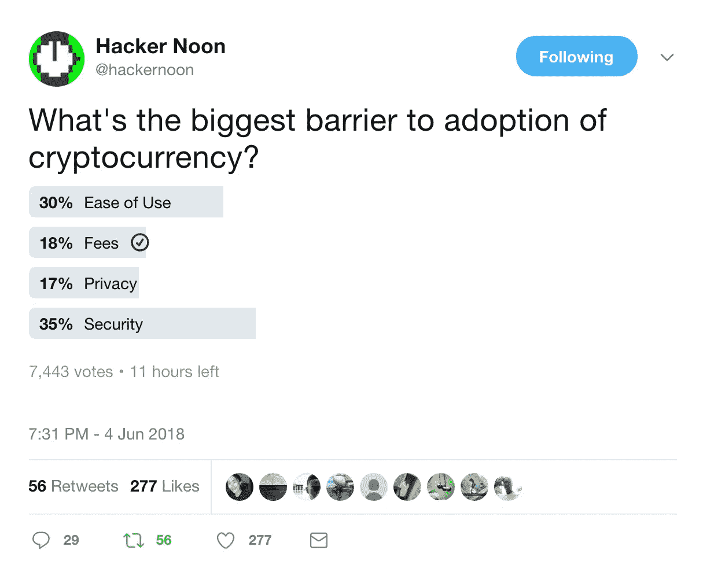

# 采用加密的最大障碍是什么？

> 原文：<https://medium.com/hackernoon/whats-the-biggest-barrier-to-crypto-adoption-72c22c75193f>

## **本周深度潜水**

[**Sharding 通过向你出售调入伪装成调出**](https://hackernoon.com/sharding-centralizes-ethereum-by-selling-you-scaling-in-disguised-as-scaling-out-266c136fc55d)by[stopandcrypt](https://medium.com/u/cbbfa20339f2?source=post_page-----72c22c75193f--------------------------------)来集中以太坊

## 关于 GITHUB 更多信息

[**微软+ Github**](https://hackernoon.com/five-quick-thoughts-on-microsoft-github-b3563722e856) 创始人集体[的五个快速思考](https://medium.com/u/f49435c6fa9?source=post_page-----72c22c75193f--------------------------------)

[**微软与米切尔·路易斯**](https://hackernoon.com/microsoft-and-the-octosition-d3eebcabdc71)的合作

[**微软收购 GitHub:下一步怎么办？**](https://hackernoon.com/microsoft-buys-github-what-next-fc05f0bd3e17) 由[迈克尔·j·博士翻拍](https://medium.com/u/3bc0ac239206?source=post_page-----72c22c75193f--------------------------------)

[**为什么微软收购 Github 完全有道理**](https://hackernoon.com/why-microsoft-buying-github-totally-makes-sense-dd5b3d8a3bac) 作者[przemyslaw Mroczek](https://medium.com/u/4a63f775e632?source=post_page-----72c22c75193f--------------------------------)

为什么 GitHub 这么值钱？ [**阅读更多。**](https://hackernoon.com/search?q=github)

## **续作**

当一个伟大的故事结束时，谁会开心？以下是一些伟大系列的最新更新:

[**一个秘密交易者的日记——第 10 周；恒星**](https://hackernoon.com/a-crypto-traders-diary-week-10-stellar-2c9dff7112e1) 作者[大卫·吉尔伯森](https://medium.com/u/f735d3b0f2f3?source=post_page-----72c22c75193f--------------------------------)(如果你不想错过任何一个故事，我们为这个令人敬畏的系列制作了 [**专题页面**](https://hackernoon.com/crypto-traders-diary/home) )

[**更屎的产品经理说**](https://hackernoon.com/more-shit-product-managers-say-f8f480448057) 作者[斯蒂芬·科涅塔](https://medium.com/u/829d5c865a60?source=post_page-----72c22c75193f--------------------------------)(他的失控打击的后续 [**屎的产品经理说，译**](https://hackernoon.com/shit-product-managers-say-translated-1628d08aa7dd) )

## **长期加密思想……**

[**以太坊留在这里的 4 个理由**](https://hackernoon.com/4-reasons-ethereum-is-here-to-stay-75b88c7d639f) 作者[雷扎·杰费里](https://medium.com/u/233a3800c90b?source=post_page-----72c22c75193f--------------------------------)

[**我的《中本聪是谁》**](https://hackernoon.com/my-take-on-who-satoshi-nakamoto-is-e9e2bea38058) 作者

## [**PM 提示**](https://hackernoon.com/product-management-life/home)

[**优先考虑“非特色”工作和持续改进**](https://hackernoon.com/prioritizing-non-feature-work-and-continuous-improvement-bad2a612d860) 作者[约翰·卡特勒](https://medium.com/u/4c3f4fe11e6b?source=post_page-----72c22c75193f--------------------------------)

## **新产品**

[**现在你可以直接支持互联网上的内容**](https://hackernoon.com/you-can-directly-support-content-all-over-the-internet-706072f301b)[肯尼李](https://medium.com/u/f9523f18e303?source=post_page-----72c22c75193f--------------------------------)(敬请期待——我们很快会有一些有趣的消息宣布)

加密借记卡是采用加密技术的下一步。 由 [Shaurya Malwa](https://medium.com/u/ff2918a83de9?source=post_page-----72c22c75193f--------------------------------)

# 直到下一次，不要把世界的现实想当然。

**附言**[照片推文署名](https://twitter.com/hackernoon/status/1003826727892574208)，转自[AMIpolls.com](http://AMIpolls.com)

(到目前为止)六月最佳故事(T22)。