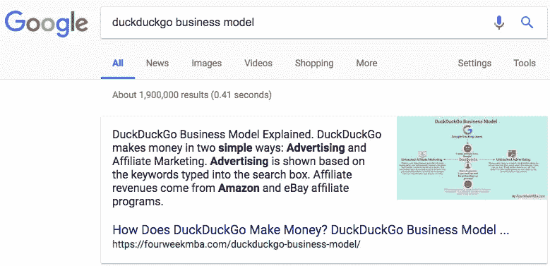
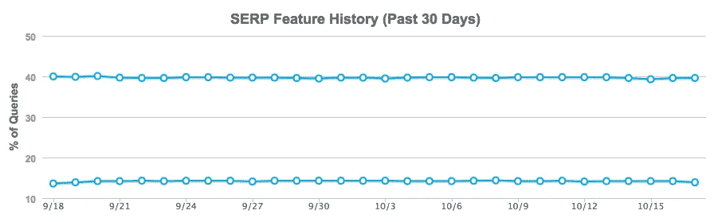
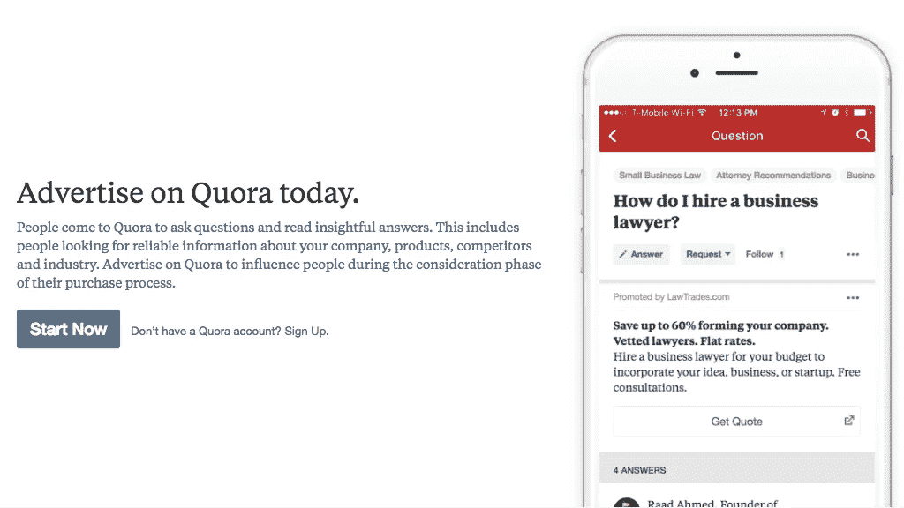

# Quora 的业务是什么？这是关于问正确的问题

> 原文：<https://medium.com/hackernoon/whats-the-business-of-quora-it-s-about-asking-the-right-question-7f6049d9b12e>

## 许多人认为 Quora 的主要资产是该平台提供的答案库。然而，真正的交易是 Quora 能够收集的问题库。这个问题库不仅对吸引用户至关重要，对其商业模式也是如此。如果 Quora 不能让人们问正确的问题，整个公司都将处于危险之中。

# 商人的回答

如果我要比较 Quora 广告网络，我会把它比作谷歌，而不是脸书。Quora，就像谷歌试图组织信息一样。他们用不同的方式做这件事。谷歌允许你搜索任何东西，并通过一个由许多部分组成的大规模算法，找到与现有付费内容(广告)和有机内容(它可以抓取、索引和排名的任何网站)的完美匹配，这也利用了人类质量评级。

Quora 试图以问题的形式将信息与愿意回答这些问题的人匹配起来。虽然它是一个问答系统，Quora 也利用搜索来检索存储在其数据库中的大量问题。

这里的相似之处在于，谷歌和 Quora 都试图回答尽可能多的问题。事实上，谷歌越来越倾向于以[特色片段](https://fourweekmba.com/what-is-seo-hacking/)的形式给用户直接答案:

*一个谷歌特色片段的例子，提供了一个搜索“DuckDuckGo 商业模式”的直接答案*

换句话说，谷歌“决定”什么时候基于特定的关键词提供直接的答案是有意义的。谷歌现在的优势在于它已经成为一个强大的语义引擎，能够提供大量的答案。正如 [MozCast](https://moz.com/mozcast/features) (基于一组 10k 次搜索)所示，这些直接答案在人们搜索某样东西时至少出现了一半时间:

**来源** : MozCast *在一个 10k 搜索集合上，Mox 展示了特色片段和知识面板(Google 的两个旨在提供直接答案的功能)如何在一半的时间里提供答案*

另一方面，Quora 也试图就任何话题提供尽可能多的答案。简而言之，网络正在从一个你可以找到任何内容的地方，变成一个你可以找到任何问题的答案的地方。

虽然谷歌和 Quora 为用户寻找答案，但它们的方式完全不同。谷歌在用户可以问的问题方面没有问题。这是所有的方式。由于谷歌是最大的人类搜索库，它现在正在微调其搜索算法，使其能够为任何问题或关键词提供答案。

相反，Quora 让人们回答任何问题，并使用其算法将问题与可能提供答案的人进行匹配，但它必须确保人们不断提出有趣的问题，但对谁来说有趣？

# Quora 试图微调其商业模式

由于 Quora 的商业模式偏向于用户生成的内容，所以对 Quora 来说继续生产相关的内容是至关重要的。然而，这个难题还有另一个关键部分:广告。

在货币化方面，Quora 的[商业模式](https://fourweekmba.com/what-is-a-business-model/)基于两个主要基础:

*   投资者，通过退出或 IPO 寻求投资回报
*   出版商/在线企业通过广告寻求投资回报

既然 Quora 已经推出了广告计划，毫无疑问，该公司正在加倍努力:

机制很简单。你建立了你的账户，你的副本，选择了你的受众，只有当人们点击广告时你才付费！

这个逻辑和 [Google AdWords](https://fourweekmba.com/google-business-model/) 相差不远。然而，正如我在这篇博客中多次强调的那样，商业模式比货币化战略要复杂得多。因此，为了 Quora 商业模式的成功，它需要将几个移动的部分结合在一起，使其[商业模式](https://fourweekmba.com/what-is-a-business-model/)最终可持续。

当谷歌成功地在付费结果和有机答案之间找到平衡时，它就成功了。这是通过两个主要网络实现的， [AdWords 和 AdSense](https://fourweekmba.com/google-business-model/) 。Quora 现在正试图从一个不同的角度找到同样的平衡。

你可能认为 Quora 的核心问题是让人们在平台上回答问题。在这种情况下，对 Quora 来说最重要的是确保人们不断提问，从而产生广告收入。事实上，从商业角度来看，让平台保持活力和可行性的是它解决人们感兴趣的问题的能力。因此，这不是回答任何问题的问题，而是提出正确的问题！

但是你如何确保人们问正确的问题呢？

# 问题商家:Quora partners 计划以及为什么它对其商业模式的成功至关重要

> *根据问题产生的广告收入比例，问题将获得报酬。这是他们回答得如何以及有多少人觉得他们有趣的结果。你问一个问题之后，你会在这个问题上赚 1 年的钱。*

这就是 [Quora](https://help.quora.com/hc/en-us/articles/360000673263-Partner-Program-Frequently-Asked-Questions) 在其合作伙伴计划页面上所指定的。换句话说，Quora 希望利用货币化和经济激励让人们写出引人注目的问题。因此，该公司提出了一个很好的观点:价值(包括商业价值和非商业价值)在于用户提出的问题。

根据 Quora " *的规定，该计划目前只接受邀请*，*，但随着时间的推移，我们打算向更多人开放。*”

如[公告](https://productupdates.quora.com/Quora-Partner-Program-Beta)所述:

> 好的问题页面是让 Quora 成为作家和任何想更好地了解世界的人的好地方的基础。今天，我们很兴奋地分享一个新计划，它将有助于确保 Quora 始终提供最有趣和最有用的问题。Quora 合作伙伴计划将补偿参与者添加世界上许多人可能有的好问题。

这听起来可能很违反直觉，可能会让那些花大力气在 Quora 上制作内容的人失望，但事实是，问正确的问题是 Quora 商业模式的第一推进器。如果人们不停地问一些愚蠢的问题，不管这些问题多么富有哲理，多么有深度，都没有人会愿意去读(就像一本封面不好或者书名不对的书卖不出去一样)。

这个项目会成为 Quora 商业模式拼图中的关键一环吗？

*原载于 2018 年 10 月 17 日*[*【fourweekmba.com】*](https://fourweekmba.com/quora-partner-program/)*。*