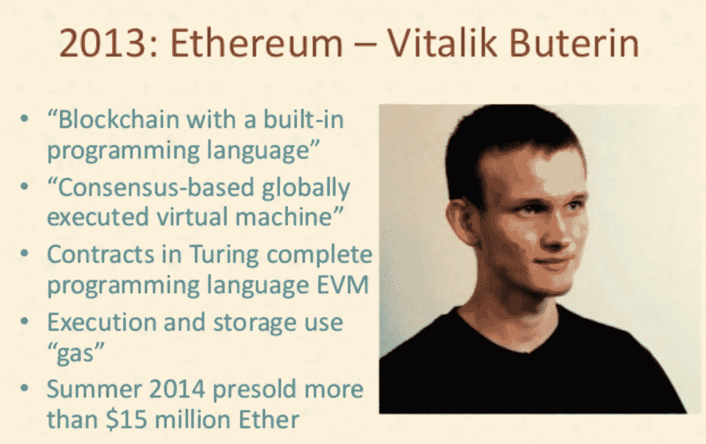
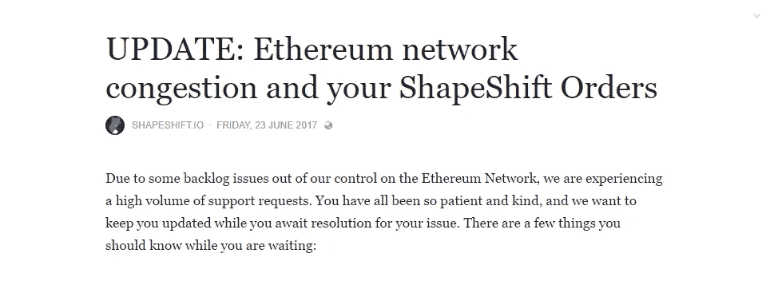
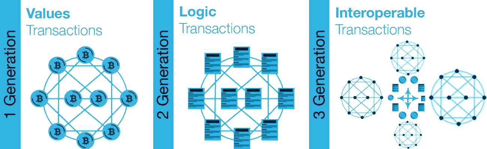

# 区块链技术的下一步是什么？

> 原文：<https://medium.com/hackernoon/whats-the-next-step-in-blockchain-technology-f479c425027a>

## 定义第三代区块链技术的真正主题会是什么？

在区块链技术中有很多新的有趣的项目和观点，每个人都在试图开发下一个大东西，并试图自称为第三代区块链技术，有人甚至将主题-自我*“第四代区块链技术”*像 [**多元宇宙**](/swlh/this-is-what-a-4th-generation-blockchain-looks-like-685c5edf34ed) ，这无疑是一个伟大的项目，但在他们的交流中存在巨大的误解。PS:这是我对它的回应:[https://medium . com/@ alet 89/mmm-EOS-is-haul-more-scalable-and-product-90-ready-the-fourth-gen-is-a-joke-you-serious-you-serious-1ff 986 CAD 294](/@alet89/mmm-eos-is-already-more-scalable-and-product-90-ready-the-fourth-gen-is-a-joke-are-you-serious-1ff986cad294)

## 定义一代里程碑

为了理解这一主题，我们还需要思考区块链技术的演变:

*   第一代:分散交易和分类账的转移价值[比特币，Dogecoin，莱特币，比特币现金，Monero，Dash，Verge 等。].
*   第二代:通过分散交易、分类帐、应用程序和数据转移价值和逻辑。
*   第三代:？？？？

如果我们定义像 EOS，NEO 甚至 Multiversum 这样的项目，第三代区块链就像把 BitcoinCash，LiteCoin 或者 Monero 称为第二代，因为它们是比特币的改进(不管好不好)或者是为特定用例设计的项目。

莱特币旨在实现可扩展性，比特币现金旨在提高区块大小并试图成为支付标准，Monero 旨在实现基于隐私的交易等等…

一代里程碑是指通过一些新概念真正改变这项技术的东西，如以太坊概念如何开始第二代，引入智能合约和逻辑交易，以一种全新的方式将区块链作为一种操作系统，人们可以分散并以无信任的方式使用应用程序，而不是在集中的服装层上工作，而是在网络内部工作。

今天，区块链技术中谈论最多的趋势是可扩展性和去中心化，但与旧一代一样，这些主题是第二代概念的改进。

> 问题是下一步是什么？

## 第二代区块链限制了大规模采用

在第二代区块链技术中，开发和研究是巨大的，有许多项目试图开发尽可能最好的技术，以在其网络中运行去中心化的应用程序，每个人都有不同的观点和不同的杀手级功能，EOS 正试图尽可能扩大规模，DPOS 共识专注于 Dapps，以太坊正试图去中心化并通过等离子体连接公共区块链和私有区块链， Cardano 正在尝试开发一个专注于安全的网络，NEO 正在尝试使用 POS consensus，Nebulas 正在为开发者开发一个基于激励的区块链，等等。

> 就研究而言，这种情况令人惊讶，并且肯定在 2/3 年内，我们将有许多不同的区块链网络专注于特定领域，并解决不同的问题。

同时，如果你今天想建立一个分散的应用程序，你必须选择一个像以太坊或 EOS 等网络，你不能因为任何原因改变它，这就像一场婚姻，这对任何类型的业务都是危险的。一个例子是 2017 年以太坊网络中发生的事情。对加密 Kitties 的大肆宣传堵塞了整个网络，不幸的是，这不是可能发生的危险风险，如网络更新错误、分叉、黑客等，因为您的业务完全掌握在您选择的网络手中。

区块链不同于云，使用 AWS 或谷歌等常规云网络构建网络更具弹性，因为你可以将你的应用程序拆分到不同的网络中，或者随时随地以任何理由改变网络。在区块链领域，事情更加复杂，首先，没有改变网络的退出策略，也没有任何计划来解决这个可能发生的简单问题:

例如，您在以太坊网络中启动一个分散式应用程序，以一种 100%无信任友好的方式，有人会启动一个新的区块链网络，为您的业务更好地修复，或者以太坊进行了一些您不喜欢的更改，或者出于其他原因，您想为您的 Dapp 更改网络，但您不能。

是的，你可以创建一个 fork，但是 fork 是为区块链网络设计的，这是一个有用的方法，尤其是在价值交易中，当你处理逻辑时，事情会更复杂，你会有很多用户，fork 通常是为技术人员设计的，而不是为大众设计的，最后一个但不是列表，当你有用户和你处理逻辑时，你必须处理法规，在今天这种事情不是那么简单。这对小企业和大企业来说都是一个巨大的问题。

为了理解什么可能是第三代区块链技术，我们必须考虑一些新的东西，一个真正有意义的硬趋势，我认为这个硬趋势可能是互操作性。正如唐·塔斯考特所说:“

> 10 年后，今天的顶级加密货币，如果名单上还有三种，我会感到惊讶。有各种令人惊叹的新技术正在将各种区块链链接在一起，并创造各种新功能。像宇宙，波尔卡多特，永恒之塔或图标公司。这些是下一代公司，也可能是投资机会。”

第二代区块链网络是一种垂直网络技术，在这种技术中，您可以在历史上第一次使用去中心化的逻辑构建自己的应用程序，该技术的下一步是解决互操作性，并将区块链 2.0 与一种新技术连接起来，这种新技术的工作方式类似于 90 年代计算机的互联网。在我看来，这一概念对于开发基于无信任的去中心化应用程序至关重要，同时可以扩展这种技术，以运行互连和不可停止的应用程序，避免垂直网络的风险，根据特定需求使用更多的网络。

## 互操作性的概念

互操作性是将不同的区块链互连起来构建分散的应用程序的概念，这些应用程序与更多的区块链进行互操作，以分散的、不可信的方式传输值和逻辑。
区块链技术中的互操作性概念即将建立一个网络，旨在翻译一个 Dapp，并运行到更多的区块链 OS 中，以在不同的区块链之间传输逻辑和值。这听起来像是这项技术的一个新步骤，也是我为什么喜欢称之为第三代区块链技术的原因。

理解这个概念有多大的一个例子是思考“旧万维网”的演变，在这种情况下，第二代区块链网络就像一个拥有自己目录的电子商务，互操作性区块链网络就像一个平台，当你可以从不同电子商务的更多目录中购买物品时。

## 互操作性生态系统

互操作性领域的当前方法类似于 90 年代的内部网和互联网，它们可以分为两个部分:

*   **单操作系统互操作:**一种区块链网络，旨在构建私有/公共区块链，与同一操作系统(内部网)互操作并相互处理值和逻辑。
*   **多操作系统互操作:**一个区块链网络，旨在互操作不同的区块链技术，为不同的操作系统翻译功能，以在不同的技术和标准(互联网)之间处理值和逻辑。

内部网愿景已经启动，使用最多的项目是 Cosmos，“区块链互联网”。对于一些需要来自不同区块链的内部网的公司来说，这项技术很有意思。

内部网愿景和互联网愿景之间最有趣的项目之一是 Polkadot，由以太坊的联合创始人 Gavin Wood 开发，致力于不同区块链之间的互联性共识:

我专注于第二个愿景，即多操作系统互操作性概念，其中 AION、ICON 和万链等项目开发了互操作性联盟，以推动该领域的标准，帮助区块链网络和 Dapp 的开发人员构建技术，并在未来简化这种技术之间的互操作和过渡的弹性。

正如这篇官方帖子中所写:

> 孤立的区块链人无法相互沟通是分散化环境中经常出现的问题。孤立的区块链内部通信会给区块链的可扩展性和主流采用带来压力。
> 
> 该联盟的首要任务是合作研究链间交易和通信。该联盟将致力于开发通用行业标准、共享研究成果和协议架构。
> 
> 所有三个区块链项目的共同目标是连接区块链协议。ICON 是一个互连的区块链网络，无需额外的中介即可连接独立的区块链。Aion 的目标是成为用于这些区块链的通用协议，使更有效和分散的系统得以建立。Wanchain 是一个分布式金融平台，支持私有的、跨区块链的智能合同执行，旨在联合世界上孤立的数字资产。

 [## 区块链互通联盟:ICON x Aion x Wanchain

### ICON 已经加入“区块链互通联盟”。该联盟是由图标，永恒之塔，和万链支持，并已…

medium.com](/helloiconworld/blockchain-interoperability-alliance-icon-x-aion-x-wanchain-8aeaafb3ebdd) 

来自文章“[区块链互通联盟(BIA) —定义区块链 3.0](https://cryptovest.com/features/blockchain-interoperability-alliance-bia---defining-blockchain-30/) ”

> “ICON 项目最初是应我们的企业区块链客户的要求启动的，目的是与其他区块链网络互联。该联盟的目标是为连接区块链创建一个全球公认的标准，并将创新汇集在一起，”ICON 基金会理事会的 JH·金说
> 
> Aion 创始人 Matthew Spoke 表示:“我们相信，跨项目合作将有助于为区块链互操作性设定最佳实践，并鼓励企业和公众更广泛地采用这一技术。
> 
> “区块链互操作性联盟将在增加我们数字资产和生活的连通性方面发挥至关重要的作用，”Wanchain 总裁 Dustin Byington 说。

例如，放眼 AION 这个领域，这种区块链网络必须:

*   **联邦成员:**在不同的区块链技术(以太坊、比特币等)之间，以去中心化、完全不可信的方式传输逻辑(数据)和价值(密码)。
*   **规模:**为所有参与 Aion 的区块链提供快速交易处理并增加数据容量。
*   **发言:**支持创建定制的公共或私有区块链，保持与其他区块链的互操作性，允许出版商选择治理、共识机制、发行和参与。

Aion Network 的愿景是一个多层区块链连接集，以解决区块链作为“孤岛”的问题，从而扩大这项技术的规模以供大众采用。Aion 的首席执行官 m .谈到了这一愿景，他对这一技术的下一个十年很感兴趣，在未来，我们将看到许多专注于解决特定问题的新区块链，并与规模相关联。

## BAAM(区块链作为微服务)概念

这项正在重塑区块链生态系统的新技术，将改变我们为新一代可互操作的去中心化应用构建 Dapps 的方式，这真的可以改变每个行业，最终可能建立一个有竞争力的 web 3.0。

正如我在我的文章中所写的: [*理解由区块链和去中心化 AI 驱动的可扩展和验证数据的淘金热*](https://hackernoon.com/understanding-the-gold-rush-of-scalable-and-validated-data-powered-by-blockchain-and-decentralized-ee05db6b6a68)

> 互操作性基础设施允许开发人员以一种新的智能方式创建去中心化的应用程序，我喜欢称之为**“区块链即微服务”**
> 
> **“BAAM”概念，**首先它听起来很酷，类似于我们用微服务创建现代集中式应用程序的方式——基于每个功能的专用和可替换的 API。在 Dapps 中，我们将使用许多专注于特定需求的专用且可替换的区块链来执行每项任务。这种类型的基础设施将对这种技术的发展进行指数级研究，尤其是在新区块链集中在特定的用例上，而不会失去不可信的验证。

> BAAM 的概念可能在这一代人之后实现，它是区块链技术的一个巨大里程碑，最终可以击败企业或小企业以无信任的方式采用区块链技术的所有摩擦。