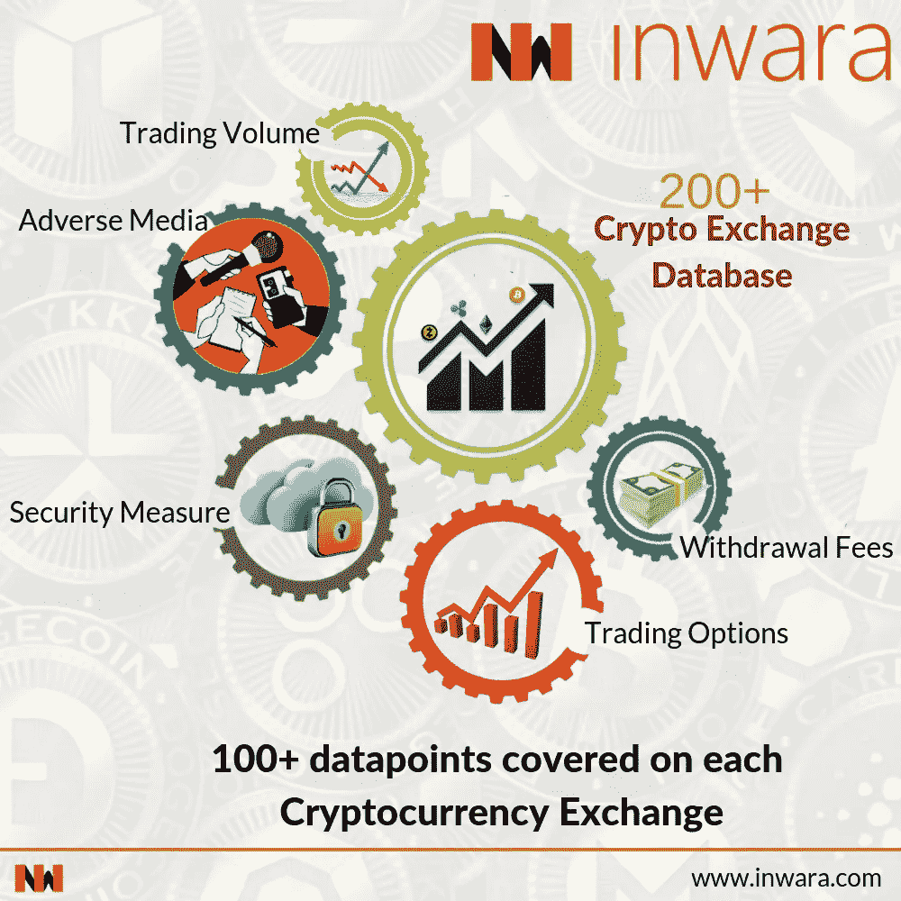
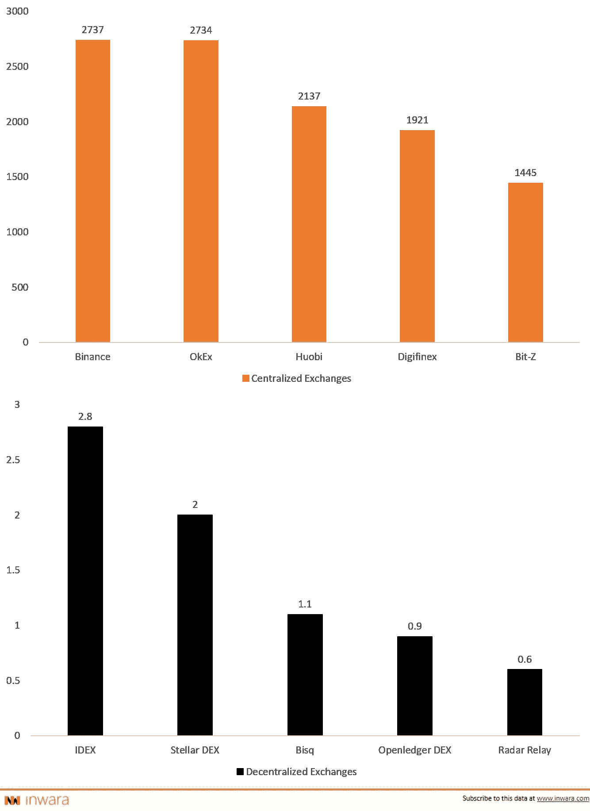

# 加密货币交易所的作用是什么？

> 原文：<https://medium.com/hackernoon/whats-the-role-of-cryptocurrency-exchanges-b37cc31f0b2c>

[*免责声明*](https://www.inwara.com/disclaimer) *:文章来源于* [*InWara*](http://www.inwara.com/?utm_source=exchangehacker&utm_medium=exchangehacker&utm_campaign=exchangehacker) *。这不是财务建议。*

随着比特币、以太坊和几乎所有加密货币每天都成为头条新闻，尽管市场暴跌，但越来越多的人正在加入加密潮流。而且，他们是通过加密货币交易所来实现的。

# 为什么交流？

> 流动性是简单的答案！

无论是散户还是机构投资者，每个人投资的最终目标都是实现投资回报最大化。对于能够使用机构级交易工具的专业交易者来说，投资一个需要详尽的 KYC 过程、拥有合法的负面媒体和无懈可击的安全技术的交易所才是务实的。

# 类型:集中式与分散式交换

区块链技术被设想为一种开源倡议，其中存在分散的权力分布，而不是将所有权力集中在一个单一的中央权力机构。然而，有一个例外，开发团队在项目路线图中有重要的发言权。与区块链的设想相反，集中交易和分散交易并存。

**集中交易**直接挑战区块链价值观，因为资产由一个单一的中央实体控制，这引发了严重的信任问题。简而言之，获取你所有资产/资金的钥匙在交易所，而不在你，平台的一个安全漏洞甚至技术故障都可能让你滚烫钱包里的所有资金化为乌有。

目前在密码领域，集中交易所(如[比特币基地](https://www.coinbase.com/)、[北海巨妖](https://www.kraken.com/)、[币安](https://www.binance.com/en)、 [Bitfinex](https://www.bitfinex.com/) 等)贡献了更大的市场份额。然而，有许多像币安这样的公司已经意识到了去中心化的重要性，并且正在努力尽快推出他们的去中心化平台。

> 另一方面…

**分散交换机**(如 [IDEX](https://idex.market/) 、 [Stellar DEX](https://stellarterm.com/) 、 [Bisq](https://bisq.network/) 、 [Openledger DEX](https://openledger.io/) 、[雷达中继](https://radarrelay.com/)等)采用区块链技术，以对等协议运行。这意味着该系统基于独立节点的数量，这些独立节点将在单点故障的情况下确保平台的功能。

## 集中式与分散式交换

流动性是分散式交易所的主要问题之一。目前，在分散的平台上，没有足够多的做市商可以吸引相当数量的买家，这就是为什么没有足够的流动性来与集中的平台竞争。

> 前 5 大集中和分散交易所，交易量(百万美元)比较！

Trading volumes in $MM ([Source: InWara’s crypto exchange database](http://www.inwara.com/?utm_source=exchangehacker&utm_medium=exchangehacker&utm_campaign=exchangehacker))

# 如何选择交易所？

与在特定时区运营的 YSE 或其他交易所不同，加密货币在全球范围内全天候交易，这是其波动性的主要原因之一。人们错误地认为，仅仅了解加密货币就足以确保良好的回报，但他们大多数人都忽略了这样一个事实，即了解你将用于投资/交易的交易所的进出情况也是至关重要的。

加密投资与你可能熟悉的投资银行、信用合作社或传统证券交易所完全不同。与加密货币交易所不同，加密货币交易所几乎没有自动防故障装置来保护你的资产，即使是一个小错误也可能让你失去一切。

当你陷入困境时，没有热线可以拨打，或者如果你失去了资金，没有公司总部可以联系，并且没有 FDIC 保险银行对这些投资的支持，这表明一个人可能会在没有任何追索权的情况下，因网络攻击而立即失去所有资金。

## 定义交易所可信度的方法

*   交易所遵循的安全措施应该足以抵御黑客的破坏企图。至关重要的是，交易所采取广泛的措施，如 2fa 验证、密码强度、反钓鱼代码功能、验证码措施等。
*   对于机构级投资者和风险资本家来说，掌握每个交易所提供的交易量数据，以选择符合其投资标准的交易所至关重要。
*   一般来说，如果提供的交易量很高，则交易所被认为是在顶部。
*   透明度是定义交易所可信度的另一个参数。特定交易所的不利媒体数据在做出选择时至关重要。
*   知道交易所的位置是至关重要的，如果你不能确定交易所的位置，这就是一个危险信号。很难找到一个合适的司法管辖区，在这种情况下，你可以起诉那些有违规行为的人。
*   在加密领域，以法定货币进行交易的交易所数量不到 10%，这可能会给尚未拥有任何数字代币的散户投资者带来担忧，在这种情况下，他们将不得不寻找一个以现金运营的交易所(如[北海巨妖](https://www.kraken.com/)、[比特币基地](https://www.coinbase.com/)、[双子星](https://gemini.com/)、 [Bitstamp](https://www.bitstamp.net/) 等)。
*   通常情况下，越安全的交易所交易费率越高，但当费用与保护进行权衡时，这一切都是合理的。
*   不是所有的硬币都在所有的交易所交易，所以最好是知道你选择的硬币上市的交易所。

[InWara 的](http://www.inwara.com/?utm_source=exchangehacker&utm_medium=exchangehacker&utm_campaign=exchangehacker)加密交易数据库是全球最大的加密货币交易数据库。该数据库提供了关于每个交易所选择的安全措施、其 KYC 进程细节、交易费用限额、交易量和接受的支付方式等信息。

这是一个详尽且经过验证的数据库，包含超过 200 个加密货币交易，每个交易包含 100 多个数据点。数据点包括负面媒体、安全黑客、交易量的实时跟踪和更新
、交易费用和 KYC 流程。

