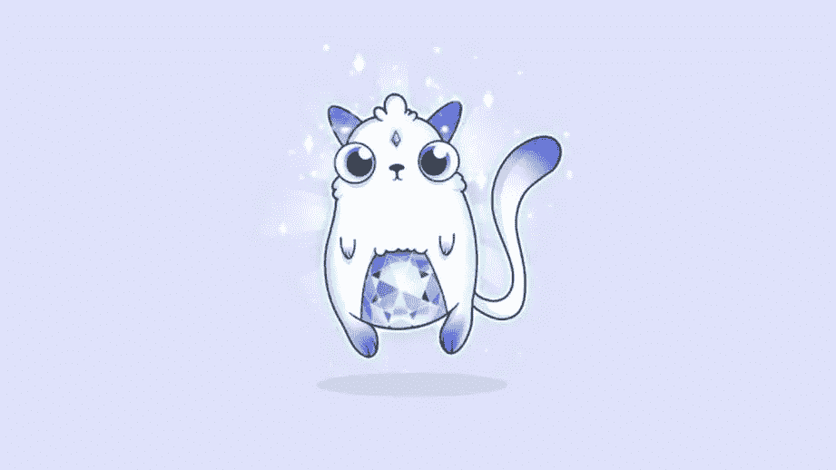

# 现有的密码游戏有什么问题？

> 原文：<https://medium.com/hackernoon/whats-wrong-with-existing-crypto-games-e7f2bfe4b3e4>

大约半年前，Crypto Kitties 推出，让每个人都很开心。大量的交易创造了超过以往最高纪录的便宜货日成交量。在此期间，我们正在进行 Lordmancer II ICO，由于大量的交易，我们遇到了有关以太坊网络的重大问题。

看起来 Crypto Kitties 正在成为一个真正的热门。有史以来第一个流行的密码游戏。然后，就在几个月内，许多新的加密游戏推出。所有这些游戏都宣告了区块链储存的资产。加密游戏即将彻底击败其他类型的游戏…

但是让我们仔细看看。有一些服务可以扫描加密游戏中玩家的活动。例如，[https://dappradar.com/category/game](https://dappradar.com/category/game)

如果打开它，您将看到如下所示的表格。

如你所见，Crypto Kitties 的日活跃用户数约为 500，所有 crypto games 的日活跃用户数合计约为 1000。同样，只有几千名用户玩任何一种加密游戏。而且这个数字从去年 12 月开始就没变过。

1000 个用户——这可能是一个非常中等水平的手机或网页游戏的每日观众。为什么这个数字这么少？

嗯，有很多原因:

1.  加密货币持有者的总数估计为 150 万，相比之下，游戏玩家的总数约为 15 亿。
2.  不是所有的密码拥有者都有乙醚。
3.  不是所有的以太用户都安装了元掩码，尽管这几乎是玩加密游戏的唯一方式。
4.  所有的加密游戏都是付费游戏。您的设备上安装了多少免费游戏？有多少付费的？

即使对熟悉密码世界的人来说，玩密码游戏也太难了！它是

还有一个原因。所有现存的密码游戏都不能称之为游戏。主要的，在大多数情况下唯一的“游戏”活动是收集。实际上，人们不玩它们，他们试图与小猫赌博。加密游戏很难玩，它们是“付费游戏”，更重要的是，它们根本不是游戏。

现有的区块链解决方案，包括以太坊，只能支持基本的游戏机制，如收集或赌博。每笔交易都要花很多时间和金钱。在我们有新的更好的解决方案之前，我们必须考虑创造结合区块链和古典建筑的游戏。

Lordmancer II 就是这种结合的一个很好的例子。一方面，游戏使用 ERC20 代币主币作为游戏内货币，供玩家之间交易。它为游戏中的物品带来了真正的价值。另一方面，每个人都可以很容易地开始玩这个游戏，因为一般来说这是一个免费的手机游戏。你不需要有一台电脑，元面具，甚至以太或主币来启动游戏。下载后就可以玩了！如果你决定使用 Lordmancer II 的加密货币相关功能，你可以购买一些 Lord Coins(是的，在那里你必须创建一个以太坊钱包并在交易所注册),或者通过向其他玩家出售游戏资源和物品来获得加密令牌。

Lordmancer II 将为密码世界带来新用户。玩家将有机会在加密货币领域“软”起步。让我们把密码社区变得更大！

Lordmancer II 现在正在公测，可以在 [http://lordmancer2.io](http://lordmancer2.io) 下载

在这里加入 Lordmancer II 电报社区【https://t.me/lm2ico 