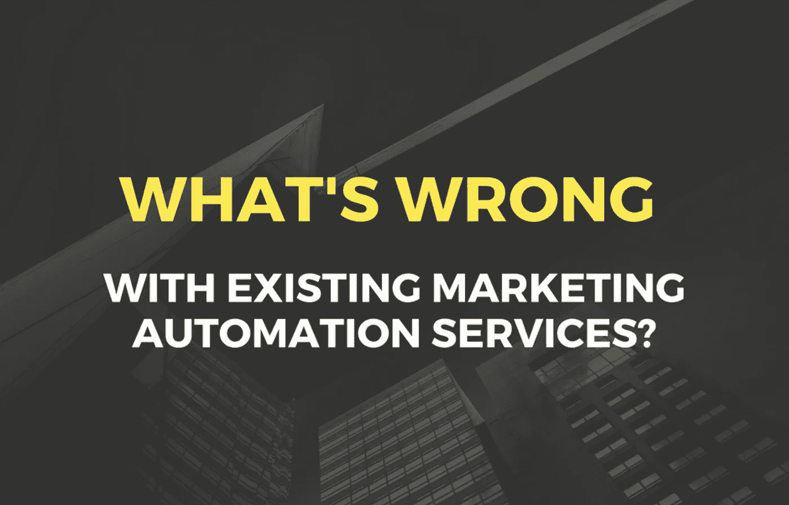
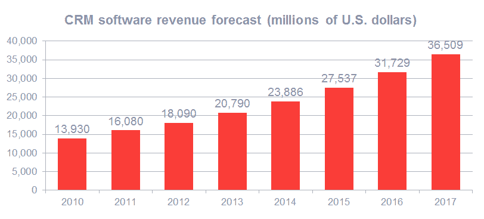
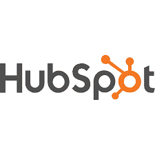
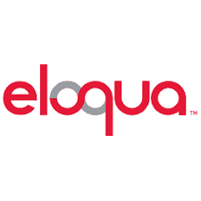
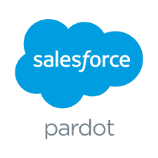
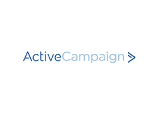

# 现有的营销自动化服务有什么问题？

> 原文：<https://medium.com/hackernoon/whats-wrong-with-existing-marketing-automation-services-86713bb6ed6a>

浏览最新的商业报告和全球概览，我们不断看到:

营销自动化是 2018 年的必然趋势。

这些不仅仅是一些报告，而是几乎所有的博客文章、研究、电子书。每周都有成千上万的文字被用来证明营销自动化是多么时髦。

# 营销自动化不是一种趋势

反正不再是了。在 2018 年，营销自动化是一个现实，一个既定的商业实践，这不是一个更好的选择，但往往是唯一的选择。营销自动化对于企业至关重要，就像空气对于人一样。我们都呼吸的事实并没有让呼吸变得时髦，只是证明了它的重要性。

**2018 年，营销等于营销自动化**

[根据 Grand View Research](https://www.grandviewresearch.com/press-release/global-marketing-automation-software-market) 的数据，截至 2017 年，全球营销自动化行业规模达 40 亿美元，预计到 2025 年将达到 76.3 亿美元。

[Gartner 表示](https://www.gartner.com/smarterwithgartner/gartner-top-5-marketing-predictions/)，自动化销售线索管理的公司将在 6-9 个月内实现 10%或更高的收入增长。 [Forrester 声称](https://www.forrester.com/home/0,6092,1-0,FF.html)，擅长潜在客户培育的企业以 33%的低成本创造了 50%以上的销售就绪型潜在客户。

*成功的公司是那些培育更多销售线索的公司。为了培养更多的潜在客户，公司将营销自动化。*

为什么当自动化行业处于巅峰并持续增长时，它仍被称为一种趋势？这不是什么“创新方法”，而是一种基本的竞争优势。在这个世界上，每个人都在自动化或考虑自动化，这些手动做事的人站在后面。2018 年就是这样。

# 营销自动化服务的优势

从头开始自动化是艰难的，如果不是不可能的话。营销是复杂的，因为这些过程不会自行运作。它们总是与销售、内容、客户支持联系在一起:市场营销会影响这一切。

为了避免混乱，同时试图在一切之上，有创造工具，专门致力于营销自动化。它们的开发正是为了将所有这些流程整合到一起，并将其统一到一个系统中，统一 KPI 并衡量最终结果。

**这些工具能满足我的特定业务需求吗？**

*营销自动化的创造者不知道我的业务，不知道我需要什么。*

很公平，他们没有。然而，营销自动化系统的开发是基于全面的统计和客户洞察，收集和彻底分析。基于一般的市场趋势，平台创建者看到了更大的图景——他们甚至可能看到你还没有注意到的可能性和问题。

无论如何，这就是我们的想法——我们将进一步观察这种方法是否总是有效。

# 有许多解决方案，而且它们似乎都有效

让我们分析一下最流行的几种的功能和可能性，并比较它们的容量。

**轮毂**

HubSpot 是发展最快的营销自动化解决方案之一，它将各种内容分发渠道和促销活动与通用管理系统集成在一起。该平台管理博客、搜索引擎优化、电子邮件营销、分析、客户联系和销售。HubSpot 是一个成熟的工具，用于将出站(垃圾邮件、电视广告、贸易展览、垃圾邮件)营销转变为出站方法，如电子邮件营销、社交媒体营销、搜索优化等。

**用户数量**:超过 18 万

**每月费用**:提供免费版本(可能性有限)，基本功能—每月 200 美元，专业—800 美元，企业—2400 美元+更多可能性的额外付款。

**Marketo**

Marketo 将自己定位为一个通用的营销自动化解决方案，可以自动化销售线索生成、电子邮件营销、移动营销、网站集成和其他数字化流程。主要软件功能包括登录页面编辑器、电子邮件编辑器、网上研讨会集成、预测内容生成、程序分析和工作流引擎优化。

**用户数量:**活跃在超过 19，000 个网站上，该公司在全球拥有超过 100，000 名用户。

**每月费用**:基础版——895 美元，专业版——1175 美元，精英版——3195 美元

**伊洛夸**

营销自动化平台，主要由 B2B 营销人员用于自动化数字营销、销售线索挖掘和客户支持。Eloqua creators 开发了一个数据库，用于存储客户信息，并为自动电子邮件活动、网站监控系统和客户管理平台提供数据。这是一个 B2B 营销工具的集合，其主要目标是自动引导培养和建立一个以客户为中心的战略。该网络控制着 700 个集成，拥有 500 个全球合作伙伴。

**用户数量:10 万+**

**每月成本:基本版—2000 美元，标准版—4000 美元，企业定制价格**

帕多

销售和营销优化的简单 B2B 营销自动化解决方案。其功能包括 CRM 集成、线索评分和培育、电子邮件营销和投资回报报告。这些自动化工具通过设定可衡量的目标并将他们的目标联系起来，从而将营销和销售团队团结起来。该软件跟踪客户集成，并根据客户的行为收集个性化的见解。

**用户数量**:280 万

**每月成本:**增长—1250 美元，升级—2000 美元，高级—4000 美元

**主动出击**

该软件为整个客户生命周期提供营销、电子邮件营销、销售自动化和跨渠道信息。该平台旨在创建每个企业客户的详细报告，分析现场行为，并在促销活动中使用这些数据。正如积极活动的创造者所说，是自动化在倾听和学习。

用户数量: 50 000

**每月费用**:取决于联系人的数量，1000 个联系人，lite 为 17 美元，plus 为 49 美元，professional 为 129 美元。用户可以开始 14 天的试用期。

# 现有营销自动化服务的缺点

营销自动化工具最紧迫的问题是从众多可用的解决方案中选择一个。标准的“试一试，看看什么最适合你”的解决方案在这里行不通——有成千上万的服务，怎么可能有人尝试所有的服务呢？然而，问题多于答案。营销自动化，现在的运作方式，并不奏效——至少，几乎没有达到公司需要的效率。为什么？

**简单来说，现有的营销方案让人不舒服。**

**问题#1 —价格**

即使软件有免费或精简版本，也不意味着你最终花费更少。程序是为了让你上瘾而设计的，但是当你走得更远时，它就变成了一个扫兴的人。无论是免费版还是精简版，都只能在很短的时间内使用，或者可能性很小，以至于企业在一周内就无法满足他们的需求。

也就是说，很明显，中小企业不能为一个平台支付那么多，他们也不应该仅仅因为高功能成本而限制他们的营销机会。强迫你在“高效”和“实惠”之间做出选择的平台是行不通的。

**为什么自动化软件最终变得昂贵而低效**

*   平台向你推销，但没有明确的结果。对于现有的营销自动化平台，你永远不知道你支付的是什么。没有保证的结果:如果没有线索，你还是要付费。因此，软件创建者没有动力去跟踪他们解决方案的效率。
*   很难找到专门为中小企业开发的软件。现有解决方案的创造者还在考虑与大企业合作，增加对中小企业所有者毫无意义的冗余功能。在这种情况下，中小企业所有者会遭受损失，为他们不使用的东西付费，但仍然缺乏必要的功能。
*   现有平台无法适应最近的技术创新。数字营销一直在变化。随着新技术的出现，自动化产品很快就会过时，从而失去关键的竞争优势。中小型企业的所有者为落后的服务付费，而不是为前瞻性的解决方案付费。

**问题#2 —现有平台集中化**

所有的数据、见解和工具都属于平台创造者。想想吧。你对收集的关于你的业务的所有信息没有权力，不知道为什么软件提供你这个特殊的工具来解决问题。基本上，公司失去了控制，营销流程变得遥不可及。

**有办法解决这个问题吗？**

是的，通过区块链技术，自动化解决方案可以被开发成分布式系统。这意味着所有数据将直接属于企业所有者，对收集的业务见解和客户信息拥有完全的控制权和权力。

然而，如前所述，现代解决方案目前实现最新创新的速度很慢，这严重阻碍了用户的发展。

**问题# 3——文字多于实际结果**

选择现有的营销自动化解决方案，企业主支付推广，而不是产品。使用这样的平台，你根本不知道它是怎么工作的，也不知道它是否工作。所有统计数据和效率指标都是由同一个解决方案提供的，因此有一个合乎逻辑的问题要问:

这些结果是真的吗？如果是的话，我怎么知道它们值得投资呢？

不幸的是，考虑到现有的解决方案，这个问题不可能用“是”来回答。你实际上无法衡量效率。即使目标没有达到，你也永远不会绝对知道是你的错还是平台的问题。

此外，我们不要忘记，所有的企业都是独一无二的。如果你的特定业务不成功，那么 50 000 人取得的进步又有什么关系呢？你的公司肯定和那 5 万人不一样，对他们管用的，不一定对你管用。考虑到营销方法的多样性，可以肯定地说，现在的公司比以往任何时候都更加不同。标准做法已经不存在了。

在 [Triggmine](https://triggmine.io/) 的时候，我们相信是时候革新营销自动化了。业务规模或当前利润额不应影响自动化服务的质量。每个公司都应该使用优化和个性化的解决方案，专门分析*的*需求，而不是其他五万家企业的需求。

未来已经来临。有了分布式系统，就有可能创造一个自由市场，在这个市场中，服务提供商将拥有无限的数据和营销工具。我们相信智能技术驱动的营销。要跟踪最新的自动化创新，请关注我们的更新。