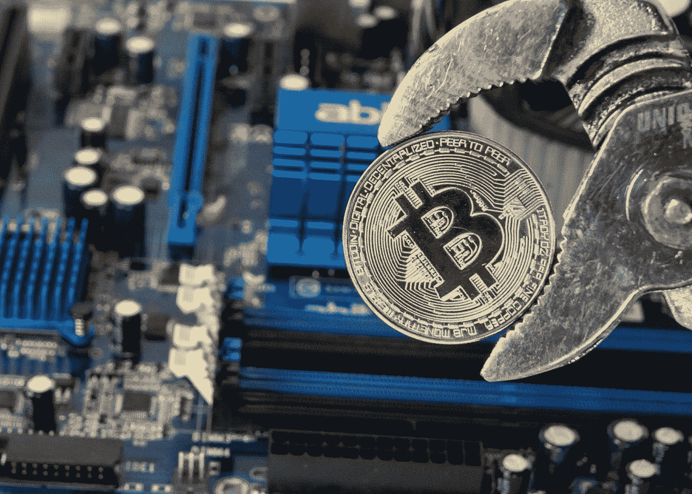
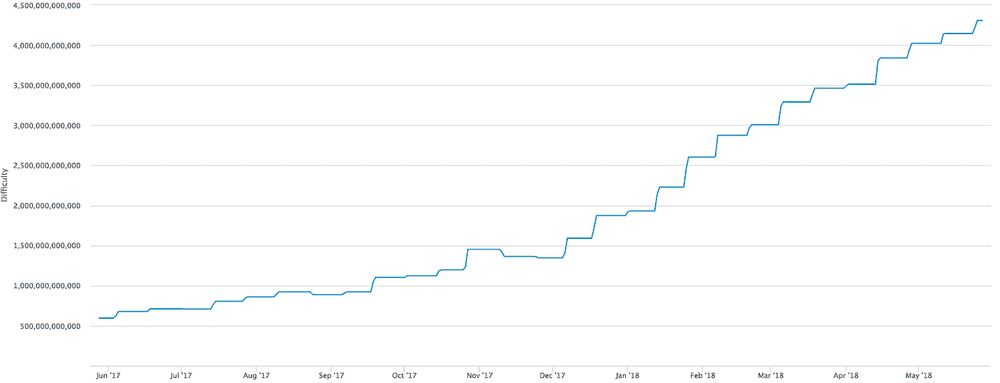
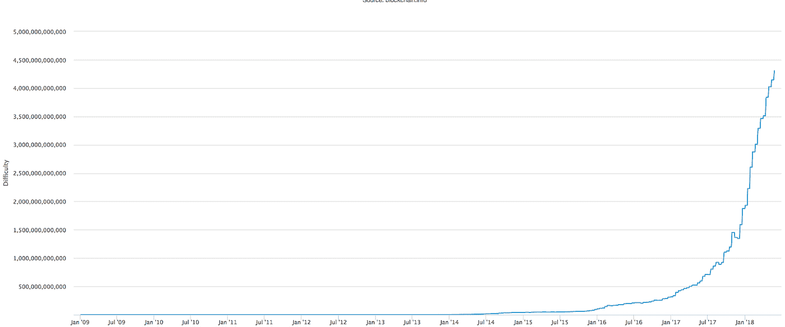
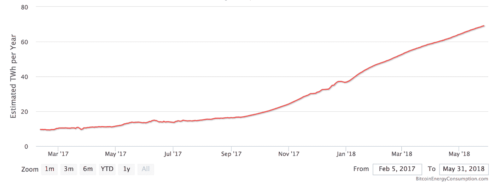
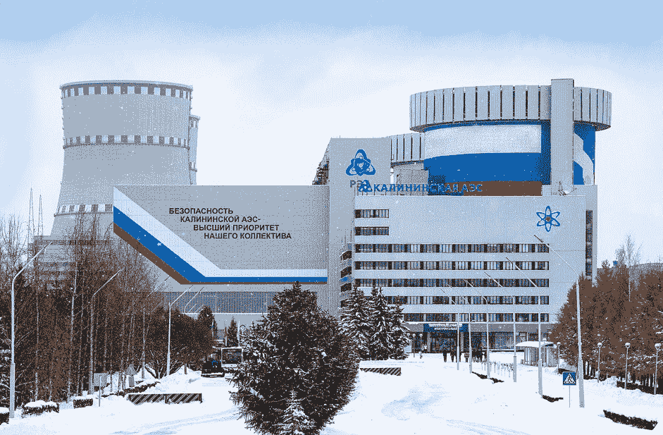

# 采矿出了什么问题？众筹和原子能如何解决这个问题

> 原文：<https://medium.com/hackernoon/whats-wrong-with-mining-and-how-crowdfunding-and-atomic-energy-could-fix-it-11a41d05ce30>

图片来源:[马尔科·韦尔奇](https://www.flickr.com/photos/149561324@N03/39043596200/in/photolist-22u9CTJ-EMRVVv-QVdAg3-ZDQmP6-258qZjY-CoqCPa-DSn1A9-ZUTF2w-DU3hpj-CoqCmg-RY9AEE-21XpUtE-22u9BMq-221Xcrg-CmLMxz-21XpTL7-ZDQqm6-24x6N2W-26GjtDQ-21Xq1pY-259oXCX-21XpFWA-ZFyVUe-H4EDuB-H4Eboc-222WBY8-222WEjk-H4Earc-B32SZk-ZWD8rd-21XpQkj-AyZbEh-ZDQ8uR-H4EjdR-Bz8uc5-25f3gTa-BbNe1E-Bd1RSi-AfVYRC-ZUUVs3-26c3FDj-H4EsvT-21XpJrL-DSmC33-221hn4F-BaHdCW-Be238D-ABkE32-BbKkLQ-Ag8dDV)， [CC BY 2.0](https://creativecommons.org/licenses/by/2.0/)

加密货币挖矿市场的现状相当复杂。报道[预测](https://www.prnewswire.com/news-releases/cryptocurrency-mining-market-projected-to-grow-674287173.html)其价值将从 2016 年的 6.1091 亿美元增长到 2025 年的 383.8 亿美元(年增长率超过 29%)。根据目前的统计数据，矿工持有所有比特币的 20%至 30%。

数据显示，对于新玩家和那些想从采矿中赚钱的人来说，还有一些空间。然而，随着竞争的加剧和流行硬币的复杂性，私人矿工的采矿利润正在萎缩。他们被迫不断地在当前的成本上工作——比如搬迁到房地产便宜、电费低的地方(比如已经很有名的密苏里州斯普林菲尔德),或者加入采矿池。

2018 年进入矿业市场并不是一件容易的事情。今天，我们将探讨当前的机会和最佳策略。

**私采:一块缩水的馅饼**

为了挖掘像[比特币](https://hackernoon.com/tagged/bitcoin)这样受欢迎的加密货币，你必须建立自己的强大硬件基础设施，或所谓的 ASIC 设备。根据技术特点，这种设备的价格从几百美元到几千美元不等。这个硬件也需要电力来工作和冷却。根据 Crescent Electric Supply Company[的估计](https://blog.cesco.com/blog/bitcoin-mining-costs-per-state)，开采一枚比特币的电力成本可能在 3224 美元至 9000 美元以上。

为了与在这个市场工作的公司竞争，私营矿商必须不断争取成本效益。他们一直在寻找降低成本的方法。虽然你找不到比市场价格更便宜的硬件，但你仍然可以找到一个地方，在那里租赁空间更便宜，电费比大城市更便宜。

不久前，一家政治媒体发表了一篇关于位于西雅图东部三小时车程的哥伦比亚中部盆地的加密繁荣的报道。该地区以拥有全国最便宜的电力而闻名，这种电力是由哥伦比亚河上的水电站产生的。因此，越来越多的矿工前往该地区建立他们的农场，并试图赚取一些东西——就像在淘金时代一样。

这种持续的生存竞争使得小型私营矿商更难专注于发展。他们很少有资源来分散他们的努力——统计数据[显示](https://www.jbs.cam.ac.uk/fileadmin/user_upload/research/centres/alternative-finance/downloads/2017-global-cryptocurrency-benchmarking-study.pdf)虽然 27%的大型矿商从事三个或更多的价值链活动，小矿商只能处理一个。

过去几个月来，比特币的挖掘难度持续稳步增加:

另一张图显示了最近一段时间的巨大增长(2017 年增长了 700%):

以太币或莱特币等其他热门加密币的挖掘难度也在稳步增长。市场上的玩家数量如此之多，以至于很难赚到钱。但是从建立自己的农场转移到云采矿很少有帮助，因为这种采矿的合同通常有限制潜在利润的限制(例如取款的高佣金)。

与私人采矿相反，工业部门最近显示出良好的统计数据。但是，这个小众也有自己的问题。

**工业采矿怎么了？**

不断增长的开支造成了只有大公司才能从采矿中获利的局面。有许多报告发现，仅比特币开采一项[就消耗了超过 159 个国家的](https://blockonomi.com/bitcoin-energy-consumption/)能源，约占全球总耗电量的 0.13%。

采矿的复杂性也在增加(如上所示)，这使得进入这个行业更加昂贵。因此，工业采矿公司蓬勃发展。据统计，矿工持有所有比特币的 20%至 30%，其中很大一部分掌握在企业手中。据分析师告诉彭博的消息，仅 Bitfury 一家就挖掘了超过 100 万枚比特币。

趋势是大矿商越来越大。例如，行业领导者比特大陆公司正在全球扩张，为其在中国的大型比特币矿场增加新设施。Bitfury 正计划生产便携式服务器农场，并在不同地区开设自己的新农场。

因此，市场将变得更加集中。甚至有人担心，很快大型矿商将控制足够的加密货币散列率来执行所谓的[51%攻击](https://bitcoin.org/en/glossary/51-percent-attack)，并将区块链的发展推向所需的方向。

很明显，加密货币挖掘市场的当前形式远非最佳。私营和工业采矿都有自己的问题和缺陷。这意味着还有改进的空间——这也是 [Atomine 项目](https://atomine.io/)背后的团队正在做的事情。

**采矿业的未来**

我们的目标是为私营和工业矿商找到新的融资机会。目前的形势让私人矿工几乎没有机会赚钱。但这可以通过引入新的方法来资助此类活动来解决。例如，私人采矿者可以利用众筹投资建设采矿设施，并从运营这一基础设施的公司的收入中获得一部分。

这就是我们在 Atomine ICO 期间提供的服务——令牌持有者将有机会分享企业的总利润并影响管理决策。

对于工业采矿，另一个改进的方法是寻找更便宜的能源。原子能就是这样一种能源。是的，我们已经设法与一家管理核电站的俄罗斯国有公司签署了一份协议。这给了我们一个稳定的、几乎取之不尽的能源来源，它不依赖于气候、天气和其他自然因素。

*Kalininskaya 核电厂——根据签订的合同*可用于采矿目的的设施之一

我们已经签署了一份长期供电合同，电价为每千瓦时 0.038 美元。根据协议条款，Atomine 已经可以使用高达 25 兆瓦的分配容量，并有可能在几个站点增加到 50 兆瓦。

因此，采矿成本可以显著降低，这为新参与者提供了一个真正的机会，从采矿大饼中分得一杯羹，并对抗工业市场的集中化。