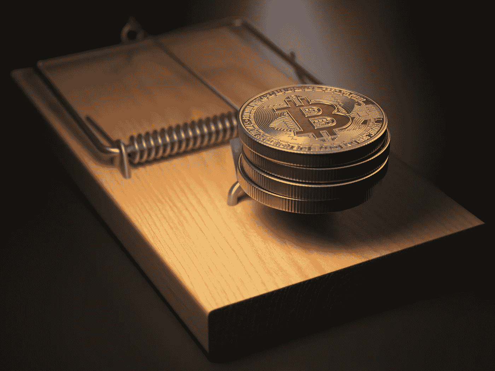

# 大多数 ico 都有什么问题，你能做些什么

> 原文：<https://medium.com/hackernoon/whats-wrong-with-most-icos-and-what-you-can-do-about-it-f037392ede6>

如果你像我一样，对[加密货币](https://hackernoon.com/tagged/cryptocurrencies)着迷了一段时间， [ICOs](https://hackernoon.com/tagged/icos) 可能会让你和我一样“呻吟”。我的意思是(其中大部分)从投资的角度来看根本没有任何意义。

无论如何，我发现自己访问 ICO 网站，这是经常发生的事情。

**我们这里有什么？这是什么？**

另一个 ICO 提出:“只是一个想法”，“只是一个具有潜在潜力的概念”。

或者更糟，这是一个:“没有任何实际的 ICO 或令牌的目的，但我们即将发布，或者有一天将发布惊人的产品，将使这个令牌的价格暴涨豪华 10.000 倍，所以你应该买它！”。

Pffffff。又浪费了我 10 分钟的时间！谁会投资这个？

***十四天后。***

让我再检查一下这个网站，哦，等等，他们得到了 2000 多万美元的资金，基于“只是一个具有潜在潜力的概念”。

尽管如此，ico 或实际上代币可能是发生在人类身上最好的事情。

# 那么从投资的角度来看有什么问题呢？

你看，在我之前的[文章](https://coincheckup.com/blog/ico-economy/)中，我写道，例如，初创公司，通常由天使投资人和风险投资公司资助。如果说这些人(尤其是风投)做了一件事，那就是尽职调查。

**他们会问一些非常基本的问题，比如:**

1.  这家公司以前是否得到过(另一家)知名风险投资基金(VC 公司)和/或天使投资人的支持？
2.  公司是否提交了完整的财务报表？
3.  该公司是否对其成本给出了见解？
4.  一个月要花多少钱(他们的烧钱率是多少)？
5.  公司是否给出其财务/增长预测和/或利润和增长预测？
6.  公司是否解释了其相对于竞争对手的优势(如果有)？
7.  公司是否有稳固的战略伙伴关系？
8.  公司有专利吗？
9.  公司以前是否发放过真正的股票(不是代币或硬币),而是真正的股份？
10.  公司有商标吗？
11.  公司是否以任何方式展示其销售计划/营销计划/走向市场战略？

因此，在研究超过 1500 枚硬币的同时，我们发现大多数问题的答案都是直截了当的没有或者不可追踪/不公开/或者也许只是:我们为什么要这样做？

换句话说，你不能对代币进行任何基本的尽职调查，你看不到它们的潜力，因为信息不公开和/或根本不存在，我们为什么要公开呢？

这就是 ico 和 tokens 的毛病。

图片来源:Cryptocoin Mastery

# 你是在告诉我我在投资“只是一个想法”！？

如今，大多数 ico 呈现的“只是一个具有潜在潜力的概念”。我这么说的意思是，他们“只是提出一个想法”。

> 如今，大多数 ico 呈现的“只是一个具有潜在潜力的概念”。我这么说的意思是，他们“只是提出一个想法”。给你个提示:创意是免费的！点击发微博

这太荒谬了，我把钱投资在一个想法上，我只希望他们真的能实现。让我们给这家公司 2000 万美元以上，看看他们是否可以实现。

我很好奇大多数 ICO 投资者是否真的意识到了这一点。

亲爱的每一个读到这篇文章的人！以防你不知道。创意是免费的！

你猜怎么着:

*   思想是自由的；
*   想法很容易；
*   想法只是在正确的时间，正确的时间，带着正确的烦恼，出现在正确的地方；
*   创意的价值是“0 ”,就像零一样，什么都不是！
*   你的大脑免费给你出主意！

但是我听到你在想，我有很棒的想法，我可以用它来建立一个数百万美元的公司，对吗？脸书，推特和谷歌是伟大的想法，对不对？

是的，你说得很对。例如，Twitter 和 Google 的创始人有一个伟大的想法，但之后他们就不再浪漫了。他们刚刚开始执行。

他们一次又一次，一次又一次，一次又一次的失败，一次又一次的失败，在每周 80 多个小时的工作中，他们做出了一个伟大的产品。

或者，也许他们工作并不努力，但可以肯定的是，他们确实在出色的执行中找到了商业上的最佳时机！

如果我们可以相信脸书的故事，马克甚至没有提出“脸书的想法”自己，但我们知道不会有像脸书是今天的脸书，否则，它会被称为 WinkleVossBook(或可能是一个不同的名字😛但归文克莱沃斯双胞胎所有)。

无论如何，他们似乎从脸书那里得到了一些不错的钱，但是说实话，那是因为他们只是适当地请了律师:-)。

# 还是不相信我？让我免费给你 50+个商业点子！

在我的一家创业公司 Nexibeo，我们免费提供 50 多个创业点子。

是啊，那一定是蹩脚的主意？

我不这么认为，它们从生活方式的商业概念(赚 10 万美元以上，环游世界或做任何让你开心的事情)到潜在的数百万美元的商业想法。我们甚至帮你分类了。这有多简单？

# 为什么我们免费提供这些想法？

因为我们知道我们不能对所有人都执行；

因为每一个好的想法都需要一个(或几个)全天候以这个想法为生的领导者！

因为我们知道，一旦有了一个好的领导者，我们就擅长围绕创业公司建立团队；

目前，因为我们正忙着帮助加密社区评级进一步发展 [CoinCheckup](https://coincheckup.com/) 。

请随时查看 [Nexibeo](https://www.nexibeo.com/) ，如果你认为你是发起我们任何想法的创始人，请告诉我们。我们将很乐意帮助你为你的创业成立一个团队。

如果你想采纳其中的一个想法，围绕它建立自己的团队，并在未来的 2-5 年内利用它建立一个成功的企业，那么我们将是第一个向你祝贺的人:-)。

# 抱怨够了，请解决！

我在这篇文章中咆哮豪华。老实说，那不是真正的我。我相信的一件事是:抱怨是为那些没有寻找解决方案的人准备的。

总之，没有抱怨就没有解决方案，所以我想是抱怨产生了解决方案。

一个可能的解决方案是 IPCO 模式。

# 去他妈的 ICOs，让我们试试 IPCOs

可能的新模式:更有意义的 ICOs 为什么我们不试试 IPCO？

我们基本上需要建立一个框架/标准，作为一个关于理想 ICO 应该是什么样子的加密社区。

我对 ico 的主要烦恼是，大多数 ico 呈现的“只是一个想法”，或者更糟:“只是一个具有潜在潜力的概念”。

在我看来:如果你要求人们投资，你最好在他们投资你的企业之前，向他们展示你确实能开发出高质量的东西。

我想提出一个模型，在这个模型中，我们实际上购买了一项服务/产品。一些已经在工作，而不是一周开发的演示，阿尔法或比这更糟。

# 你说 IPCO？

IPCO 代表:首次公开发行硬币。
在 IPCO 期间，公司以折扣价向公众提供其产品/服务或优质产品/服务，同时赠送代币，提供产品/服务或其周边的未来利益。

# 这个 IPCO 模型是如何工作的？

您购买了 ServiceX 套餐，就可以获得“免费代币”，这些代币以后可以用于:

*   延长您的订阅期限；
*   持有您的投资组合并分享例如 ServiceX 的利润；
*   在公开市场上与想以折扣价购买服务的人进行交易；
*   在公开市场上交易，只是为了投机，获取利润；

还有别的吗？亲爱的读者，我需要你的反馈。多谢😉

我在上面用软件作为服务的例子，但是这也可以是一个产品或者其他任何东西，在人们必须购买令牌之前，它实际上增加了人们生活的价值。

# IPCO 与 ICO 有何不同？

与 ICO 不同，您购买的是产品/服务，而不是“仅仅是一个想法”或“仅仅是一个有潜力的概念”或“一个未来可能增长的代币/硬币”。

与 ICO 不同，令牌是对订阅的补充，而不是相反。

因此，该产品需要从 IPCO 发布之日起为其用户/订户提供价值，并在 IPCO 发布之日后进行改进。

与许多 ico 不同，令牌应该用于产品中。就我个人而言，我有点厌倦了与产品/服务本身没有任何关系的硬币。

比特币和莱特币以及许多其他货币本身就是一种数字货币，它们创造了价值。如果有一种令人惊叹的新技术比这些硬币更好，他们可能有权拥有相同的价值主张，但我个人认为，目前我们有足够多的相同技术，我们需要区块链相关产品来使区块链成为主流。

与 ICO 不同，令牌的目的和价值主张必须非常明确。这是当前 ico 的一个问题。

在令牌的目的和价值主张变得清晰之前，您必须研究整个白皮书。

理想情况下，我希望看到 ico 提出创造性的模式，为其令牌持有者创造价值。

现在我听到你在想“还有其他 ico 有工作产品”，或者说他们会发布一个工作产品。他们中的一些人实际上可能已经落入了 IPCO 的篮子。

我个人非常高兴了解这些 ico，但我希望看到更多。这就是我提出 IPCO 模型的原因。

定义模型的目的是因为我已经厌倦了寻找那些 ICO 已经有了“真正的工作产品”甚至更好的“增加真实世界价值的产品”的独特案例。

# IPCO 与众筹你的产品/服务有何不同？

与你在众筹网站(比如 kickstarter.com)上为 IPCOs 购买的产品不同，你应该:

*   直接获得(早期)产品。大多数时候，你在众筹网站上购买的产品并非如此。我还在等我去年订的那副花哨的耳机，本来应该去年四月就送到的。
*   获得代币，为产品本身带来未来利益。

产品本身不够好，如果问我个人看法。

CompanyX 要求人们投资于他们产品/服务的第一个版本，而 CompanyX 并没有给他们任何回报。

CompanyX 向你寻求信任，他们给你的唯一东西是产品或服务的第一个版本。为什么不给那些信任你的人更多的奖励呢？

# 公开交易贵公司代币的潜在收益和能力。

在代币发明之前，这是不可能的。正如我在之前的一篇文章中所描述的，代币使得任何交易成为可能。

代币使得让市场决定你的代币的价值成为可能，市场总是正确的，所以在我看来，这是一件伟大的事情。

# 更多的(IPCO)标准会让我高兴

因此，在集思广益时，我提出了一些我个人希望在当前 ico 中改进的标准。

您当前购买的 IPCO 产品可能会从当前版本升级。由于这是一个“初始产品提供”,所以重点仍然应该是“初始”,因此应该始终为 IPCO 提供一个路线图，公司应该承诺在一段时间内根据该路线图发展其产品，除非“不可抗力”阻止公司发展，或者除非“公司及其代币持有人有更好的机会”。

IPCO 的发起人必须提供该产品的试用版，以便潜在买家在 IPCO 阶段可以根据事实决定是否购买该产品。

依我看，这是有道理的。如果有人甚至不能使用产品的试用版，你为什么要强迫他们使用这个产品呢？

IPCO 中给出的令牌应该给产品本身带来未来的好处。

除了我在本文中提出的想法之外，IPCO 应该为它的订户/令牌持有者提供更多。一些可能的想法:

*   获得产品的特殊功能；
*   附加服务折扣
*   与产品开发相关的投票权(路线图上的项目)
    还有别的吗？亲爱的读者，我需要你的反馈。多谢😉

# 如何从这里继续前进？

我真诚地希望这篇文章能引起一些关注。不是因为个人原因，而是因为我希望更多的人愿意分享他们对“更好的 ICO 模式”的愿景

在我的下一篇文章中，我可能会写我希望在 ICOs 或 IPCOs 中看到的透明度。

如果你把你的钱给一家公司，你应该能预料到他们会用你的钱做什么。

> 如果你把你的钱给了一家公司，你应该能预料到他们会用你的钱做什么。点击推文

我不认为你需要知道所有的细节，但我看到 ICOs 提到: **10% —营销计划**

这对我来说是个笑话。如果 CompanyX 的 ICO 产生了 800 万美元，他们真的会投资 80 万美元用于营销计划吗？？？即使他们为你的营销计划雇佣了奥美，你的花费也会更少。

我们只是需要更多的透明度，不管怎样，以后会有更多的透明度😉

请分享你对理想 ICO 的愿景。请与我分享你对你投资的 ico 的期望。请在评论中回复！🙂

另一个问题:你和我一样对加密市场感到兴奋吗？

如果你能帮我，让我知道你对我们创业的想法，那就太好了:[CoinCheckup.com](https://coincheckup.com/)

*原载于 2018 年 4 月 25 日*[*【coincheckup.com*](https://coincheckup.com/blog/whats-wrong-with-icos/)*。*