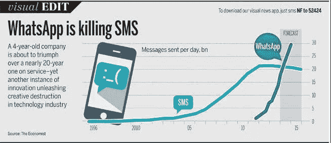
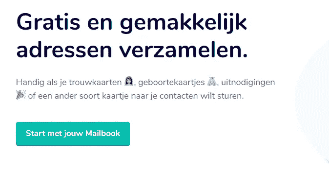

# Whatsapp 是你的生态系统或记录器

> 原文：<https://medium.com/hackernoon/whatsapp-as-your-eco-system-orchistrator-730d92db1ba8>

**whatsapp 在服务业的崛起**

自从 2009 年初 whatsapp 在[开发](https://hackernoon.com/tagged/development)以来，我们还没有看到多少基于 whatsapp 的新产品和服务。它自己的产品扰乱了信息市场

但是他们似乎忽略了它在其他领域的价值。当然，核心的主要焦点是让消费者不用为信息付费，这样我们就可以整天交流。
它需要的只是 3g、端到端加密和一部智能手机。然后脸书发生了，他们花了 19 亿美元买下了它。两年后，在世界的另一端，一家名为腾讯的公司创建了微信。

**你知道微信在 app 里面连接了 580.000 个迷你程序吗**

微信以消息服务起家，但他们已经转变为一个服务 10 亿人的平台。微信是一个很好的例子，说明一个产品如何转变为一家采用杀手级 api 策略的公司。从订阅到服务账户，微信是一个完整的平台，可以与第三方 api 协同工作。这允许用户在平台上构建和部署他们自己的应用程序。他们有一个非常开放的生态系统，用户可以在其中使用自己的服务。我喜欢的一个 whatsapp 荷兰服务例子是来自 Bram Kanstein 的 mailbook。当你想发送卡片或邀请时，它的服务可以方便地从朋友和家人那里收集地址。

但是有了微信，我们可以做得更多。

1.  **金融服务**

**2。医生预约**

**3。公共交通**

**4。网店**

**5。忠诚度计划**

**6。搜索引擎**

突然之间，一个消息应用程序变得不仅仅是发送信息，而是变成了一个“ ***动词*** ”，并且可以是隐藏在消息中的任何东西。(就像，让我们用谷歌搜索一下)这让我们的消费者可以在一个完全不同的层面上发布信息、交易和对话。这也意味着公司之间可以进行不同的交流。它的 API 相互交流，开发者成为销售人员，消费者成为产品，我们为公司创造的价值就是数据。

## 更简单的说，我们可以在一瞬间发送信息、检索信息、购买信息、出售信息。

让我们深入到对话式商务中，围绕社交信息的世界正在发生变化。电子商务是一个发展速度足够快的领域。我们需要更好地理解这些概念来思考它们。趋势像:聊天机器人，whatsapp，api 经济，聊天机器人。

**微信内部的多平台战略？**

让我们去掉微信的营销层，看看平台的功能层。它提供了公共 api、私有 api，但更多的是杀手级的多平台策略。仅仅阅读像*、【平台革命】*这样的书是一个很好的开始，但这仅仅触及表面。这是什么，但不是如何。深入下去你会发现一些有趣的东西。腾讯让多家公司合作，利用彼此的网络效应。这意味着所有实体都用于利用彼此的资产和能力。为了阅读更多的材料，这是我发现的一篇论文。

【https://www.ijsr.net/archive/v6i3/ART20171411.pdf 

# **使用不同的分销渠道对组织有什么影响？组织需要与生态系统合作**

我们接受电子邮件、消息等外部通信作为提供附加服务的分发渠道。如支付、投资、保险等。在付款方面，我们将通过 whatsapp 支付一切。我们习惯于发送付款和接收付款；但也可能是反向支付，我授权你从我这里取回钱。

心态的改变应该是将目标从支付等改变为 64 位消息，该消息可以包含一个包，该包具有一个设计为做特定事情的程序，该特定事情可以是任何事情。从入职、更新信息、发送交易、进行投资、学习模块等。有一个很好的 API 策略，关注公共和私有模块。公司的哪些部分应该公开，哪些部分应该保密。我们可以开放哪些部分，以便其他人可以在你的数据上构建东西。

# **设计一个生态系统，或者让生态系统通过 whatsapp 或 messenger 自行构建**

你可以随时来接我们；)，很简单。把链接发给我们，把我们驱逐到你希望我们去的安全地方。这是[未来](https://hackernoon.com/tagged/future)可能发生的事情，你在 whatsapp 上给优步发一条信息，说“接我”。然后 api 接收动作调用，并知道发送什么给第一个驱动程序。

> 最后但同样重要的是，这对金融服务业意味着什么。

我们首先将 whatsapp 加入我们的沟通渠道。银行将不得不利用这一点，由于 PSD2(支付服务指令)，它们将开始创造不同的服务。还因为它允许他们在内部走出自己的系统。让其他人在他们的 Api 之上构建新的服务。一些让你心痒痒的想法:

为团体投资、p2p 支付、新客户入职、调查、视频通话、共享文档、在电子商务上购买产品、分担风险和入职能力等等。

**下一篇博客**

在我接下来的两篇博客中，我将谈到微信使用的增长策略，以及金融公司如何通过使用 whatsapp 作为他们的**生态系统协调器**来构建投资产品